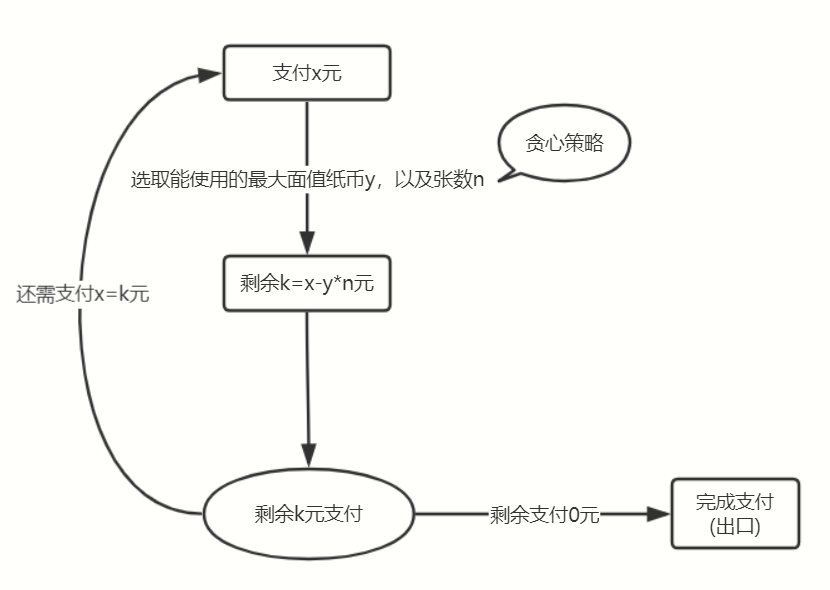

# 贪心算法

- 贪心算法（又称贪婪算法）是指，在对问题求解时，总是做出在当前看来是最好的选择
- 不从整体最优上加以考虑，他所做出的是在某种意义上的局部最优解
- 贪心关注的是当前问题的最优解，而不是全局最优解。动态规划关注的是全局最优解

基本要素

- 贪心选择是采用从顶向下、以迭代的方法做出相继选择，每做一次贪心选择就将所求问题简化为一个规模更小的子问题
- 要确定它是否具有贪心选择的性质，我们必须证明每一步所作的贪心选择最终能得到问题的最优解
- 当一个问题的最优解包含其子问题的最优解时，称此问题具有最优子结构性质

步骤

- 遍历备选元素
- 贪心策略确定选择元素

1. 当我们看到这类问题的时候，首先要联想到贪心算法：针对一组数据，我们定义了限制值和期望值，希望从中选出几个数据，在满足限制值的情况下，期望值最大
2. 我们尝试看下这个问题是否可以用贪心算法解决：每次选择当前情况下，在对限制值同等贡献量的情况下，对期望值贡献最大的数据
3. 我们举几个例子看下贪心算法产生的结果是否是最优的。大部分情况下，举几个例子验证一下就可以了

实际上，用贪心算法解决问题的思路，并不总能给出最优解

## 支付找零问题

- 给定纸币面值数组`[1,2,5,10,20,50,100]`，每张纸币不限次数使用
- 当要支付x元时，求最少使用的纸币数，并列出使用的纸币面值及其张数
- 不能多付，少付

分析



代码实现

```js 支付找零
// 纸币面值
const coins = [1, 2, 5, 10, 20, 50, 100]
// 支付找零
function pay(money, coins, p = coins.length - 1, obj = {count:0}) {
  if (money === 0) return obj
  let min, residue = 0
  // 计算当前最少使用纸币数
  for (let i = p; i >= 0; i--) {
    // 计算当前面值张数
    const much = ~~(money / coins[i])
    if (much < 0) continue // 不能多付
    min = min || much
    if (min >= much) {
      // 更新最少张数
      min = much
      // 更新纸币使用面值区间
      p = i
      // 剩余支付
      residue = money % coins[i]
    }
  }
  // 记录使用的纸币
  obj[coins[p]] = min
  obj['count'] += min
  return pay(residue, coins, p, obj)
}
console.log(pay(123, coins)) // {1: 1, 2: 1, 20: 1, 100: 1, count: 4}
```

## 限制有限张纸币，求支付情况

```js 条件找零
// 纸币面值以及张数
const coins = [
  [1, 5],
  [2, 2],
  [5, 8],
  [10, 4],
  [20, 5],
  [50, 3],
  [100, 2]
]
// 支付找零
function pay(money, coins, p = coins.length - 1, obj = {
  count: 0
}) {
  if (money === 0) return obj
  let much, residue = 0
  // 计算当前最少使用纸币数
  for (let i = p; i >= 0; i--) {
    // 计算当前面值张数
    much = ~~(money / coins[i][0])
    if (coins[i][1] <= 0) {
      p = i - 1;
      continue // 当前没有面值的纸币
    }
    if (much >= coins[i][1]) { // 当前面值的纸币张数不够
      // 钱不够
      if (coins[i][0] == coins[0][0]) return '钱不够'
      obj[coins[i][0]] = coins[i][1] //记录
      obj['count'] += coins[i][1]
      // 当前不够，看看有没有其他小零钱凑一下
      money -= coins[i][0] * coins[i][1] // 扣掉所有当前面值
      continue
    }
    // 够
    // 更新纸币使用面值区间
    p = i
    // 剩余支付
    money = money % coins[i][0]
    obj[coins[i][0]] = much //记录
    obj['count'] += much
  }
  return obj
}
console.log(pay(328, coins)) // {1: 1, 2: 1, 5: 1, 10: 0, 20: 1, 50: 2, 100: 2, count: 8}
console.log(pay(600, coins)) // 钱不够
```

## 求移除k个数，使剩下值最小

- 在一个非负整数 a 中，我们希望从中移除 k 个数字，让剩下的数字值最小，如何选择移除哪 k 个数字呢？

```js
let num = 59513048
function foo(num, s) {
  let arr = String(num).split('')
  for (let i = 0; i < arr.length; i++) {
    if (s && arr[i] * 1 > arr[i + 1] * 1) {
      arr.splice(i, 1)
      s--
      i = -1  // 继续从最高位开始
      continue
    }
  }
  return arr.join('') * 1
}
console.log(foo(num, 2));
```

<Vssue title="算法 issue" />