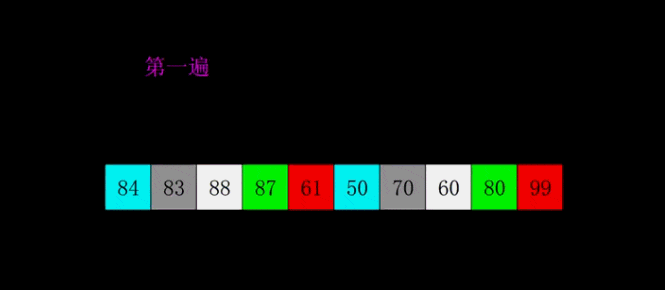
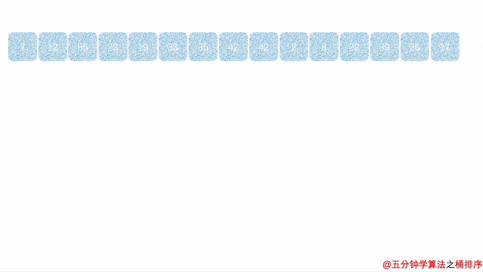
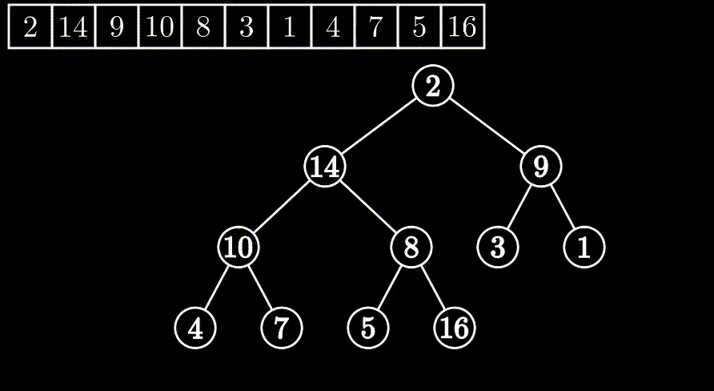

# 十大排序算法

## 冒泡排序

- 它重复地走访过要排序的元素列，依次比较两个相邻的元素
- 外层每比较一轮就会确认当前排序中的最大/小值，放到最尾部


代码实现

```js 冒泡排序
let array = [3, 2, 8, 2, 1, 9, 4, 5, 6, 0]
// 冒泡排序
function bubbling(arr, sort=1) { //arr:排序数组，sort:1升序、-1降序、0反转
  // 排序总个数
  const l = arr.length
  // 标志
  let flag
  // 外层，最后一个不需要排序
  for (let i = 0; i < l - 1; i++) {
    flag = false
    // 内层，每执行一次外层内层少排一个
    for (let j = 0; j < l - 1 - i; j++) {
      if ((arr[j + 1] - arr[j]) * sort <= 0) {
        // 交换
        arr[j] = [arr[j + 1], (arr[j + 1] = arr[j])][0]
        flag = true
      }
    }
    // 全都不需要交换
    if(!flag) return
  }
}
bubbling(array, 1)
console.log(array)
-----------------------------------------------
// 递归法冒泡排序
function bubbling(arr, sort = 1, outside = 0, inside = 0, flag = false) {
  // 外层结束
  if (outside >= arr.length - 1) return;
  // 判断大小
  if ((arr[inside + 1] - arr[inside]) * sort <= 0) {
    // 交换
    arr[inside] = [arr[inside + 1], (arr[inside + 1] = arr[inside])][0]
    flag = true
  }
  // 内层结束
  if (++inside >= arr.length - 1 - outside) {
    outside++
    inside = 0
    if (!flag) return // 不需要排序
  }
  // 下一轮
  bubbling(arr, sort, outside, inside, flag)
}
bubbling(array, 1)
console.log(array)
```

冒泡算法时间复杂度最好O(n)、最坏O(n^2)、平均O(n^2)

## 选择排序

- 选择排序每轮选取一个最大/最小值放到首部
- 每循环一次外层，内层所排总次数减少一次，首部后移一位


代码实现

```js 选择排序
// 选择排序
function select(arr, sort = 1) {
  const l = arr.length
  // 最小值索引
  let min
  for (let i = 0; i < l - 1; i++) {
    // 初始最小值索引
    min = i
    for (let j = i; j < l - 1; j++) {
      if ((arr[j + 1] - arr[min]) * sort <= 0) {
        // 找最小值的索引
        min = j + 1
      }
    }
    // 最小值与未排的最前端对调
    arr[i] = [arr[min], arr[min] = arr[i]][0]
  }
}
select(array)
console.log(array)
---------------------------------------------
// 递归法选择排序
function select(arr, sort = 1, outside = 0, inside = 0, min = 0) {
  // 外层跳出条件
  if (outside >= arr.length - 1) return;
  if ((arr[inside + 1] - arr[min]) * sort <= 0) {
    // 寻找最小值索引
    min = inside + 1
  }
  // 内层跳出条件
  if (++inside >= arr.length - 1) {
    // 最小值与未排的最前端对调
    arr[outside] = [arr[min], arr[min] = arr[outside]][0]
    // 外层下一轮
    outside++
    inside = outside
    min = outside
  }
  // 下一轮
  select(arr, sort, outside, inside, min)
}
select(array)
console.log(array)
```

选择排序时间复杂度最好/最坏/平均O(n^2)

## 插入排序

- 插入排序，从第一个开始，取出下一个，一直往前面扫描，如果比选取的值大的后移，比选取值小的，则插入到其后面
- 外层每循环一次，起始选取(最开始为第二个)的值后移一位，直到n


代码实现

```js 插入排序
// 插入排序
function insert(arr, sort = 1) {
  const l = arr.length
  // 外层，第一个到倒数第二个
  for (let i = 0; i < l - 1; i++) {
    // 内层，最大循环j次，插入合适则直接跳出
    for (let j = i + 1; j > 0; j--) {
      // 插入合适，跳出
      if ((arr[j - 1] - arr[j]) * sort <= 0) {
        break
      }
      // 不合适，选取值前移
      arr[j - 1] = [arr[j], arr[j] = arr[j - 1]][0]
    }
  }
}
insert(array, 1)
console.log(array)
---------------------------------------------
// 递归法插入排序
function insert(arr, sort = 1, outside = 0, inside = 1) {
  // 内层循环结束，或者满足插入条件，外层进行下一轮
  if (inside < 1 || (arr[inside - 1] - arr[inside]) * sort <= 0) {
    // 外层+1，内层初始为外层+1+1
    inside = ++outside + 1
    // 外层结束
    if (outside >= arr.length - 1) return;
  } else {
    // 交换
    arr[inside - 1] = [arr[inside], arr[inside] = arr[inside - 1]][0]
    // 内层-1
    inside--
  }
  // 下一轮
  insert(arr, sort, outside, inside)
}
insert(array, 1)
console.log(array)
```

插入排序时间复杂度最好O(n)、最坏O(n^2)、平均O(n^2)

## 希尔排序

先将整个待排序的记录序列分割成为若干子序列分别进行直接插入排序

- 选择一个增量序列t1，t2，…，tk，其中ti>tj，tk=1；
- 按增量序列个数k，对序列进行k 趟排序；
- 每趟排序，根据对应的增量ti，将待排序列分割成若干长度为m 的子序列，分别对各子表进行直接插入排序。仅增量因子为1 时，整个序列作为一个表来处理，表长度即为整个序列的长度。
- 简单说就是，每一次外层循环，内层中每次比对的2者索引差值2为上一次外层时比对差值的一半，直到内层两两比对的索引差值为1
- 外层分组类似二分，内层使用差值插入排序



代码实现

```js 希尔排序
// 希尔排序
function shell(arr, sort = 1) {
  const l = arr.length
  // 外层每轮增量变为上一轮的1/2，i为每轮固定的增量，增量范围l/2~1
  for (let i = ~~(l / 2); i > 0; i = ~~(i / 2)) {
    // 中层，确认每组每次选取的值，j为每组选取的索引
    for (let j = i; j < l; j = j + i) {
      // 内层为间隔插入比较
      for (let n = j; n >= 0; n = n - i) {
        // 选取位置插入
        if ((arr[n] - arr[n - i]) * sort <= 0) {
          // 交换
          arr[n - i] = [arr[n], (arr[n] = arr[n - i])][0]
        } else {
          break
        }
      }
    }
  }
}
shell(array, 1)
console.log(array)
----------------------------------------------
// 递归法希尔排序
function shell(arr, sort = 1, o = arr.length >> 1, mid = o, i = mid) {
  // 内层终止条件
  if (i < 0) {
    mid = mid + o // 中层下一轮
    i = mid // 内层初始化
  }
  // 中层终止条件
  if (mid >= arr.length) {
    o = o >> 1 // 增量减半
    mid = o // 初始化选取的索引
    i = mid // 初始比对索引
  }
  // 外层终止条件
  if (o < 1) return;
  // 比较
  if ((arr[i] - arr[i - o]) * sort <= 0) {
    arr[i - o] = [arr[i], (arr[i] = arr[i - o])][0]
    // 内层下一轮
    i = i - o
  } else {
    // 外层下一轮
    mid = mid + o
    i = mid
  }
  // 下一轮
  shell(arr, sort, o, mid, i)
}
shell(array, 1)
console.log(array)
```

- 希尔排序，外层控制每次比对增量，即间隔数
- 中层控制，每次选取插入的索引位置，受增量影响
- 内层控制，与选取的值做向前比对插入适当位置

希尔排序时间复杂度最好O(n)、最坏O(n^2)、平均O(n^1.3)

## 计数排序

- 计数排序通过统计相同值出现的个数，保存在一个顺序表里
- 最后按照顺序把表里对应个数的值一个个取出，直到个数为0，再取下一个
- 计数排序为非比较型排序


```js 计数排序
// 计数排序
function count(arr, sort = 1) {
  // 获取长度，以及初始化一个保存计数个数的表
  let l = arr.length,
    table = []
  // 开始计数
  for (let i = 0; i < l; i++) {
    const value = arr[i]
    table[value] = table[value] ? table[value] + 1 : 1
  }
  l = 0
  // 排序顺序
  let entries = sort >= 0 ? Object.entries(table) : Object.entries(table).reverse()
  // 依次展开
  for (const [value, counts] of entries) {
    for (let j = 0; j < counts; j++) {
      // 转数值保存
      arr[l++] = +value
    }
  }
  table = null
}
count(array, 1)
console.log(array)
-----------------------------------------------
// 递归法计数排序
function count(arr, sort = 1, table = [], l = arr.length, i = 0, entries = [], j = 0) {
  if (i < l) { // 计数
    const value = arr[i++]
    table[value] = table[value] ? table[value] + 1 : 1
  } else { // 展开
    if (!entries.length) { // 第一次取表数据
      entries = sort >= 0 ? Object.entries(table) : Object.entries(table).reverse()
      l = 0
    } else if (j >= entries.length) {
      // 全部取出
      return
    }
    if (entries[j][1]--) {
      // 取对应个数个的值
      arr[l++] = +entries[j][0]
    } else {
      // 下一个值
      j++
    }
  }
  count(arr, sort, table, l, i, entries, j)
}
count(array, 1)
console.log(array)
```

计数排序时间复杂度最好/最坏/平均O(n+k)

## 桶排序

- 设置固定数量的空桶。
- 把数据放到对应的桶中。
- 对每个不为空的桶中数据进行排序，可用任意排序算法。
- 拼接不为空的桶中数据，得到结果。



代码实现

```js 桶排序
// 桶排序
function bucket(arr, sort = 1, count = 4, step = Math.ceil(arr.length / count)) {
  // 创建count个桶的数值
  const hub = Array.from({
    length: count
  }, () => [])
  const l = arr.length
  // 放入对应桶中
  for (let i = 0; i < l; i++) {
    // 计数桶序号
    const h = ~~(arr[i] / step)
    hub[h].push(arr[i])
  }
  for (let j = 0; j < hub.length; j++) {
    // 给每个桶使用插入排序
    insert(hub[j])
  }
  arr.length = 0
  // 展开桶
  const res = sort >= 0 ? hub.flat() : hub.flat().reverse()
  // 填充原数组
  arr.push(...res)
}
bucket(array, 1)
console.log(array)
-----------------------------------------------
// 递归法桶排序
function bucket(arr, sort = 1, count = 4, step = Math.ceil(arr.length / count), hub = Array.from({
  length: count
}, () => []), i = 0, j = 0) {
  if (i < arr.length) {
    // 计算桶序号
    const h = ~~(arr[i] / step)
    // 放入桶
    hub[h].push(arr[i++])
  } else if (j < hub.length) {
    // 给每个桶进行排序
    insert(hub[j++])
  } else {
    // 清空原数组
    arr.length = 0
    // 展开桶
    const res = sort >= 0 ? hub.flat() : hub.flat().reverse()
    // 填充原数组
    arr.push(...res)
    return
  }
  bucket(arr, sort, count, step, hub, i, j)
}
bucket(array, 1)
console.log(array)
```

桶排序时间复杂度最好O(n)、最坏O(n^2)、平均O(n+k)

## 基数排序

- 基数排序是按照低位先排序，然后收集；再按照高位排序，然后再收集；依次类推，直到最高位
- 取得数组中的最大数，并取得位数
- arr为原始数组，从最低位开始取每个位组成radix数组
- 对radix进行计数排序（利用计数排序适用于小范围数的特点）


代码实现

```js 基数排序
// 基数排序
function base(arr, sort = 1, maxLength = arr[0]) {
  const l = arr.length
  for (let i = 0; i < l; i++) {
    if (arr[i] > maxLength) {
      maxLength = arr[i]
    }
  }
  maxLength = maxLength.toString().length
  for (let p = 0; p < maxLength; p++) {
    const hub = Array.from({
      length: 10
    }, () => [])
    // 取当前轮的对比位指数
    const pow = Math.pow(10, p)
    for (let j = 0; j < l; j++) {
      // h为当前位对应的桶序号
      const h = ~~(arr[j] / pow % 10)
      hub[h].push(arr[j])
    }
    arr.length = 0
    // 展开桶
    const res = hub.flat()
    // 填充原数组
    if (p + 1 == maxLength && sort < 0) {
      arr.push(...res.reverse())
    } else {
      arr.push(...res)
    }
  }
}
base(array, 1)
console.log(array)
----------------------------------------------
// 递归法基数排序
function base(arr, sort = 1, maxLength = 0, hub = Array.from({
  length: 10
}, () => []), p = 0, i = 0) {
  if (!maxLength) {
    // 取最大值位数
    maxLength = Math.max(...arr).toString().length
  }
  if (p < maxLength) {
    const pow = Math.pow(10, p)
    if (i < arr.length) {
      // 计算序号
      const h = ~~(arr[i] / pow % 10)
      hub[h].push(arr[i++])
    } else {
      p++
      i = 0
      arr.length = 0
      // 展开桶
      const res = hub.flat()
      // 填充原数组
      if (p == maxLength && sort < 0) {
        arr.push(...res.reverse())
      } else {
        arr.push(...res)
      }
      hub = Array.from({
        length: 10
      }, () => [])
    }
  } else {
    return
  }
  base(arr, sort, maxLength, hub, p, i)
}
base(array, 1)
console.log(array)
```

基数排序时间复杂度最好/最坏/平均O(nxk)

## 堆排序

- 堆排序（Heapsort）是指利用堆这种数据结构所设计的一种排序算法。
- 堆积是一个近似完全二叉树的结构，并同时满足堆积的性质：即子结点的键值或索引总是小于（或者大于）它的父节点。



代码实现

```js 堆排序
// 堆排序
function heap(arr, sort = 1) {
  const sortDown = function (arr, i, length, sort) {
    // 执行子叶排序
    for (let j = i * 2 + 1; j < length; j = j * 2 + 1) {
      // 左子节点小
      if (j + 1 < length && (arr[j + 1] - arr[j]) * sort >= 0) {
        j++
      }
      // 右子节点大或者左子节点大
      if ((arr[j] - arr[i]) * sort >= 0) {
        // 把大的交换到符节点
        arr[i] = [arr[j], arr[j] = arr[i], i = j][0]
      } else {
        break
      }
    }
  }
  // 第一个非子叶节点
  const first = ~~(arr.length / 2 - 1)
  // 所有非子叶节点排序一遍，从后往前
  for (let i = first; i >= 0; i--) {
    sortDown(arr, i, arr.length, sort)
  }
  for (let j = arr.length - 1; j > 0; j--) {
    arr[j] = [arr[0], arr[0] = arr[j]][0]
    sortDown(arr, 0, j, sort)
  }
}
heap(array, 1)
console.log(array)
-----------------------------------------------
// 裂开
```

堆排序时间复杂度最好/最坏/平均O(nlogn)

## 归并排序

- 把长度为n的输入序列分成两个长度为n/2的子序列
- 对这两个子序列分别采用归并排序
- 将两个排序好的子序列合并成一个最终的排序序列


代码实现

```js 归并排序
// 归并排序
function mergeSort(arr, sort = 1, merge = null) {
  if (!merge) {
    // 声明合并函数
    merge = function (left, right) {
      let res = []
      // 左右组分别比较
      while (left.length && right.length) {
        if (left[0] <= right[0]) {
          res.push(left.shift())
        } else {
          res.push(right.shift())
        }
      }
      // 补漏
      while (left.length) {
        res.push(left.shift())
      }
      while (right.length) {
        res.push(right.shift())
      }
      return res
    }
  }
  // 只有1个直接返回
  if (arr.length < 2) return arr
  let mid = arr.length >> 1
  // 取左右分组数组
  let left = arr.slice(0, mid),
    right = arr.slice(mid)
  // 左右合并
  return merge(mergeSort(left, sort, merge), mergeSort(right, sort, merge))
}
console.log(mergeSort(array, 1))
// 
function mergeSort(array, l = 0, r = array.length - 1) {
  if (l >= r) return array
  let mid = (l + r)>>1
  return merge(mergeSort(array.slice(l, mid + 1)), mergeSort(array.slice(mid + 1, r + 1)))
}
function merge(l, r) {
  let indexL = 0, indexR = 0
  let arr = []
  while (indexL < l.length && indexR < r.length) {
    let val1 = l[indexL]
    let val2 = r[indexR]
    if (val1 <= val2) {
      arr.push(val1)
      indexL++
    } else {
      arr.push(val2)
      indexR++
    }
  }
  while (indexL < l.length) arr.push(l[indexL++]);
  while (indexR < r.length) arr.push(r[indexR++]);
  return arr
}
```

归并排序时间复杂度最好/最坏/平均O(nlogn)

## 快速排序

- 快速排序的基本思想：通过一趟排序将待排记录分隔成独立的两部分，其中一部分记录的关键字均比另一部分的关键字小，则可分别对这两部分记录继续进行排序，以达到整个序列有序
- 从数列中挑出一个元素，称为 “基准”（pivot）；
- 重新排序数列，所有元素比基准值小的摆放在基准前面，所有元素比基准值大的摆在基准的后面（相同的数可以到任一边）。在这个分区退出之后，该基准就处于数列的中间位置。这个称为分区（partition）操作；
- 递归地（recursive）把小于基准值元素的子数列和大于基准值元素的子数列排序
- 最实用的一种排序算法


代码实现

```js 快速排序
//快速排序
function quick(arr, sort = 1, l = 0, r = arr.length - 1) {
  // 求中值索引函数
  const getBase = function (arr, l, r, sort) {
    const base = arr[l]
    while (l < r) {
      // 与base对比
      while (l < r && (arr[r] - base) * sort >= 0) r--;
      arr[l] = arr[r]
      while (l < r && (base - arr[l]) * sort >= 0) l++;
      arr[r] = arr[l]
    }
    arr[l] = base
    // 返回中值索引
    return l
  }
  // 存储未排组
  const stack = [l, r]
  while (stack.length) {
    r = stack.pop()
    l = stack.pop()
    // 中值索引
    let baseIndex = getBase(arr, l, r, sort)
    if (l < baseIndex - 1) {
      stack.push(l, baseIndex - 1)
    }
    if (baseIndex + 1 < r) {
      stack.push(baseIndex + 1, r)
    }
  }
}
quick(array, 1)
console.log(array)
-----------------------------------------------
//递归法快速排序
function quick(arr, sort = 1, l = 0, r = arr.length - 1, getBase = null) {
  if (!getBase) {
    getBase = function (arr, l, r, sort) {
      const base = arr[l]
      while (l < r) {
        while (l < r && (arr[r] - base) * sort >= 0) r--;
        arr[l] = arr[r]
        while (l < r && (base - arr[l]) * sort >= 0) l++;
        arr[r] = arr[l]
      }
      arr[l] = base
      return l
    }
  }
  if (l >= r) return
  // 中值索引
  let b = getBase(arr, l, r, sort)
  // 左递归
  quick(arr, sort, l, b - 1, getBase)
  // 右递归
  quick(arr, sort, b + 1, r, getBase)
}
quick(array, 1)
console.log(array)

function quick(arr, l = 0, r = arr.length - 1) {
  if (l >= r) return arr
  let s = l, e = r, base = arr[s]
  while (l < r) {
    while (l < r && arr[r] > base) r--;
    arr[l] = arr[r]
    while (l < r && arr[l] <= base) l++;
    arr[r] = arr[l]
  }
  arr[l] = base
  quick(arr, s, l - 1)
  quick(arr, r + 1, e)
  return arr
}
```

快速排序时间复杂度最好O(nlogn)、最坏O(n^2)、平均O(nlogn)

## 强化版快排

- 基于三数取中，插排，非递归，计数排序

```js 强化版快排
function counts(array) {
  let m = []
  for (let index = 0; index < array.length; index++) {
    m[array[index]] = m[array[index]] ? m[array[index]] + 1 : 1
  }
  for (let index = 0, l = 0; index < m.length; index++) {
    for (let i = 0; i < m[index]; i++) {
      array[l++] = index
    }
  }
}
function insert(array, L = 0, R = array.length - 1) {
  for (let n = L + 1, c, i, p; n <= R; n++) {
    c = array[n]
    for (i = n - 1; i >= 0; i--) {
      p = array[i]
      if (p > c) {
        array[i + 1] = p
      } else {
        break
      }
    }
    array[i + 1] = c
  }
}

function quickMerges(arr, L, R) {
  //取中间index
  let Mid = L + ((R - L) >> 1)
  if (arr[L] > arr[Mid]) arr[Mid] = [arr[L], (arr[L] = arr[Mid])][0]
  if (arr[L] > arr[R]) arr[L] = [arr[R], (arr[R] = arr[L])][0]
  if (arr[R] < arr[Mid]) arr[Mid] = [arr[R], (arr[R] = arr[Mid])][0]
  L++
  arr[Mid] = [arr[L], (arr[L] = arr[Mid])][0]
  R--
  const base = arr[L]
  while (L < R) {
    while (base <= arr[R] && L < R) R--
    arr[L] = arr[R]
    while (arr[L] <= base && L < R) L++
    arr[R] = arr[L]
  }
  arr[L] = base
  return L
}

function quickSortNos(arr, L = 0, R = arr.length - 1) {
  let min = 0,
    max = 1,
    d
  if (R > 10000) {
    let dd = ~~(R / 100)
    for (let i = 0; i <= R; i += d) {
      if (arr[i] < arr[min]) min = i
      if (arr[i] > arr[max]) max = i
    }
    d = arr[max] - arr[min]
  }
  if ((R / d >= 100 && R < 1000000) || R < 10000) {
    counts(arr)
    return
  }
  let baseIndex
  const stack = [L, R]
  do {
    R = stack.pop()
    L = stack.pop()
    if (R - L <= 30) {
      insert(arr, L, R)
      continue
    }
    baseIndex = quickMerges(arr, L, R)
    if (L < baseIndex - 1) {
      stack.push(L, baseIndex - 1)
    }
    if (baseIndex + 1 < R) {
      stack.push(baseIndex + 1, R)
    }
  } while (stack.length)
}
```

<Vssue title="算法 issue" />