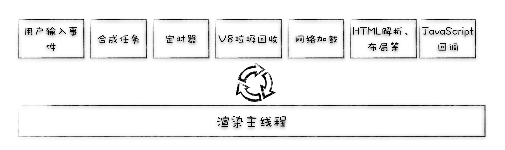
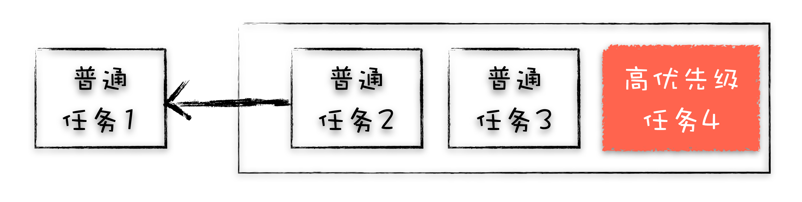
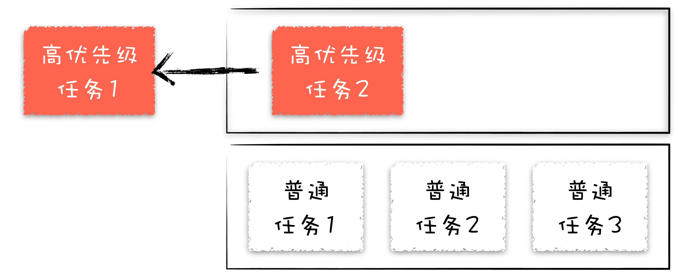
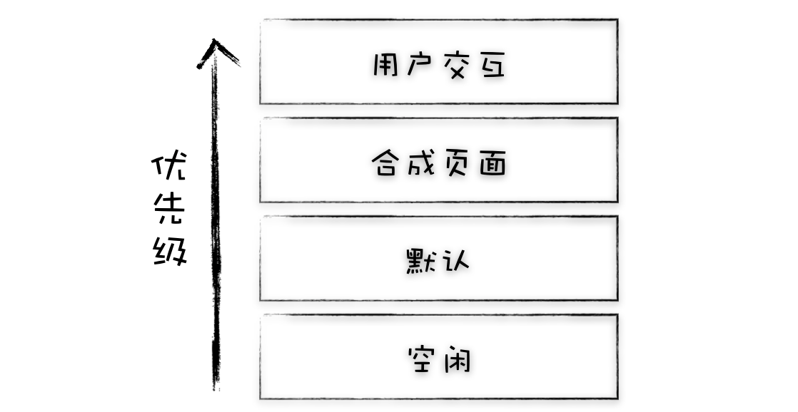
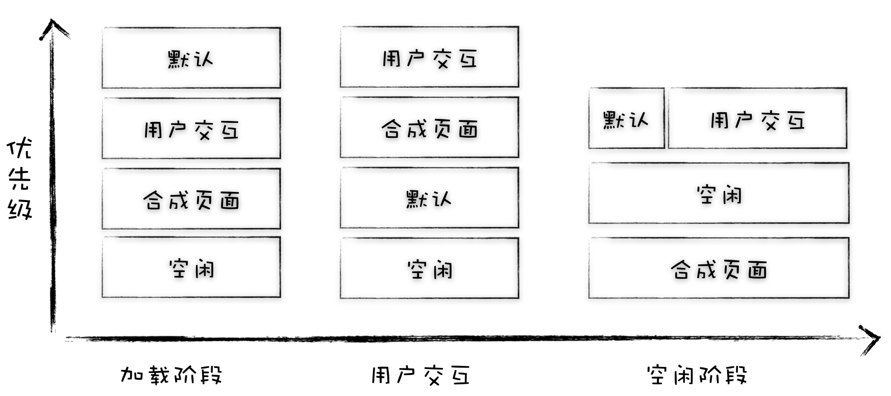
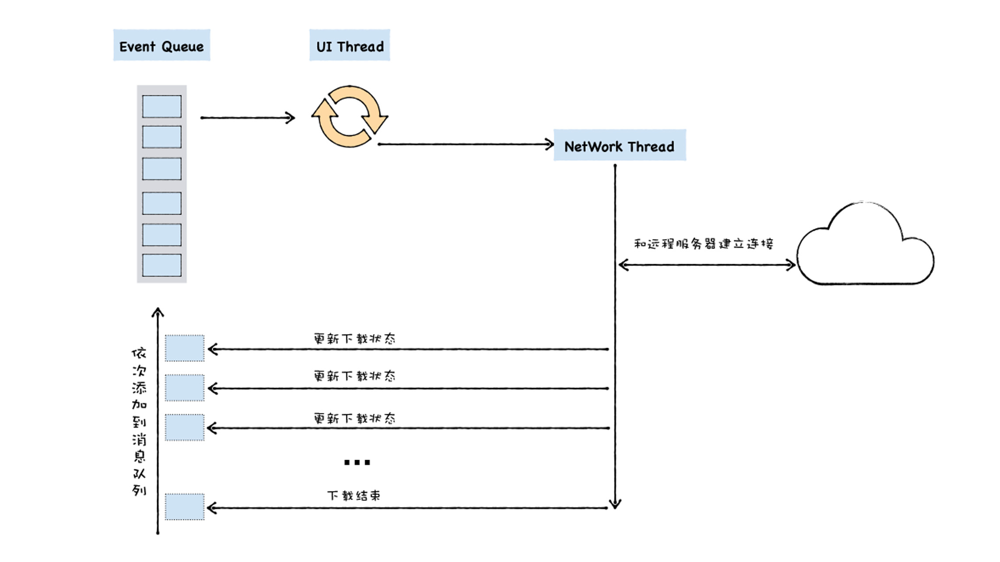

# 深入浏览器工作原理(中)

这篇主要介绍浏览器处理输入事件、渲染进程事件循环

## 三、浏览器如何处理输入事件

这里，你能了解到浏览器是怎么监听事件，并且更新页面

### 从浏览器的角度看事件

在浏览器角度，任何用户的交互行为都算是输入事件，比如移动鼠标、鼠标滚轮滚动、鼠标悬停、点击、触摸屏等

当用户触发行为时，**浏览器进程是最先接收行为**的进程，但是由于页面内容是由渲染进程处理，因此浏览器进程只会知道触发行为的位置，而不会知道到底需要做些什么


因此**浏览器主进程**将触发的**事件类型以及坐标位置**发送**给渲染进程**，**渲染进程根据坐标信息，定位出事件目标并且运行事件处理程序**

### 渲染进程如何处理接收的事件

如果页面**没有存在任何的输入事件监听器**，那么**合成线程**将会创建一个**新的合成框架**，以便重新渲染页面

#### 非快速滚动区域

由于运行JavaScript是主线程的工作，因此在合成页面时，合成器线程会将页面上**具有事件处理程序**的区域**标记为“非快速可滚动区域”**

根据事件发生的坐标来判断触发的事件是否处于“非快速可滚动区域”，也就是触发在添加了事件处理程序的区域中，如果是，那么**合成线程将会把输入事件信息发送渲染主线程**，以便处理事件回调。如果不是，合成线程将不会等待主线程，而**直接合成新帧(跳过重排/重绘，直接进入合成)**


### 使用事件处理程序需要注意的

在开发中我们经常使用事件委托处理程序

```js
document.body.addEventListener('touchstart', event => {
    if (event.target === area) {
        event.preventDefault();
    }
});
```

**事件委托**可以帮助我们节省很多代码，但是基于“非快速可滚动区域”，使得**页面中大部分的区域变为“非快速可滚动区域”**，这样一来，大部分触发的事件都**需要由合成线程发送给主线程处理**，并在每次输入事件发生时等待它。因此，合成线程的平滑度下降


为了减轻大面积的“非快速可滚动区域”导致合成效率降低的问题，我们可以在注册事件监听处理程序时设置`{ passive: true }`选项，这将向浏览器说明事件**仍需要监听**，但是合成器也可以**继续合成新帧**而不必等待主线程处理

当设置了`{ passive: true }`，页面将会更加平滑，但是如果使用preventDefault限制事件触发，那么preventDefault将会被**延迟处理**。由于`passive: true`会导致合成线程**不等待**主线程处理事件之后再生成新帧，这将导致preventDefault不会立即生效

```js
document.body.addEventListener('pointermove', event => {
    if (event.cancelable) {
        event.preventDefault(); // block the native scroll
        /*
        *  do what you want the application to do here
        */
    }
}, {passive: true});
```

使用`event.cancelable`来检查事件是否能够取消

### 如何命中事件目标

当合成线程把输入事件发送给主线程之后，主线程就需要根据触发事件信息(事件类型、触发坐标)，并且在渲染过程中生成的**绘制记录(绘制命令)**数据中找出**事件发生坐标点下的内容(找出事件触发目标的样式信息)**


### 最小化事件触发(节流)

众所周知大多数的显示器每秒刷新频率在60次，也就是60HZ、16.66ms刷新一次屏幕。对于输入设备来说，大多数触摸屏以每秒60-120次触发触摸事件，而鼠标则在100次，可以看出输入事件触发频率高于屏幕刷新频率，这将导致在一帧中有过多的重复事件被处理，但却又没能立即体现到屏幕上


如果在一帧中多次触发事件那么将浪费一部分的处理结果，最终也只会渲染最新的处理结果。为了降低对主程序的过渡调用，Chrome将**合并连续触发的事件**(比如wheel，mousewheel，mousemove，pointermove， touchmove)，以及延迟到requestAnimationFrame中处理


这样一来，连续触发的事件将**在一帧中合并处理**

对于**离散的事件**，比如keydown，keyup，mouseup，mousedown，touchstart，和touchend将会**立即触发**

> 简单讲，Chrome对连续触发的事件进行节流，并在requestAnimationFrame中统一处理

#### 获取每次触发的事件对象

对于大多数情况下，事件节流有利于我们高效的处理事件，但是在某些情况下可能会导致一些问题(由于事件节流，每次触发不一定都能立即执行事件处理程序)

当我们基于鼠标移动事件来绘制一条弧线时，由于事件节流，导致绘制的路径只有60次/秒的精度，这样一来当我们快速的移动鼠标绘制的曲线也就成了这样


我把它称为抗锯齿曲线

为了保证在页面不能及时渲染的情况下也能正确记录精确的绘制路径，我们就需要在事件处理程序中使用如下操作

```js
window.addEventListener('pointermove', event => {
    const events = event.getCoalescedEvents();
    for (let event of events) {
        const x = event.pageX;
        const y = event.pageY;
        // draw a line using x and y coordinates.
    }
});
```

即便Chrome合并处理连续触发的事件，但是事件对中**依然保存了每次触发时的事件信息**，通过`event.getCoalescedEvents()`获取每次触发的事件对象，当合并执行时，将按照记录绘制一帧完整的路径

[国外资料](https://developers.google.com/web/updates/2018/09/inside-browser-part4)

## 四、消息循环系统(事件循环)

每个渲染进程都有一个主线程，并且主线程非常繁忙，既要处理 DOM，又要计算样式，还要处理布局，同时还需要处理 JavaScript 任务以及各种输入事件。要让这么多不同类型的任务在主线程中有条不紊地执行，这就需要一个系统来统筹调度这些任务，这个统筹调度系统就是我们今天要讲的消息队列和事件循环系统

### 渲染进程(浏览器内核)

由于渲染进程的调度机制是基于消息循环系统，所以这里先介绍一下渲染进程的结构

渲染进程组成：

1. **GUI线程(主线程中执行)**：负责解析HTML、CSS、构建DOM、CSSOM、生成布局树、分层、生成绘制记录
2. **JavaScript引擎线程(主线程中执行)**：解析js代码并且执行，负责执行所有js回调，包括io回调、事件回调、定时器回调等，在Chrome中由v8引擎负责
3. **定时器触发线程**：注册定时器，计时结束触发回调，包括setInterval与setTimeout
4. **事件触发线程**：处理由浏览器进程传递过来的输入事件
5. **异步HTTP请求线程**：处理由网络进程传递过来的资源加载信息，监听网络请求状态变更
6. **合成线程**：图层分块、生成合成帧、合成框架
7. **栅格化线程**：将绘制信息转换为屏幕上的像素信息
8. **IO线程**：处理其他进程传递给渲染进程的消息

这里只列出了主要线程

GUI线程与JS线程的执行时机是互斥的，也就是说**主线程同一时刻只能执行GUI或者JS线程**，这是出于JS可以修改DOM结构，GUI线程不能同时渲染页面，否则将会**导致页面冲突**

### 单线程如何执行任务

在单线程中，我们只能够一个一个顺序的执行任务，比如这样


在没有引入消息队列且只有一个线程时，执行的js代码就是同步代码，按照代码顺序执行任务

```js
var a = 1
var b = 2
console.log(a + b)
```

在这段代码中，将会被分为3个任务被顺序执行

当我们在js脚本中执行了一段需要用户输入的结果作为操作数进行计算，这是同步单线程使得脚本执行被阻塞在用户输入交互上

```js
var a = 1
var b = 2
var c = prompt('请输入0-10的数字')
console.log(a + b)
console.log(a + b + c)
```

为了演示，只是做了简单的log操作，这里可以看到prompt交互框阻塞了以下的log代码，这么一来当用户一直不输入数据，js将不会继续执行


### 使用消息队列处理其他线程任务

基于主线程的处理方式，如果要执行其他线程的任务，那么就需要引入**消息队列**，来保存其他线程传递给主线程处理的任务，这里需要主线程处理的任务都是由js引擎来负责


要明确一点，渲染进程执行的代码都来自于最开始的index.html文件，当HTML解析器解析到js代码时，将会把js代码提交给JavaScript引擎，让出主线程控制权给js引擎执行。而所有来自页面的io、http、事件、定时器任务都是由最初执行的js代码产生


从图中可以看出，消息循环系统维护了消息队列，这是一个FIFO的队列结构，当执行js代码产生的异步回调任务都将添加到队列中，等待主线程处理

### 事件循环如何处理浏览器其他进程传递的任务

通过消息循环系统，可以处理渲染进程内，多个线程之间的任务调度工作。那么浏览器进程又是如何参与渲染进程的调度？

浏览器主进程拥有浏览器大部分的权限，而渲染进程是被放置在安全沙箱中，限制了多数的操作系统权限，这也是出于安全考虑


受限的渲染进程无法调起系统api发起网络请求，所有的网络资源都由独立的网络进程来获取。网络进程承担了所有的网络请求任务，最终根据下载文件的类型来决定是直接调用下载管理器，还是传递给渲染进程处理并展示页面。进程与进程间都是通过IPC来通信

### 针对不同类型的任务如何选择执行

事件循环针对不同的任务也是按队列顺序执行吗？

对浏览器而言在不同阶段中，渲染进程的执行优先级不同，比如输入事件（鼠标滚动、点击、移动）、微任务、文件读写、WebSocket、JavaScript 定时器等等。为了更加合理的选择高优先级的任务执行，浏览器内核采用多队列的方式，根据任务类型划分多个消息队列，在不同阶段下各个队列的优先级不同

### 单消息队列的队头阻塞问题

单消息队列，在最初，采用这种方式没有太大的问题，因为页面中的任务还不算太多，渲染主线程也不是太繁忙。不过浏览器是向前不停进化的，其进化路线体现在架构的调整、功能的增加以及更加精细的优化策略等方面，这些变化让渲染进程所需要处理的任务变多了，对应的渲染进程的主线程也变得越拥挤



单消息队列架构无法满足**根据任务的优先级执行**，如果一个页面缩放任务触发了，但是由于其他队列中的任务还未执行，那么将会导致页面卡顿，过一会才发生缩放，这对用户来说会影响体验



基于这个因素，现代浏览器支持更多的任务队列，以便根据不同阶段的优先级来执行不同队头任务

### Chromium如何解决消息对头阻塞

为了解决由于单消息队列而造成的队头阻塞问题，Chromium 团队从 2013 年到现在，花了大量的精力在持续重构底层消息机制

#### 重构思路1：使用高优先级队列

当触发一个需要及时处理的任务时，给他分配到高优先级队列中，这样可以优先其他任务执行

被认定为**高优先级的任务**：

1. 鼠标事件，包括点击、滚动、移动
2. 页面缩放任务
3. CSS、js动画任务

这些任务需要被及时反馈，否则会给用户带来卡顿的体验

分离高低优先级队列来分别执行



这样一来，浏览器内核将需要引入一个任务调度器来控制任务执行顺序

**相同优先级队列任务的执行顺序不变，不同优先级的任务根据优先级来执行**，我想Chrome团队任务调度方案的灵感来自于操作系统的优先权调度算法(很类似非抢占式优先权算法)

不过大多数任务**需要保持其相对执行顺序**，如果将用户输入的消息或者合成消息添加进多个不同优先级的队列中，那么这种任务的相对执行顺序就会被打乱，甚至有可能出现还未处理输入事件，就合成了该事件要显示的图片。因此我们需要让一些相同类型的任务保持其相对执行顺序

#### 重构思路2：根据消息类型创建不同队列

可想而知，不同类型的消息对优先级的需求不同，比如由用户触发的任务优先级更高，对于js垃圾回收任务的优先级更低

根据实时性分配优先权



**基于消息类型分配优先权**，确实可以解决大部分的调度需求，但是针对浏览器不同阶段来说，各个消息的优先级并发完全固定，比如在首屏渲染时，浏览器优先处理用户交互，这就带来了不必要的处理，将会使渲染任务延迟执行，导致首屏时间延长

Chromium 团队曾测试过这种情况，使用静态优先级策略，网页的加载速度会被拖慢 14%

#### 重构思路3：动态调度策略

基于浏览器不同阶段采用不同的优先级调度策略，这样能够更有效的调整任务执行顺序



根据不同阶段的诉求，浏览器对应调整调度策略

**加载阶段**：提高页面解析、js执行优先级，降低交互任务优先级

**交互阶段**：提高交互任务优先级、合成任务优先级级，以便快速响应

如果当前任务处于正在处理中，那么新来的相同任务将被降低优先级，以便其他任务也能够得到处理

#### 重构思路4：任务饿死

根据优先级处理任务似乎可行，但是如果高优先级任务一直添加，而导致低优先级任务在长时间内无法得到执行，这就是任务饿死

为了**避免有部分任务长时间无法执行**，Chromium团队给每个队列设置了执行权重，当连续执行一定数量的高优先级任务之后会穿插执行一次低优先级任务，来缓解任务饿死

### 如何处理定时器

在浏览器内核中会独立维护一个**延时队列**，用于专门处理定时器

#### 注册定时器

当通过 JavaScript 调用 setTimeout 设置回调函数的时候，渲染进程将会创建一个回调任务，包含了回调函数 showName、当前发起时间、延迟执行时间，其模拟代码如下所示：

```c++
struct DelayTask{
  int64 id；
  CallBackFunction cbf;
  int start_time;
  int delay_time;
};
DelayTask timerTask;
timerTask.cbf = showName;
timerTask.start_time = getCurrentTime(); //获取当前时间
timerTask.delay_time = 200;//设置延迟执行时间
```

将创建好的回调任务添加到延时队列中

```c++
// 定义延时队列
DelayedIncomingQueue delayed_incoming_queue;
// 添加到延时队列中
delayed_incoming_queue.push(timerTask)；
```

#### 触发定时器

```c++
void ProcessTimerTask(){
  //从delayed_incoming_queue中取出已经到期的定时器任务
  //依次执行这些任务
}

TaskQueue task_queue；
void ProcessTask();
bool keep_running = true;
void MainTherad(){
  for(;;){
    //执行消息队列中的任务
    Task task = task_queue.takeTask();
    ProcessTask(task);
    
    //执行延迟队列中的任务
    ProcessDelayTask()

    if(!keep_running) //如果设置了退出标志，那么直接退出线程循环
        break; 
  }
}
```

我们添加了一个 ProcessDelayTask 函数，该函数是专门用来处理延迟执行任务的

处理完消息队列中的一个任务之后，就开始执行 ProcessDelayTask 函数。ProcessDelayTask 函数会根据发起时间和延迟时间计算出到期的任务，然后依次执行这些到期的任务。等到期的任务执行完成之后，再继续下一个循环过程

#### 注销定时器

每当我们注册一个定时器都将返回一个定时器ID，使用这个ID可以让我们手动取消还未触发的定时器

```js
clearInterval(timer_id)
clearTimeout(timer_id)
```

当我们取消注册的定时器时，浏览器内部将会从delayed_incoming_queue 延迟队列中查找对应ID的多定时器任务，并且**从延迟队列中移除**

#### 使用定时器的注意事项

当你使用定时器时需要注意定时器的一些细节，以免掉坑

1. **定时器并不准确**：定时器定时时间受执行环境影响，当主线程被其他任务占据过久时间，那么定时器即使到期也需要等待当前正在执行的任务结束。当多个定时器同时到期，需要一个个执行，这样也会导致定时器执行时机延后
2. **定时器最小间隔4ms**：W3C规范定时器最小间隔不低于4ms，在Chrome中嵌套执行的定时器超过5次之后将会限制调用间隔不低于4ms
3. **未激活页面的定时器最小间隔1000ms**：对于当前未处于激活状态的页面，其定时器间隔不低于1000ms，这是浏览器为了优化后台页面的加载损耗以及降低耗电量
4. **最大延时时间**：Chrome、Safari、Firefox 都是以 32 个 bit 来存储延时值的，32bit 最大只能存放的数字是 2147483647 毫秒，这就意味着，如果 setTimeout 设置的延迟值大于 2147483647 毫秒（大约 24.8 天）时就会溢出，那么相当于延时值被设置为 0 了，这导致定时器会被立即执行
5. **定时器回调中的this指向**：在定时器的回调函数中this都指向window，不管在严格模式下，定时器都是被window调用，this指向调用者。Web API都挂载在全局对象window下，所以调用者默认指向window

```js
'use strict'
window.name = 'name:window'
function a() {
  console.log(this.name);
}
setTimeout(a)
```

### 如何处理HTTP请求

根据浏览器架构可知，网络进程负责下载资源并且根据资源类型进行不同的操作

**网络进程根据响应头的字段信息来识别资源类型**，再传递给其他进程处理。**网络进程在获取到资源时会预先解析响应头，根据Content-Type**字段值来判断使用什么方式来处理。当值为`application/octet-stream`时将告诉浏览器这是个文件流，这样一来浏览器就会开启下载管理器对其进行下载操作。如果是`text/html`则知道这是个页面，那么就通过IPC传递给渲染进程处理

若是页面内部发起的HTTP请求又是如何处理呢？


基于Ajax无刷新请求技术，页面可以在不重新导航的情况下发起HTTP请求。浏览器实现了XMLHttpRequest接口，供开发者在不刷新页面的情况下请求服务器数据

```js

 function GetWebData(URL){
    /**
     * 1:新建XMLHttpRequest请求对象
     */
    let xhr = new XMLHttpRequest()

    /**
     * 2:注册相关事件回调处理函数 
     */
    xhr.onreadystatechange = function () {
        switch(xhr.readyState){
          case 0: //请求未初始化
            console.log("请求未初始化")
            break;
          case 1://OPENED 已建立服务器链接，open() 方法已经被调用
            console.log("OPENED")
            break;
          case 2://HEADERS_RECEIVED 请求已接受，send() 方法已经被调用，并且头部和状态已经可获得
            console.log("HEADERS_RECEIVED")
            break;
          case 3://LOADING 正在处理请求，下载中； responseText 属性已经包含部分数据
            console.log("LOADING")
            break;
          case 4://DONE 完成，下载操作已完成
            if(this.status == 200||this.status == 304){
                console.log(this.responseText);
                }
            console.log("DONE")
            break;
        }
    }

    xhr.ontimeout = function(e) { console.log('ontimeout') }
    xhr.onerror = function(e) { console.log('onerror') }

    /**
     * 3:打开请求
     */
    xhr.open('Get', URL, true);//创建一个Get请求,采用异步


    /**
     * 4:配置参数
     */
    xhr.timeout = 3000 //设置xhr请求的超时时间
    xhr.responseType = "text" //设置响应返回的数据格式

    /**
     * 5:发送请求
     */
    xhr.send();
}
```

以上是一段使用XMLHttpRequest接口发起的HTTP请求程序

发起请求主要步骤：

1. **创建XMLHttpRequest请求实例**：创建一个当前HTTP请求实例，用于本次请求
2. **注册请求回调函数**：由于网络请求异步执行，数据需要在回调函数中获取
3. **配置请求参数**：对本次请求配置基本信息，比如超时时间、请求头字段等
4. **发起请求**：最后发起请求，等待状态变更，根据请求状态执行成功/失败的回调函数



渲染进程中的网络线程负责从网络进程中接收下载数据并添加到响应对象中，并且更新请求状态信息，当可以调用回调函数时，将其添加到任务队列中

### 宏微任务调度方式

基于事件循环的调度方式，为了更好的处理各线程之间的协调工作，**使用微任务配合宏任务**来满足不同的需求

#### 宏任务


浏览器把**所有的异步Web API任务都称之为宏任务**，也就是那些排队在消息队列中的回调函数

宏任务的来源：

1. **解析HTML文件**：最早的宏任务来自网络进程将HTML文件传递给渲染进程解析。起初消息队列为空，当解析任务添加进来时，主线程就开始工作，而之后的所有任务都来自解析HTML时产生的
2. **js脚本注册宏任务**：当解析并执行js代码时，由于开发者调用Web API产生的额外宏任务。在页面开发中，无法避免操作Web API，而执行Web API通常是异步执行并且需要其他线程配合着执行，这时主线程不会等待其他线程执行。而是通过异步任务回调的形式，也就是宏任务形式添加到消息队列，由事件循环系统来执行任务调度


#### 微任务

基于宏任务的异步回调能够在一定程度上满足开发需求，但是基于宏任务的回调都是粗颗粒度，即便是定时器。为了能够达到**更细粒度的调控**异步任务执行，ECMAScript加入了微任务技术，微任务可以在实时性和效率之间做一个有效的权衡


微任务来源：

1. **Promise**：使用Promise创建微任务，Promise的出现主要是为了解决嵌套异步回调产生的回调地狱，把处理程序放置在微任务队列中异步执行
2. **async、await**：结合Promise与generator，实现同步编程方式编写异步微任务代码
3. **MutationObserver**：用于监视DOM变化，当DOM变化时以微任务形式执行回调

**微任务队列是由js引擎来维护**，当每执行一个宏任务时，如果产生微任务回调，那么将添加进当前微任务队列中，并且在当前宏任务结束前，执行微任务队列中的所有回调

#### 调度方式

微任务由执行宏任务而产生，并且在当前宏任务将要结束时执行，当前宏任务产生的所有微任务都将在当前宏任务结束前执行


当微任务队列不为空时，将不会进行下一轮的事件循环，直到队列为空

```js
function foo() {
  return Promise.resolve().then(foo)
}
foo()
```

如果执行以上代码，主线程将被阻塞，因为在执行一个微任务时，又产生了一个新的微任务，队列永不为空，js线程一直占用主线程，导致无法渲染页面

浏览器中处理微任务与Node.js中**每个阶段结束前都会执行完微任务**有异曲同工之妙

<Vssue title="浏览器 issue" />