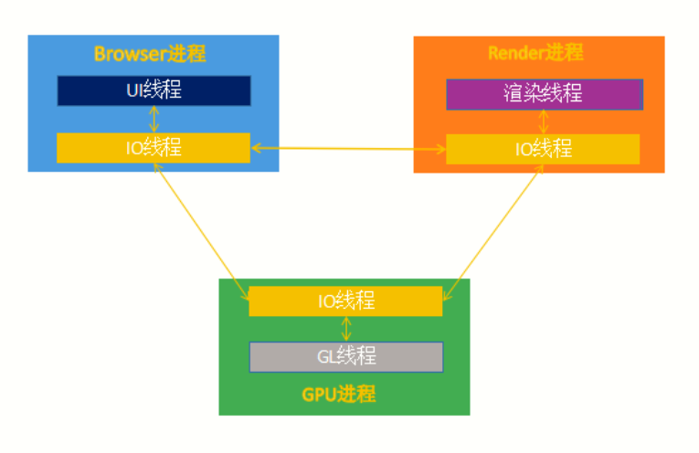
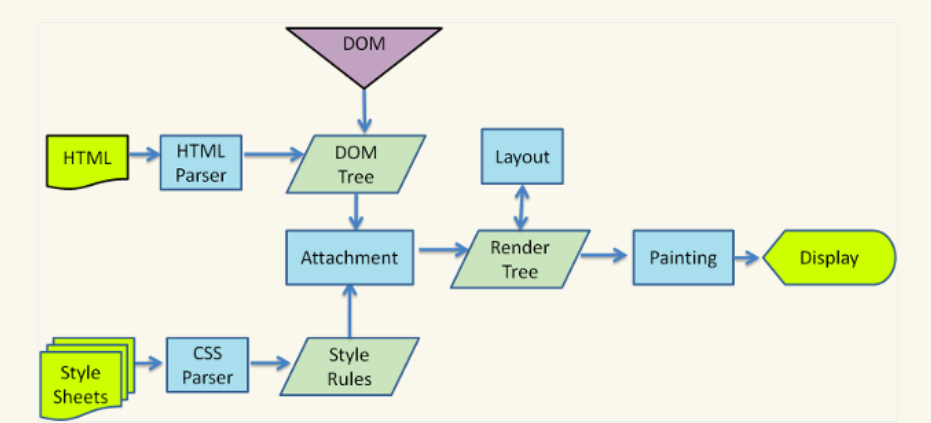
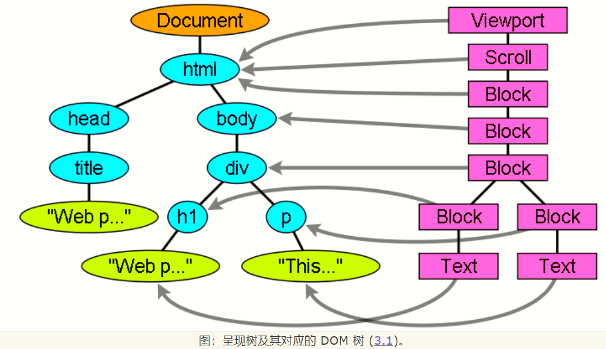
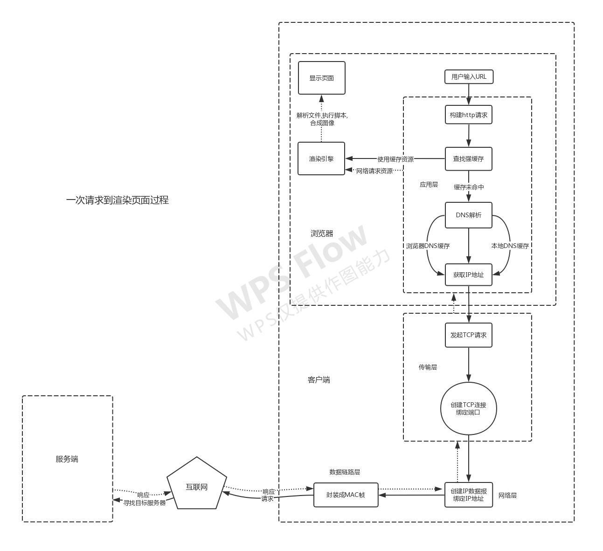

# 从输入URL到呈现页面发生了什么

通篇介绍当用户输入URL回车之后到最终呈现网页画面这一整个过程发生了什么，通过这篇文章能更加彻底的了解浏览器的工作原理，以及从服务器获取资源到本地的过程。

## 当用户输入URL回车之后到获取响应之前浏览器做了什么

### 获取目标URL的IP地址

- 当用户打开一个标签页时，browser浏览器主进程创建一个当前标签页的渲染进程实例，也就是浏览器内核的一个实例。
- 当用户输入URL回车之后，browser主进程负责的浏览器UI菜单栏部分监听到用户发起的一个请求网页信息，构建一个http请求，此时browser会先到强缓存中查询这个请求URL是否已经缓存，如果缓存命中则直接使用缓存渲染页面，跳过从服务器下载资源步骤
- 如果浏览器缓存中并没有发现曾经对这个网站进行过缓存，那么将会发起网络请求获取URL所对应的IP地址
- 当浏览器查询本身的DNS解析缓存池中是否有过当前URL的DNS解析记录，如果没有则会到计算机本地的DNS解析池中查看是否有计算机本地缓存，比如我们在系统盘的hosts文件下查看是否有用户自己写好的域名解析对照表，如果有则直接使用查询到的IP地址发起TCP请求，如果没有则会发起DNS解析请求，到当前计算机所在网络的DNS服务器寻找解析，如果没有再到上层DNS服务器查询直到有DNS解析记录之后，返回的DNS响应中就带有目的URL对应的IP地址

### 浏览器准备

- 此时浏览器获取到IP地址之后对目标IP地址的默认80/443端口发起TCP请求，其中TCP请求是以socket为端进行请求，即IP+端口，所以需要http的80或者https的443端口，当然这2个端口是这些协议请求的默认端口，为了不同用户能够以相同的方式请求服务器。其中服务器提供的端口是要公认的，除非你是自己使用
- browser进程创建的网络资源下载线程，由于http/1.1以及之前版本存在队头阻塞的情况，一个http请求必须在前一个请求得到响应之后才能进行下一次的http请求，为了解决这个问题，各浏览器通过并发连接来缓解，也可以通过域名分片的方式，在chrome中一个域名最多不能超过6个TCP连接，一个域名限制连接数，使用多个域名则可以建立多个TCP连接，这样就能够大大减缓http队头阻塞的问题。在http/2.0中使用到了多路复用的技术，通过二进制分帧，以流的形式传输数据，这样一来一个TCP连接同时可能有多个分帧的http请求，在接受端通过这些帧的匹配来接受对应的数据，这就大大解决了http/1.1中的队头阻塞问题
- 当浏览器创建了一个TCP下载线程之后就是操作系统与网络的工作了，浏览器只需要等待这个响应

其中DNS解析在应用层发生，TCP请求在传输层发生，浏览器走了发送端的应用层与传输层

## 当浏览器发出了TCP请求之后到接收网络资源的过程

### 操作系统创建TCP连接进程

以下http与https就是默认的80/443端口

- 操作系统需要根据这个TCP请求创建一个进程用于负责建立这个TCP连接，其中操作系统会随机在本机的49152~65535客户端端口号中挑选一个端口作为客户端发起的TCP连接源端口号，这样服务器在返回响应的时候才会发往本机的这个随机端口号，用于识别本机的应用程序，TCP请求的头部记录源端口号以及目标端口号，其中目标端口号即为公认熟知的端口号统一的
- 创建TCP请求线程之后操作系统底层网络模块还会对这个TCP请求报文做一次封装，即对TCP报文添加IP首部，也就是添加源与目标的IP地址，此处的目标IP地址就是当初浏览器通过DNS解析/本地缓存中获取的目标IP地址，此时封装成了IP请求，这样网络层就结束了

### 互联网中传输数据

- 计算机通过网卡设备，给要发送的IP请求添加mac地址首部，其中源mac地址就是本机网卡设备的mac物理地址，目标设备mac地址就是当前所处网络的网关设备。此时处于数据链路层，mac地址是用来寻找网络请求的下一个中转点，其中网关就是我们需要发送请求的下一个中转点设备。通过网线发送到ISP，然后就是因特网了，其中最底层的传输媒介就是网线，比如光纤或者是双绞线等，接通一个个交换机、路由器等设备，形成一个网状的拓扑结构，而数据包就在这个网上寻路，通过数据包的各个首部信息指明要去的地方
- 英特网中这些请求包在每次经过中转点的时候，也就是一个个路由器的时候，会从最底层的物理层一直到网络层，通过每次的查错纠错，如果是无效的包就直接丢弃
- 由于数据链路层中，数据包只是从一个点传到另一个通过网线直连的点。可以说是整个网络请求中的最小段，通过一次次的查错转发到达目的地，数据链路层中的每次转发都要更新数据包的源于目标mac地址，其中他们是通过目标ip地址来识别下一个中转站，其实也就是通过网段来识别下一个路由设备，每个路由器都有一个ip与mac的映射表，记录着各个ip网段去往的设备mac地址，从而实现寻路

### 到达目标服务器

- 当通过因特网寻找到最终得服务器时，服务器也是经过发送端在计算机中的那5层，只不过是倒着来，通过一层层首部信息揭开最终的数据
- 数据包到了计算机之后脱去mac首部，操作系统再脱去IP首部，最后根据访问的端口号，把数据包发送给这个端口
- 当端口是80/443端口时，由于服务器上的服务器软件监听这些端口的请求再把数据给对应部署的服务端程序，这样一来，请求的数据就被监听这些请求的服务器软件接收，一般来说一个端口就对应服务一个网站，当然也可以通过代理转发到不同的端口，由部署的服务端程序监听这个转发的端口即可获取数据
- 此时转发到监听端口的服务端程序，这样一来，在客户端发送的请求，服务端程序就接收到了
- 服务端程序接收到http请求体之后，处理请求，如果是建立TCP的请求，那么还会经过TCP的3次握手过程，这里不赘述了，网络篇有详细介绍
- 服务端发起的响应还是相同的方式，只是现在的源地址改成服务器，目标地址改成客户端，这里的响应是通过80/443端口发送出去的，目标端口就是当时客户端随机分配的端口，这样客户端与服务端就能通过ip与端口识别发起/接收网络请求的应用程序

到这里，一个完整的网络请求就结束了，接下来就是浏览器获得网络资源后的操作了

## 浏览器获取到网络资源之后做了什么让页面呈现出来的

### 解析HTML

- 当浏览器接收到网络资源后，也就是下载线程接收到数据之后，browser主进程通过io线程把资源发送给渲染进程

- 渲染进程把获取到的index.html文件给GUI线程解析，一般情况下浏览器根据关键路径优先级，最先加载的就是index.html文件，这是网站的入口文件，通过解析这个文件，再加载其他相关文件，比如css、js文件
- 其中html、css文件的详细解析过程可以在另一篇浏览器工作原理中了解，不过这里还是大致提一下
- GUI线程对html文件的解析，分为生成解析树、DOM树阶段，css解析为sytlesheet树、CSSOM树
- html的解析分为词法解析、语法解析，其中词法解析使用标记化算法，词法分析是将输入内容分割成大量标记的过程，标记是语言中的词汇，即构成内容的单位
- 之后进行语法分析，即把多个标记进行语法匹配，匹配出符合规则的语句形成解析树
- 此时解析树只是带有一条条语句的与层次结构的树，最后通过翻译解析树的语法，生成DOM树，其中DOM树就是window下的DOM对象树，根节点就是document，到这一步，只是解析了html中的标签，使其生成对应的DOM对象，生成DOM对象后将会触发DOMContentLoaded事件

### 解析CSS

- 在解析html中总会解析到外部引入或者是内联、内嵌的css、js代码，当遇到引入css文件时，开启异步下载线程，下载css文件，当下载完成，开始异步解析，解析css通过正则匹配应用匹配规则，解析css中的代码，生成stylesheet对象，此对象包含选择器和声明对象，以及其他与 CSS 语法对应的对象
- 在合成render树之前还需要对stylesheet对象解析，生成样式规则树，此树是用来匹配DOM节点应用的样式规则
- 最后当css与html都解析完成之后将会合并生成render树，此过程较为复杂，主要是匹配DOM节点对应的css样式信息
- 当通过一系列的算法合并成render树之后，还需要对树中每个节点进行布局，布局过程需要计算每个节点的位置信息，比如宽、高、定位等，用于绘制页面时用到的位置信息，计算这个的过程就是回流，当然对于一些不需要计算位置的过程称为重绘，由于这些过程非常耗时，浏览器会对这些过程做优化，比如在生成render树的时候，不是全部的html与css解析完成才合成，而是完成一部分就开始合成render树再渲染，这样就不会长时间的留白，还有使用局部回流，只重新计算修改部分，对于不同的浏览器解析这些文件的过程也会不太相同，但是大致的流程差不多
- 当render计算Layout之后，浏览器在构建完布局树之后，还会对特定的节点进行分层，构建一棵图层树(Layer Tree)

### 合成图层

- 一般情况下，节点的图层会默认属于父亲节点的图层(这些图层也称为合成层)
- 有些情况下会生成独立图层，其中有显式合成与隐式合成，显式合成一般在有特定的css样式下会生成，隐式合成是层叠等级低的节点被提升为单独的图层之后，那么所有层叠等级比它高的节点都会成为一个单独的图层，尽量避免隐式合成，这样会导致图层过多反而不利于GPU硬件加速
- 接下来渲染引擎会将图层的绘制拆分成一个个绘制指令，生成绘制命令列表，之后就可以开始绘制

- 渲染进程中绘制操作是由专门的线程来完成的，这个线程叫合成线程，绘制列表准备好了之后，渲染进程的主线程会给合成线程发送commit消息，把绘制列表提交给合成线程，最后合成线程根据首屏显示区域，把图层分块，渲染进程中专门维护了一个栅格化线程池，专门负责把图块转换为位图数据，然后合成线程会选择视口附近的图块，把它交给栅格化线程池生成位图。生成位图的过程实际上都会使用 GPU 进行加速，生成的位图最后发送给合成线程
- 栅格化操作完成后，合成线程会生成一个绘制命令，浏览器进程中的viz组件接收到这个命令，根据这个命令，把页面内容绘制到内存，也就是生成了页面，然后把这部分内存发送给显卡

### 显示页面

- 而显卡接收到浏览器进程传来的页面后，会合成相应的图像，并将图像保存到后缓冲区，然后系统自动将前缓冲区和后缓冲区对换位置，如此循环更新，此过程有些类似js的垃圾回收机制中的新生代与老生代
- 最后显卡把页面渲染出来，到这里用户就看的了请求网站的页面
- 如果在html解析过程中遇到js文件，那么会根据加载情况使用异步或者同步加载，当加载完成后把js代码加入到事件队列，由事件循环机制，让js引擎线程执行代码，此过程会阻塞GUI线程的进一步解析

以下为一次网络请求响应的大致过程

