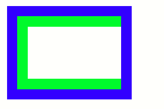
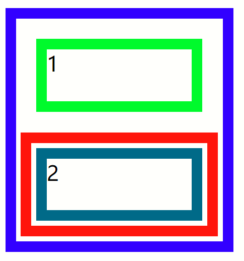
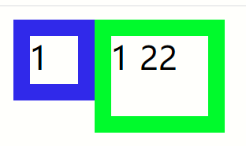
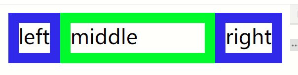
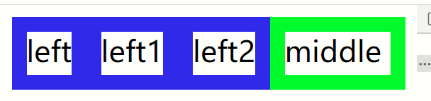
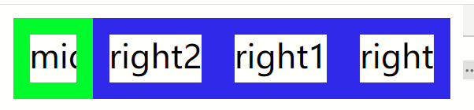
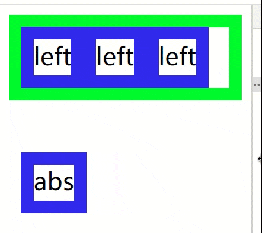
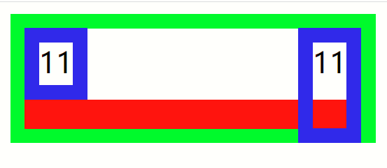
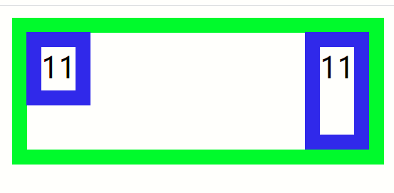

# BFC、浮动、清除浮动

## 什么是BFC

- 块格式化上下文（Block Formatting Context，BFC） 是Web页面的可视CSS渲染的一部分，是块盒子的布局过程发生的区域，也是浮动元素与其他元素交互的区域
- 它是一个独立的渲染区域，只有Block-level box参与， 它规定了内部的Block-level Box如何布局，并且与这个区域外部毫不相干

## 如何创建BFC

- 根元素`<html>`
- 浮动元素，float不是none
- 绝对定位元素，position为absolute或fixed
- 行内块元素，display为inline-block
- 表格单元格，display为table-cell，HTML表格单元格默认为该值
- 表格标题，display为table-caption，HTML表格标题默认为该值
- 匿名表格单元格元素，display为table、table-row、table-row-group、table-header-group、table-footer-group（分别是HTML table、row、tbody、thead、tfoot的默认属性）或 inline-table
- overflow值不为visible的块元素
- display值为flow-root的元素
- contain值为layout、content或paint的元素
- 弹性元素，display为 flex、inline-flex元素的直接子元素
- 网格元素，display为grid、inline-grid元素的直接子元素
- 多列容器，column-count/column-width不为 auto，包括column-count为 1
- column-span为all的元素始终会创建一个新的BFC，即使该元素没有包裹在一个多列容器中

创建满足以上一个条件的元素就会产生BFC，BFC包含创建它的元素内部的所有内容

## BFC规则

- 浮动定位&清除浮动只会应用于同一个BFC内的元素
- 浮动不影响**其它BFC**中元素的布局，BFC的区域不会与float的元素区域重叠
- **清除浮动**只能清除**同一BFC中在它前面**的元素的浮动
- **外边距折叠**，只会发生在属于**同一BFC的块级元素之间**，一般只在垂直方向上边距重叠
- 内部的BOX会在垂直方向上一个接一个的放置
- 计算BFC的高度时，浮动子元素也参与计算
- 每个元素的左外边距与包含块的左边界相接触（从左到右），即使浮动元素也是如此
- position为absolute的元素可以超出它的包含块边界
- BFC使内部的浮动元素不会到处乱跑

在正常的文档流中，块级元素是按照从上自下，内联元素从左到右的顺序排列的，如果给元素float或者绝对定位，它就会脱离普通文档流中，给外层元素创建BFC，限制内部浮动元素

BFC就是页面上的一个隔离的独立容器，容器里面的子元素不会影响到外面的元素

> 因为BFC内部的元素和外部的元素绝对不会互相影响，因此， 当BFC外部存在浮动时，它不应该影响BFC内部Box的布局，BFC会通过变窄，而不与浮动有重叠。同样的，当BFC内部有浮动时，为了不影响外部元素的布局，BFC计算高度时会包括浮动的高度。避免margin重叠也是这样的一个道理

## 范例

### 一、BFC清除浮动

- 对于只包含浮动元素的父元素来说，其高度无法被浮动元素撑开，原因是父元素无法包含浮动元素，父元素的高度不会被浮动元素撑开
- 浮动元素脱离标准文档流，而父元素还属于标准文档流，互不影响
- 通过父元素创建BFC，使其内部元素不会影响外部，只能属于其内部空间，由于浮动元素有一定高度，为了不影响其他外部元素，那么父元素必须包裹所有的浮动元素，这样一来，父元素就由其内部元素自动适应大小

如下，蓝色为父元素，绿色边框为浮动子元素，可以看出父元素没有被子元素撑开，高宽都没有被撑开


以下代码

```BFC清除浮动
<style>
  #parent{
    border: 10px solid blue;
    width: 100px;
  }
  #child{
    float: left;
    width: 150px;
    height: 50px;
    border: 10px solid rgb(57, 250, 9);
  }
</style>
<div id="parent">
  <div id="child">
  </div>
</div>
```

现在给父元素创建BFC，可以使用任何方式，只要父元素能够创建BFC即可

```BFC清除浮动
#parent{
  border: 10px solid blue;
  width: 100px;
  overflow:hidden;
  /* float: left; */
  /* position: absolute; */
  /* display: inline-block; */
  /* display: flow-root; */
  /* contain: layout; */
  /* display: flex; */
  /* display: grid; */
}
```

以上使父元素创建BFC，这样一来父元素就包裹子元素，看效果



> 这里有一点需要注意，如果之前设置了父元素的高或者宽，那么清楚浮动之后的高宽还是固定，不会因为浮动元素改变。在父元素高或者宽不定的时候，清楚浮动之后的高宽才是由浮动元素撑起。简单说，浮动元素只会改变父元素没有明取设置的高宽值，且值为浮动元素中的最大值，毕竟父元素要包裹全部子元素嘛。

### 二、BFC避免外边距塌陷

- 由于在同一个BFC中的两个相邻块之间会导致外边距margin塌陷，即2个块的内边距会重叠在一起

#### 场景1

相邻2个块元素看看外边距重叠效果


可以看到子元素1的外边距远大于子元素2外边距，但是二者在垂直方向上的内边距取了子元素1较大的外边距。其实是二者的外边距重叠了，由于子元素1的外边距更大，所以取了较大值

```BFC外边距塌陷
<style>
  #parent{
    border: 10px solid blue;
    width: 200px;
    overflow: hidden;
  }
  #child1{
    margin: 20px;
    height: 50px;
    border: 10px solid rgb(57, 250, 9);
  }
  #child2{
    margin: 5px;
    height: 50px;
    border: 10px solid rgb(11, 106, 119);
  }
</style>
<div id="parent">
  <div id="child1">1</div>
  <div id="child2">2</div>
</div>
```

由于都在父元素的BFC内，子元素1和2会相互影响，如果让他们处于不同的BFC中即可解决这个外边距重叠问题



从上图可以看到，红边框创建了一个BFC，其内部的子元素2处于红边框的内部，不属于蓝边框的BFC中，因为元素1与元素2处于不同的BFC中，所以就防止了外边距合并。但是可以发现红边框与元素1的外边距还是重叠了，因为红边框与元素1还是属于蓝边框的BFC中

```BFC外边距塌陷1
<style>
  #parent {
    border: 10px solid blue;
    width: 200px;
    overflow: hidden;
  }
  #child1 {
    margin: 20px;
    height: 50px;
    border: 10px solid rgb(57, 250, 9);
  }
  #child2 {
    margin: 5px;
    height: 50px;
    border: 10px solid rgb(11, 106, 119);
  }
  .bfc {
    margin: 5px;
    border: 10px solid rgb(185, 21, 43);
    overflow: hidden;
  }
</style>
<div id="parent">
  <div id="child1">1</div>
  <div class="bfc">
    <div id="child2">2</div>
  </div>
</div>
```

从代码中也可以看出，在同一个BFC下的元素会有外边距重叠问题，处于不同的BFC的元素之间不会有外边距重叠问题，这是因为BFC与BFC之间没有关系，不会互相影响，是相互独立的作用域

#### 场景2

子元素的外边距margin大于父元素的外边距，且父元素没有边框的情况下，父元素的外边距会被子元素的外边距合并，导致父元素外边距塌陷


上图可以看到，在垂直方向上子元素的外边距充当了父元素的外边距，其实是由于父元素的外边距小于子元素的外边距，导致使用较大的外边距作为合并后的外边距。但是在水平方向上的外边距没有合并，而是叠加了，ie另说

```BFC外边距塌陷2
<style>
  *{
    margin: 0;
    border: 0;
  }
  #parent {
    margin: 10px;
    background-color: blue;
    width: 200px;
    height: 100px;
  }
  #child1 {
    margin: 20px;
    height: 50px;
    border: 10px solid rgb(57, 250, 9);
    background-color: brown;
  }
</style>
<div id="parent">
  <div id="child1">1</div>
</div>
```

如果让父元素创建BFC那么其子元素的内容就被限制在了父元素内部，那么子元素的外边距也就只在父元素内部填充。当然也可以让父元素直接使用边框，此时子元素的外边距也会以父元素的边框为参考计算margin


可以看到现在不会塌陷了

```BFC外边距塌陷3
#parent {
  overflow: hidden;
  /* border: 10px solid rgb(67, 99, 59); */
  margin: 10px;
  background-color: blue;
  width: 200px;
  height: 100px;
}
```

### 三、BFC避免浮动元素环绕

众所周知浮动元素脱离文档流，浮动在标准文档流之上，但是不会覆盖文字，而形成文字环绕效果，如下


从上图能够明显看出浮动元素覆盖了其下的标准文档流元素，但是标准文档流的文字却没有被覆盖，而是围绕着浮动元素周围

```BFC浮动元素
<style>
  .float {
    float: left;
    height: 30px;
    width: 30px;
    border: 10px solid rgb(20, 41, 231);
  }

  .box {
    height: 50px;
    width: 60px;
    border: 10px solid rgb(57, 250, 9);
  }
</style>
<div class="float">1</div>
<div class="box">1 22</div>
```

从代码中也可以看到，文字围绕着浮动元素周围分布。接下来给绿色元素创建BFC，由于BFC区域与浮动区域不会相互干扰，即BFC的区域不会与float的元素区域重叠



代码

```BFC浮动元素1
.box {
  overflow: hidden;
  height: 50px;
  width: 60px;
  border: 10px solid rgb(57, 250, 9);
}
```

以上只给绿色边框的元素添加了生成BFC的代码，就可以看到浮动元素不会再覆盖其本身。从这里可以明白，浮动元素区域不会与BFC区域重叠，利用这个性质我们就可以把，浮动元素挤出指定标准流元素之外

#### 自适应左右布局

已经知道BFC会排挤浮动元素，那么可以通过这个特性来实现自适应布局



通过左右浮动以及BFC实现左右分栏，中间自适应宽度

```BFC自适应左右布局
<style>
  .left {
    float: left;
    height: 30px;
    border: 10px solid rgb(20, 41, 231);
  }
  .right {
    float: right;
    height: 30px;
    border: 10px solid rgb(20, 41, 231);
  }
  .middle {
    overflow: hidden;
    height: 30px;
    border: 10px solid rgb(57, 250, 9);
  }
</style>
<div class="left">left</div>
<div class="right">right</div>
<div class="middle">middle</div>
```

比如这样



亦或者是这样



当然还有更多花样


是不是有点自适应的感觉

## 浮动与清除浮动

### 浮动

- float是CSS属性指定一个元素应沿其容器的左侧或右侧放置，允许文本和内联元素环绕它
- 该元素从网页的正常流动(文档流)中移除，尽管仍然保持部分的流动性（与绝对定位相反）
- 浮动可以让块级元素脱离标准流，使其水平排列，使行内元素拥有宽高

浮动元素脱标(脱离标准文档流)，虽然position:absolute定位也脱标，但是主要区别在于，浮动元素是有一定的流动性直到碰到父容器边缘，它会随着父元素的大小或者是创建BFC而改变浮动位置，而position:absolute是不会因为父容器大小而变换，可以理解为是非标准流的精确定位，当然也会覆盖其下标准流元素，且不受父元素影响，可以定位到父元素之外



从以上动画可以看到，浮动元素会随父元素的宽度自动调节浮动位置，而absolute定位则不会有影响，且可以定位到父容器外部，还能发现absolute定位与浮动元素会重叠，说明不在同一个流中。absolute定位可以看成是相对于父容器位置的固定定位，而fixed是相对于视口的固定定位，父容器位置不改变其定位也不会变，而浮动元素则会随父容器的大小自适应排版，且浮动元素之间相互影响不会重叠，absolute定位之间不相互影响，会重叠

#### 浮动属性

- `float: left;`左浮动
- `float: right;`右浮动
- `float: none;`不浮动
- `float: inline-start;`在其所在块容器的开始一侧浮动，根据块元素的排版方向来决定
- `float: inline-end;`在其所在块容器的结束一侧浮动，根据块元素的排版方向来决定

浮动让块级元素排列在同一行，且自适应位置

### 清除浮动

什么时候需要清除浮动呢？

- 当父容器塌陷的时候，为了包裹住浮动元素，那么父元素就要清除浮动
- 让一些块级元素横向排列，默认情况下块与块之间是垂直排列，但是有时候就需要横向排列，那么就可以给块元素添加浮动，然后父元素清除浮动即可

浮动的设计初衷就是为了实现文字随图片环绕效果，随着浮动布局的发展，浮动在网页中应用也比较广泛，因此就需要解决浮动布局中的清除浮动问题

#### 一、通过BFC清除浮动(不建议)

通过给父元素创建BFC，强制把浮动元素限制在父元素内部，达到清除浮动效果，BFC章节中有演示，这里不再赘述

优点：代码简洁

缺点：内容增多的时候容易造成不会自动换行导致内容被隐藏掉，无法显示要溢出的元素

#### 二、通过clear属性清除浮动(不建议)

- `clear: none;`元素不会向下移动清除之前的浮动
- `clear: left;`元素被向下移动用于清除之前的左浮动
- `clear: right;`元素被向下移动用于清除之前的右浮动
- `clear: both;`元素被向下移动用于清除之前的左右浮动
- `clear: inline-start;`该元素向下移动以清除其包含块的起始侧上的浮动
- `clear: inline-end;`该元素向下移动以清除其包含块的末端的浮点

根据clear属性值，清除其之前或者一侧上的元素浮动


```清除浮动前
<style>
  .left {
    float: left;
    height: 30px;
    border: 10px solid rgb(20, 41, 231);
  }
  .right {
    float: right;
    height: 50px;
    border: 10px solid rgb(20, 41, 231);
  }
  .clear {
    /* clear: both; */
    border: 10px solid rgb(231, 20, 55);
  }
  .middle {
    border: 10px solid rgb(57, 250, 9);
  }
</style>
<div class="middle">
  <div class="left">11</div>
  <div class="right">11</div>
  <div class="clear"></div>
</div>
```

可以看到没有清除浮动时的效果，现在通过添加clear属性清除浮动


```清除浮动后
.clear {
  clear: both;
  border: 10px solid rgb(231, 20, 55);
}
```

只给最后一个元素添加clear清除浮动，可以看到最终清除之后处于高度最高的浮动元素底下，其实clear:right效果也是这样，看看clear:left的效果



看到结果，clear:left是以左边浮动元素为参考清除浮动，右边却没有清除浮动，clear可以应用于不完全清除浮动的情况

优点：通俗易懂，方便

缺点：添加无意义标签，语义化差

#### 三、通过给父元素伪元素清除浮动(建议)

- 伪元素清除浮动原理类似上一个方法，主要区别在于，不需要创建额外的标签
- 伪元素可以被浏览器渲染，但本身并不是DOM元素。它不存在于文档中，所以JS无法直接操作它
- 父元素添加伪元素来实现清除浮动



```清除浮动后2
<style>
  .left {
    float: left;
    height: 30px;
    border: 10px solid rgb(20, 41, 231);
  }
  .right {
    float: right;
    height: 60px;
    border: 10px solid rgb(20, 41, 231);
  }
  .middle {
    border: 10px solid rgb(57, 250, 9);
    *zoom: 1;/*ie6清除浮动的方式 *号只有IE6-IE7执行，其他浏览器不执行*/
  }
  .middle::after {
    content: "";
    display: block;
    clear: both;
    height: 0;
    visibility: hidden;
  }
</style>
<div class="middle">
  <div class="left">11</div>
  <div class="right">11</div>
</div>
```

不严谨的写法，还是能达到效果

```清除浮动后2
.middle::after {
  content: "";
  display: block;
  clear: both;
}
```

这里把上一种方法的标签换成了伪元素，使用更方便

优点：符合闭合浮动思想，结构语义化正确

缺点：ie6-7不支持伪元素：after，使用zoom:1触发hasLayout