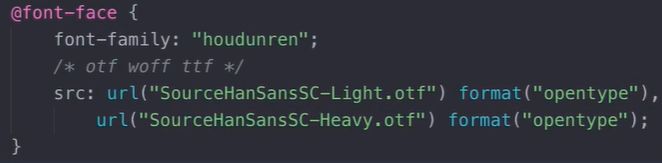

# CSS基础

## 书写方式

- 嵌入式，嵌入到 html 代码中单独一块
  - `<style type="text/css"></style>`html5 可不写，一般放 head 里
- 行内式，直接写到标签内当作标签属性设置 style="css 代码（直接写属性：值；）不用选择器"通用属性
- 外链式，用文件包含.css 文件`<link rel="stylesheet" href="xx.css">`rel 的 stylesheet 为样式表类型 。css 只能写选择器：{语句 1；语句 2}；css 代码
- @import url(css 文件目录)，通过这种方式在 css 中引入其他 css 样式

### css 属性

- css 代码：选择器：{语句 1；语句 2}；
- color 文本颜色#f00==#ff0000
- font-size 文本大小
- width 宽度
- height 高度
- 注释`/*注释内容*/`不能用 html 注释

### 选择器

#### 基本选择器

- \*{属性：值}，为通用选择器，\*表示全部
- 标签名 {属性：值}标签选择器
- .class 名 {}类选择器，使用.类名 来选择；p .class 表示层层选择到指定为 class 类的标签
- #id 名 {} id 选择器，使用#id 来选择；id 唯一，给特定标签设置样式

#### 复合选择器

- 多元素选择器：p,h1,h2 {属性：值} 同时匹配多个标签或类、id 等，多个选择器之间用逗号隔开
- 后代选择器：#id p {属性;值} 匹配所有属于#id 下的全部 p 标签，父子带之间用空格隔开
- 子元素选择器：.class>p {属性：值} 匹配.class 下一层中全部的孩子，不包括孙子及以下
- 相邻元素选择器：div1+div2 {属性：值} 匹配同级紧跟 div1 后的元素 div2，之间用+号连接，条件同级元素，之间没有其他元素，且 div2 在 div1 下面

#### 伪类选择器

- 根据 a 或者其他的超级链接不同状态设置用:状态名 设置
- input:focus,鼠标焦点
- div:target目标内容
- :root根元素伪类选择器
- div:empty空内容的元素
- :link 未访问过的链接的样式
- :visited 已被访问过的链接的样式
- :hover 当鼠标悬浮元素上方时，显示的样式
- :active 鼠标放在元素上面，点击时的样式，即点击瞬间的样式
- 一般超级链接 正常与访问过的状态一样，鼠标放上时设置另一个颜色，激活状态一般不设置时间太短了

#### 属性选择器

- 属性选择器通过属性名和属性值来匹配元素
  - [attr] 匹配所有具有 attr 属性的元素 eg：h1[align][size]{}
  - [attr="val"] 匹配所有 attr 属性值为 val 的元素 eg：h1[align="center"] {}
  - [attr^="val"] 匹配元素中 attr 属性以指定值开头的所有元素 eg：font[color^="#ff"]
  - [attr$="val"] 匹配元素中 attr 属性以指定值结尾的所有元素 eg：font[color$="00"]
  - [attr*="val"] 匹配元素中 attr 属性中包含指定值的所有元素 eg：font[color*="00"]
  - [attr~="val"] 匹配元素中 attr 属性中指定值为一个整体（一个单词独立整体）的所有元素 eg：font[color~="00"]
  - [attr|="val"] 匹配元素中 attr 属性以指定值开头（以及值后跟-）所有元素 eg：font[color|="#ff"]

#### 结构选择器

- div span p{}div的后代span的后代p,后代用空格
- div>span{}div的孩子span，父子级用>
- div h1~h2{}div的后代中h1的兄弟h2以及之后的
- div h1+h2{}div的后代中紧挨h1的兄弟h2

#### 尺寸样式属性

- height auto、length 使用 px 定义
- width 同上
- min-width、max-width
- 自动撑满空间height、width：-webkit-fill-available
- 自动由内容设置weight、height：fit-content
- width、height：min-content、max-content，由内容最大最小适应尺寸

#### 文本属性

- color 设置文本颜色，十进制没有兼容性问题
- text-align 值 left、center、right 设置文本水平对齐方向
- text-decoration：设置文本修饰线 值 none 去掉文本修饰线、underline 下划线、overline 上划线、line-through 删除线
- text-transform 值 capitalize 首字母大写、uppercase 大写、lowercase 小写、small-caps小型大写
- line-height 值 固定值或%，设置行高，调整文本位置，与高度值一致则为居中
- text-indent 值 px 或 em，设置首行缩进，允许负值
- letter-spacing 值 px，设置字符间距
- word-spacing 值 px，设置单词间距
- writing-mode：vertical-rl右列排列vertical-lr左列排列，horizontal-tb上下排列
- font-style 值 normal 正常、italic 斜体，设置文本斜体
- font-weight 值 normal 正常，bold 加粗，设置文本加粗
- font-size 值 12px、14px，记得加单位，设置文字大小
- font-family 值 微软雅黑、楷体、宋体，设置文本字体
- font 值 eg：font：italic bold 14px "微软雅黑" ，可以同时设置斜体、加粗、大小、字体；需要空格隔开，并且要有顺序
- vertical-align 垂直对齐，行内块元素有默认值，默认 baseline 默认对齐，top 顶部对齐，middle 中部对齐，bottom 底部对齐
- 定义字体

- 1em相当于100%宽度字体
- %相对于父级
- 行高1.5em（倍数适应好）、px
- white-space:pre-line保留空格，nowrap不换行
- text-overflow：ellipsis溢出...
- text-indent：1em首行缩进

#### 列表样式属性

- 无序列表和有序列表
- list-style-type 值 none 将列表前面的小圆点去掉、disc 实心圆、square 实心方块、circle 空心圆，设置列表前面符号的类型
- list-style-position 值 inside 在里面、outside 在外面，设置列表项标记放置的位置，inside 在框内，outside 在框外
- list-style-image 值 url 图像路径，将图像设置为列表项标记
- list-style 值 square inside url（xx.png），在一个声明中设置所有列表属性

### 继承性

- 外层元素身上的样式会被内层元素继承，子继父
- 如果内层元素的样式与外层元素样式一致时，优先渲染内层样式

> **只有*文本*与*字体*样式属性能够被继承，其他属性都不可以继承**

- 一般直接给 body 标签设置字体大小和样式，body 为最外层元素

### 优先级

> **行内样式>id 选择器>类选择器>标签选择器>**

- 一般选择器指向越准确，优先级越高
- *通配符权重0，继承权重null，通配符大于继承
- 标签选择器用 1 表示
- 类选择器用 10 表示
- id 选择器用 100 表示
- 行内选择器用 1000 表示
- 上述数值表示权重，**权重值越高优先级越高**
- ！important 提升**属性**优先级，使用此关键字，权重无限大，为最高级；需写在值的后面不能有分号需要空格，不能提升继承过来的权重，即只增加自己属性的权重，不增加孩子的权重
- 同权重谁后出现谁优先

#### 一个标签可以有多个类名

- 类名直接用空格隔开 eg：class="show head"
- 快捷生成 div.div${哈哈\$}\*2

  ```快捷生成
  <div class="div1">哈哈1</div>
  <div class="div2">哈哈2</div>
  ```

- 如果多个类名的样式一样，则会冲突，优先使用优先级高的，即写的越近的 css 样式，谁越后写谁优先级高和 class 写的顺序无关

#### 背景样式属性

- bakcground-color 值#ffffff 等，设置背景色
- background-image 值 url 图像路径，设置背景图
- background-repeat 值 repeat、repeat-x、repeat-y、no-repeat，设置图像重复类型
- background-position 值（left、right、center）center center 或 x% y%或 xpos ypos，设置背景图像起始位置
- background-attachment 值 scroll 滚动、fixed 固定，设置背景图像是否固定或者随页面的其余部分滚动
- background 值 url no-repeat center center，设置背景的简写形式
- background-clip：content-box背景按内容裁切

#### 标准文档流

- html 文档从左至右、从上至下

1. 空白折叠现象
   - 换行处有空白间隙
   - 文字和图片在同一行就不会有间隙
2. 高矮不齐，底部对齐
   - 高度不齐时，只有底部对齐

#### 浮动流

- 实现多个块元素在同一行，并且设置高宽
- 有行内元素特性、有块级元素特性
- float 值 left（左浮动）、right（右浮动），脱离标准文档流，不占位置
- 浮动元素碰到父级元素边框线停止，浮动元素层级比标准文档流高，会覆盖底下元素
- 浮动元素碰到上一个浮动元素则停止
- 父元素不会包裹浮动元素
- 行内元素浮动之后会成为块元素
- 浮点影响后面的元素

#### 清除浮动

- 为什么要清除浮动：浮动元素会影响下面元素的排版布局，父元素不会包裹浮动元素
- 清除浮动就不会邮箱之后排版，父元素会在视觉上包裹浮动元素
- 清除的 3 个方法：

  1. 给浮动元素的父元素设置固定高度，不建议使用
  2. 使用清除浮动的样式 clear，专门清除浮动；clear：left、right、both 都清，一般用在最后一个浮动元素下再建一个 div 放上清除浮动属性，::after{clear:both;content:'';display:block}追加元素
  3. 使用 overflow：hidden 属性清除浮动，溢出隐藏，父元素设置，BFC计算浮动元素高度

#### 盒子模型

- 盒子=内容 content+内填充 padding+边框 border+外边距 margin
- 盒子主要属性：width、height、padding、border、margin
- width、height 为内容的宽度
- 盒子高宽为内容+内填充+边框大小，一般不设置盒子宽高

##### 内填充 padding

- padding-top、-left、-right、-bottom，设置指定方向的内填充
- padding 简写属性为，上右下左顺序填写大小
- 一值为全部，二值为上下、左右，三值为上、左右、下，四值为分开设置

##### margin 外边距

- 上右下左同上设置
- margin 有塌陷现象，在标准文档流中，竖直方向上的 margin 不会叠加，它会取较大的值
- 水平方向没有 margin 塌陷现象，为相加
- 浮动元素没有 margin 塌陷现象，为相加
- margin 的 auto 自动值，auto 会自动居中
- margin:0 auto;用 margin 居中时需要固定宽度，块元素盒子居中，区分**text-align 为文本居中**
- 元素没设置宽度，则会占据父元素 100%宽度
- 多用父元素的 padding，少用子元素的 margin
- 给父元素设置边框，子元素可用 margin，少用
- 父元素没设置边框，父元素设置 padding，撑开子元素，推荐使用
- margin 用于描述兄弟之间的关系，父子关系用 padding

##### border 边框

- 边框 3 要素，粗细、颜色、线条
- border：粗细 线型 颜色；border:1px solid red;颜色不写为黑色，其他值不能不写，否则无效
- 线型：常用 3 种=>dotted 圆点虚线、dashed 短虚线、solid 实线
- 边框方向大小设置同上，可设置各方向不同边框
- shape-outside：border-box文字环绕边框，值也可以是clip-path的值、url（图片.png）
- clip-path：circle（大小 at 圆心x，圆心y），形状、ellipse、polygon绘制形状

##### display 转换元素体现类型

- 显示元素属性
- 值为 inline 行内元素、block 块级元素、none 不显示、inline-block 行内块元素，转换之后具有各类型属性
- display会丢失空间
- visibility：hidden会保留空间位
- opacity：0透明度

#### position

- position 值 fixed 固定定位、relative 相对、absolute 绝对
- 定位需配合定位坐标使用 left、right、top、bottom 离各方向距离
- 定位居中用left：50%，margin-left：-自己的一半
- 定位才有层级
- 后定位层级比前定位高

1. fixed 固定定位，相当于浏览器窗口的位置定位，不管滚动位置不变
   - 不占空间
   - 脱离标准流，层级比标准流高
   - 不随 llq 滚动而 dong
   - 使用固定定位来实现返回顶部按钮
2. relative 相对定位 相对于自己原来位置的定位，即 left、top=0px 时的位置

   - 相对定位没有脱标
   - 如果没有设置坐标，则还在原来位置
   - 设置坐标后在原来位置上留了坑，还占位置，很少单独使用，一般配合绝对定位使用，子绝父相，父亲设置相对且不设置坐标，孩子可以使用绝对定位控制位置
   - 相对定位会覆盖标准流元素
   - 定位坐标可为负值，则为反方向

3. absolute 绝对定位 查找父元素的定位属性，如果有定位属性，会参照父元素来定位，层层冒泡寻找，如果都没有则已浏览器窗口为参照
   - 绝对定位脱离标准流
   - 绝对定位不占空间
   - 绝对定位会覆盖标准流元素
   - left、top、right、bottom 属性相当于自身前代中有定位（固定、相对、绝对都行一般为相对的前代）属性（最近级）的前代为参照，来进行定位

4. sticky粘性定位，吸附作用，left：0px，吸附定位顶部，同级不会移走会覆盖，非同级会移走

#### z-index 层级

- 只有定位元素才有 z-index 属性
- 没有单位，默认值为 0 ，如果都没设置，则后写的会覆盖早写的元素
- z-index 值越大，层级越高，越后渲染，则显示越前面
- 固定导航条为最高层，则不会被覆盖

### CSS3=CSS2+新语法

#### 结构伪类选择器

- div：first-child 匹配第一个孩子
- div：last-child 匹配最后一个孩子
- div：nth-child（n） 匹配第 n 个孩子
- div：nth-child（2n） 匹配偶数孩子
- div：nth-child（even） 匹配偶数孩子
- div：nth-child（2n+1）匹配奇数孩子
- div：nth-child（odd） 匹配奇数孩子
- div：only-child 匹配有且只有一个的孩子
- :xxx-of-type限制类型eg：nth-last-of-type
- 可连续写多个:选择，除去用not()
- input:disabled、input:enabled、input:checked、input:require、input:optional、input:valid、input:invalid
- p::first-letter、p::first-line、span::after、

#### border-collapse 合并表格边框线

- 表格各边框相交处只留一个边框
- 轮廓线outline-style：double
- box-sizing：border-box盒子不会向外面撑开，固定大小

#### 伪元素（选择器）

- :first-letter 操作当前元素中第一个
- :first-line 操作当前元素中第一行
- ::before 在之前插入，在盒子内部的最前面插入
- ::after 在之后插入，在盒子内部的最后面插入

  ```插入
  .box::before{
    /*插入内容写在content中*/
    content:"哈哈";
  }
  ```

#### 文本阴影

- text-shadow 值可为多个，用逗号隔开
- 值 h-shadow 必须，水平阴影位置可负，正为右
- 值 v-shadow 必须，垂直阴影位置可负，正为下
- blur 可选，模糊距离
- color 可选，阴影的颜色
- text-shadow：3px 3px 3px red；分别为水平、垂直、距离颜色，可设置多组用逗号分隔shap

#### 盒子阴影

- box-shadow 值为多个顺序：水平方向、垂直方向、阴影清晰度、阴影大小、阴影颜色、阴影位置（inset outset 默认）
- h-shadow、v-shadow 必须
- blur 模糊距离、spread 阴影尺寸、color 阴影颜色、inset 内阴影（默认为外阴影）可选值

### 圆角矩形

- border-radius：左上 右上 右下 左下，顺时针单位 px 或%
- 4 个值一样可只写一个，写 50%为圆形

### 透明度

- rgb 中第 4 位为透明度，0 为透明，1 为不透明
- 颜色都可设置透明度

### 弹性盒模型

- display：flex弹性盒子，块级元素、inline-flex行级块，文本也适用
- 弹性盒子内放弹性元素
- 弹性容器
  - flex-direction：row左到右、row-reverse右到左、column上到下、column-reverse下到上排列
  - 默认往内挤（放不下变换情况），flex-wrap：wrap上到下挤、wrap-reverse下到上挤
  - flex-flow：row wrap 同时设置排列和折行
  - 主副轴
  - justify-content：flex-start、flex-start、center、space-between平均分布（左右靠齐）、space-around左右各有间距、space-evenly完全平均分布、内容对齐方向参照盒子的排列方向，只控制主轴
  - align-items：副轴对齐方式（元素），stretch拉伸优先级低于高宽
  - align-content副轴对齐方式（内容）同justify
- 单个元素设置
  - align-self：自己对齐
  - flex-grow：1平均分配、0不进行分配、3三等分，分配按照总的分配数划分，没分配的不计算在内，放大
  - flex-shrink：0为不压缩、1为压缩分配比例，按照总压缩的的占比算，缩小
  - flex-basis：基准尺寸，按照主轴控制高或者宽，优先级比普通尺寸高比max低
  - flex：放大 缩小 基准
  - order：1排列顺序数值越大越后面
- 弹性不影响绝对定位，相对定位影响后面布局

#### 栅格系统

- display：grid栅格容器，块级
- grid-template-row：repeat（5，20%）画行、columns列，repeat（auto-fill，100px）、（3，1fr）按份分（2，minmax（50px，100px））
- row-gap：行间距、column-gap列间距，gap，行 列
- grid-row/column-start/end：r1-start/c2-end画指定行列位置栅格，必须矩形
- grid-template-row：快捷画栅格r、c

- span 1占一行/列
- grid-row/column：3/4，开始/结束（推荐）
- Bootstrap框架
- grid-area：2/2/3/3定位区域
- grid-template-areas：“header header”统一命名区域，grid-area：header：同名划分到一个区域
- grid-auto-flow：排列方向（dense自动填满空格）
- justify-content：、align-content：和弹性差不多
- justify-items、align-items控制整个栅格内元素
- justify/align-self控制自己对齐
- place-items同时控制、place-self

#### 变形透视

- x水平，y垂直，z纵深不能%
- transform:translateX（200px）x移动，%，translate（x，y），可以把元素定在中心用动画，translate3d（x，y，z），scaleX（2，.5）缩放,perspective(900px)透视，rotateX（45deg）、rotate（）、rotate3d（x,y,z,deg）旋转，scaleZ（5）z轴拉长，scale3d（x,y,z），skew(xdeg,ydeg)倾斜
- transition：2s过渡时间，哪个元素变化哪个使用过渡
- linear-gradient（to left，col，col）线性渐变函数
- transform-style:preserve-3d，能看到z轴方向
- transform-origin:left top缩放基点，旋转参考点等变换参考点
- filter:blur(15)模糊、滤镜
- transform不会叠加，同属性只会使用一个属性，顺序有关系
- 块元素才会变换
- 父元素设置透视，子元素的透视效果不同perspective值越小透视越严重
- perspective：600px给子元素设置透视
- perspective-origin:-100px 200px视角移动
- backface-visibility:hidden背面不可见

#### 过渡

- transform：2s过渡时间,可以继承，可以单独设置状态的过渡
- transition-property:col，width（默认all）过渡属性
- transition-duration：2s，属性过渡改变时间，可独立设置每个属性过渡时间
- transition-timing-function:ease、linear、（，，，）贝塞尔曲线，steps（3，end）分步过渡，step-end/start帧过渡、步进
- transition-delay:1s延迟过渡（2s,3s）可分别设置属性过渡延迟，时间不够不显示
- transition：过渡属性 过渡方式 过渡时间 延迟时间，组合设置过渡，也可每个属性独立设置

#### 帧动画

- 定义帧动画，定义顺序无关,不会覆盖过渡变换，多个动画可以同时作用
- animation-name:帧动画名
- animation-duration:2s帧动画过渡时间，动画时间
- 属性重叠，后出现的优先级高，不管时间
- animation-fill-mode:forwards（保持100%时状态）、初始状态backwards填充模式
- 有中间值的 有过渡效果
- animation-iteration-count:1,2执行次数、infinite无限循环
- 动画方向animation-direction：reverse（从后往前）动画方向、normal、alternate、alternate-reverse
- background：radial-gradient（at center，col，col）背景渐变
- 延迟动画animation-delay：2s过2秒开始动画
- animation-timing-function:动画过渡平滑模式，cubic-bezier（，，，）自定义参数
- box-shadow：currentColor（获取文本颜色的阴影）盒子阴影
- 阴影作为动画。。。
- 步进动画animation-timing-function:step(0,start)
- animation-play-state:paused动画状态暂停，running运动
- animation-fill-mode:backwards延迟的初始状态为起始帧，forwards定格结尾帧、both两者都、normal
- 组合animation:hd 模式 运行时间 延迟

``` 帧动画
@keyframes 帧动画名{
  form{
    起始
  }
  to{
    终点
  }
  0%{
    百分比形式
  }
  50%,75%{

  }
  100%{

  }
}
```

#### 响应式布局

- 不同屏幕上有不同布局
- media="screen"设备属性print打印设备all，link标签，css中使用@import url（print.css) print，media=“screen and (min-width:760px) and (max-width:1000px) and (orientation:landscape横屏),screen and (min-width:760px)”，用逗号表示或，逻辑非not写在最前面，only浏览器支持则使用
- @media screen and (max-width:600px){样式}
