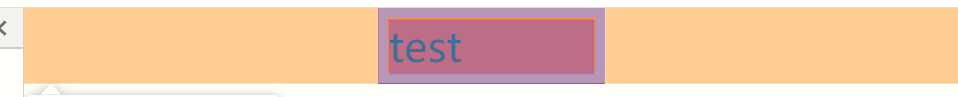
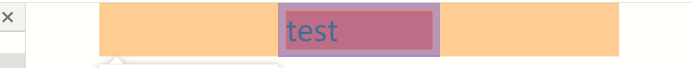
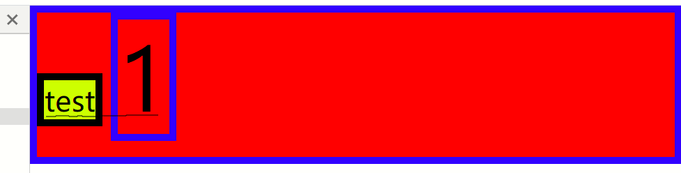
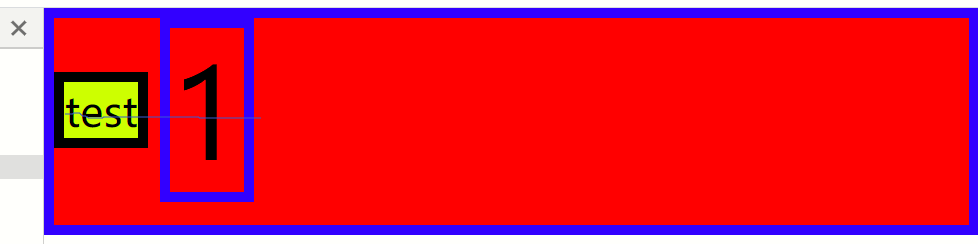
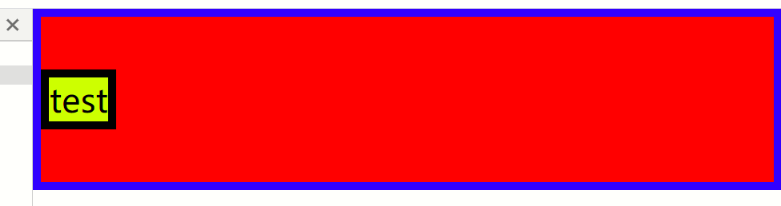

# 实现水平&垂直居中

## 水平居中

### 文字水平居中

**`text-align: center`** 最简单的实现

#### 块级元素，文字居中

```css 文字水平居中1
.align1 {
  text-align: center;

  border: 5px solid blue;
  background: red;
}
<div class="align1">test</div>
```

大多数的块级元素，直接使用这条属性就能实现文字居中

还包括`p、ul、li、h1~h6、ol、form`等等

#### 行内元素，文字居中

转为**块级元素+定宽**

```css 文字水平居中2
 /* 行内块元素需要给定宽度才会撑开，否则宽度以内容为标准 */
.align1 {
  text-align: center;
  display: inline-block;  /* 转成行内块元素 */
  width: 100px;    /* 必须给宽度，否则将根据内容被撑开 */

  border: 5px solid blue;
  background: red;
}
<span class="align1">test</span>
```

行内元素，实现文字居中，需要转成块级元素或者是行内块元素，即拥有块级元素的特性，就能实现文字水平居中，不过还要给定宽度才能体现出来

还包括`inline-table、list-item、table-caption、table-cell、inline-box`等等

### 元素水平居中

此处讨论的是块级元素水平居中，非块级元素水平居中，相当于文字居中

#### 一、定宽+`margin:auto`或`margin:0 auto`

对给定宽度的块级元素水平居中

```css 元素水平居中1
.align1 {
  width: 100px;
  margin: auto; /* 或margin:0 auto; */

  border: 5px solid blue;
  background: red;
}
<div class="align1">test</div>
```

如果不给宽度，块级元素将会自动拉满宽度，所以也就没有所谓的水平居中。

使其水平居中需定宽，当margin-left与margin-right为auto时，浏览器将会自动居中元素，所以`margin:auto或者margin:0 auto、margin-left:auto;margin-right:auto;`都能实现水平居中

#### 二、定宽+定位+`left:50%`+`margin:-50%*宽`

这种方法也很常见，块级元素都要定宽，再居中才有意义，定位的可以调整其距离4个方向上的位置，再通过margin调整多移动的位置

```css 元素水平居中2
.align1 {
  width: 100px; /* 定宽 */
  position: relative; /* 定位 */
  left: 50%;  /* 左偏移 */
  margin-left: -50px; /* 调整多走宽度的一半 */

  border: 5px solid blue;
  background: red;
}
<div class="align1">test</div>
```

定位方式还包括`absolute、fixed`

#### 三、定宽+定位+`left:50%`+`transform:translate3d(-50%,0,0)`

原理同方法二，不同的是通过transform偏移，效率更高，如果采用3d偏移，浏览器将调用GPU启动3d硬件加速

```css 元素水平居中3
.align1 {
  width: 100px;
  position: fixed;
  left: 50%;
  transform: translate3d(-50%,0,0); /* x轴左移动宽度50% */

  border: 5px solid blue;
  background: red;
}
```

#### 四、定宽+定位+`left:0`+`right:0`+`margin:auto`或`margin:0 auto`

原理类似方法一，主要是利于定位的特性

方法一是不局限位置，通过margin的自动对齐方式。此方法也是通过margin自动对齐，注意基于w3c标准盒模型left的值为margin最左到文档最左的距离，不是border到文档最左的距离

```css 元素水平居中4
.align1 {
  width: 100px;
  position: fixed;
  left: 0;
  right: 0;
  margin: auto; /* 自动补齐左右距离 */

  border: 5px solid blue;
  background: red;
}
<div class="align1">test</div>
```

left与right强制设置为0，加上margin的auto，导致margin自动补全左右距离使其满足left与right为0



上图为left与right时margin的自动填充，橘黄色位置即为margin，可以看到填充了很多。接下来我调整一下lefr与right的值



上图中我把left与right都设置为50px，可见margin也是相对左右位置开始填充，所以只要保证left与right的值相等即可使用margin对齐。当然left、right也可以是负值，只不过margin填充更多而已

#### 五、父元素:`display:flex`+`justify-content:center`

此方法设置子元素在其父元素内居中

```css 元素水平居中5-1
.align1 {
  display: flex;  /* 父元素为弹性盒 */
  justify-content: center;  /* 设置其主轴(x水平轴)内容对齐 */

  border: 5px solid blue;
  background: red;
}
.align2 {
  border: 5px solid black;
  background: yellow;
}
<div class="align1">
  <span class="align2">test</span>
</div>
```

如下，同理**设置y轴为主轴，再设置`align-items:center`**对齐，效果一致

```css 元素水平居中5-2
.align1 {
  display: flex;
  flex-direction: column; /* 主轴为y垂直轴 */
  align-items: center;  /* 副轴(x水平轴)对齐 */

  border: 5px solid blue;
  background: red;
}
```

如下，**父元素设置`display:flex`+`flex-direction:colum`,子元素设置`align-self:center`**，此方法单独给子元素设置水平对齐

```css 元素水平居中5-3
.align1 {
  display: flex;
  flex-direction: column;

  border: 5px solid blue;
  background: red;
}
.align2 {
  align-self: center;
  border: 5px solid black;
  background: yellow;
}
<div class="align1">
  <span class="align2">test</span>
</div>
```

flex布局实现居中的方式很多，但是大同小异，主副轴对调、给父元素设置内容对齐、单独对子元素设置对齐。总之flex就是"花样多"，但不得不说确实好用

#### 六、父元素`display:grid`+`justify-content:center`

此方法很少用，我也是找资料才知道

```css 元素水平居中6
.align1 {
  display: grid;   /* 网格 */
  justify-content: center;  /* 主轴对齐 */

  border: 5px solid blue;
  background: red;
}
.align2 {
  border: 5px solid black;
  background: yellow;
}
<div class="align1">
  <span class="align2">test</span>
</div>
```

用法也类似flex，具体用法待补充

#### 七、`width:fit-content`+`margin:auto`或者`margin:0 auto`

fit-content只支持Chrome 和 Firefox浏览器

```css 元素水平居中7
.align1 {
/*   width: -moz-fit-content;
  width: -webkit-fit-content; */
  width: fit-content;
  margin: auto; /* 或者margin:0 auto */
  
  border: 5px solid blue;
  background: red;
}
<div class="align1">test</div>
```

fit-content就是实现元素收缩效果的同时，保持原本的block水平状态，配合margin实现自动水平居中。如果width不设置，那么块级元素自动会拉满宽度，当设置fit-content后，宽度就由内容决定

#### 手动定位，这个方法最无脑，给个定位，计算left距离写死

### 水平居中先讲到这里，待补充。。。

## 垂直居中

### 文字垂直居中

#### 行内元素

**定高+`line-height:父级/自身高度`** 通过设置行高与父元素高度或自身高度一致，即可实现文字垂直方向的居中

```css 文字垂直居中
.align1 {
  height: 100px;
  line-height: 100px;
  
  border: 5px solid blue;
  background: red;
}
.align2 {
  border: 5px solid black;
  background: yellow;
}
-----------------同效果---------------
.align1 {
  height: 100px;
  
  border: 5px solid blue;
  background: red;
}
.align2 {
  line-height: 100px;
  border: 5px solid black;
  background: yellow;
}
<div class="align1">
  <span class="align2">test</span>
</div>
```

由于文字属性具有继承性，所以不论设置父级还是自身都会使内部文字居中

**父元素:定高+`display:table`+子元素:`display:table-cell`+`vertical-align:middel`**此方法设置子元素内的文字垂直居中

```css 表格文字垂直居中
.align1 {
  display: table;
  height: 100px;

  border: 5px solid blue;
  background: red;
}
.align2 {
  display: table-cell;
  vertical-align: middle;

  border: 5px solid black;
  background: yellow;
}
<div class="align1">
  <span class="align2">test</span>
</div>
```

只设置文字垂直居中，不是子元素垂直居中

#### 行内块元素

##### 先了解一下基线对齐

当块级元素内的文字高度不一时，以文字最高的基线作为所有文字的基线，先看如下

```css 行内块元素垂直居中
.align1 {  /* 父元素只给高度 */
  height: 100px;

  border: 5px solid blue;
  background: red;
}
.align1::after {   /* 父元素给个伪元素 */
  display: inline-block;
  content: '1';
  font-size: 60px;

  border: 5px solid blue;
  background: red;
}
.align2 { /* 子元素 */
  font-size: 20px;

  border: 5px solid black;
  background: yellow;
}
<div class="align1">
  <span class="align2">test</span>
</div>
```



基线画的不是很整齐，但是能看出test与1的底线对齐，即最高文字的基线对齐，这就是文字默认的基线对齐。加`display: inline-block;`的原因就是形成BFC，不让子元素与父元素的border重叠，如果去掉则边框会重叠，子元素会向上移动边框宽度

再看下添加`vertical-align: middle;`效果，先说明这个属性是设置行内元素在其父元素内的垂直对齐方式

```css 行内块元素垂直居中1
.align1::after {
  vertical-align: middle;  /* 垂直居中 */
  display: inline-block;
  content: '1';
  font-size: 60px;

  border: 5px solid blue;
  background: red;
}
.align2 {
  vertical-align: middle;
  font-size: 20px;

  border: 5px solid black;
  background: yellow;
}
```



设置完之后，会发现，文字以其垂直方向上的中心线对齐，没错这就是设置`vertical-align: middle;`的效果。可以这么理解，块级元素中的基线(即默认`vertical-align: baseline;`)以行内元素中字体高度最高的那个文字的底线作为基线，所有的vertical-align属性都是以最高的那个文字作为参照

> 行内元素默认高度是line-height 默认值为文字高度的1.0-1.2倍，img标签的底部与文字底部基线对齐，height可以触发hasLayout，line-height不会

[推荐文章](https://juejin.im/post/6844903507007553550)

##### 文字垂直中心线对齐

这么一来就明白了其效果，那么可以设置一个伪元素，让其内容为''，且其高度为100%，再设置文字为`vertical-align: middle;`，这么一来就使所有的文字相对于父元素垂直居中，其实是基于最高行内元素的垂直中心线对齐

```css 行内块元素垂直居中2
.align1 {
  height: 100px;

  border: 5px solid blue;
  background: red;
}
.align1::after {
  vertical-align: middle; /* 垂直中心线对齐 */
  display: inline-block;  /* 必须为属性行内块元素，这样才有高 */
  content: '';   /* 无内容 */
  height: 100%;  /* 之前用font-size: 60px;撑开的高度，现在不需要显示字，只需设为与父元素一样高即可 */

  /* 由于border会使其向下偏移border高度，且现在不需要显示，所以这里不需要border */
  /* border: 5px solid rgb(102, 255, 0); */
  background: red;
}
.align2 {
  vertical-align: middle; /* 垂直中心线对齐 */
  font-size: 20px;

  border: 5px solid black;
  background: yellow;
}
<div class="align1">
  <span class="align2">test</span>
</div>
```

最终效果，此方法兼容性较好也适应IE7



### 元素垂直居中

这里讲的是块级元素垂直居中，行内元素上述已经说明

#### 一、父元素:定宽+`display:flex`+`align-items:center`

这个方法与水平居中类似，其子元素垂直居中，主副轴对调又是一种方法，不多赘述

```css 元素垂直居中1
.align1 {
  display: flex;
  height: 100px;
  align-items: center;

  border: 5px solid blue;
  background: red;
}
```

还有，子元素直接设置`align-self: center`实现单个元素垂直居中

#### 二、父元素:定位+定高+子元素:`position:absolute`+`top:50%`+`margin-top:-50%高度`+定高

这与水平实现方式类似

```css 元素垂直居中2
.align1 {
  height: 100px;
  position: relative;

  border: 5px solid blue;
  background: red;
}
.align2 {
  position: absolute;
  top: 50%;
  margin-top: -15px;
  height: 30px;

  /* 子元素不加border，若加了需要`margin-top:-50%*(高度+上下border的总宽度)` */
  background: yellow;
}
<div class="align1">
  <div class="align2">test</div>
</div>
```

这里的`margin-top:-50%高度`可以改为使用`transform:translate(0,-50%)`

#### 三、父元素:浮动+定高+子元素:`position:relative`+`top:50%`+`transform: translate3d(0,-50%,0)`

其中translate3d还是2d都行，建议使用3d，如果换成margin-top则需要计算自身高度，所以需要设置height(具体值)，transform则不需要

```css 元素垂直居中3
.align1 {
  float: left;
  height: 100px;

  border: 5px solid blue;
  background: red;
}
.align2 {
  position: relative;  /* 如果使用absolute 父元素需要定位属性 */
  top: 50%;
  transform: translate3d(0,-50%,0);

  border: 10px solid blue;
  background: yellow;
}
<div class="align1">
  <div class="align2">test</div>
</div>
```

#### 手动定位就不讲了，大家都知道，给个能设置top、bottom、left、right的定位都行

### 其他垂直居中待补充。。。

## 水平垂直都居中

文字水平垂直居中要么是转成行内块元素，要么是使用伪元素，这里同一归为块级元素来说明

### 一、父元素:定位+定宽高+子元素:定宽高+`position:absolute`+4个方向:0+`margin:auto`

此方式同之前讲的左右为0，用margin自动填补，这里的4个方向的值只要都一样即可，margin自动向4周均等填充，也就实现居中

```css 水平垂直居中1
.align1 {
  position: relative;
  height: 200px;
  width: 200px;

  border: 5px solid blue;
  background: red;
}
.align2 {
  position: absolute;
  margin: auto;  /* 这里4个方向的margin必须都为auto */
  height: 50px;
  width: 50px;
  top: 0;
  bottom: 0;
  left: 0;
  right: 0;

  border: 5px solid blue;
  background: yellow;
}
<div class="align1">
  <div class="align2">test</div>
</div>
```

### 二、父元素:`display:flex`+定宽高+`justify-content:center`+`align-items:center`

此方法就是利于flex盒模型实现，是不是发现flex哪都有它，没错flex就是这么强，推荐使用

```css 水平垂直居中2
.align1 {
  display: flex;
  width: 100px;
  height: 100px;
  justify-content: center;
  align-items: center;

  border: 5px solid blue;
  background: red;
}
.align2 {

  border: 5px solid blue;
  background: yellow;
}
<div class="align1">
  <div class="align2">test</div>
</div>
```

如果父元素使用flex布局，那么子元素的排列方式可不止这些

### 三、`position:absolute`+定宽高+`top:50%`+`left:50%`+`transform:translate3d(-50%,-50%,0)`

这里的transform可以改成margin形式的写法，使用position使需要祖先中有定位，如果都没有那么相对于body居中

```css 水平垂直居中3
.align1 {
  position: absolute;
  width: 100px;
  height: 100px;
  top: 50%;
  left: 50%;
  transform: translate3d(-50%,-50%,0);

  border: 5px solid blue;
  background: red;
}
<div class="align1">test</div>
```

#### 暂时补充到这里，有些奇葩少见的居中方式我还得研究一下。。。

## 总结

### 水平居中

- 文字水平居中:
  - **`text-align: center`**
- 块元素水平居中:
  - **定宽+`margin:auto`或`margin:0 auto`**
  - **定宽+定位+`left:50%`+`margin:-50%*宽`**
  - **定宽+定位+`left:50%`+`transform:translate3d(-50%,0,0)`**
  - **定宽+定位+`left:0`+`right:0`+`margin:auto`或`margin:0 auto`**
  - **父元素:`display:flex`+`justify-content:center`**
  - **父元素`display:grid`+`justify-content:center`**
  - **`width:fit-content`+`margin:auto`或者`margin:0 auto`**
  - 待补充

### 垂直居中

- 文字垂直居中:
  - **定高+`line-height:父级/自身高度`**
  - **父元素:定高+`display:table`+子元素`display:table-cell`+`vertical-align:middel`**
  - **基于伪元素的垂直居中**
- 块元素垂直居中:
  - **父元素:定宽+`display:flex`+`align-items:center`**
  - **父元素:定位+定高+子元素:`position:absolute`+`top:50%`+`margin-top:-50%高度`+定高**
  - **父元素:浮动+定高+子元素:`position:relative`+`top:50%`+`transform: translate3d(0,-50%,0)`**
  - 待补充

### 水平垂直都居中

- **父元素:定位+定宽高+子元素:定宽高+`position:absolute`+4个方向:0+`margin:auto`**
- **父元素:`display:flex`+定宽高+`justify-content:center`+`align-items:center`**
- **`position:absolute`+定宽高+`top:50%`+`left:50%`+`transform:translate3d(-50%,50%,0)`**

以上并非最简情况，可能有些不需要定宽或者定高，可自行斟酌，后续将会修正

[推荐文章](https://juejin.im/post/6844903491891118087)

<Vssue title="CSS issue" />