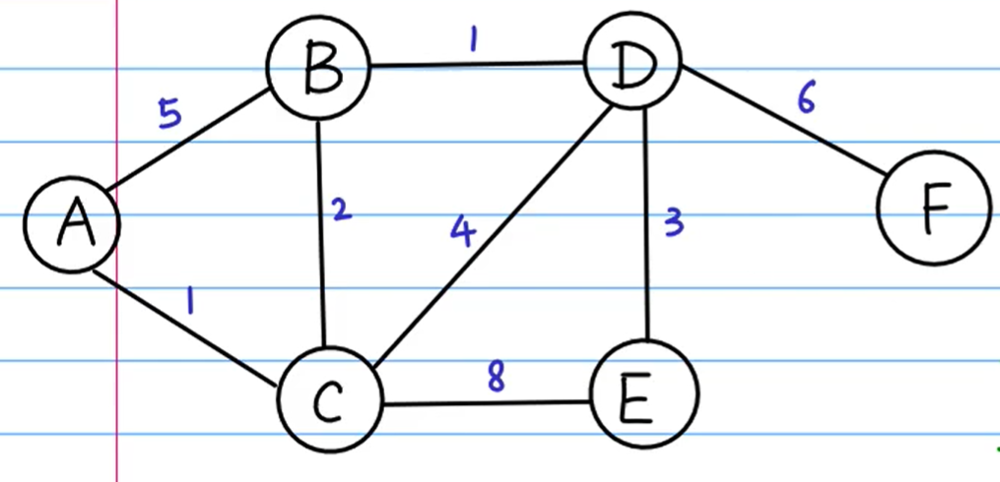

# 图


- 图中的元素我们就叫做顶点（vertex）
- 图中的一个顶点可以与任意其他顶点建立连接关系。我们把这种建立的关系叫做边（edge）
- 跟顶点相连接的边的条数,就叫做顶点的度（degree）
- 我们把这种边有方向的图叫做“有向图”
- 我们把边没有方向的图就叫做“无向图”


- 在有向图中，我们把度分为入度（In-degree）和出度（Out-degree）


- 带权图，每条边都有一个权重（weight）


- 图最直观的一种存储方法就是，邻接矩阵（Adjacency Matrix）


- 另外一种图的存储方法，邻接表（Adjacency List）

## 广度优先搜索（BFS）

- 广度优先搜索（Breadth-First-Search），我们平常都简称 BFS。
- 直观地讲，它其实就是一种“地毯式”层层推进的搜索策略，即先查找离起始顶点最近的，然后是次近的，依次往外搜索
- 借助一个队列实现深度优先搜索
- 三个重要的辅助变量 visited、queue、prev

- visited 是用来记录已经被访问的顶点，用来避免顶点被重复访问
- queue 是一个队列，用来存储已经被访问、但相连的顶点还没有被访问的顶点
- prev 用来记录搜索路径

使用对象模拟图

```js
/*
    a ——  b —— g
    |    |  \
    d —— e —— c
    |    |
    f    h
  */
let graph = {
  a: ['b', 'd'],
  b: ['a', 'e', 'c', 'g'],
  c: ['b', 'e'],
  d: ['a', 'e', 'f'],
  e: ['b', 'd', 'c', 'h'],
  f: ['d'],
  h: ['e'],
  g: ['b']
}
// 广度优先搜索，迭代
function bfs(graph, vertex, visited = [], queue = [], prev = []) {
  visited.push(vertex) // 设置当前顶点访问
  let ver = graph[vertex] // 获取当前顶点的所有邻接点
  queue = ver
  while (queue.length) {
    for (let i = 0; i < ver.length; i++) {
      // 没访问过的点push，避免重复
      if (!visited.includes(ver[i])) {
        visited.push(ver[i])
        queue.push(ver[i])
        prev.push(`${vertex}->${ver[i]}`)
      }
    }
    // 类似树的层次遍历
    vertex = queue.shift()
    ver = graph[vertex]
  }
  return [prev.join(), visited.join()]
}
// 迭代
function BFS(graph,vertex,visited = [vertex],queue = [...graph[vertex]],pre = [vertex]) {
  while (queue.length) {
    vertex = queue.shift()
    if (visited.includes(vertex)) continue
    // 标记访问过
    visited.push(vertex)
    // 添加邻接顶点
    queue.push(...graph[vertex])
    // 添加路径
    pre.push(vertex)
  }
  return pre
}
console.log(bfs(graph, 'a'));
-----------------------------------------------------------
// 递归
function BFS(graph,vertex, visited = [], queue = [], pre = []) {
  // 访问过
  if(visited.includes(vertex)) return
  // 标记访问过
  visited.push(vertex)
  // 添加邻接顶点
  queue.push(...graph[vertex])
  // 添加路径
  pre.push(vertex)
  while(queue.length){
    BFS(graph,queue.shift(),visited,queue,pre)
  }
  return pre
}
```

## 深度优先搜索（DFS）

- 深度优先搜索（Depth-First-Search），简称 DFS
- 深度优先搜索用的是一种比较著名的算法思想，回溯思想
- 深度优先搜索算法的消耗内存主要是 visited、prev 数组和递归调用栈
- 借助一个栈实现深度优先搜索

```js
/*
    a ——  b —— g
    |    |  \
    d —— e —— c
    |    |
    f    h
  */
let graph = {
  a: ['b', 'd'],
  b: ['a', 'e', 'c', 'g'],
  c: ['b', 'e'],
  d: ['a', 'e', 'f'],
  e: ['b', 'd', 'c', 'h'],
  f: ['d'],
  h: ['e'],
  g: ['b']
}
// 深度优先搜索，递归
function dfs(graph, vertex, visited = [], prev = []) {
  if (visited.includes(vertex)) return
  visited.push(vertex)
  let ver = graph[vertex]
  for (let i = 0; i < ver.length; i++) {
    // 没访问过的点push，避免重复
    if (!visited.includes(ver[i])) {
      prev.push(`${vertex}->${ver[i]}`)
      dfs(graph, ver[i], visited, prev) // 使用递归就能模拟栈
    }
  }
  return [prev.join(), visited.join()]
}
console.log(dfs(graph, 'g'));
------------------------------------------------------------------------
// 迭代
function DFS(graph, vertex, visited = [], pre = [],stack=[vertex]) {
  // 对当前节点的所有邻接节点进行遍历，并一个个的深度遍历
  while(stack.length){
    vertex = stack.pop()
    // 访问过
    if(visited.includes(vertex)) continue
    // 添加访问记录
    visited.push(vertex)
    // 添加访问路径
    pre.push(vertex)
    // 相邻节点入栈，准备访问
    stack.push(...graph[vertex])
  }
  return pre
}
```

## 拓扑排序

- 拓扑排序本身就是基于有向无环图的一个算法

拓扑排序有两种实现方法：Kahn 算法和 DFS 深度优先搜索算法

Kahn算法：

- 实际上用的是贪心算法思想
- 定义数据结构的时候，如果 s 需要先于 t 执行，那就添加一条 s 指向 t 的边。所以，如果某个顶点入度为 0， 也就表示，没有任何顶点必须先于这个顶点执行，那么这个顶点就可以执行了

DFS 深度优先搜索算法：

- 深度优先遍历，遍历图中的所有顶点
- 这个算法包含两个关键部分：
  - 第一部分是通过邻接表构造逆邻接表
  - 第二部分是这个算法的核心，也就是递归处理每个顶点

拓扑排序还能检测图中环的存在。对于 Kahn 算法来说，如果最后输出出来的顶点个数，少于图中顶点个数，图中还有入度不是 0 的顶点，那就说明，图中存在环

```js
/*
  a ——> b <—— g
  |     |  \
  v     v    v
  d <—— e <—— c
  |     |
  v     v
  f     h
*/
// 记录每个顶点的入度顶定
let graph = {
  a: [],
  b: ['a', 'g'],
  c: ['b'],
  d: ['a', 'e'],
  e: ['b', 'c'],
  f: ['d'],
  h: ['e'],
  g: [],
}
// 递归，如果有环，则返回1，五环返回拓扑顺序
function kahn(graph, vertex, visited = []) {
  // 存在入度顶点，无法作为起始顶点
  if(!visited.length&&graph[vertex].length) throw new Error('vertex is not 0 in-degree')
  // 用访问过，来标识已被删除的顶点
  visited.push(vertex)
  for (const key in graph) {
    const inDegreeIs0 = graph[key].every((vertex) => {
      return visited.includes(vertex)
    })
    // 未访问过，并且入度为0，则可做当前的起始顶点
    if (!visited.includes(key) && inDegreeIs0) {
      return kahn(graph, key, visited)
    }
  }
  return visited.length === Object.keys(graph).length ? visited : 1
}
-------------------------------------------------------------------
// 记录每个顶点的出度顶定
let graph = {
  a: ['b', 'd'],
  b: ['e', 'c'],
  c: ['e'],
  d: ['f', 'e'],
  e: ['h'],
  f: [],
  h: [],
  g: ['b'],
}

// 使用深度优先遍历，输出拓扑排序
function DFS(graph, vertex, visited = [], pre = [], stack = [vertex]) {
  // 对当前节点的所有邻接节点进行遍历，并一个个的深度遍历
  while (stack.length) {
    vertex = stack[stack.length - 1]
    // 访问过,未记录,则判断其所有邻接顶点是否都记录过
    // 如果都记录则记录当前顶点，否则继续深度遍历未记录的顶点
    if (visited.includes(vertex) && !pre.includes(vertex)) {
      if (graph[vertex].every((v) => visited.includes(v))) {
        pre.push(stack.pop())
        continue
      }
    }
    // 未访问过,则记录为访问过
    !visited.includes(vertex) && visited.push(vertex)
    // 继续入栈其未访问过的邻接顶点
    for (const v of graph[vertex]) {
      // 未访问且未入栈，说明还未搜索过，则入栈准备搜索
      if (!(visited.includes(v) || stack.includes(v))) {
        stack.push(v)
        break
      }
    }
  }
  // 对剩余0入度的另外入口进行深度遍历，直到图的所有顶点被记录
  for (const vertex in graph) {
    if (!visited.includes(vertex)) {
      stack.push(vertex)
      return DFS(graph, vertex, visited, pre, stack)
    }
  }
  // 有环返回1，无环则返回拓扑排序
  return pre.length === Object.keys(graph).length ? pre.reverse() : 1
}
console.log(DFS(graph, 'a'))
```

## 最短路径Dijkstra 算法

- 单源最短路径算法（一个顶点到一个顶点）
- 贪心算法

1. 我们用 vertexes 数组，记录从起始顶点到每个顶点的距离（dist）。
2. 起初，我们把所有顶点的 dist 都初始化为无穷大（也就是代码中的 Integer.MAX_VALUE）。
3. 我们把起始顶点的 dist 值初始化为 0，然后将其放到优先级队列中。我们从优先级队列中取出 dist 最小的顶点 minVertex，然后考察这个顶点可达的所有顶点（代码中的 nextVertex）。
4. 如果 minVertex 的 dist 值加上 minVertex 与 nextVertex 之间边的权重 w 小于 nextVertex 当前的 dist 值，也就是说，存在另一条更短的路径，它经过 minVertex 到达 nextVertex。
5. 那我们就把 nextVertex 的 dist 更新为 minVertex 的 dist 值加上 w。
6. 然后，我们把 nextVertex 加入到优先级队列中。重复这个过程，直到找到终止顶点 t 或者队列为空
7. predecessor 数组的作用是为了还原最短路径，它记录每个顶点的前驱顶点
8. inqueue 数组是为了避免将一个顶点多次添加到优先级队列中

先用堆实现优先队列

```js
// 优先队列
class PriorityQueue {
  constructor(sort = 1, queue = []) {
    this.queue = queue
    this.sort = sort
    this.length = queue.length
    this.adjust()
  }
  pqPush(flag, val) {
    this.queue.push([flag, val])
    this.length++
    this.adjust(this.sort)
    return this.queue
  }
  pqShift() {
    if (!this.length) return false
    const result = this.queue.shift()
    this.length--
    this.adjust()
    return result
  }
  sortDown(arr, i, length) {
    for (let j = i * 2 + 1; j < length; j = j * 2 + 1) {
      if (j + 1 < length && (arr[j + 1][1] - arr[j][1]) * this.sort >= 0) j++
      if (!((arr[j][1] - arr[i][1]) * this.sort >= 0)) break
      arr[i] = [arr[j], arr[j] = arr[i], i = j][0]
    }
  }
  adjust() {
    const arr = this.queue
    const first = ~~(arr.length / 2 - 1)
    for (let i = first; i >= 0; i--) {
      this.sortDown(arr, i, arr.length)
    }
    for (let j = arr.length - 1; j > 0; j--) {
      arr[j] = [arr[0], arr[0] = arr[j]][0]
      this.sortDown(arr, 0, j)
    }
    return this.queue
  }
  getPQ() {
    return this.queue
  }
}
```

构造加权图：



```js
const graph = {
  A:{ B:5 , C:1 },
  B:{ C:2 , A:5 , D:1 },
  C:{ A:1 , B:2 , D:4 , E:8 },
  D:{ B:1 , C:4 , E:3 , F:6 },
  E:{ C:8 , D:3 },
  F:{ D:6 }
}
```

最短路径：

```js
// 初始化数据
function init_path(graph, start) {
  const res = { [start]: 0 }
  for (const key of Object.keys(graph)) {
    if (key !== start) res[key] = Infinity
  }
  return res
}
// 最短路径
function minPath(graph, start) {
  const pq = new PriorityQueue() // 优先队列，存放所有到达顶点的可能
  const vertexes = init_path(graph, start) // 最优路径数组
  const predecessor = {
    [start]: null
  } // 记录前驱
  const visited = new Set() // 已访问
  pq.pqPush(start, 0)
  while (pq.length) {
    const vertex = pq.pqShift() // 取一条最短路径节点，可能访问、未访问
    const flag = vertex[0],
      minLen = vertex[1]
    if (visited.has(flag)) continue // 访问过，下一个
    // 开始处理未访问的顶点
    visited.add(flag)
    // vertexes[flag] = minLen // 更新记录表中最短路径，初始Infinity
    // 遍历邻接点
    for (const key of Object.keys(graph[flag])) {
      // 添加没操作过的邻接点
      if (!visited.has(key)) {
        // 更新当前节点最短路径 = 当前节点与起始节点最短路径 + 2节点路径
        const curLen = minLen + graph[flag][key]
        if (vertexes[key] > curLen) { // 更新最短路径
          vertexes[key] = curLen
          predecessor[key] = flag
        }
        pq.pqPush(key, curLen)
      }
    }
  }
  return [vertexes, predecessor]
}

// 测试
const [minLen, prev] = minPath(graph, 'A')
console.log(minLen);
console.log(prev);
// 打印
function printPath(prev, vertex) {
  let res = '', queue = [vertex]
  const visited = new Set()
  while (queue.length) {
    vertex = queue.shift()
    while (visited.has(vertex))  vertex = queue.shift()
    for (const key of Object.keys(prev)) {
      if (prev[key] === vertex) {
        res += ` ${vertex}->${key} `
        queue.push(key)
      }
    }
    visited.add(vertex)
  }
  return res
}
console.log(printPath(prev, 'A'));
------------------------------------------------------------------------------
// 基于贪心的迪杰斯特拉算法
function Dijkstra(graph, vertex, visited = [], dist = {}) {
  // 初始化最短距离数组
  Object.keys(graph).forEach((vertex) => (dist[vertex] = Number.MAX_VALUE))
  dist[vertex] = 0
  // 下一个要去的顶点
  let nextVertex = null
  function minPath(graph, vertex) {
    if (visited.includes(vertex)) return
    visited.push(vertex)
    nextVertex = null
    // 遍历所有邻接顶点
    Object.keys(graph[vertex]).forEach((v) => {
      if (visited.includes(v)) return
      // 判断当前顶点到邻接顶点的距离，与dist中记录的距离对比，小于则更新
      const cur_min = dist[vertex] + graph[vertex][v]
      if (cur_min < dist[v]) {
        dist[v] = cur_min
      }
      // 标记要去往路径最短的下一个未访问过的邻接顶点
      if (!nextVertex || dist[nextVertex] > dist[v]) {
        nextVertex = v
      }
    })
    // 尽头
    if (!nextVertex) return
    minPath(graph, nextVertex)
  }
  minPath(graph, vertex)
  return dist
}
console.log(Dijkstra(graph, 'A'))
```

## A\*算法

- A* 算法利用贪心算法的思路
- 启发式搜索算法利用估价函数，避免“跑偏”，贪心地朝着最有可能到达终点的方向前进。这种算法找出的路线，并不是最短路线
- `曼哈顿距离 = |x1-x2|+|y1-y2|`

G：当前位置**离起始点**距离
H：当前位置**离目的地**距离
F：G+H的距离

```js
// 1表示障碍物，0表示可通行
const graph = [
  [1, 1, 1, 1, 1, 1, 1, 1, 1, 1], //0
  [1, 0, 0, 0, 0, 0, 1, 0, 0, 1], //1
  [1, 0, 0, 0, 1, 0, 1, 0, 0, 1], //2
  [1, 0, 1, 0, 1, 0, 0, 1, 0, 1], //3
  [1, 0, 0, 0, 1, 0, 1, 1, 0, 1], //4
  [1, 1, 1, 0, 1, 0, 0, 0, 1, 1], //5
  [1, 0, 1, 0, 1, 0, 1, 0, 1, 1], //6
  [1, 0, 1, 0, 0, 1, 1, 0, 0, 1], //7
  [1, 0, 0, 0, 0, 0, 1, 0, 0, 1], //8
  [1, 1, 1, 1, 1, 1, 1, 1, 1, 1]  //9
]//0  1  2  3  4  5  6  7  8  9
// 模拟
/*     const graph = [
  [1, 1, 1, 1, 1, 1, 1, 1, 1, 1], //0
  [1, 0, 0, 8, 8, 8, 1, 0, 0, 1], //1
  [1, 8, 8, 8, 1, 8, 1, 0, 0, 1], //2
  [1, 0, 1, 0, 1, 8, 0, 1, 0, 1], //3
  [1, 0, 0, 0, 1, 8, 1, 1, 0, 1], //4
  [1, 1, 1, 0, 1, 8, 8, 8, 1, 1], //5
  [1, 0, 1, 0, 1, 0, 1, 8, 1, 1], //6
  [1, 0, 1, 0, 0, 1, 1, 8, 0, 1], //7
  [1, 0, 0, 0, 0, 0, 1, 8, 0, 1], //8
  [1, 1, 1, 1, 1, 1, 1, 1, 1, 1]  //9
]//0  1  2  3  4  5  6  7  8  9 */
// 计算曼哈顿距离
function startToEndLen(start, end){
  return Math.abs(start[0] - end[0]) + Math.abs(start[1] - end[1])
}
// A* 算法
function aStart(graph, start = [2, 1], end = [8, 7]) {
  let H = startToEndLen(start, end) // 距离目的地
  let G = startToEndLen(start, start) // 距离起点
  let F = G + H
  const visited = new Set() // 已经访问点
  let [curX, curY] = start
  let [endX, endY] = end
  let s = `(${start.toString()})`
  let predecessor = {[`${curX},${curY}`]:'start'} // 前驱
  const path = new PriorityQueue()  // 优先队列
  path.pqPush([curX, curY, s], F)
  // 记录邻接点
  function pushPath([curX, curY, s]){
    const arr = [
      [curX + 1, curY],
      [curX - 1, curY],
      [curX, curY + 1],
      [curX, curY - 1],
    ]
    arr.forEach((v)=>{
      let str = `${v[0]},${v[1]}`
      if(!visited.has(str)){
        if(!predecessor[str]) 
          predecessor[str] = `${curX},${curY}`
        H = startToEndLen(v, end)
        G = startToEndLen(v, start)
        path.pqPush([...v,`${s}->(${str})`], G + H)
      }
    })
  }
  // 搜索路径
  function search(s){
    if(!path.length) return s;
    [[curX, curY, s],F] = path.pqShift() // 取当前最优路径
    if(curX===endX && curY===endY) return s
    if(graph[curX][curY] === 1) return search(s)
    visited.add(`${curX},${curY}`)  // 添加为访问过
    // 添加当前顶点的邻接顶点，排除已经访问，并且计算F权重，添加到优先队列
    pushPath([curX, curY, s])
    return search(s)
  }
  return search(s)
}
console.log(aStart(graph))
```

## 最小生成树

1. 一个有 n 个结点的连通图的生成树是原图的极小连通子图
2. 包含原图中的所有 n 个结点，并且有保持图连通的最少的边

**Kruskal(克鲁斯卡尔)最小生成树算法**

1. 取出所有边，并记录权值
2. 对取出的所有边按照权值进行升序排序
3. 依次从排序中选出未选中的边，再判断，当前已选中的边所组成的图是否有环，有环则跳过当前边
4. 进行下一条边选择，循环3步骤，直到已选边数+1==图的顶点数，则说明构建完成

**Prim(普里姆)最小生成树算法**

1. 构建selected数组用于存放已选择的路径顶点；dist对象存储未选集合与已选集合之间所有相邻边的距离，初始化为无穷大，对于已选集合中的点无需再存放，因为不是候选连接顶点；parent对象存储最小生成树中顶点的父级顶点，也就是最小路径映射关系
2. 从任意一点开始，对与其相邻且未选中的顶点进行距离更新，，从所有未选中的相邻顶点中选择距离最短的边作为路径，并把相邻顶点加入到已选数组中，删除dist中记录的距离，且更新其父顶点
3. 循环更新已选数组，直到已选数组长度为图的顶点个数，则说明所有顶点已全部连接完成

主要维护已选数组、当前相邻未选顶点集合并选择距离最短的顶点作为下一个顶点，删除dist中已选择的顶点，并更新parent最小路径映射关系


代码实现

```js
const graph = {
  A:{ B:5 , C:1 },
  B:{ C:2 , A:5 , D:1 },
  C:{ A:1 , B:2 , D:4 , E:8 },
  D:{ B:1 , C:4 , E:3 , F:6 },
  E:{ C:8 , D:3 },
  F:{ D:6 }
}
// 最小生成树
function mst(graph) {
  const vertexes = new PriorityQueue()
  const select = []
  for (const [key,val] of Object.entries(graph)) {
    for (const [k,v] of Object.entries(val)) {
      if(key<k) vertexes.pqPush(`${key}-${k}`,v)
    }
  }
  // 判断图是否有环
  function isRing(){
    let res = {}
    select.forEach((v)=>{
      let [f,t] = v.split('-')
      if(!res[f]) res[f] = [t,0]
      if(!res[t]) res[t] = [f,0]
      res[f][1] += 1
      res[t][1] += 1
    })
    for (let i = 0; i < select.length; i++) {
      for (const [key,val] of Object.entries(res)) {
        if(val[1] === 1){
          res[key][1] = 0
          res[res[key][0]][1] -= 1
        }
      }
    }
    for (const [key,val] of Object.entries(res)) {
      if(val[1] > 1) return true
    }
    return false
  }
  const len = vertexes.length
  while(vertexes.length && select.length<len){
    const [s,v] = vertexes.pqShift()
    select.push(s)
    if(isRing()) select.pop()
  }
  return select.join(' ')
}
console.log(mst(graph));
-------------------------------------------------------------------------
// Kruskal(克鲁斯卡尔)
function Kruskal(graph, dist = {}, selected = []) {
  // 判断环
  function hasRing(selected) {
    const map = {}
    // 记录每个顶点的度
    selected.forEach(([edge, dis]) => {
      const [start, end] = edge.split('-')
      !map[start] && (map[start] = [end, 0])
      !map[end] && (map[end] = [start, 0])
      map[start][1] += 1
      map[end][1] += 1
    })
    selected.forEach(() => {
      for (const v in map) {
        // 遍历度为1的顶点，进行删除，包括连接的顶点
        if (map[v][1] === 1) {
          map[v][1]--
          map[map[v][0]][1]--
        }
      }
    })
    for (const v of Object.values(map)) {
      // 还存在度大于1的则判断为环
      if (v[1] > 1) return true
    }
    return false
  }
  // 记录所有2顶点的距离
  for (const v in graph) {
    Object.entries(graph[v]).forEach(([key, dis]) => {
      // 未记录
      if (!(dist[`${key}-${v}`] || dist[`${v}-${key}`])) {
        dist[`${key}-${v}`] = dis
      }
    })
  }
  // 转换成数组再排序
  dist = Object.entries(dist).sort((a, b) => a[1] - b[1])
  dist.forEach((item) => {
    // 全部顶点已连接
    if (selected.length + 1 === Object.keys(graph).length) return
    // 选择边
    selected.push(item)
    // 有环则删除
    if (hasRing(selected)) {
      selected.pop()
    }
  })
  return selected
}

console.log(Kruskal(graph))
---------------------------------------------------------------------------
// Prim(普里姆)算法
function Prim(graph, selected = [], dist = {}, parent = {}) {
  // 初始化权值集合
  const vertexes = Object.keys(graph)
  vertexes.forEach((vertex) => {
    dist[vertex] = Number.MAX_VALUE
  })
  // 下一个连接的顶点
  let nextVertex = null
  for (const vertex in dist) {
    // 选择一条权值最小边
    if (!selected.length) {
      selected.push(vertex)
      // 删除已选顶点的权值
      delete dist[vertex]
    } else {
      // 遍历已选集合，更新所有与已选集合相邻的未选顶点的权重值
      selected.forEach((v) => {
        Object.keys(graph[v]).forEach((near) => {
          // 未选的相邻顶点
          if (!selected.includes(near)) {
            // 更新当前顶点到达未选顶点的距离
            if (dist[near] > graph[v][near]) {
              dist[near] = graph[v][near]
              // 更新最新到达顶点的父顶点
              parent[near] = v
            }
            // 判断是否更新下一顶点
            if (!nextVertex) {
              nextVertex = near
            } else if (dist[nextVertex] > dist[near]) {
              nextVertex = near
            }
          }
        })
      })
      selected.push(nextVertex)
      delete dist[nextVertex]
      nextVertex = null
    }
  }
  return parent
}

console.log(Prim(graph))
```