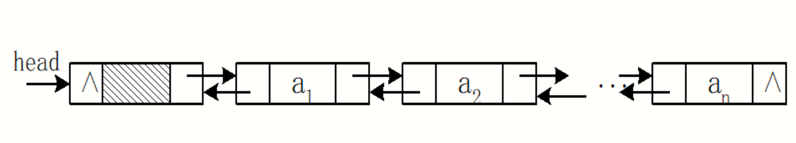
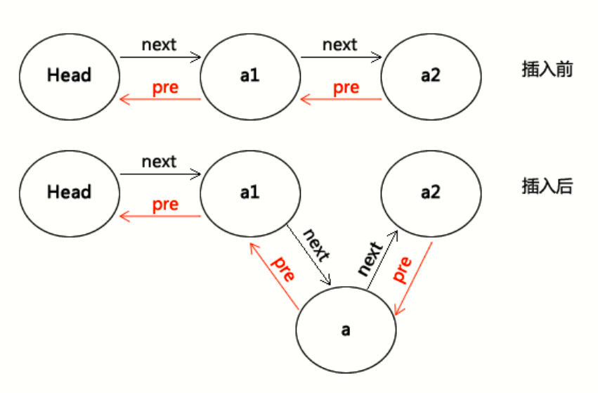
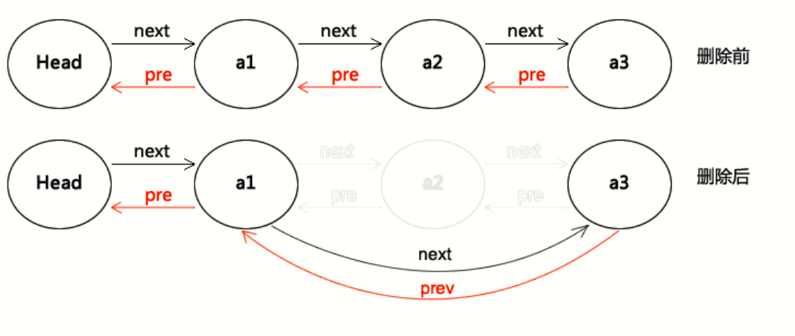
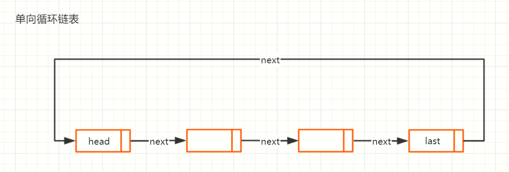
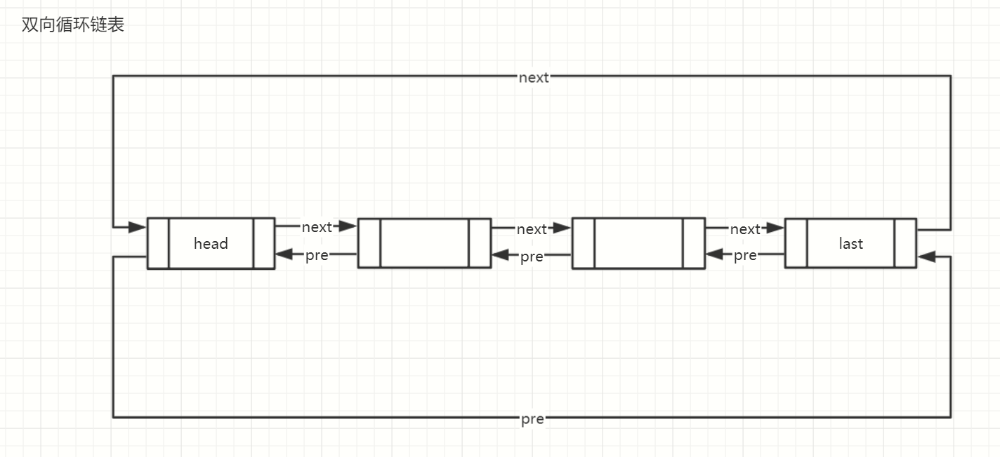
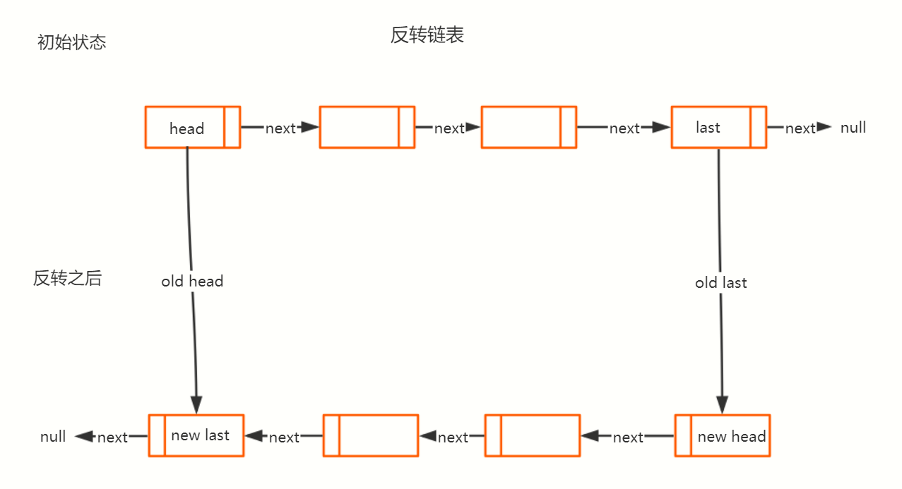
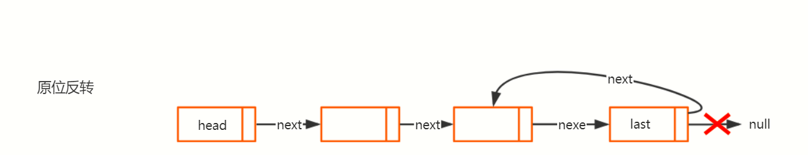
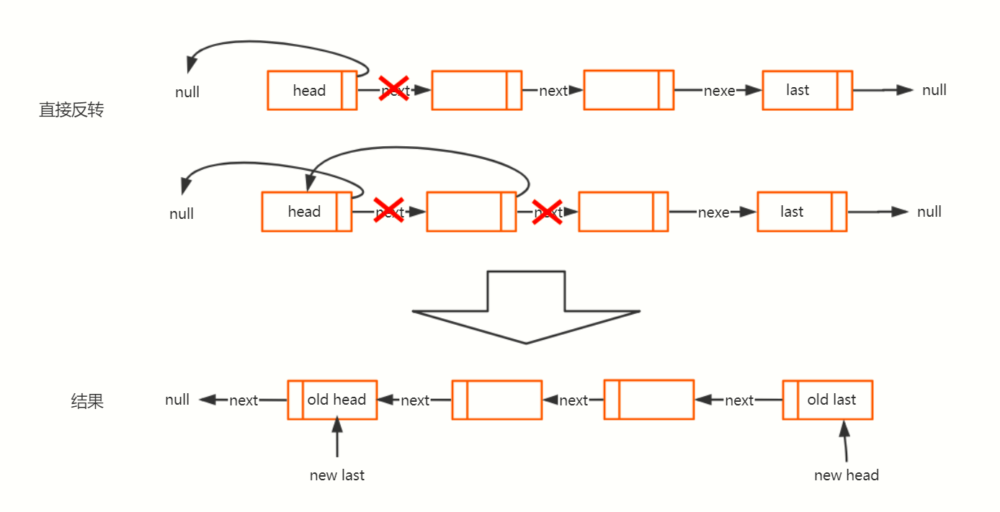
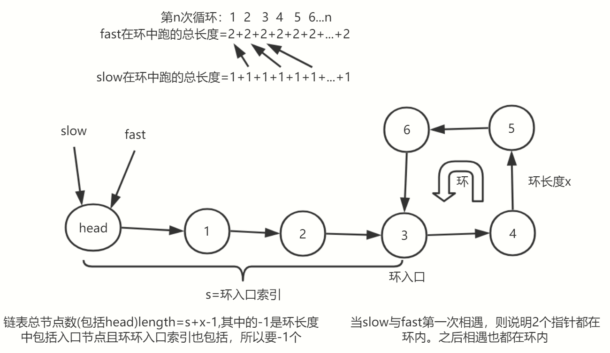
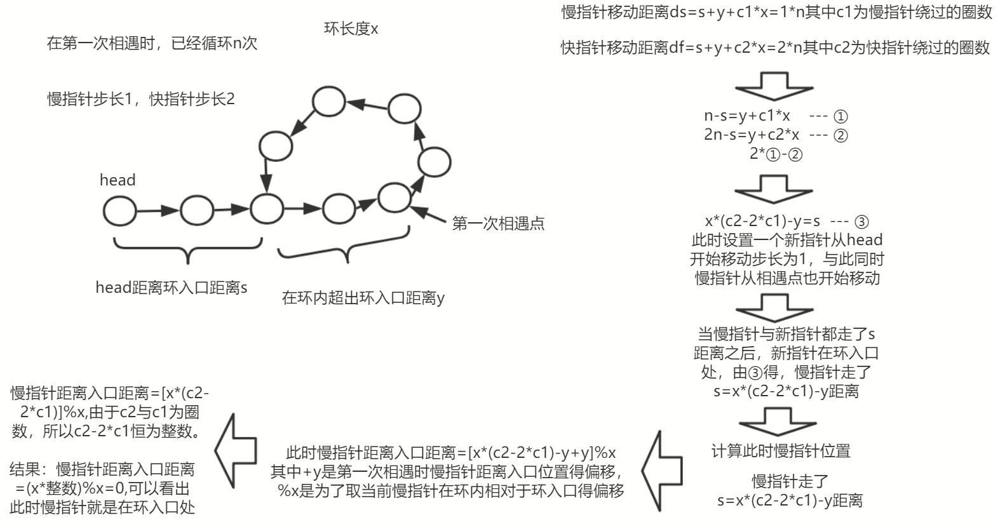

# 链表

- 链表是一种物理存储单元上非连续、非顺序的存储结构，数据元素的逻辑顺序是通过链表中的指针链接次序实现的
- 链表由一系列结点（链表中每一个元素称为结点）组成，结点可以在运行时动态生成
- 每个结点包括两个部分：一个是存储数据元素的数据域，另一个是存储下一个结点地址的指针域

## 单向链表

- 单向链表（单链表）是链表的一种，其特点是链表的链接方向是单向的，对链表的访问要通过顺序读取从头部开始
- 其中每个结点都有指针成员变量指向列表中的下一个结点
- 链表是由结点构成，head指针指向第一个成为表头结点，而终止于最后一个指向NULL的指针


代码演示

```单向链表
// 创建节点
class CreateNode {
  constructor(data) {
    this.data = data
    this.next = null
  }
}
class LinkList {
  constructor() {
    // 初始头节点
    this.head = new CreateNode('head')
  }
  // 获取最后节点
  getLast() {
    let cur = this.head
    // 逐个查找直到为null，尾节点的next为null
    while (cur.next !== null) cur = cur.next;
    return cur
  }
  // 插入指定posNode节点
  insertNode(node = new CreateNode(), posNode = this.getLast(), pos = 0) { // 0最后，1之后，-1之前
    if (pos === 1) { // 之后
      if (posNode.next) { // 指定位置节点插入新节点，替换next
        node.next = posNode.next
        posNode.next = node
      }
    } else if (pos === -1) { // 之前
      let cur = this.head
      while (cur.next != posNode&&cur!==null) cur = cur.next; // 直到查找到指定位置之前的节点
      // 替换next
      cur.next = node
      node.next = posNode
    } else { // 最后
      this.getLast().next = node
    }
    return node
  }
  removeNode(posNode, pos = 2, all = false) { // 0最后，1之后、-1当前
    let cur = this.head,
      curBefore = null
    if (pos === 0) { // 最后
      this.searchNode(this.getLast()).curBefore.next = null
    } else if (pos === 1) { // 之后
      if (all) posNode.next = null;
      else posNode.next = posNode.next.next;
    } else { // 之前
      cur = this.searchNode(posNode).cur
      curBefore = this.searchNode(posNode).curBefore
      if (all) cur.next = null;
      else curBefore.next = cur.next;
    }
    return posNode
  }
  searchNode(nodeOrIndex, mode = 1) { //mode:0使用index查找，1使用node查找
    let cur = this.head,
      curBefore = null,
      count = 0
    if (mode === 0) {
      // 通过index找对应的node
      while (mode !== nodeOrIndex) {
        curBefore = cur
        cur = cur.next;
        mode++
      }
    } else {
      // 通过node找index
      while (cur !== nodeOrIndex&&cur!==null) {
        curBefore = cur
        cur = cur.next;
        count++
      }
    }
    return {
      curBefore,
      cur,
      count
    }
  }
}
const list = new LinkList()
let node1 = new CreateNode('1')
let node2 = new CreateNode('2')
let node3 = new CreateNode('3')
let node4 = new CreateNode('4')
let node5 = new CreateNode('5')
list.insertNode(node1)
list.insertNode(node2)
list.insertNode(node3)
list.insertNode(node4)
list.insertNode(node5)
console.log(list.searchNode(node3)) //{curBefore: CreateNode, cur: CreateNode, count: 3}
console.log(list.searchNode(3, 0)) //{curBefore: CreateNode, cur: CreateNode, count: 0}
list.removeNode(node2, -1, false)
console.log(list)
```

## 双向链表

- 它的每个数据结点中都有两个指针，分别指向直接后继和直接前驱
- 从双向链表中的任意一个结点开始，都可以很方便地访问它的前驱结点和后继结点



插入操作



删除操作



```双向链表
// 创建节点
class LinkNode {
  constructor(value) {
    this.data = value
    this.next = null
    this.pre = null
  }
}
// 创建双向链表
class List {
  constructor() { // 头节点
    this.head = new LinkNode('head')
  }
  // 查找指定数据的节点
  find(data, mode = 0) {
    let currentNode = this.head
    if (mode === 0) {
      while (currentNode.data != data && currentNode.next != null) {
        currentNode = currentNode.next
      }
      if (currentNode.next === null) return null
    } else {
      while (currentNode != data && currentNode.next != null) {
        currentNode = currentNode.next
      }
    }
    return currentNode
  }
  // 查找最后一个节点
  findLast() {
    let currentNode = this.head
    while (currentNode.next != null) {
      currentNode = currentNode.next
    }
    return currentNode
  }
  // 插入节点
  insert(element, node) {
    let newNode = new LinkNode(element)
    let Node = node == undefined ? this.findLast() : this.find(node, 1)
    if (Node.next) {
      //插入节点后有其他节点
      Node.next.pre = newNode
      newNode.next = Node.next
      Node.next = newNode
      newNode.pre = Node
    } else {
      Node.next = newNode
      newNode.pre = Node
    }
    return newNode
  }
  // 删除节点
  remove(node) {
    let Node = node == undefined ? this.findLast() : this.find(node)
    if (Node.next) {
      Node.next.pre = Node.pre
      Node.pre.next = Node.next
      Node = null
    } else {
      Node.pre.next = null
    }
  }
  // 显示所有节点的数据
  display() {
    let currentNode = this.head
    let arr = []
    while (currentNode != null) {
      arr.push(currentNode.data)
      currentNode = currentNode.next
    }
    return arr
  }
  // 显示所有节点反转之后的数据
  disReverse() {
    let cur = this.findLast()
    let arr = []
    while (cur !== null) {
      arr.push(cur.data)
      cur = cur.pre
    }
    return arr
  }
  // 反转链表
  reverse(Node = this.head) {
    // 递归拐点，当递归到最后一个时，返回最后一个节点
    if (Node.next == null) return Node
    let last = this.reverse(Node.next)
    // 反转
    Node.next.next = Node
    // 设置当前链表尾
    Node.next = null
    // 返回原始链表链尾节点
    return last
  }
  // node节点与后面n个反转
  reverseN(Node, n) {
    let next
    if (n == 1) {
      next = Node.next
      return Node
    }
    let last = this.reverseN(Node.next, n - 1)
    Node.next.next = Node
    Node.next = next
    return last
  }
  // 反转指定区间节点
  reverseBetween(startNode, start, end) {
    if (start == 1) {
      return this.reverseN(startNode, end)
    }
    startNode.next = this.reverseBetween(startNode.next, start - 1, end - 1)
    return startNode
  }
}
const list = new List()
const node1 = list.insert('hello')
const node2 = list.insert('world')
const node3 = list.insert('你好')
const node4 = list.insert('世界')
const node5 = list.insert('啊啊')
// const node6 = list.insert('哈哈', node2)
// list.remove('你好')
// list.reverse()
// console.log(list.find('你好'))
// console.log(list.findLast())
// console.log(list.display())
// console.log(list.disReverse())
// console.log(list.reverse())
// console.log(list.reverseN(node2,2))
// console.log(list.reverseBetween(node2,1,2))
console.log(list);
```

## 循环链表

- 循环链表中，将单链表中的终端结点的指针端由空指针改为指向头结点，就使整个单链表形成一个环，使得链表的头尾相接
- 循环链表和单链表的主要差异就在于循环的判断条件上，单链表判断循环结束为：node->next==NULL;而循环链表判断循环结束为：（node->next）等于头结点

单向循环链表



双向循环链表



实现一下双向循环链表操作

```双向循环链表操作
// 双向循环链表，基于构造函数
// 创建双向节点
function CreateNode(data = null, pre = null, next = null) {
  this.data = data // 节点数据
  this.pre = pre // 节点的前驱
  this.next = next // 节点后继
}
// 创建双向链表
function DbLoopLink(name = 'head') {
  this.head = new CreateNode(name) // 链表头节点
  this.head.pre = this.head.next = this.lastNode = this.head // 前后指向自身
  this.data = this // 数据指向当前链表
}
// 判断链表是否只有头节点，没有其他节点
DbLoopLink.prototype.isEmpty = function () {
  const head = this.head
  return (head === head.next) && (head === head.pre)
}
// 通过序号查找节点，当onData为true时返回index位置节点的data属性，否则返回整个节点
DbLoopLink.prototype.searchByIndex = function (index, onData = false) {
  let first = this.head
  // 寻找指定index的节点，头节点index默认尾0
  do {
    // 搜索到指定节点
    if (index-- === 0) return onData ? first.data : first
    // 下一个节点
    first = first.next
  } while (first !== this.head)
  // 没找到,超出链表长度,返回最后一个节点
  return this.lastNode
}
// 通过给定节点查找对应的序号
DbLoopLink.prototype.searchByNode = function (node, start = 0) {
  // 指定位置开始查找
  let first = this.searchByIndex(start)
  // 寻找指定index的节点，头节点index默认尾0
  do {
    // 搜索到指定节点
    if (first === node) return start
    // 序号增加
    start++
    // 下一个节点
    first = first.next
  } while (first !== this.head)
  // 没找到,超出链表长度,返回最后一个节点
  return -1
}
// 通过给定节点数据查找对应的节点
DbLoopLink.prototype.searchByData = function (nodeData, start = 0, onData = false) {
  // 指定位置开始查找
  let first = this.searchByIndex(start)
  // 寻找指定index的节点，头节点index默认尾0
  do {
    // 搜索到指定节点
    if (first.data === nodeData) return onData ? first.data : first
    // 下一个节点
    first = first.next
  } while (first !== this.head)
  // 没找到,超出链表长度,返回最后一个节点
  return this.lastNode
}
// 指定序号插入节点，index：-1则默认队尾插入，否则指定位置插入node
DbLoopLink.prototype.insertNodeByIndex = function (node, index = -1) {
  let first = this.head
  let last = this.lastNode
  // 只有一个节点时
  if (this.isEmpty() || index === -1) { // 此时node都为链尾
    // 空链表时
    if (this.isEmpty()) { // 此时只有2个元素
      // head后继为node链尾
      first.next = node
      // 链尾前驱head
      node.pre = first
    }
    // 默认插入链尾时
    if (index === -1) { // 此时node只为链尾，且node前驱不为head
      // 当前链尾更新
      last.next = node
      // 新链尾的前驱为旧链尾
      node.pre = last
    }
    // node为链尾，且其后继为head
    node.next = first
    // head前驱，指向链尾
    first.pre = node
    this.lastNode = node
  } else {
    // 直到搜索到最后一个原始
    const target = this.searchByIndex(index)
    // 原节点next=>插入节点的next
    node.next = target.next
    // 原节点=>插入节点前驱
    node.pre = target
    // 插入节点=>原节点的next.pre
    target.next.pre = node
    // 插入节点=>原节点的后继
    target.next = node
  }
  return node
}
// 删除给定节点,默认不传参数删除最后一个节点
DbLoopLink.prototype.removeByNode = function (node = this.lastNode) {
  const head = this.head
  const last = this.lastNode
  if (node === head) throw new Error("can't delete headNode")
  if (node === last) this.lastNode = node.pre // 更新链表最后一个节点
  // 删除节点的前驱=>删除节点后继的前驱
  node.next.pre = node.pre
  // 删除节点的后继=>删除节点前驱的后继
  node.pre.next = node.next
  // 返回删除节点
  return node
}
// 删除给定index的节点,默认不传参数删除最后一个节点
DbLoopLink.prototype.removeByIndex = function (index = this.searchByNode(this.lastNode)) {
  // 获取目标节点
  const target = this.searchByIndex(index)
  // 删除目标节点
  this.removeByNode(target)
  // 返回删除节点
  return target
}
// 创建双向循环链表
const loopList = new DbLoopLink()
const node1 = new CreateNode('1')
const node2 = new CreateNode('2')
const node3 = new CreateNode('3')
const node4 = new CreateNode('4')
loopList.insertNodeByIndex(node1)
loopList.insertNodeByIndex(node2)
loopList.insertNodeByIndex(node3)
loopList.insertNodeByIndex(node4)
// console.log(loopList.searchByIndex(0)) // head
// console.log(loopList.searchByNode(node3)) // 3
// console.log(loopList.searchByData('2')) // node2
// console.log(loopList.removeByNode(node3)) // node3
// console.log(loopList.removeByIndex(1)) // node1
console.log(loopList)
```

以上只实现了增加元素、删除元素、搜索元素，接下来讲解反转链表

## 反转链表

- 反转链表即把链表的头节点变为链尾，尾节点变为头节点，且next指向从尾节点开始指向头节点
- 这里只探讨单向链表的反转

反转对比



### 原位反转



反转过程


最终结果


思路

- 从最后一个节点开始，next重新指向前一个节点
- 头节点最后指向null
- 递归到最后一个节点，保存递归的前一个节点，通过前一个节点的next指向当前节点，再递推回去

代码实现(以下使用到的一些方法来自单向链表的示范代码)

```原位反转
reverse(node=this.searchNode(0,0).cur, preNode=null) {
  // 判断拐点,最后一个节点的next指向null
  if (node.next === null) { //最后一个节点
    node.next = preNode // 改变尾节点next指向为前一个节点
    return node // 返回最后一个节点,即作为最终的head节点
  }
  // 非尾节点 ，最开始reverse的返回值为尾节点
  let oldLast = this.reverse(node.next, node) //此处获取到了node.next节点
  // 现在可以修改node.next指向为其前一个节点
  node.next=preNode
  // 逐路返回尾节点
  return oldLast
}
```

此时链表已经反转，此时原链表head指向null，所有只能使用返回的oldLast用作新head

基于for循环的从head开始的正向反转



```正向反转
reverseByFor(node = this.searchNode(0, 0).cur) {
  let next
  for (let pre = node; true; node = next) {
    // 记录原始next
    next = node.next
    // 如果为头节点设置其next为null
    if (node === this.searchNode(0, 0).cur) {
      node.next = null;
    } else { // 其他节点
      // 如果为尾节点，则说明已经反转好了，可以直接返回新头节点
      if (next === null) {
        node.next = pre
        return node
      }
      // 调转next指向
      node.next = pre
    }
    // 为下一轮保存上一个节点
    pre = node
  }
}
```

## 链表判断环

创建单向链表并生成环

```单向链表
// 创建单向链表
const list = new LinkList()
let node1 = new CreateNode('1')
let node2 = new CreateNode('2')
let node3 = new CreateNode('3')
let node4 = new CreateNode('4')
let node5 = new CreateNode('5')
let node6 = new CreateNode('6')
list.insertNode(node1)
list.insertNode(node2)
list.insertNode(node3)
list.insertNode(node4)
list.insertNode(node5)
list.insertNode(node6)
// 生成环，环入口node3
node6.next = node3
```

### 判断环

一、通过Set保存遍历节点，判断每个节点是否保存过，如果保存过则说明是环

```判断环
// 判断环
function isRing(link) {
  // 获取链表头
  let node = link.head
  // 创建set存储节点
  const set = new Set()
  while (node) {
    // 不存在，则保存
    if (!set.has(node)) {
      set.add(node)
    } else {
      // 存在则说明是环
      return true
    }
    // 下一个节点
    node = node.next
  }
  return false
}
console.log(isRing(list)) // true
```

二、通过设置快慢指针，当快指针与慢指针重合则说明，快指针绕了个环跑到后面了，快指针一次二格，慢指针一次一格

```判断环
// 判断环
function isRing(link) {
  // 获取头指针
  let node = link.head
  // 定义快慢指针
  let fast = node,
    slow = null
  // 如果快指针与慢指针相同，则说明快指针从慢指针的前面跑到后面，则说明有环
  while (fast !== slow) {
    if (!slow) slow = node
    // 如果为null则说明到链尾
    if (!(fast.next && fast.next.next)) return false
    // 快指针跳2个
    fast = fast.next.next
    // 慢指针跳1个
    slow = slow.next
  }
  return true
}
console.log(isRing(list)) // true
```

### 确认环入口

- 通过快慢指针在环内相遇间隔，来进行判断



- 当第一次slow与fast相遇时已经都在环内，此时slow的移动距离(ds)=循环次数(n)x步长(1)，fast的移动距离(df)=循环次数(n)x步长(2)，且有df=2xds，fast共走了(df-s)/环长度(x)圈，slow共走了(ds-s)/环长度(x)圈

详细推导



代码实现

```链表判断环入口
// 判断环入口节点
function isRing(link) {
  const head = link.head
  let slow = null,
    fast = head
  // 直到第一次相遇
  while (slow !== fast) {
    if (!slow) slow = head
    slow = slow.next
    fast = fast.next.next
  }
  // 此时已经第一次相遇
  // fast指针充当新指针，指向head，开始以慢指针同样的步长进行
  fast = head
  // 继续走s步
  while (fast !== slow) {
    slow = slow.next
    fast = fast.next
  }
  // 相遇，此时fast指向的就为环入口
  return fast
}
console.log(isRing(list)) // node3
```