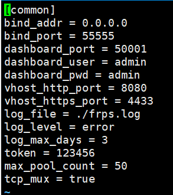
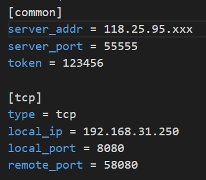
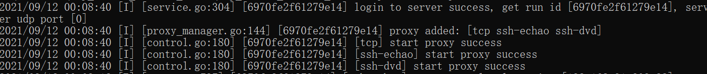

# 搭建 frp 服务器和客户端

此步骤基于 centos7 搭建

frp 仓库：https://github.com/fatedier/frp/releases

官方帮助文档：https://github.com/fatedier/frp

linux 下载 frp

```shell
wget https://github.com/fatedier/frp/releases/download/v0.37.1/frp_0.37.1_linux_amd64.tar.gz
# 或
curl -L -# -O https://github.com/fatedier/frp/releases/download/v0.37.1/frp_0.37.1_linux_amd64.tar.gz
```

windows 直接下载压缩包

## 服务端搭建

解压 frp 项目

```shell
tar -zxvf frp_0.37.1_linux_amd64.tar.gz
```

重命名 frp（可选）

```shell
mv frp_0.37.1_linux_amd64 frp
```

进入 frp 目录修改配置

```shell
cd frp
vi frps.ini
```

添加 frp 服务端配置并保存



记得**开放**服务器端口（包括云服务**安全组**和主机**防火墙**）

完整配置可以参考 frps_full.ini 文件

运行 frp 服务

```shell
# windows
# 打开 cmd 进入包目录并执行
frps.exe -c frps.ini

# linux
./frps -c frps.ini
```

## 客户端搭建

到 [frp仓库](https://github.com/fatedier/frp/releases下载) 下载  windows / linux 压缩包，并解压

配置 frpc.ini 文件



完整配置可以参考 frpc_full.ini 文件

启动 frp 客户端

```shell
# windows
# 打开 cmd 进入包目录并执行
frpc.exe -c frpc.ini

# linux
./frpc -c frpc.ini
```

启动并代理成功



