---

---

# Docker 基础

docker 官网：https://docs.docker.com/

docker hub：https://hub.docker.com/

命令大全

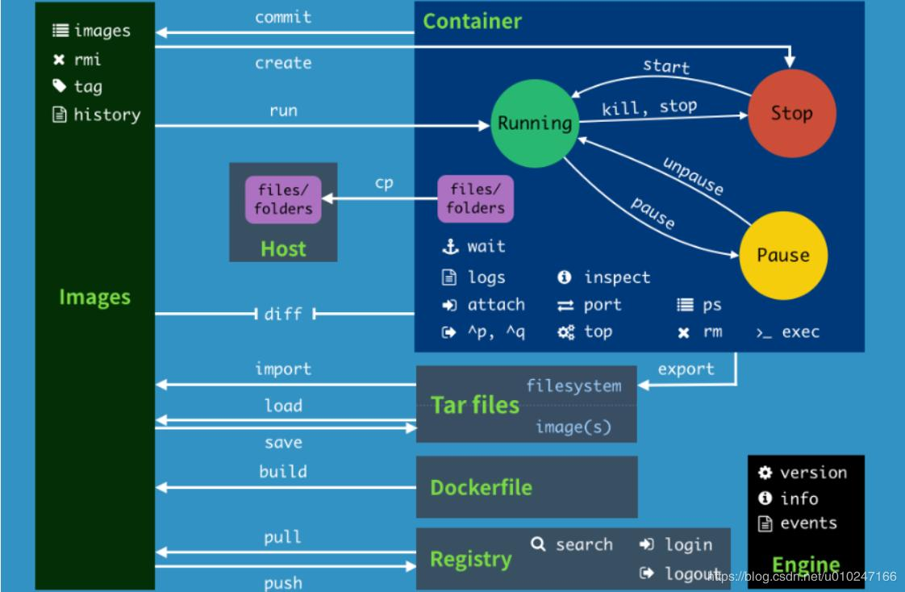

docker 架构

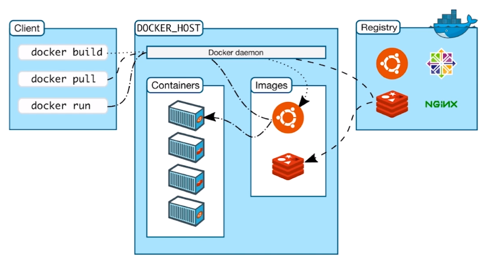

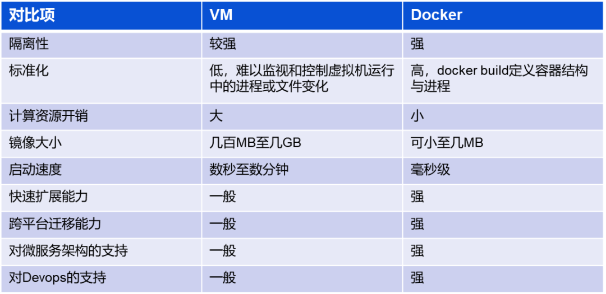

docker 与虚拟机

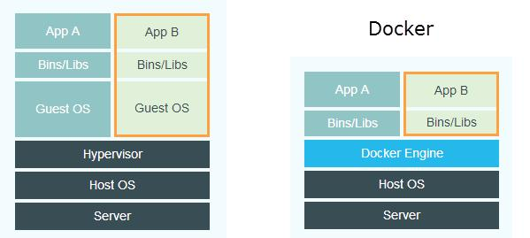

## Linux 安装 docker

### CentOS

移除旧版本 docker

```shell
sudo yum remove docker \
          docker-client \
          docker-client-latest \
          docker-common \
          docker-latest \
          docker-latest-logrotate \
          docker-logrotate \
          docker-engine
```

安装 yum 工具包

```shell
sudo yum install -y yum-utils
```

配置 yum 源地址

```shell
sudo yum-config-manager \
    --add-repo \
    http://mirrors.aliyun.com/docker-ce/linux/centos/docker-ce.repo
```

更新索引

```shell
yum makecache fast
```

安装 docker 引擎

```shell
sudo yum -y install docker-ce docker-ce-cli containerd.io
```

## docker 服务启动

启动 docker 服务

```shell
sudo systemctl start docker
```

查看 docker

```shell
docker version
```

跑 hello world 程序

```shell
sudo docker run hello-world
```

卸载 docker

```shell
 sudo yum remove docker-ce docker-ce-cli containerd.io
```

移除资源目录

```shell
 sudo rm -rf /var/lib/docker
 sudo rm -rf /var/lib/containerd
```

## 基础命令

### 镜像命令

帮助命令

```shell
docker 命令 --help # 命令帮助
docker version # 查看版本
docker info # 容器数量等信息
```

查看镜像

```shell
dockers images # 查看镜像列表
# 选项
-a # 查看所有镜像，包括历史
-q # 只查看说镜像id
```

搜索镜像

```shell
docker search 镜像名 # 搜索镜像
# 选项
-f=STARS=300 # 根据星数过滤
```

下载镜像

```shell
docker pull xxx[:tag=latest] # 下载镜像 
```

发布镜像

```shell
docker push 镜像id
```

删除镜像

```shell
docker rmi 镜像id # 通过镜像id删除指定镜像
docker rmi -f $(docker images -aq) # 删除所有镜像
# 选项
-f # 强制删除
```

### 容器命令

创建容器

```shell
docker run 镜像id /bin/bash # 使用指定镜像创建容器
# 选项
--name='name' # 指定名称
-d # 后台启动
-it # 交互式
-p [[ip:]outport:]inport # 端口指定
-P # 随机端口
```

退出容器内

```shell
exit # 容器停止
ctrl+q,p # 容器不停止退出
```

列出所有运行容器

```shell
docker ps
# 选项
-a # 当前运行
-n=1 # 列出最近几个
-q # 只显示id
```

启动容器

```shell
docker start 容器id
```

停止容器

```shell
docker stop 容器id
```

重启容器

```shell
dockers restart 容器id
```

强制停止容器

```shell
docker kill 容器id
```

删除容器

```shell
docker rm 容器id # 删除指定容器
docker rm -f # 强制删除容器，包括运行中
docker ps -aq | xargs docker rm # 删除所有容器
```

### 常用命令

查看日志

```shell
docker logs 容器id
# 选项
-f # 持续显示日志
-t # 显示时间戳
--tail=4 # 尾部几条
```

查看容器进程信息

```shell
docker top 容器id # 容器内部进程信息
```

查看镜像具体配置

```shell
docker inspect 镜像id
```

查看容器具体配置

```shell
docker inspect 容器id
```

进入当前运行容器（新开命令行进程）

```shell
docker exec -it 容器id /bin/bash
```

进入当前运行容器（当前运行命令行）

```shell
docker attach 容器id
```

拷贝容器内文件到外部主机

```shell
docker cp 容器id:inpath outpath # 从指定容器内部路径拷贝到外部路径
```

提交容器生成镜像

```shell
docker commit -m="msg" -a="author" 容器id [user/]目标镜像名:[tag]
```

查看卷

```shell
docker volume ls
```

查看镜像变更历史

```shell
docker history 镜像id
```

## 实践

docker 远程镜像仓库：https://hub.docker.com/

### docker 使用 Nginx

```shell
docker pull nginx
```

启动 nginx

```shell
docker run -d -it --name="nginx-1" -p 8080:80 nginx # 后台运行nginx，指定外部8080端口映射内部80端口，添加-it不会自动退出
# 选项
-p [[ip:]外部port:]内部port # 端口指定
```

### docker 可视化管理后台 portainer

安装

```shell
docker pull portainer/portainer
```

运行

```shell
docker run -d -p 9000:9000 --restart=always -v /var/run/docker.sock:/var/run/docker.sock --privileged=true portainer/portainer # 默认启动在9000端口上
```

访问

```shell
# 访问地址
http://localhost:9000/
```

## docker 容器数据卷

使用数据卷 -v 卷挂载

```shell
docker run -it -v 主机目录:容器目录 centos[:tag] /bin/bash # 删除容器，数据不丢。停止容器目录可用
# 选项
-v 主机目录:容器目录 # 双向同步文件（保存在主机中）
-e key=value # 配置环境变量
```

匿名挂载

```shell
-v 容器目录 # 默认外部目录 /var/lib/docker/volumes/xx/_data
```

具名挂载（推荐）

```shell
-v 卷名:容器目录 # 卷名不能以 / 开头
```

指定路径挂载

```shell
-v 主机路径:容器路径:ro/rw # 主机完整路径， ro只读，rw读写针对容器，主机都行 
```

数据卷容器

```shell
docker run -it --name="centos-2" --volumes-form 数据卷容器 centos # 从数据卷容器同步其他容器。删除数据卷容器，数据还在 
```

## Dockerfile 镜像构建文件

构建过程

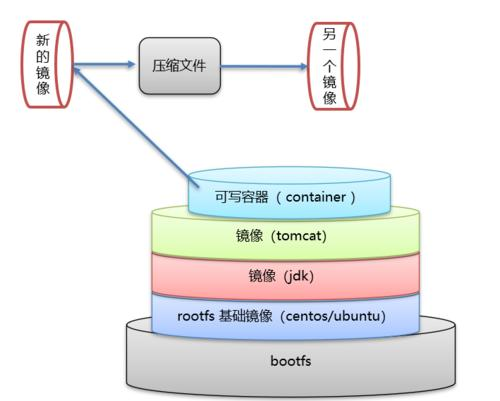

指令大全

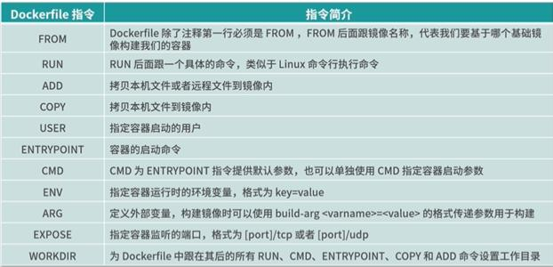


Dockerfile 文件内容，命令大写

```shell
# 要去掉注释
FROM centos	# 镜像来源，scratch基础镜像
VOLUME ["volume1"] # 卷挂载
CMD echo "-----------" # 执行启动指令 替换启动指令 最后一个生效
CMD /bin/bash
# ENTROYPOINT 可追加启动指令参数
```

构建镜像

```shell
docker build -f 构建文件 -t [user/]name[:tag]
docker build -t [user/]name[:tag] .  # 默认指定当前目录下的 Dockerfile
```

构建包含 vim 和 net-tools 的 centos

```shell
FROM centos
MAINTAINER 5102
ENV MYPATH /usr/local
WORKDIR $MYPATH
RUN yum -y install vim
RUN yum -y install net-tools
EXPOSE 80
CMD echo $MYPATH
CMD /bin/bash
```

构建自定义镜像

```shell
docker build -t 5102/centos-1:1.0 .
```

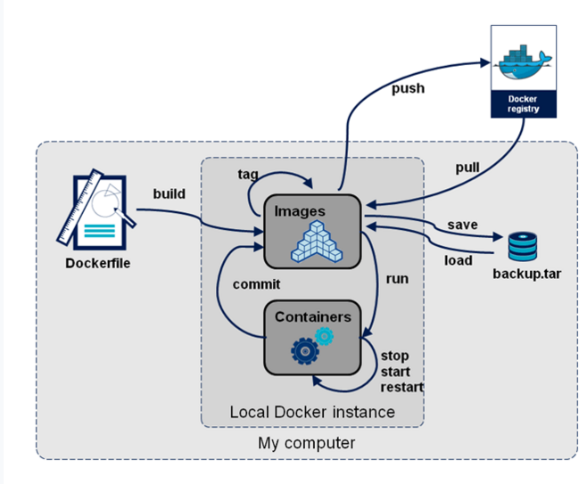

登录 docker hub

```shell
docker login -u user -p password
```

登出 docker hub

```
docker logout
```

增加标签（新名字）

```shell
docker tag 镜像id newname
```

发布自定义镜像

```shell
docker push [地址] user/images:tag # 标准命名规范
```

## docker 网络

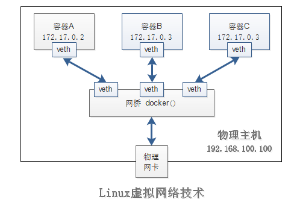

查看 linux 网络

```shell
ip addr
```

查看 docker 所有网络

```shell
docker network ls
```

查看网络具体信息

```shell
docker network inspect 网络id
```

连通网络 --link（不推荐）

```shell
docker run -d -P --name nginx1 --link nginx2 nginx
# 选项
--link # 连通网络，通过网络名访问，不能反向访问，本质配置 /etc/hosts
```

### 自定义网络

网络模式

1. bridge 桥接（默认）
2. none 不配置网络
3. host 和主机共享
4. container 容器网络

创建网络

```shell
docker network create --driver bridge --subnet 192.168.10.1/24 --gateway 192.168.10.1 网络名
# 选项
--driver # 指定网络模式
--subnet # 子网
--gateway # 网关
```

删除网络

```shell
docker network rm -f 网络id
```

指定网络（推荐）

```shell
docker run -d -P --name nginx1 --net 网络名 nginx 
```

容器网络连接（多ip）

```shell
docker network connect 网络名 容器名
```

### 创建 redis 集群配置

```shell
for port in $(seq 1 6); \
do \
mkdir -p /mydata/redis/node-${port}/conf
touch /mydata/redis/node-${port}/conf/redis.conf
cat << EOF > /mydata/redis/node-${port}/conf/redis.conf
port 6379
bind 0.0.0.0
cluster-enabled yes
cluster-config-file nodes.conf
cluster-node-timeout 5000
cluster-announce-ip 192.168.10.1${port}
cluster-announce-port 6379
cluster-announce-bus-port 16379
appendonly yes
EOF
done
```

启动 redis 服务

```shell
for port in $(seq 1 6); \
do \
docker run -p 637${port}:6379 -p 1637${port}:16379 --name redis-${port} \
-v /mydata/redis/node-${port}/data:/data \
-v /mydata/redis/node-${port}/conf/redis.conf:/etc/redis/redis.conf \
-d --net redis --ip 192.168.10.1${port} \
redis:5.0.9-alpine3.11 redis-server /etc/redis/redis.conf \
done
```

进入 redis

```shell
docker exec -it redis-1 /bin/sh
```

设置 redis 集群

```shell
redis-cli --cluster create \
192.168.10.11:6379 \
192.168.10.12:6379 \
192.168.10.13:6379 \
192.168.10.14:6379 \
192.168.10.15:6379 \
192.168.10.16:6379 \
--cluster-replicas 1
```

进入集群

```shell
redis-cli -c
```

查看集群

```shell
cluster info
cluster nodes
```

## docker compose

定义和管理多容器

命令大全

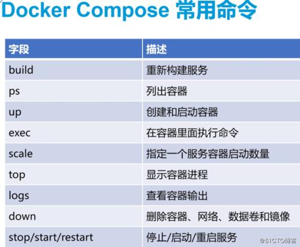

步骤：

1. 定义 Dockerfile 文件
2. 定义 docker-compose.yml 文件
3. 启动项目

docker-compose.yml

```shell
version: "3.9"  # optional since v1.27.0
services:
  web:
    build: .
    ports:
      - "5000:5000"
    volumes:
      - .:/code
      - logvolume01:/var/log
    links:
      - redis
  redis:
    image: redis
volumes:
  logvolume01: {}
```

app -> service -> container

### 安装 docker-compose 

```shell
sudo curl -L "https://github.com/docker/compose/releases/download/1.29.2/docker-compose-$(uname -s)-$(uname -m)" -o /usr/local/bin/docker-compose
# 目录
/usr/local/bin/docker-compose
```

添加执行权限

```shell
cd /usr/local/bin/   # 进去执行目录
chmod +x docker-compose # 添加执行权限
```

### 开始 docker-compose

创建文件夹

```shell
 mkdir composetest
 cd composetest
```

创建 python 应用（用于测试）

```shell
# app.py
import time

import redis
from flask import Flask

app = Flask(__name__)
cache = redis.Redis(host='redis', port=6379)

def get_hit_count():
    retries = 5
    while True:
        try:
            return cache.incr('hits')
        except redis.exceptions.ConnectionError as exc:
            if retries == 0:
                raise exc
            retries -= 1
            time.sleep(0.5)

@app.route('/')
def hello():
    count = get_hit_count()
    return 'Hello World! I have been seen {} times.\n'.format(count)
```

创建 requirements.txt 依赖

```shell
flask
redis
```

创建 Dockerfile

```shell
# syntax=docker/dockerfile:1
FROM python:3.7-alpine
WORKDIR /code
ENV FLASK_APP=app.py
ENV FLASK_RUN_HOST=0.0.0.0
RUN apk add --no-cache gcc musl-dev linux-headers
COPY requirements.txt requirements.txt
RUN pip install -r requirements.txt
EXPOSE 5000
COPY . .
CMD ["flask", "run"]
```

创建 docker-compose.yml

```shell
version: "3.9"
services:
  web:
    build: .
    ports:
      - "5000:5000"
  redis:
    image: "redis:alpine"
```

以上要是没有执行权限则添加权限 `chmod +x filename`  添加执行权限

启动 docker-compose 服务

```shell
docker-compose up -d [yml] [--build]
```

yaml 规则

https://www.ruanyifeng.com/blog/2016/07/yaml.html

https://docs.docker.com/compose/compose-file/compose-file-v3/

```
version: "3.9" # 版本

services: # 服务
  wordpress: # 程序
    image: wordpress # 镜像
    ports: # 端口
      - "8080:80"
    networks: # 网络
      - overlay
    # depends_on: 依赖
    deploy: # 部署
      mode: replicated
      replicas: 2
      endpoint_mode: vip

  mysql:
    image: mysql
    volumes:
       - db-data:/var/lib/mysql/data
    networks:
       - overlay
    deploy:
      mode: replicated
      replicas: 2
      endpoint_mode: dnsrr

volumes:
  db-data:

networks:
  overlay:
```

## Swarm 集群

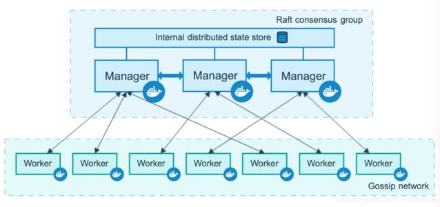

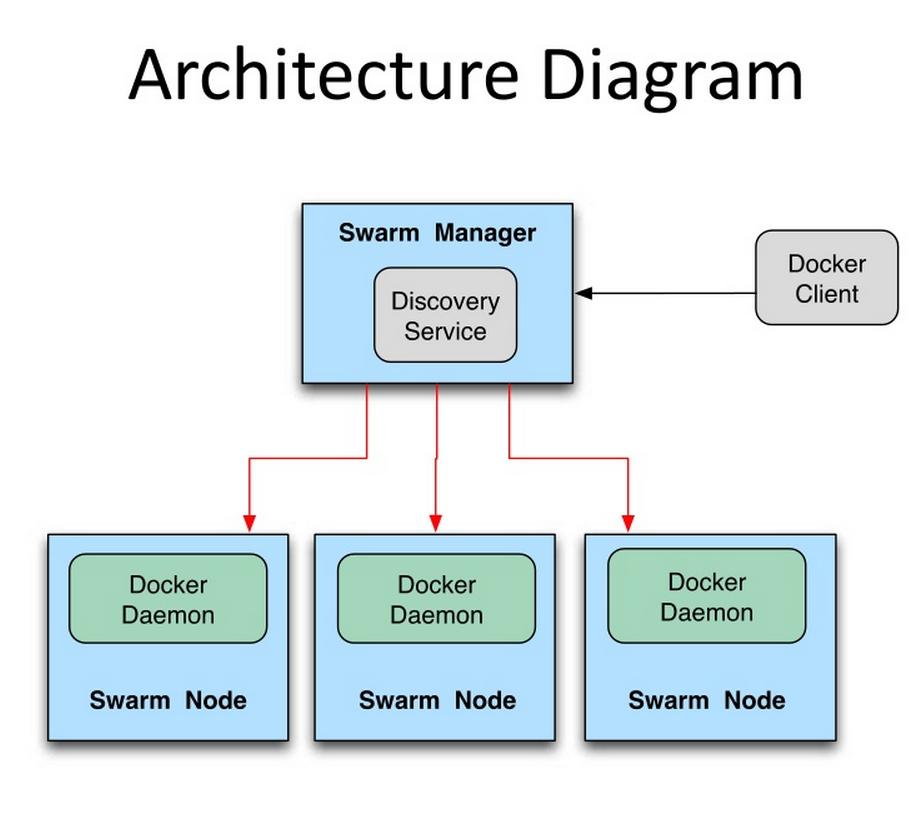

manager 管理节点（3 >=）可使用管理命令

workers 工作节点，不可使用管理命令

步骤：

1. 生成主节点 init
2. 加入 worker 和 manager

帮助命令

```shell
docker swarm --help
```

### 初始化 swarm 集群

```shell
docker swarm init --advertise-addr 192.168.31.201 # 主机ip
```

生成加入 workers 节点命令

```shell
docker swarm join-token worker
```

生成加入 manager节点命令

```shell
docker swarm join-token manager
```

添加工作节点（生成的 token）

```shell
docker swarm join --token SWMTKN-1-5z8j3yfzdp7ggweaj9ate7hnsr88nkm0sn9s5hho4nlt9v01aq-712dmhuuba5b34hrjahk1ewx7 192.168.31.201:2377
```

查看节点

```shell
docker node ls
```

节点离开集群

```shell
docker swarm leave -f
```

### 创建 service （在集群中创建，可扩缩容）

```shell
docker service create -p 8088:80 --name="nginx-1" nginx
```

```shell
docker service create --name="site" -p 80:80 --replicas 6 --restart-condition=any --mount source=site-volume,target=/usr/share/nginx/ site1.0
```

查看 service 

```shell
docker service ls # 查看所有服务
docker service ps nginx-1 # 查看指定服务
docker ps # 查看所有运行容器
docker service logs -f site # 查看日志
```

删除服务

```shell
docker service rm site
```

更新服务（动态维持多副本）

```shell
docker service update --replicas 3 nginx-1 # 在集群中创建3个副本，replicas 副本模式
```

扩缩容

```shell
docker service  scale nginx-1=5 # 扩展5份
```

swarm 网络

ingress：同网络负载均衡

overlay：不同网络负载均衡

移除服务

```shell
docker service rm nginx-1
```

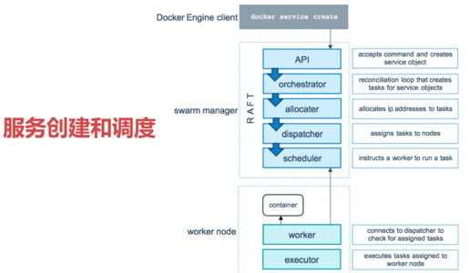

概念

swarm：集群管理，操作集群 worker 和 manager

node：docker 节点，worker 和 manager

service：服务，运行的app

task：容器内的命令

docker stack

docker secret

docker config
