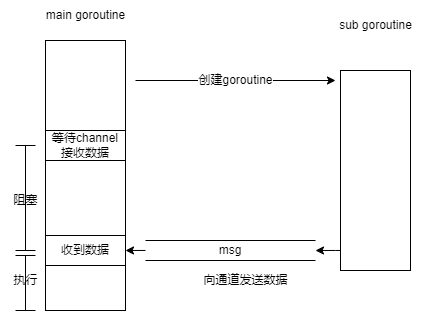
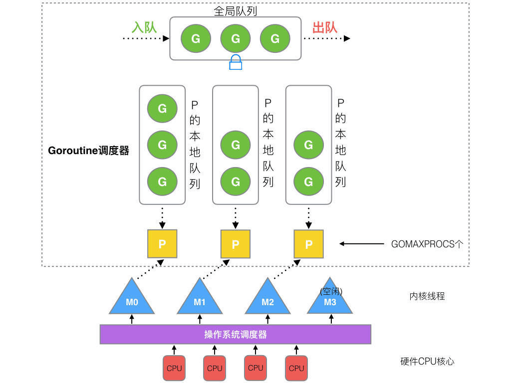

# GO 的并发模型

并发：是指多个程序同时在一个处理器上运行，但任一个时刻点上只有一个程序在处理器上运行，强调多个程序在一个处理器上分时执行

并发编程：表现为程序是由多个自主的活动单元组成

GO 支持两种并发编程风格或实现：

1. 基于channel实现通信的CSP模型
2. 基于共享内存实现的互斥锁模型

## 并发模型：CSP模型

GO的并发哲学：不要通过共享内存来通信，而要通过通信来实现内存共享

CSP模型概念：

- 并发实体：一般为执行的线程，它们相互独立，并发执行，在go中对应的就是goroutine
- 通道：并发实体之间使用通道进行通信

CSP中的并发实体是独立的，它们之间没有共享的内存空间，数据通过通道进行传输，并且向通道发送数据或者是接收数据都会导致实体阻塞，这也就是使用channel所带来的特性

- 通道channel：连接2个实体，发送方向通道发送数据，接收方从通道中读取数据
- CSP称为通信顺序进程：如果channel同时只容纳1条数据，那么channel内部最多只能驻留1条数据。如果发送方尝试向channel发送2条数据，那么第一条能够加入到channel中，但在发送第2条数据时将会被阻塞，直到channel中的数据被读取；如果接收方持续读取channel中的数据，当channel中的数据都被读取后，channel为空，此时实体将被阻塞，直到有新的数据到来

CSP模型就类似生产者与消费者模型，并且在这之间加入了channel来控制双方的节奏，数据在双方之间是以串行的方式进行流转

```go
func main(){
  // 创建通道，传输的数据为 int 类型
  cn := make(chan int)
  go func(){
    // 向 cn 中发送数
    cn <- 1
  }()
  // 从 cn 中接收数据
  fmt.Println(<-cn)
  // 关闭通道
  close(cn)
}
```



在GO语言中可以设置channel容量，channel就是一个队列结构，设置更大的队列长度可以让发送和接收方有一定的缓冲区

- 发送方在队列未满之前都可以正常执行，直到队列被填满后才会被阻塞执行
- 接收方在队列未空之前都可以正常执行，直到队列为空后程序才会被阻塞
- 如果双方能够维持在一个动态平衡的状态（也就是数据生产速度与消费速度匹配），那么双方都能正常执行下去，直到一方速度不匹配进入阻塞状态，正常情况下不会持续处于平衡状态

## 并发模型：互斥锁模型

通过共享内存来实现数据通信时，数据竞争是不可避免的，通过锁机制来保证在并发模型下程序安全的读写数据

**互斥锁**

在对共享内存的数据进行操作之前请求对数据进行上锁，也就是请求获取数据控制权

```go
var (
  mu sync.Mutex
  data int
)

func main (){
  go func(){
    // 请求获取锁
    mu.Lock()
    // 操作数据
    data = 1
    // 释放锁
    mu.Unlock()
  }()
  mu.Lock()
  // 读取数据
  fmt.Println("%d", data)
  mu.Unlock()
}
```

从上面代码可以看出，在另一个goroutine中尝试修改全局数据data时请求获取锁，并在赋值后释放锁。由于不同goroutine并发执行，执行顺序是随机的，如果没有锁，那么可能导致数据异常。

```go
var (
  data int
)

func main (){
  go func(){
    data = 1
  }()
  data = 2
  // ...
  // 读取数据
  fmt.Println("%d", data) // 2 or 1
}
```

如果是这样的代码，由于cpu调度的原因，可能在创建新goroutine的时候立刻就执行data赋值操作（在data=2之前就执行了），那么最终打印data就为2。
如果新goroutine没有立刻赋值data，而是在main goroutine中先执行data=2后才执行data=1赋值，那么最后打印的是1，这就不符合预期

使用互斥锁改写后就正常了

```go
var (
  mu sync.Mutex
  data int
)

func main (){
  go func(){
    // 请求获取锁
    mu.Lock()
    // 操作数据
    data = 1
    // 释放锁
    mu.Unlock()
  }()
  mu.Lock()
  data = 2
  // 读取数据
  fmt.Println("%d", data) // 2
  mu.Unlock()
}
```

其实互斥锁解决的是在一个原子操作内，共享内存的数据是可控的，至少在上锁期间不会被其他goroutine改变。

读写锁：也是类似的，不同点在于可以同时有多个读锁，但是只能有一个写锁。当有一个写锁后，读请求将会被阻塞，直到写操作解锁。一般情况下读操作是不会改变数据的，也就是不存在数据竞争，只有在改变数据是才会导致数据竞争，这也就是为什么只能有一个写锁

## 线程模型

线程：是操作系统能够进行运算调度的最小单位
进程：是计算机中的程序关于某数据集合上的一次运行活动，是系统进行资源分配和调度的基本单位

无论语言层面何种并发模型，到了操作系统层面，一定是以线程的形态存在的。而操作系统根据资源访问权限的不同，体系架构可分为用户空间和内核空间；内核空间主要操作访问CPU资源、I/O资源、内存资源等硬件资源，为上层应用程序提供最基本的基础资源，用户空间呢就是上层应用程序的固定活动空间，用户空间不可以直接访问资源，必须通过“系统调用”、“库函数”或“Shell脚本”来调用内核空间提供的资源。

线程的实现模型主要有3种：

1. 用户级线程模型 m:1（多对一，m个用户线上对应1个内核线程，无法并行化）
2. 内核级线程模型 1:1（一对一，1个用户线上对应1个内核线程）
3. 两级线程模型 m:n（多对多，m个用户线上对应n个内核线程，可以并行化）

上面说的比值其实是用户线程和内核线程（内核调度实体Kernel Scheduling Entity,简称KSE）之间的比值，内核调度实体就是可以被内核的调度器调度的对象。在很多文献和书中，它也称为内核级线程，是操作系统内核的最小调度单元。

GO实现的线程模型是多对多的两级线程模型，用户线程对应的就是goroutine

[参考文章](https://blog.csdn.net/csy2005csy/article/details/120592566)
[操作系统-多线程模型](https://blog.csdn.net/qyb19970829/article/details/113621043)

## Goroutine调度模型：GMP模型

- G：表示goroutine协程（用户线程），每个goroutine 都有自己的栈空间，定时器，初始化的栈空间在2k 左右，空间会随着需求增长。
- M：抽象化代表内核线程，记录内核线程栈信息，当goroutine 调度到线程时，使用该goroutine 自己的栈信息。
- P：代表调度器，负责调度goroutine，维护一个本地goroutine 队列，M 从P 上获得goroutine 并执行，同时还负责部分内存的管理。



[参考文章](https://learnku.com/articles/41728)
[推荐文章](https://blog.csdn.net/qq_37703224/article/details/121258233)

[强烈推荐文档](https://www.yuque.com/aceld/golang/ithv8f)