# 计算机网络

## 七层结构

1. 物理层

   - 物理层是最底层的结构，通常在电缆、光纤上传输数据
   - 物理层上传递的数据是以比特为单位，通过电压的高低等方式表示0与1
   - 物理层就是最接近现实的，我们可以随处看到，相当于传输数据的物理媒介

2. 数据链路层

   - 数据链路层，是在2台主机之间的数据传输，封装网络层的IP数据包装成帧发送给下一台主机
   - 一般情况在网络传输过程需要经过很多台主机才会到达最终目的地，比如一个MAC网卡在这里就可以当作是一台主机
   - 当你要发送数据的时候，通过网关，即你的下一个传输目标是网关的MAC地址，等到传到网关，又需要到下一个中转点，直到找到最终的目标IP地址
   - 数据链路层就好比数据包需要经过的一个个关卡，链路就是每一段的数据传输过程，MAC地址就是标识当前段需要到达的目的地，而IP是最终要到达的目的地
   - 在这一层会检测数据是否有误，如果有误就需要检错和纠错，来保证传输可靠性

3. 网络层

   - 网络层负责为分组交换网上的不同主机提供通信服务
   - 网络层把运输层的数据封装成分组或者包进行传送
   - 网络层使用IP协议，通过IP协议找到具体的目标
   - 网络由大量的路由器相互连接而成，通过IP协议，选择去往目标地址的方向即选择恰当的路由器，通过路由器来实现寻找目标IP地址
   - 数据链路层是规定MAC地址，用于查找物理设备，而IP地址是用于查找具体主机所在网络段，通过IP识别要去往的路由器，通过MAC地址寻找路由器，再通过路由器识别IP选择恰当的下一个中转点，直到到达指定IP的目标

4. 运输层

   - 运输层负责两台主机中进程之间的通信通过通用的传输服务，常用的协议为TCP，UDP协议
   - 传输控制协议TCP，提供面向连接的、可靠的数据传输服务，数据传输单位是报文段
   - 用户数据包协议UDP，提供无连接的、尽最大努力的数据传输服务，数据传输单位是用户数据报
   - 此层协议主要用于主机与主机的进程间通信，通常用于网络应用的一种通用通信协议

5. 会话层

   - 会话层(Session)是建立在传输层之上，利用传输层提供的服务，使应用建立和维持会话，并能使会话获得同步
   - 会话层使用校验点可使通信会话在通信失效时从校验点继续恢复通信。这种能力对于传送大的文件极为重要

6. 表示层

   - 表示层为在应用过程之间传送的信息提供表示方法的服务，它只关心信息发出的语法和语义
   - 表示层是处理所有与数据表示及运输有关的问题，包括转换、加密和压缩

7. 应用层

   - 应用层为最高层结构，提供应用进程间的交互来完成特定网络应用
   - 应用层协议是应用进程间通信和交互的规则
   - 如DNS域名系统，HTTP协议，邮件SMTP协议，数据传输单位报文

- 通常的五层结构是把应用层、表示层、会话层合并为应用层
- 四层结构是在五层结构的基础上把物理层与数据链路层合并为网络接口层，把相类似结构的层合并

看看从主机上的网络应用发起一个请求的数据传递过程

- 当一个主机的应用进程发送数据时，先经过应用层的处理，加上控制信息http报文，再到运输层添加控制信息tcp/udp数据段，再通过网络层添加IP数据报，进而通过数据链路层的MAC添加数据帧，最后通过物理层的物理媒介发送到下一个中转点(路由器),路由器检查低3层的数据是否有错，有就纠错，如果无法纠错就抛弃，再到下一个路由器，直到最终IP地址对应的主机，从物理层一步步到应用层，获取最终数据
- 传输路线：发送数据->应用->应用层->传输层->网络层->数据链路层->物理层->进入路由器->物理层->数据链路层->网络层->数据链路层->物理层->离开路由器->...数个路由器->目标网段->网络层->数据链路层->网络层->传输层->应用层->应用->获取数据
- 好比一个商品从国外进口，商品有商品的包装盒，再进一步运输包装，通过轮船运输，经过海关的检查再到店里，我们把商品买回家，拆分包装最终获得实物

接下来主要讲传输层与应用层相关的知识

## 传输层(运输层)

- 网络的五层结构中，物理层负责提供最底层的物理媒介，是计算机网络的最底层的支撑也是最真实的存在，数据在其物理媒介中传输
- 数据链路层是负责物理设备间的寻路，以便数据在网络传输过程中的高效，由一段段小的线路构成一条通往目的地的路线，通过物理设备的MAC地址查找，MAC是区分设备
- 网络层是用于区分用户当前上网所在的网络段，通过网络段可以识别用户所在的大致地理位置，IP地址是按照地理位置分配的，但是IP也不是固定的，只能说是临时上网点，如果离线那么就没有所谓的IP，除非是内网，通过IP就能识别上网的主机
- 传输层是在以及寻找到主机的情况下，进程之间的通信是基于端口的，通过端口识别网络应用，每一个端口都可以建立一个TCP协议，但是指定的端口就只能在规定的端口上发送和接受数据
- 应用层是在应用内使用对应的网络协议，通过编写应用层协议进行应用进程间的通信和交互

### 传输层的重要概念

- 滑动窗口
- 流量控制
- 拥塞控制

1. 运输层为相互通信的应用进程提供逻辑通信
2. 端口和套接字的意义
3. 无连接的UDP的特点
4. 面向连接的TCP的特点
5. 在不可靠的网络上实现可靠传输的工作原理，停止等待协议和ARQ协议
6. TCP的滑动窗口、流量控制、拥塞控制和连接管理

#### 进程间的通信

- 传输层向它上面的应用提供通信服务，是用户功能的最低层
- IP只把数据交付给主机，而传输层协议是把数据从主机交付给指定的进程，进而实现主机进程与主机进程间的通信
- 传输层有一个重要的功能复用和分用，复用指的是在发送方不同的应用进程可以使用相同的传输层协议传输数据。分用是指接受方的运输层在剥去报文的的首部后能够正确交付给应用进程
- IP协议只检查数据报，不检查数据部分，传输层协议这会对收到的报文进行差错检测
- 传输层协议分为UDP面向无连接与TCP面向有连接

#### UDP与TCP

- UDP用户数据报协议
  - udp在传送数据前不需要建立连接，在收到数据时也不需要确认，是不可靠交付，传输单元用户数据报
- TCP传输控制协议
  - tcp提供面向连接的服务，发送数据前先建立连接，数据传送结束需要释放连接，tcp不提供广播域多播，tcp提供可靠、面向连接的运输服务，避免不了额外的开销，传送单元报文段

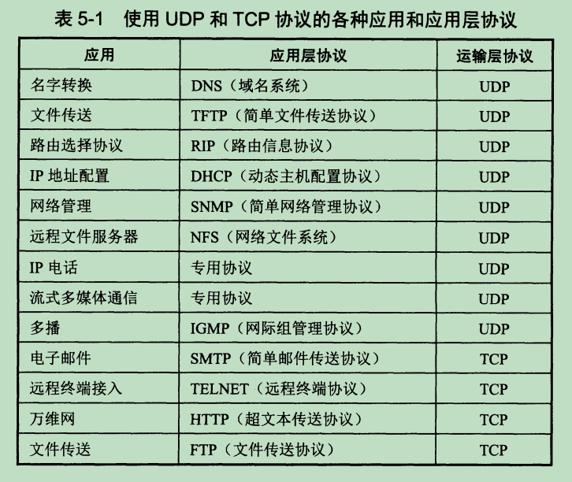

#### 运输层的端口

- 复用：应用层所有的应用进程可以通过运输层再传给网络层
- 分用：运输层从网络层接受到数据发送给指明的应用进程，所以给每个应用进程赋予一个明确的标志很重要
- 由于不同系统对于进程的标识不一样，所以无法通过进程标识来识别应用，但是可以通过端口来识别，由于一台主机上有很多应用程序，那么必须给指定的应用分配端口才能通过复用来实现数据传送
- IP协议只识别主机，而TCP/UDP协议通过识别端口来寻找指定的应用程序，硬件端口是不同硬件设备进行交互的接口，比如主机外设的use端口，是与外部设备对接使用，而软件端口是虚拟的，在应用层的各种协议进程与运输实体进行层间交互的一种地址
- IP地址就好比信封上的大概地址，而TCP/UPD还要在IP地址低基础上增加对方的端口号，就好比具体的住址
- 一般16位的端口号最多可以有2^16=65536个端口，0~1023之间的端口称为熟知端口号，就好比互联网上公认的指定协议的端口号，比如FTP是21端口、DNS：53、SMTP：25、HTTP：80、HTTPS：443，这些协议对应的端口都是大家默认使用的，一般不会去更改
- 1027~49151端口是登记端口，应用程序所使用的端口，为了防止应用程序使用重复的端口，服务端应用程序使用的端口必须是众所周知的，因为服务器应用程序需要让客户知道
- 49152~65535为客户端端口号，这些端口只在客户进程运行时才动态选择的，又叫短暂端口号，当服务器进程收到客户端进程的报文时，就会记录客户使用的端口号，在下一次就会发送到客户机的这个端口上，如果通信结束则释放端口，客户端口只需要让服务端知道

#### UDP

- udp协议只在IP协议的基础上增加了复用、分用、差错检测功能，所以udp是轻量的
- udp特点
  1. 无连接，减少开销和发送延迟
  2. 尽最大努力交付，不保证可靠交付，所以主机不需要维持不需要复杂的连接状态表
  3. 面向报文，udp保留应用层的报文，不合并也不拆分，如果报文太长或者太短，则会影响IP协议的效率
  4. 没有拥塞控制，udp发送的数据不会受到网络拥塞的控制，所以udp协议在主机端发送的速率不受影响，可以适用于接受丢包，但是不能有太多延迟的场景，比如直播软件，对于用户来说只要直播不卡顿总比没画面好，尽管画面质量不怎样
  5. 支持一对一，一对多，多对一交互通信，比如广播
  6. 首部开销小，8字节比起tcp的20字节，在传输效率上更高

##### 首部格式

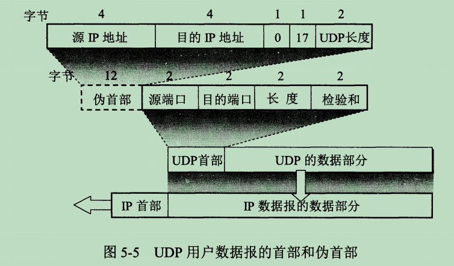

UDP首部结构

- 源端口2字节，保存发送端的端口号
- 目的端口2字节，保存目标主机端口号
- 长度最小值8，如果没有数据报则此长度就是首部长度8字节
- 校验和2字节，用于检测udp用户数据报在传输过程是否有误，如果有误就丢弃

伪首部是在检测用户数据报时临时产生的12字节首部，检验和就是根据这个伪首部计算而来

#### TCP

tcp特点

- 面向连接的运输层协议，在传送数据前需要建立连接
- 每条tcp连接只能有2个端点，即点对点连接
- 可靠交付服务。可以实现无差错、不丢失、不重复、按序到达
- 提供全双工通信，双方在任何时候都可以进行发送和接受数据，设有发送接收缓存，存储临时数据
- 面向字节流，流是指流入进程或者流出进程的字节序列，把发送的数据转换成字节流的形式，通过tcp的分块传送

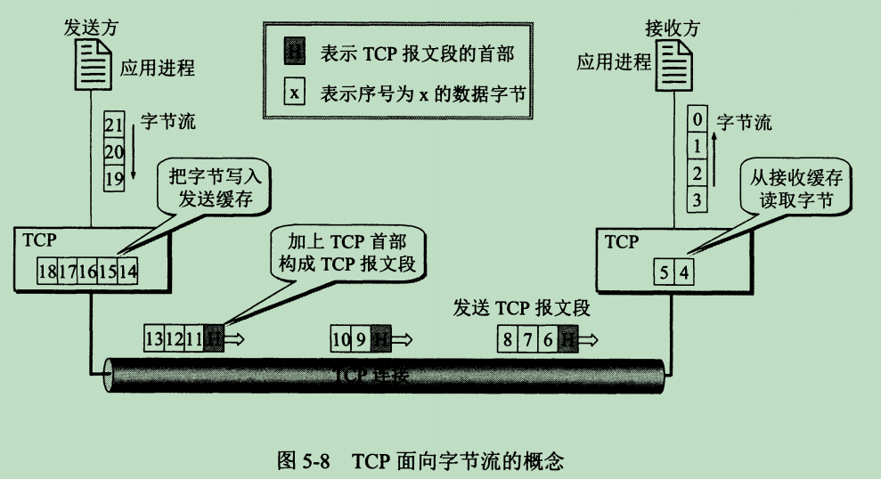

TCP的端点

- 所谓tcp的连接端点并不是ip、端口、应用程序，而是套接字socket或者是插口，即IP:端口，这种才是tcp的端，tcp的套接字就是规定了ip地址与端口号。socket=IP地址:端口号
- 每一条tcp连接都规定了2个端，即2个套接字之间的通信socket在不同场景的含义也不同，这里是指tcp协议的socket

停止等待协议

- 当一方发起tcp请求连接时，对方在一段时间内没有返回应答，则发送方需要重新发送建立连接，也叫超时重传
- 相同的接收端在返回应答之后，如果发送端又重新发送建立连接那么，接收端就会抛弃上一个确认，重新开始一个确认

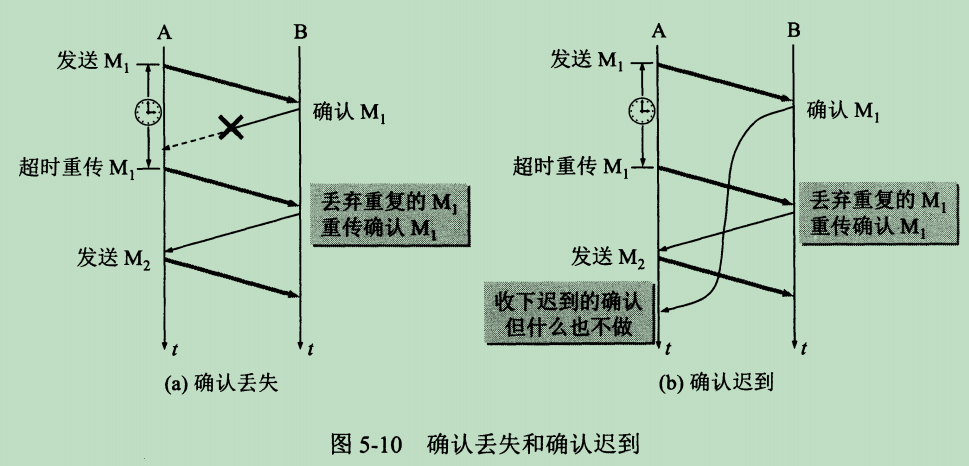

- 简单说就是：发送端一段时间没收到确认就会重新发送请求，发送/接收端只确认最新的请求，如果是早期的请求将会无视

连续ARQ协议

- 为了提高tcp的信道利用率，不可能一直等待上一次发送请求的应答，通过分组以及连续arq协议、滑动窗口协议来提高效率

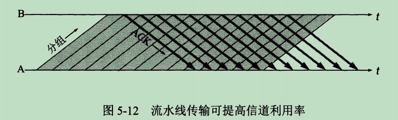

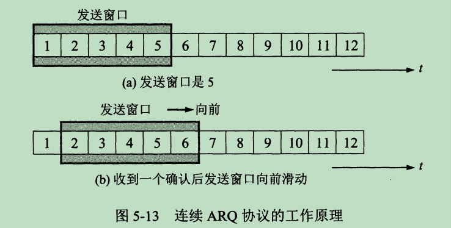

- 滑动窗口只在发送/接收缓存中才有，发送缓存的数据就是从应用层中的数据通过字节流形式传入到发送区，发送缓存是保存近期要准备发送的数据，只是发送区的一部分数据，而接受缓存也是类似
- 滑动窗口是在缓存区的一个当前正在发送的数据窗口，窗口的大小可以调整，窗口内的数据是指明当前正在发送的数据，如果发送端接受到了应答则发送窗口可以向后移动
- 把窗口比作加工机器，把缓存队列比作传送带，只有到达加工机器的物品才会被加工，加工完成工作人员确认之后才会进行下一个的加工

##### tcp报文段

tcp首部

tcp的首部较大，因为需要建立可靠连接，必不可少的一些信息与验证，前20个字节固定，后面可以添加选项长度4n个字节，不够4n需要填充，且选项不超过40字节

- 源端口与目的端口同udp都是2个字节
- 序号占用4个字节，用于保存此次发送的头一个字节的序号，由于tcp字节流中的每个字节都是编号的，而之后字节的序号根据长度来类推
- 确认号占4个字节，用于给对方标识，已经正确接收到的序号-1，确认号就是希望对方下一次发送的序号值
- 数据偏移占4位二进制，这个值其实是为了确认不定长的选项的长度，数据偏移占4位最大表示4*15个字节数，数据偏移最大只能表示0-15，但是其中1位就表示4个字节的长度，就是因为选项必须为4n长度，其中n就是数据偏移的值所以首部的长度最多为15x4=60个字节，即选项最长40个字节
- 保留位占6位二进制，用于以后使用
- 6个控制位，共6位二进制
  - URG紧急控制位，当置1表示紧急指针有效，紧急指针指向的属性应该被尽快传送
  - ACK确认控制位，当置1表示确认号有效，反之无效，当连接建立后所有传送的报文都应该把ACK置1
  - PSH推送控制位，当双方进行交互通信时，需要立即发送请求与响应，那么双方就要把此位置1，而不用等待缓存队列，安排满了再发送，也就是在缓存队列还没装满的时候就发送。接收数据，很少使用
  - RST复位，当置1时，说明tcp连接出现严重差错，需要释放连接，然后重新建立连接
  - SYN同步，当建立连接之后用来同步序号，当SYN为1，ACK为0时说明是一个连接请求报文段，SYN置1表示这是一个连接请求或者是连接接受报文
  - FIN终止，用来释放连接，当置1时表名此报文段的发送方数据已经发送完了，没有东西了，请求释放连接
- 窗口占2字节，表示发送方的接收窗口(不是发送窗口)的大小，目的是给接收方下一次发送数据时限制发送数据的量，窗口值经常是变化的
- 检验和占2字节，在计算检验和时，需要在tcp首部加上临时的12字节的伪首部以计算检验和
- 紧急指针占2字节，当URG为1时有效，用于指明紧急数据末尾在报文段的位置，紧急数据结束之后就是普通数据
- 选项长度可变最长40字节，长度不够4n用0补充，tcp规定了许多辅助功能的选项，比如时间戳，窗口扩大选项等

流量控制

- 利用滑动窗口实现流量控制，就是为了调整发送与接收端点速率，使其能够尽量匹配，而不会导致堵塞

拥塞控制

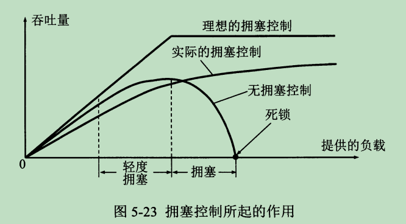

网络同马路，有时拥堵，有时畅通，tcp为了解决这种不定的情况，通过拥塞控制方法，来达到缓和网络

- 慢开始与拥塞避免
  - 基于窗口的拥塞控制，发送方控制拥塞窗口，可以理解为拥塞窗口是发送窗口的子集，当网络畅通的时候相等，当网络拥堵的时候拥塞窗口缩小
  - 在一开始发送数据的时候，数据量是慢慢增加的，以试探网络情况，也就意味着窗口慢慢变大
- 快重传、快恢复
  - 当发送方一连接收到3个重复确认就会立即进行重传
  - 当个别丢失了报文段，而不是启动慢开始，而是执行快恢复

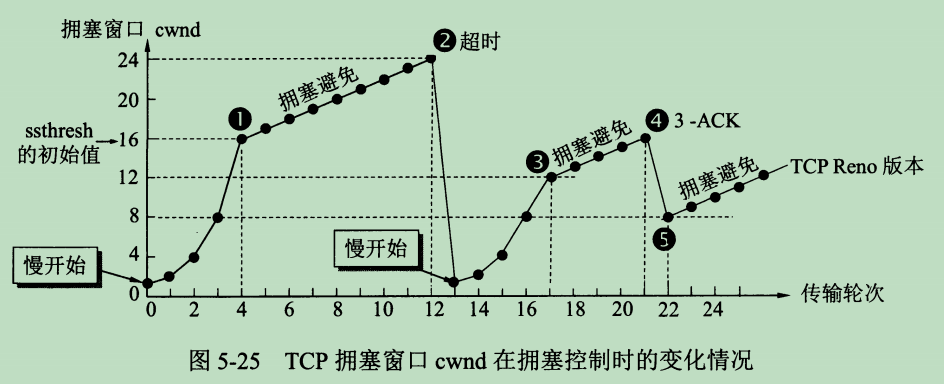

#### TCP的运输连接管理

运输连接有三个阶段

1. 连接建立
2. 数据传送
3. 连接释放

tcp建立连接过程叫做握手，握手需要客户端与服务器之间交换3个tcp报文段

客户端主动打开连接，服务器被动打开连接

##### 三次握手

- 在打算建立tcp连接时，请求方发送同步位SYN=1，与请求初始序号seq=x，规定请求报文不能携带数据，但是会消耗一个序号，发送方进入SYN-SEND状态，表示同步请求已经发送
- 服务器接收方，接收此请求后如果同意，则建立连接，确认报文段中SYN=1，确认位ACK=1表示确认请求的seq序号收到了，而此时响应的确认号为seq+1即ack(确认号)=x+1此时响应的初始序号设置为seq=y，也不能携带数据，同样消耗一个序号，服务器进入SYN-RCVD已经接收状态
- 最后客户端发送方还需要在收到服务器接收端的确认之后，还需要给服务器确认，这就是第3次握手，给服务器发送确认报文段ACK=1，确认号ack=y+1，而自己的序号seq=x+1，ACK报文段，可以携带数据，如果不携带数据则不消耗序号，且下一个seq=x+1，此时客户端进入ESTABLISHED状态

记忆，SYN在建立连接的前2次握手需要置1，表示开始建立同步连接，发送/接收方的第一次发送/应答都需要SYN位.ACK确认位在，当前有接收到seq时才会把ACK置1,用于确认接受到的seq

seq表示自己发送数据的开始序号，ack表示这次接收完的数据序号，由于握手过程需要消耗序号，所以下一次发送就要在基础上+1

- 第一次握手SYN=1，seq=x，表示发起同步连接，且当前发送初始序号为x
- 第二次握手SYN=1，ACK=1，seq=y，ack=x+1，表示同步应答，确认第一次握手的seq，且下一次应该发送x+1的序号，当前seq=y表示应答数据的初始序号为y
- 第三次握手ACK=1，seq=x+1，ack=y+1，表示确认第二次发送的seq，且下一次发送初始序号为y+1，seq=x+1表示当前数据的初始序号为x+1

- SYN为发送/接受第一次发送报文段时需要的控制位
- seq为当前报文段的第一个数据的序号
- ACK为确认号控制位，表示确认号有效，即ack有效，说明只要有ack则必须把ACK置1
- ack表示为确认收到的seq，且下一次需要发送的seq为ack的值

由于tcp是全双工通信所以在每次数据传递过程都要有seq与ack表示发送的数据以及确认收到的数据

##### 二次握手与四次握手为什么不行

- 如果是二次握手少了，第三次确认，那么如果当发送方第一次发送在网络中超过发送重传时间，那么发送方又会发送一次请求，如果这次请求比上一次的请求还快，那么服务器响应最新的请求，建立新的连接。但是过了一会最早发送的请求到了服务器，服务器不知道这是早期的请求，结过又建立了一个连接，但是双方之前已经建立了一个连接，就不会使用这个连接，导致这个连接白白浪费了，如果多个这种情况会导致，服务器由于无效连接过多而造成内存短缺，甚至崩溃
- 如果是四次握手，把第二次握手分成2部分，先响应ACK=1，ack=x+1再响应SYN=1，seq=y，其实这样的效果也同三次握手，浪费了资源

##### 四次挥手

4次挥手结束连接

- 客户端主动发起关闭连接请求，FIN=1，seq=u，FIN控制位表示数据发送完毕请求关闭连接，seq=u表示上一次传的最后一个序号+1，也就是表示有效数据的最后一位+1，发送方进入FIN-WAIT-1状态等待服务器的结束响应
- 服务器接收到请求关闭时，返回ACK=1，seq=v，ack=u+1，ACK置1使得ack确认号有效，ack=u+1用于确认客户端的结束连接请求，seq=v表明当前数据的初始序号，因为有可能服务器的数据还没有传递完成，这个时候不会发送FIN关闭连接，等到数据发送完成才会关闭连接，接下来继续传递剩余数据，进入CLOSE-WAIT状态，等待关闭
- 当传递完最后的数据，服务器发送关闭连接响应FIN=1，ACK=1，seq=w，ack=u+1，FIN=1表示关闭连接，seq=w表示服务器发送的最后有效数据+1的序号，ack=u+1表示确认的连接是第一次挥手请求，进入LAST-ACK状态，进入最后等待客户端确认
- 客户端发送ACK=1，seq=u+1，ack=w+1，确认ack=w+1服务器第三次挥手，序号为第一次挥手序号+1，此时发送方进入TIME-WAIT状态，等待2MSL时间，主要是预防服务端没有接受到最后的确认关闭，而导致服务端无法关闭连接，造成资源浪费。MSL为最长报文段寿命，等待2MSL就是尽量防止网络很差的情况服务器无法收到确认的情况，这个期间要是还收到服务端的响应，那么说明第4次挥手没有收到，从而客户端还会重新发送最后的确认

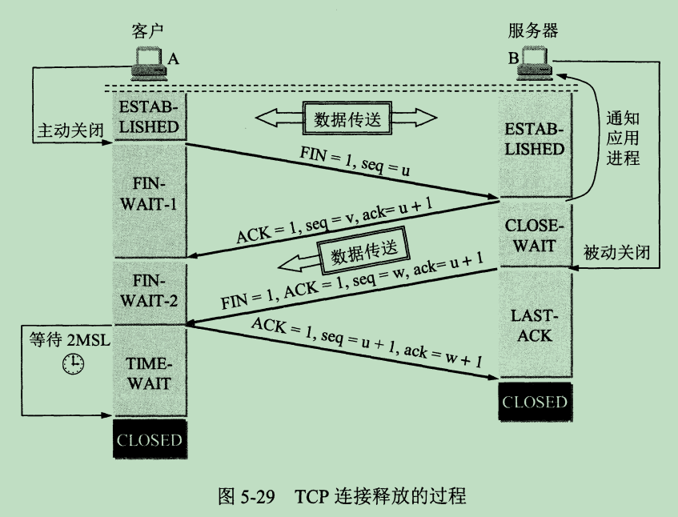

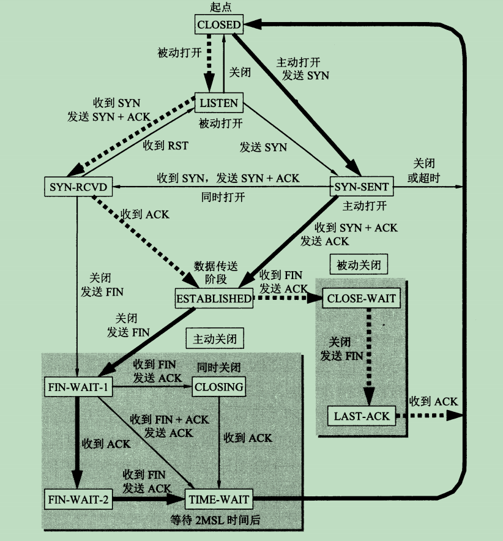

### 传输层总结

- 传输层提供的是应用进程间的逻辑通信，传输层向应用层屏蔽了下面其他层的细节
- 网络层是提供主机间的通信，传输层为应用进程之间提供端到端的逻辑通信
- 传输层有TCP与UDP协议，他们都有复用与分用，以及检错功能，tcp面向连接、可靠，UDP面向无连接，不可靠，轻量
- 传输层用到的端口为16位，最多支持65535个端口，且不同范围的端口拥有不同的含义。在不同计算机中的相同端口没有说明关联，这2个协议的目标端口和源端口只在当前连接下是对应的，可能下一次连接就不是这2个端口，但是一些通用的端口是便于响应。主动请求的端口不是很重要，被请求的端口一般是服务器上公认的端口这样大家都清楚请求哪个端口
- 比如我们打开一个网站，首先浏览器会对此网站发送tcp请求，此时浏览器会通过一个随机的用户端口发起请求服务器的80端口，服务端通过识别请求来源socket即ip:端口，来识别请求主机的应用程序进程。之后服务器根据请求socket返回网站文件，通过随机用户端口发送响应给客户端的80端口发送数据，客户端浏览器监听80端口，进一步识别来源端口给指定的网页数据，渲染网站
- UDP特点：
  - 无连接
  - 尽最大努力交付
  - 面向报文
  - 无拥塞控制
  - 支持一对一、一对多、多对一交互通信
  - 首部开销小
- TCP特点：
  - 面向连接
  - 每一条TCP连接只能是点对点即一对一
  - 提供可靠交付服务
  - 提供全双工通信
  - 面向字节流
- TCP使用套接字socket，IP地址:端口来识别应用进程
- 停止等待协议，接收重复则丢弃，还有发送确认
- 连续ARQ协议提高信道利用率，接收方采用累计确认
- TCP前20字节固定，选项长度最长40字节，首部序号是报文段中数据的第一个字节序号
- TCP的确认号是期望对方的下一个报文段的第一个数据字节序号
- TCP首部窗口字段指出对方发送的数据量，窗口是动态变化的，通过选项来控制窗口大小
- 流量控制来调整发送方的速率，使得接收方来得及接收
- 拥塞控制，用来避免网络堵塞的情况，不至于使连接瘫痪
- TCP的拥塞控制采用4种算法，慢开始、拥塞避免、快重传、快恢复
- 主动发起TCP的理解叫客户，被动等待建立连接的应用进程叫做服务器，TCP采用3次握手建立连接，通过4次挥手断开连接

## 应用层

- 每个应用层协议都是为了解决某一类应用问题，而问题的解决又必须通过位于不同主机中的多个应用进程之间的通信和协同工作来完成
- 应用层的具体内容就是精确定义这些通信规则
- 应用层协议应当定义
  - 应用进程交换的报文类型，eg请求报文、响应报文
  - 各种报文类型的语法，eg报文中的各个字段以及详细描述
  - 字段的语义，包含在字段中的信息的含义
  - 进程何时、然后发送报文，以及对报文进行响应的规则
- 互联网公共领域的标准应用的应用层协议由RFC文档定义
- 客户是服务请求方，服务器是服务提供方

### 重点知识

1. 域名系统DNS，从域名解析出IP地址
2. 万维网和HTTP协议

#### DNS域名系统

- 网络中的传输是通过IP协议来寻找目标主机，由于IP地址比如192.168.1.1这就是一个IP地址，不是那么好记忆况且将来将要普及的IPv6是64位，那么更加难记忆，可见是很反人类的设计
- 出于这个原因我们需要通过域名系统来绑定IP地址，这样我们只需要记忆域名，就能通过域名解析获取ip地址进而访问
- 域名(domain name)，域是名字可见中一个可被管理的划分，域还可以划分为子域，所以就有了顶级域名、二级域名等多级域名

- 域名在的标号由英文字母域数字组成，每一个标号不超过63个字符，不区分大小写字母，越高级的域名越在右边，通过.来分隔多级域名
- 顶级域名
  - 国家顶级域名：cn表示中国、us表示美国、uk表示英国等
  - 通用顶级域名：通用顶级域名，eg：com公司企业，net网络服务机构、org非盈利组织、int国际组织、edu教育机构等等
  - 基础结构域名：只有一个arpa，用于反向域名解析，又叫反向域名
- 用域名树来表示互联网的域名系统，最上面的是根，根下面就是最高级的顶级域名，所以一级域名又是顶级域名
- 一级域名下面就是二级域名，以此类推

- 根域名服务器，是最高层的域名服务器，根域名服务器都知道所有的顶级域名服务器与ip地址
- 全球已经有几百个根域名服务器，但是只使用13个不同IP地址的域名
- 根域名不直接查询域名对应的ip地址，而是告诉本地域名服务器下一步应该找哪个顶级域名服务器进行查询
- 顶级域名服务器(TLD服务器)，用于管理在该顶级域名下的二级域名，当dns查询时就会给出结果或者是进行下一步的寻找
- 权限域名服务器，负责一个区的域名让我去，如果不能给出解析，则会告诉用户下一次需要找的权限域名服务器
- 本地域名服务器，当主机发出DNS查询的时候会发送报文给本地域名服务器，每个ISP或者大学都可拥有一个本地域名服务器，离用户最近

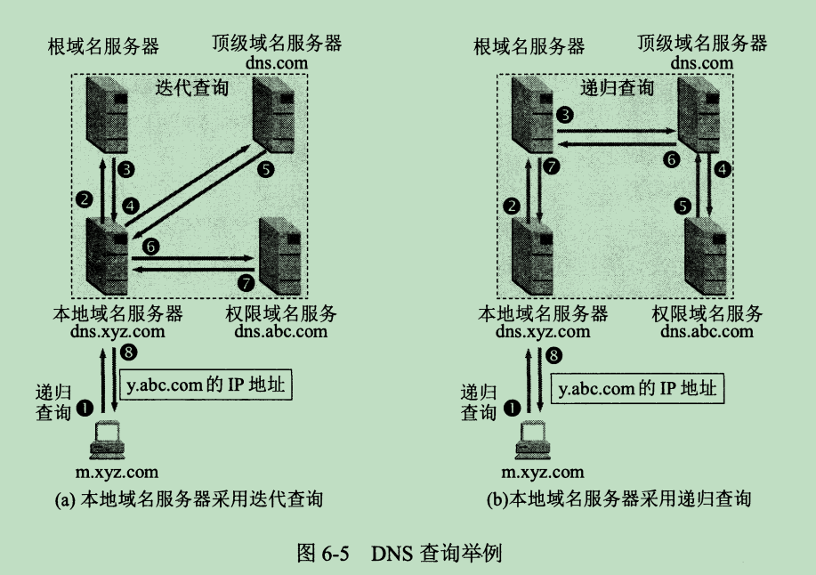

DNS查询步骤

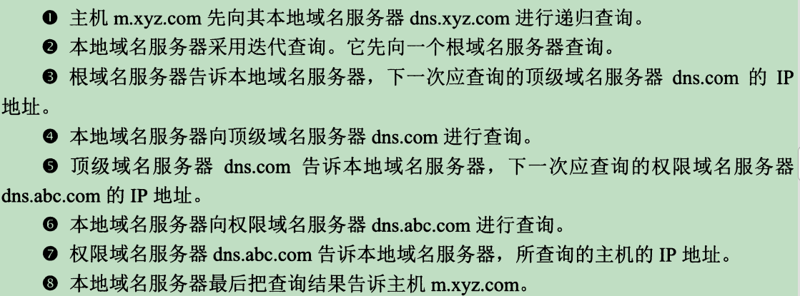

DNS服务器会缓存近期解析过的域名，以便接下来的解析，减少开销，主机与浏览器也会有DNS解析缓存

#### 万维网

- 万维网www，不是特殊的计算机网络，是一个大规模的、链继式的信息储藏所，简称Web
- 客户重新向服务器程序发出请求，服务器程序向客户程序送回客户所要的万维网文档
- 在客户程序主窗口向上的万维网文档称为页面
- 万维网使用URL统一资源定位符，来标识万维网上的各种文档，每个文档在整个互联网中具有唯一性
- 通过HTTP超文本传送协议，来解决万维网服务器程序之间的交互
- 使用超文本标记语言HTML，使得网页设计者可以方便的使用链接把本页面链接到互联网的任何万维网页面上

#### URI、URL、URN

url与urn都是uri的子集

**URI是统一资源标识符**它是一个标准，而非定义具体的表现方式

**URL是统一资源定位符**它实际上是一个资源标识符，但更具体的，它定位了资源的位置

**URN是统一资源命名**作为特定内容的唯一名称使用的，与当前资源的所在地无关,使用URN可以在不知道其网络位置及访问方式的情况下访问资源。

- url是用来标识从互联网上得到的资源位置和访问这些资源的方法
- url由4部分构成：<协议>://<主机>:<端口>/<路径>，不区分大小写
- 协议包括http，ftp，ms等
- 协议后的://是规定格式
- 第二部分是主机，可以是域名或者IP地址
- 端口，在默认情况下可以省略
- 路径对应的是主机上的相对路径

1. `http://bitpoetry.io/posts/hello.html#intro`这是一个URI
2. `http://`是定义如何访问资源的方式
3. `bitpoetry.io/posts/hello.html`是资源存放的位置
4. `#intro`是资源
5. `http://bitpoetry.io/posts/hello.html`这是URL，告诉我们访问网络位置的方式
6. `bitpoetry.io/posts/hello.html#intro`这是URN，不包括访问方式

#### HTTP超文本传送协议

http可以传送文本、超文本、声音、图像等

- http默认使用的是80端口，http本身是无连接无状态的，在TCP建立连接之后才会发起http报文
- 无连接，虽然基于TCP的连接但是在发送http报文前不需要建立连接
- 无状态，同一个客户第二次访问同一个服务器时响应与第一次相同，不会记录客户
- http/1.0使用非持续连接，所以每次连接都会导致2xRTT(往返时间)的时间开销
- http/1.1解决了这个问题，使用了持续连接，当发送响应后仍然会在一段时间内保存这个连接，持续连接有两种工作方式，非流水线方式，即客户在收到前一个响应后才会发送下一个请求，流水式的特点就是可以连续发送新的请求，服务器可以连续的发回响应，此方式只需要花费一个RTT时间，提高文档下载效率

##### http报文结构

请求报文：客户端向服务器发送的请求报文
响应报文：服务器向客户端发送的应答报文

请求报文

- http请求报文分为三部分
  - 开始行，在请求报文中叫做请求行，在响应报文中叫做状态行。开始行的三个字段都是用空格隔开
  - 首部函数，用来说明浏览器、服务器或者报文主体信息，首部行结束需要空一行，将首部行与实体部分分开
  - 实体主体，请求报文中一般不使用，在响应报文中也可能没有，一般包含的是传送的数据内容
- http的请求报文
  - 请求行：只有方法、请求资源URL、HTTP版本

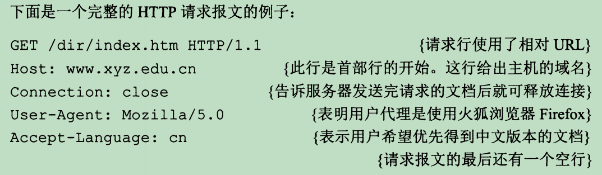

响应报文

- 状态行：HTTP版本、状态码、状态描述
  - 状态码为3位数字
  - 1xx表示调整信息，如请求升级或者正在处理
  - 2xx表示成功，接收到了
  - 3xx表示重定向，请求还需要进一步处理
  - 4xx表示客户差错，请求有问题
  - 5xx表示服务器差错，服务器无法完成请求
- 响应头同请求头，有些字段可能不一样
- 响应主体：返回的数据主体

#### 代理服务器

- 代理服务器是一种网络实体，又称为万维网高速缓存，代理服务器把最近的请求和响应暂存在本地磁盘中，如果代理服务器收到相同的请求，就把暂存的响应直接返回，而不需要再去目的地址访问资源

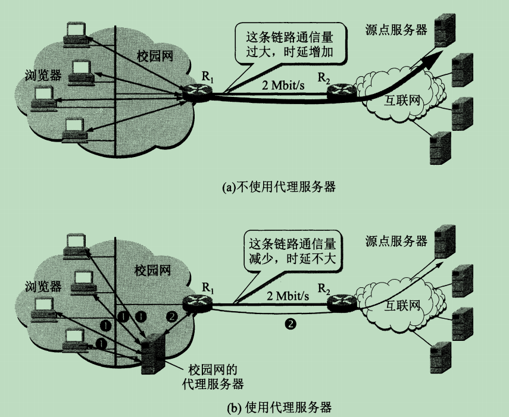

#### cookie

- cookie是服务器发送给客户端一个唯一的识别码，在之后这个客户再次访问服务器时，会在头部中设置Set-cookie字段，其值为服务器发送来的识别码

#### MIME类型

## 应用层协议

### HTTP协议

- HTTP超文本传输协议，可以传输图片、文本、视频、网页等数据，基于TCP协议，使用请求响应方式进行通信

#### http版本

- http/1.0 规定浏览器与服务器之间只保持短暂的连接，即短连接，一次请求响应之后就断开tcp连接，由于tcp的3次握手与4次挥手，将会导致效率很低
- http/1.1开始默认支持持久连接，也就是长连接Connection:keep-alive，减少了建立于关闭连接的开销
- http/2改进
  - 头部压缩：
    - 开始行与头部合并在一起，在http/2中并不会传送这些字段，而是在客户端与服务器都保存一个索引表，每个索引对应的是字段名与值形式
    - 开始行的字段以:开头，来区分开始行与头部，这样一来在传输过程只需要传索引，大大减少头部大小
  - 多路复用：
    - http的队头堵塞是由于长连接中的请求与响应必须是连续的，这样导致后面的请求会受到前面请求的影响，http/1.1通过并发连接与域名分片来增加tcp的连接数，但是并没有解决真正的问题。
    - http/2中使用多路复用，把头部与数据主体部分分开，头部使用二进制格式的Header帧来传送，主体使用Date帧来传送，这些帧不会按照先后顺序传送
    - 每一路叫做流，通过流来进行多个真的额通信，每个流有自己的StreamID，此id是指明对应的一条路，在这条路上的帧是有指定顺序传送的，响应报文由流中的帧来组装而成。
    - 一个tcp连接可以有多个流也就是多了路，但是流与流之间是无序的，帧可以设置优先级与流量控制
  - 支持服务器主动发起请求：
    - http/2支持服务端主动推送数据给客户端，在之前版本中只能由客户端发起请求，服务器接收与响应请求，服务器是被动连接，http/2中支持服务器主动推送，给客户端发送一些额外的数据

目前最常用的是http/1.1

#### http请求方法

- GET: 通常用来获取资源
- HEAD: 获取资源的元信息
- POST: 提交数据，即上传数据
- PUT: 修改数据
- DELETE: 删除资源(几乎用不到)
- CONNECT: 建立连接隧道，用于代理服务器
- OPTIONS: 列出可对资源实行的请求方法，用来跨域请求
- TRACE: 追踪请求-响应的传输路径

get与post区别

- get会被浏览器主动缓存，post不会
- get回退不会重新发起请求，post会
- get请求只能使用url编码，post多种
- get请求的url长度有限制(浏览器限制)
- get的参数只能用ASCII字符
- get更不安全，且通过url长度参数
- get产生一个数据包，post产生2个，post先发header再发body
- get一般用来获取数据，post用来提交数据
- get请求相同的url通常获取的是不变的数据，post则可能不一样

状态码

- 1xx: 表示目前是协议处理的中间状态，还需要后续操作。
  - 100继续请求，应当继续发送剩余部分的请求
  - 101切换协议，当服务器同意切换协议则返回此状态码
- 2xx: 表示成功状态。
  - 200请求成功，返回需要的响应数据
  - 204请求成功，响应没有携带主体数据
  - 206部分内容请求成功，主要是在分块下载中使用
- 3xx: 重定向状态，资源位置发生变动，需要重新请求。
  - 301永久重定向，告诉客户端以后请求location指向的服务器，不用再请求我了
  - 302临时重定向，每次还是要请求这个服务器，再定向到location
  - 304缓存命中返回的状态码，表示客户端可以继续使用缓存的数据不需要请求新数据
- 4xx: 请求报文有误。
  - 400请求语义有误，请求参数有误
  - 403服务器禁止访问，客户端没有权限
  - 404资源未找到
  - 405请求方法不允许
  - 406请求的资源内容，服务器无法满足
  - 408请求超时
  - 409请求之间冲突
  - 413请求体过大
  - 414请求URI过大
  - 429请求过多
- 5xx: 服务器端发生错误。
  - 500通用服务器响应错误
  - 503服务器过载，无法处理请求

http特点

- 无连接
- 无状态
- 灵活
- 可靠
- 明文传输

#### http头部

通用头部

- Connection 连接的选项keep-alive/close
- Date 提高日期标志，说明报文创建时间
- Transfer-Encoding 对报文采用的编码，chunked分块
- Cache-Control 强缓存指示，请求no-cache no-store max-age，响应no-cache no-store max-age s-maxage public private
  - 请求
    - no-cache跳过强缓存，进入协商缓存，去服务器取
    - max-age过期时间长度
    - 代理
    - s-maxage 代理缓存过期时间长度
    - max-stale缓存宽容，表示在指定过期时间内还有效
    - max-fresh缓存新鲜度，到期前指定时间内有效
  - 响应
    - public可以被公共缓存
    - private不能被代理缓存
    - no-cache跳过强缓存，进入协商缓存，去服务器取
    - max-age过期时间长度
  - ALL：no-store不允许缓存
- 代理
- Via 记录的是顺序经过的代理服务器名
- X-Forwarded-For 表示当前请求方ip地址
- X-Real-IP 表示客户端IP地址
- X-Forwarded-Host 表示客户端域名
- X-Forwarded-Proto 表示客户端协议名
- PROXY + TCP4/TCP6 + 请求方地址 + 接收方地址 + 请求端口 + 接收端口 ，代理协议

请求头部

- Host 接收端主机名与端口
- Referer(Referrer) 浏览器请求来源的网页URL
- User-Agent 请求来源的应用程序名称
- Accept 请求端能够接受的媒体类型
- Accept-Encoding 请求端接受的编码，通常指定压缩方法，是否支持压缩，支持什么压缩方法（gzip，deflate）
- Accept-Language 请求端接收的语言
- Accept-Charset 请求端接受的字符集
- Range 请求端，请求资源的指定范围
- if-Range 指定范围的条件请求
- Authorization 请求端的自身认证数据
- Cookie 请求端给服务器发送的数据
- If-Modified-Since 保存的是服务器第一次Last-Modified的值，也就是服务器传来的最后修改时间，如果超过这个时间就重新获取数据，否则还是使用缓存
- If-None-Match 服务器响应的ETag是根据当前文件的内容，给文件生成的唯一标识，只要里面的内容有改动，这个值就会变，请求时ETag就存放在这个字段用于服务器识别当前页面有没有改变，如果没有则使用缓存
- only-if-cached 请求端只接受代理缓存，如果没有缓存返回504网关超时
- Origin 请求的来源URL
- 预检请求
- Access-Control-Allow-Credentials 是否允许发送Cookie，对与跨域，浏览器默认false
- Access-Control-Request-Method 通过控制请求方法，正式请求时发送的需要用到的http方法
- Access-Control-Request-Headers 通过控制请求头部，正式请求将要加上的头部字段

响应头部

- Age 响应创建到下载的时间，单位s
- Server 服务器应用程序软件名
- Accept-Ranges 表示服务器是否能处理范围请求
- Set-Cookie 给客户端设置的标识，httpOnly、secure
- Location 让客户端强制重定向到的URL
- ETag 服务器会为每份资源分配对应的 ETag值。资源改变，Etag值也会变
- Access-Control-Allow-Origin 通过控制允许来源，表示允许的请求来源，*表示全部
- Access-Control-Expose-Headers 是否允许XHR获取响应的Cache-Control、Content-Language、Content-Type、Expires、Last-Modified和Pragma以及设置的字段与值

实体头部(描述主体的长度内容或者资源自身)

- Allow 用于通知客户端能够支持 Request-URI 指定资源的所有 HTTP 方法，不支持则返回405
- Content-Base 解析主体中相对URL使用的基础URL
- Content-Encoding 主体的编码方式
- Content-Language 主体适用的语言
- Content-Length 主体总长度
- Content-Type 主体数据类型，请求方可同时设置字符集charset=utf-8
- Last-Modified 这个主体最后一次被修改的时间

content一般用于请求头设置请求提交的主体，accept用于设置自身所能接受的选项，access-control一般是跨域相关设置

Cookie字段

- 服务端设置cookie时跨域额外设置SameSite字段，可选值：Strict禁止第三方请求携带cookie，Lax只允许get提交表单或者a标签get请求携带cookie，None请求默认带有cookie
- Set-Cookie可以在数据中设置Domain表示允许的域名，path表示允许的路径或者子路径使用cookie，HttpOnly表示只能通过http传输不能通过js修改，Secure表示只能在https使用cookie

### HTTPS协议

HTTPS=HTTP+SSL/TLS

- https超文本传输安全协议，是在http的基础上增加了ssl安全套接层/tls传输层安全
- SSL有1.0、2.0、3.0，当SSL3.1时被标准化为TLS1.0，所以SSL3.1=TSL1.0，目前有TSL1.0、1.1、1.2、1.3，最新的为TLS1.3，但是目前常用的是TLS1.2
- https相对于http明文传输更加安全，在应用层就给予加密处理，不过加密过程 较复杂，运用到了对称加密以及非对称加密，还有数字证书

对称加密与非对称加密

- 对称加密
  - 加密与解密用到的是同样的密钥
  - 速度快，效率高
  - 如AES-GCM算法
- 非对称加密
  - 使用2把密钥，一把用来加密，一把用来解密，或者对调使用也行，只要满足一把加密另一把解密就行
  - 一般情况下分为公钥和私钥，公钥是发给客户，私钥是自己保留，客户用公钥加密，服务器就用私钥解密，私钥要保密
  - 如RSA、ECC、DH算法

使用https协议的网站，都需要向权威第三方机构CA申请数字证书，就好比你在派出所办了个身份证，这个身份证是权威机构认证的大家都信任这个第三方，机构的签名算法，以及使用的散列函数是公共api，大家都能使用，散列函数是用来计算公开证书的明文信息摘要，签名算法是使用公钥对这个数字签名解密获得信息摘要，数字签字是使用密钥以及信息摘要通过签名算法计算出来的密文

https握手过程

- 客户端通过https协议请求服务器时，会发送一个client_random随机数、客户端的加密方式给服务器
- 服务器收到请求后发送server_random随机数、对应客户端支持的加密方式、以及权威第三方机构认证的数字证书和证书公钥给客户端
- 客户端收到响应后，使用CA机构提供的散列算法对证书计算获取信息摘要，然后使用公钥以及签名算法对签名解密，最终获得信息摘要
- 比对散列算法计算出来的信息摘要与用公钥解密出来的信息摘要是否一致，如果一致则说明证书合法
- 如果是权威机构颁发的证书那么服务器与客户端都内置了CA的证书以及公钥，如果此证书不是CA信任，那么则是非法证书
- 最后确认是合法，则之后客户端生成一个pre_random随机数，再通过公钥加密。将client_random与server_random组合之后进行散列生成一个识别码，把加密后的密文与散列识别码发送给服务器
- 服务器收到后，将client_random与server_random相同方式组合，再通过散列得到散列识别码，比对接收的识别码与自己计算的识别码是否一致，一致则表示证书认证的客户端为同一个来源，这样第一次交互已验证相同身份。接着使用私钥解密密文获得pre_random，这样一来，客户端与服务器完成了认证识别，以及都含有client_random、server_random、pre_random这3个随机数，但是只有pre_random是客户端与服务器知道的
- 服务器对之前获得的3个随机数进行hash散列，生成二次交互的识别码。给客户端发送二次交互识别码
- 客户端收到二次交互识别码，自身再通过之前获得的3个随机数也进行相同的hash散列，计算出来自己的二次交互识别码，对比计算结果与收到的识别码是否一致来判断，之前的交互是否为同一个来源，如果相同则说明是同一个来源
- 然后双方通过相同方式再混合3个随机数，混合之后就是对称加密的密钥了，那么之后双方只需要通过这个密钥进行对称加密即可，效率也高

证书=公钥+申请者与颁发者信息+签名，服务器只给CA机构公钥、申请信息、以及签名，私钥永远都只有服务器自己知道

下面来详细介绍握手过程，以及证书颁发

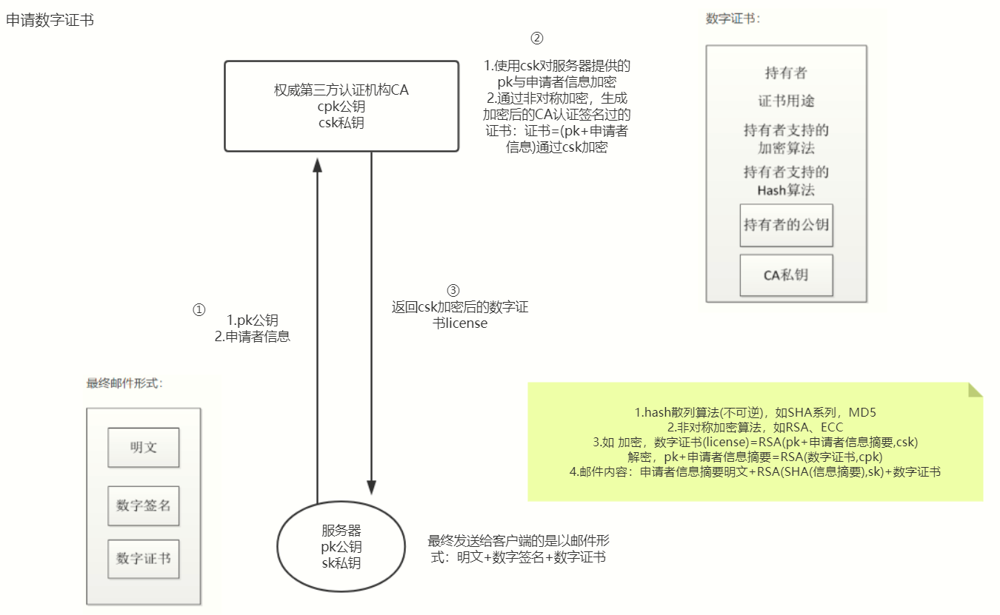

1. 服务器给CA提供申请证书需要的材料：pk公钥+申请者信息，pk与sk是由服务器自己产生的非对称加密的密钥对，sk只有服务器自己知道
2. CA也有自己的cpk与csk密钥对，cpk是公开的csk是私有的，在每个操作系统都有内置了CA机构的cpk公钥以及各种加密算法api，内置公钥是为了避免再次传输密钥导致泄漏
3. CA通过csk对pk+申请者信息进行非对称加密，生成数字证书，再返回给服务器
4. 服务器对自己的申请信息进行hash散列，生成信息摘要，再对信息摘要使用sk进行非对称加密，生成数字签名。最后发送给客户端的是：申请信息明文+数字签名+数字证书

大致过程如上，最终获得的对称密钥是服务器对应每个客户端共有的，对于每个不同的客户端其对称密钥也都不同

<Vssue title="网络 issue" />