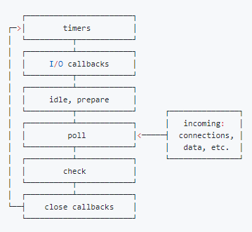
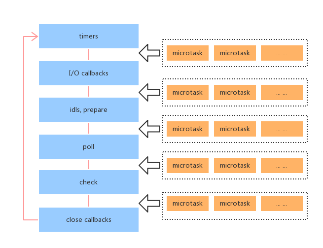
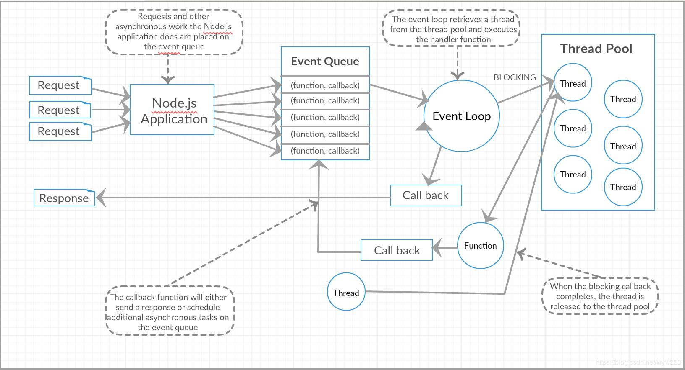

# 深入Node.js事件循环

Node.js运行机制


- 事件循环是 Node.js 处理非阻塞 I/O 操作的机制——尽管 JavaScript 是单线程处理的——当有可能的时候，它们会把操作转移到系统内核中去
- 目前大多数内核都是多线程的，它们可在后台处理多种操作。当其中的一个操作完成的时候，内核通知 Node.js 将适合的回调函数添加到 轮询(poll) 队列中等待时机执行

## 事件循环机制刨析

- 当nodejs启动之后，初始化事件循环，v8引擎将会解析执行js的同步代码，并且可能调用一些异步api，然后由事件循环来处理
- nodejs中的事件循环由libuv库引擎来负责运行
- I/O处理方面使用了自己设计的libuv，libuv是一个基于事件驱动的跨平台抽象层，封装了不同操作系统一些底层特性，对外提供统一的API，事件循环机制也是它里面的实现
- 事件循环是在node主线程上执行的



每个框都是事件循环阶段

每个阶段都有一个FIFO队列来执行回调，当事件循环进入给定的阶段时，它将执行特定于该阶段的任何操作，然后执行该阶段队列中的回调，直到队列为空或达到最大回调数，事件循环将移动到下一阶段

由于这些阶段的操作都可能调度更多的操作和由内核排列在轮询阶段被处理的新事件。处理轮询中排队的事件时，可能造成轮询阶段执行时间过长而导致计时器超时却未及时执行回调

- 事件循环机制的6个阶段：
  - `timers`(定时器阶段)：此阶段执行setTimeout和setInterval定时结束的回调函数
  - `pending callbacks`(i/o回调阶段)：处理一些系统调用错误，比如网络 stream, pipe, tcp, udp通信的错误callback，以及延迟到下一个循环迭代的 I/O 回调
  - `idle, prepare`(闲置、预备阶段)：仅限系统内部使用
  - `poll`(轮询阶段)：获取新的I/O事件，执行与I/O相关的回调(除了setTimeout、setInterval、setImmediate、以及close callbacks的回调，因为这些有特定阶段执行)，其他情况下node将在适当的时候在此阻塞(根据模式)
  - `check`(检测阶段)：执行setImmediate的回调函数
  - `close callbacks`(i/o关闭回调阶段)：一些关闭的回调函数，如：socket.on('close', ...)
- `incoming、connections、data、etc`(外部输入)：外部输入到(poll队列)事件循环中

所有阶段都有属于自己的FIFO回调队列，当队列为空或者执行回调次数超出该阶段的上限，并且`process.nextTick()`的回调队列也为空时，才会进入下一个阶段



`nextTick`不属于任何阶段，而是在每个阶段结束后都会查看`nextTick`队列并执行，直到队列为空

>在每次运行的事件循环之间，Node.js 检查它是否在等待任何异步 I/O 或计时器，如果没有的话，则完全关闭

接下来刨析每个阶段

### timer阶段

- 此阶段执行所有的setTimeout、setInterval回调函数，通常这些定时器都不是精确的，操作系统调度或其它正在运行的回调可能会延迟它们
- 在轮询(poll)阶段控制什么时候去执行setTimeout、setInterval的回调
- 在node v11之前的版本中，每事件循环到达timer阶段都会一次性执行完全部的定时器(这里讲的定时器不包括setImmediate)回调。在node v11之后改成了类似于浏览器的eventLoop机制，每次到达timer阶段只会执行一个定时器回调，然后进入下一阶段

### pending callbacks阶段

- 此阶段对某些系统操作（如 TCP 错误类型）执行回调
- 例如，如果TCP套接字在尝试连接时接收到 ECONNREFUSED，则某些 nix 的系统希望等待报告错误。这将被排队以在pending callbacks阶段执行
- 但是有的情况下，poll io阶段的回调会延迟到下一次循环执行，那么这种回调就是在pending阶段执行的

### poll阶段

在node.js里，任何异步方法（除timer,close,setImmediate之外）完成时，都会将其callback加到poll queue里，并立即执行

- poll轮询阶段是事件循环中的重要阶段，具有以下两个重要功能：
  1. 处理poll队列（poll quenue）的事件(callback)
  2. 执行timers的callback,当到达timers指定的时间时

poll阶段分以下情况分析：

前提：事件循环进入poll阶段

1. 当事件循环中没有被调度的定时器(setTimeout、setInterval)时，也就是说当前事件循环系统中timer没有正在等待被执行的定时器回调
   1. 如果poll队列不为空，事件循环将循环访问回调队列并同步执行它们，直到队列已用尽，或者达到了与系统相关的硬性限制(也就是达到最大回调数)，才会进入下一阶段
   2. 如果poll队列为空时，也有以下情况：
      1. 如果有setImmediate的调度，则事件循环将结束poll阶段，进入check阶段以执行那些被setImmediate调度的回调函数
      2. 如果没有setImmediate的调度，则事件循环将等待其他回调被添加到poll队列中，然后立即执行，此时处于阻塞等待状态
2. 当事件循环中有被调度的定时器回调时，一旦poll队列执行完成后将会检查这些定时器队列，一旦有回调需要执行，将根据定时器类型进入阶段执行
   1. 当timer阶段的定时器队列存在回调时，将按循环顺序进入timers阶段，并执行timer队列
   2. 当check阶段的定时器队列存在回调时，将进入check阶段，并执行check队列，再进入下面的阶段

>这里注意：如果在同时间注册setTimeout(cb,0)和setImmediate()定时器(非i/o回调中)，那么会根据系统性能等因素准备定时器回调，这段准备回调时间受到不同系统和当前环境的影响，这将影响哪个定时器优先完成回调准备，进而影响执行顺序，所以这2种方式的执行顺序受系统影响

node进入eventLoop最开始检查的是timer阶段定时器队列，在poll阶段event loop会有一个检查机制，检查timer队列是否为空，如果timer队列非空，event loop就开始下一轮事件循环，即重新进入到timer阶段

### check阶段

- 此阶段允许在轮询阶段完成后立即执行的回调，如果轮询阶段变为空闲状态，才会继续执行此阶段的回调
- setImmediate实际上是一个在事件循环的单独阶段运行的特殊计时器。它使用一个libuv API来安排回调在poll阶段完成后执行
- 通常，在执行代码时，事件循环最终会命中轮询阶段，在那等待传入连接、请求等，如果回调已使用setImmediate()调度过，并且轮询阶段变为空闲状态，则它将结束此阶段，并继续到检查阶段而不是继续等待轮询事件
- 简言之，poll阶段执行完所有的回调并且check队列有回调时，就会转到check阶段执行setImmediate的回调

### close callbacks阶段

- 如果socket或者handle突然关闭，例如 socket.destroy()，则'close' 事件将在这个阶段发出。否则它将通过 process.nextTick()发出
- 非强制的关闭连接的回调将会使用process.nextTick()来关闭，对于手动关闭的事件回调将会在此阶段执行

### setImmediate对比setTimeout


- `setImmediate(cb)`与`setTimeout(cb,0)`很类似
  - setImmediate() 设计为一旦在当前 轮询 阶段完成， 就执行脚本
  - setTimeout() 在最小阈值（ms 单位）过后运行脚本
- 执行计时器的顺序将根据调用它们的上下文而异。如果二者都从主模块内调用，则计时器将受进程性能的约束（这可能会受到计算机上其他正在运行应用程序的影响）
- 当2者都是从js同步代码中调用，并由v8引擎分发到事件循环系统中时，其2者的执行顺序受计时器影响，2个计时器的顺序是非确定性的，因为它受进程性能的约束
- 但是如果这2个函数都是在一个i/o回调中执行的那么setImmediate总是被优先调用，那是因为poll(i/o回调在poll中执行)之后就是check阶段
- setImmediate()相对于setTimeout()的主要优势是：如果setImmediate在i/o中被调用，那么始终将会在其他定时器之前执行
- 第一次loop进来的时候就有两种情况：
  1. 由于第一次loop前的准备耗时超过1ms，当前的loop->time >=1 ，则uv_run_timer生效，timeout先执行
  2. 由于第一次loop前的准备耗时小于1ms，当前的loop->time = 0，则本次loop中的第一次uv_run_timer不生效，那么io_poll后先执行uv_run_check，即immediate先执行，然后等close cb执行完后，继续执行uv_run_timer

### nextTick

- nextTick属于异步api中的一部分，从技术上讲不是事件循环的一部分，然而它都会在每个事件循环阶段结束后执行
- 当然如果执行到nextTick队列，只要此队列不为空，将会一直执行下去，不会强制跳转到下一阶段，如果你使用递归的调用nextTick将会阻塞事件循环进行，甚至卡死系统，但是不会导致出现 RangeError: 超过 V8 的最大调用堆栈大小
- nextTick在Node.js中算是一个设计理念，使用了它进行的回调函数，将会保证用户的代码优先执行完成，但是又在下一个循环阶段之前运行

这是一个官方例子

```js
const server = net.createServer(() => {}).listen(8080);

server.on('listening', () => {});
```

这里允先绑定端口，之后再使用`on('listening')`来监听绑定事件，其实listening事件触发的回调是被挂载在nextTick中执行，这样一来及时晚绑定的监听事件`on('listening')`也能在nextTick执行之前完成注册，当nextTick执行触发事件时就有对应的监听器了

为什么使用`nextTick()`?

- 允许用户处理错误，清理任何不需要的资源，或者在事件循环继续之前重试请求。
- 有时让回调在栈展开后，但在事件循环继续之前运行的必要

>实质上，这两个名称应该交换，因为 process.nextTick() 比 setImmediate() 触发得更快，但这是过去遗留问题，因此不太可能改变，官方建议开发人员在所有情况下都使用 setImmediate()，因为它更容易理解

### 微任务

- nodejs中也有微任务，其中包括Promise的异步回调以及async、await
- 在nodejs事件循环中，微任务的回调执行穿插在各个阶段中，与nextTick执行时机一致，但与nextTick队列执行顺序上有一些细微的差别
- 尽管严格意义上nextTick不属于事件循环的一部分，但是却参与其中，每当一个阶段结束时，nodejs都会去nextTick队列中获取回调来执行，执行完毕再接着微任务队列执行，如果在这期间添加了新的nextTick或者微任务回调，都将会进一步执行，直到2个队列都为空，再进入下一阶段

看看源码

```js
// 这是nodejs中的一部分源码
do {
  // 取出nextTick队列回调，直到nextTick队列为空
  while (tock = nextTickQueue.shift()) {
    // 获取资源的唯一标识符
    const asyncId = tock[async_id_symbol];
    // 触发异步before钩子
    emitBefore(asyncId, tock[trigger_async_id_symbol]);
    if (async_hook_fields[kDestroy] > 0)
      emitDestroy(asyncId); // 触发异步销destroy钩子
    // 获取nextTick回调
    const callback = tock.callback;
    if (tock.args === undefined)  // 没参数直接调用
      callback();
    else  // 有参数绑定this为undefined并传参
      Reflect.apply(callback, undefined, tock.args);
    // 触发异步after钩子
    emitAfter(asyncId);
  }
  // 执行微任务队列中所有回调
  runMicrotasks();
  // nextTick队列为空，或者执行reject跳出循环
} while (nextTickQueue.head !== null || emitPromiseRejectionWarnings());
```

可以看到每次进来都是先一次性执行nextTick回调，再执行微任务回调，之后再按这个顺序一直执行下去，直到2个队列都为空

所以从这能直接看出nextTick总是先于微任务执行，不严谨的说nextTick也算是个特殊的微任务

nextTick与浏览器事件循环中的requestAnimationFrame有异曲同工之妙

## libuv核心源码刨析

以下是libuv库unix系统事件循环核心函数uv_run注解

[源码](https://github.com/libuv/libuv/blob/v1.x/src/unix/core.c#L365-L414)

[libuv源码](./img/7.png)

```js
// c++核心源码
// /v1.x/src/unix/core.c#L365
int uv_run(uv_loop_t* loop, uv_run_mode mode) {
  int timeout;
  int r;
  int ran_pending;

  /*
    uv__loop_alive返回eventLoop中是否(handles||request||closing_handles != NULL)的结果。
    其中r==0表示不存在需要执行的回调，r!=0表示存在回调
   */
  r = uv__loop_alive(loop);

  // r==0，则更新当前event loop的时间戳
  if (!r)
    uv__update_time(loop);

  // r!=0，说明还有需要执行的回调，stop_flag为停止标志
  // 进入事件循环
  while (r != 0 && loop->stop_flag == 0) {
    // 开始事件循环，更新时间戳
    uv__update_time(loop);
    // 1.进入eventLoop首先执行timers阶段的回调函数
    uv__run_timers(loop);
    // 2.进入pending callbacks阶段，如果pending队列不为空，则返回1，反之返回0
    ran_pending = uv__run_pending(loop);
    // 3.进入idle、prepare阶段
    uv__run_idle(loop);
    uv__run_prepare(loop);
    // 初始化超时时间
    timeout = 0;
    // 如果模式为UV_RUN_ONCE以及pending队列为空，或者模式为UV_RUN_DEFAULT，则timeout设置为最近的一个定时器的超时时间，为了防止在poll阶段阻塞
    if ((mode == UV_RUN_ONCE && !ran_pending) || mode == UV_RUN_DEFAULT)
      timeout = uv_backend_timeout(loop);

    // 进入poll阶段，传入定时器超时时间，timeout为0可以保证其立即跳出uv__io_poll
    uv__io_poll(loop, timeout);
    // 进入check阶段
    uv__run_check(loop);
    // 进入close callbacks阶段，执行结束时的资源释放
    uv__run_closing_handles(loop);

    // 如果是UV_RUN_ONCE，再更新时间戳和执行timer
    if (mode == UV_RUN_ONCE) {
      /* UV_RUN_ONCE implies forward progress: at least one callback must have
       * been invoked when it returns. uv__io_poll() can return without doing
       * I/O (meaning: no callbacks) when its timeout expires - which means we
       * have pending timers that satisfy the forward progress constraint.
       *
       * UV_RUN_NOWAIT makes no guarantees about progress so it's omitted from
       * the check.
       */
      uv__update_time(loop);  // 更新时间戳
      uv__run_timers(loop);   // 再次执行timer
    }

    // 再次检测(handles||request||closing_handles != NULL)的结果
    // 如果为假。则跳出事件循环
    r = uv__loop_alive(loop);
    // 如果是只有一个回调，或者是不进行阻塞等待模式下，直接跳出事件循环
    if (mode == UV_RUN_ONCE || mode == UV_RUN_NOWAIT)
      break;
  }

  /* The if statement lets gcc compile it to a conditional store. Avoids
   * dirtying a cache line.
   */
  if (loop->stop_flag != 0) // 设置事件循环停止标志
    loop->stop_flag = 0;
  // 关闭事件循环，返回(handles||request||closing_handles != NULL)的结果
  return r;
}
```

一轮事件循环结束，如果libuv以UV_RUN_NOWAIT 或 UV_RUN_ONCE模式运行的，则退出事件循环。如果是以UV_RUN_DEFAULT模式运行的并且状态是alive，则开始下一轮循环。否则退出事件循环。

[推荐文章](https://cloud.tencent.com/developer/article/1630793)

## Node.js事件驱动模型



**事件驱动原理：**

Nodejs 会把所有请求和异步操作都放到一个事件队列中，用户的每一个请求就是一个事件。主线程先把普通代码执行完毕，然后会循环事件队列里的函数，如果遇到有IO的操作，nodejs会去线程池里拿出一个线程去执行IO的操作，执行完毕后再把拿到数据的回调函数，放到事件队列的尾部，继续事件循环。

**IO操作**

io操作就是以流的形式，进行的操作，比如网络请求，文件读取写入。io操作也就是input和output的操作。

**阻塞IO**

在调用阻塞io时，应用程序需要等待io完成才能返回结果。
阻塞io的特点：调用之后一定要等到系统内核层面完成所有操作之后，调用才结束。
阻塞io造成CPU等待IO，浪费等待时间，CPU的处理能力不能得到充分利用。

**非阻塞IO**

为了提高性能，内核提供了非阻塞io，非阻塞io跟阻塞io的差别是调用之后会立即返回。
阻塞io完成整个获取数据的过程，而非阻塞io则不带数据直接返回，要获取数据，还要通过文件描述符再次读取。
非阻塞io返回之后，cpu时间片可以用来处理其他事物，此时性能提升非常明显。

nodejs进程架构


## 代码演示

**`process.nextTick()`**

nextTick递归调用

```js
setTimeout(() => {  // 被阻塞，无法执行
  console.log('--------------setTimeout------------')
}, 10)

process.nextTick(function cb() {  // 递归执行，无法让出主线程
  console.log(5)
  process.nextTick(cb)
})
```

此方式将会导致node主线程阻塞，nextTick队列将不会执行完，一直递归执行，导致其他回调无法执行，就好比刚执行完回调又接着来了一个回调，这样下去将会不停歇的执行

对于一次性执行完的队列来说，只要是递归调用自身都有可能导致事件循环无法继续运转，主线程处于阻塞状态

**nextTick与其他微任务的执行顺序**

以Promise为例

```js
let n = 1
const cb = (function () {
  let i = 1
  return () => console.log('nextTick:' + i++)
})()
process.nextTick(cb)
Promise.resolve('Promise:' + n++).then(console.log)
Promise.resolve('Promise:' + n++).then(console.log)
process.nextTick(cb)
// nextTick:1
// nextTick:2
// Promise:1
// Promise:2
```

无论在同步代码中如何交换执行位置，最终都是nextTick先全部执行完，再执行其他微任务

看看嵌套调用的情况

```js
Promise.resolve().then(() => {
  console.log('Promise:1')
  process.nextTick(console.log, 'nextTick:2')
})

process.nextTick(() => {
  console.log('nextTick:1')
  Promise.resolve('Promise:2').then(console.log)
})
// nextTick:1
// Promise:1
// Promise:2
// nextTick:2
```

同步代码中的先后不影响执行结果。从结果可以看出，第一次回调都是nextTick，但是在第一次nextTick异步回调中注册的Promise(2)比第一次执行Promise(1)回调中的nextTick更快执行

看看源码部分

```js
function _tickCallback() {
  let tock;
  do {
    // 取出nextTick队列回调，直到nextTick队列为空
    while (tock = nextTickQueue.shift()) {
      // 获取资源的唯一标识符
      const asyncId = tock[async_id_symbol];
      // 触发异步before钩子
      emitBefore(asyncId, tock[trigger_async_id_symbol]);
      if (async_hook_fields[kDestroy] > 0)
        emitDestroy(asyncId); // 触发异步销destroy钩子
      // 获取nextTick回调
      const callback = tock.callback;
      if (tock.args === undefined)  // 没参数直接调用
        callback();
      else  // 有参数绑定this为undefined并传参
        Reflect.apply(callback, undefined, tock.args);
      // 触发异步after钩子
      emitAfter(asyncId);
    }
    // 执行微任务队列中所有回调
    runMicrotasks();
    // nextTick队列为空，或者执行reject跳出循环
  } while (nextTickQueue.head !== null || emitPromiseRejectionWarnings());
  tickInfo[kHasPromiseRejections] = 0;
}
```

从源码上面也能看出，第一次执行的时候先把所有的nextTick执行完成(内层循环逻辑)，再去执行微任务。如果在执行回调中又添加了新的nextTick或者是微任务，那么还将会是先把nextTick执行完再执行微任务(也就是外层循环逻辑)

根据源码逻辑我们再来测试一下

```js
process.nextTick(console.log, 'nextTick:1')
process.nextTick(console.log, 'nextTick:2')

Promise.resolve('Promise:1').then(console.log)
Promise.resolve('Promise:2').then(console.log)

Promise.resolve().then(() => {
  console.log('Promise:3')
  process.nextTick(() => {
    console.log('nextTick:3')
    Promise.resolve('Promise:5').then(console.log)
    process.nextTick(console.log, 'nextTick:4')
    Promise.resolve('Promise:6').then(console.log)
  })
  Promise.resolve().then(() => {
    console.log('Promise:7')
    process.nextTick(console.log, 'nextTick:5')
    Promise.resolve().then(() => {
      console.log('Promise:8')
      Promise.resolve('Promise:9').then(console.log)
      process.nextTick(console.log, 'nextTick:6')
    })
    process.nextTick(console.log, 'nextTick:8')
  })
  process.nextTick(console.log, 'nextTick:7')
})
Promise.resolve('Promise:4').then(console.log)
process.nextTick(console.log, 'nextTick:9')
```

先不给结果，先按层级划分：

- 第一层：
  - nextTick：nextTick:1、nextTick:2、nextTick:9
  - Promise：Promise:1、Promise:2、Promise:3、Promise:4
- 第二层：
  - nextTick：nextTick:3、nextTick:7
  - Promise：Promise:7
- 第三层：
  - nextTick：nextTick:4、nextTick:5、nextTick:8
  - Promise：Promise:5、Promise:6、Promise:8
- 第四层：
  - nextTick：nextTick:6
  - Promise：Promise:9

排序规则：

- 多次循环逻辑：nextTick=>Promise=>nextTick...交替执行队列回调
- 不同级中：低层级优先于高层级执行，低层优先被注册，FIFO规则执行回调
- 仅当嵌套执行任务时：仅当前执行的队列为空才会跳转到下一个任务队列执行。如果当前回调与当前注册回调任务为同一种任务，则继续执行当前回调类型任务队列，简言之：当前执行nextTick回调且当前回调内又有注册nextTick任务，即在递归注册中将会继续执行相同任务类型的回调(因为当前任务队列未空)，微任务队列同理

根据规则排序为：
nextTick:1、nextTick:2、nextTick:9(nextTick第一轮结束)、Promise:1、Promise:2、Promise:3、Promise:4、Promise:7、Promise:8、Promise:9(Promise第一轮结束)、nextTick:3、nextTick:7、nextTick:5、nextTick:8、nextTick:6、nextTick:4(nextTick第二轮结束)、Promise:5、Promise:6(Promise第二轮结束)。
1、2、9、1、2、3、4、7、8、9、3、7、5、8、6、4、5、6
执行以上回调都在一个阶段的结束，之后进入事件循环下一阶段

现在已经搞清楚nextTick与微任务(包括Promise
与async)回调的执行情况

**setTimeout与setImmediate比较**

看看timer阶段源码

```js
// 找出已经超时的节点，并且执行里面的回调
void uv__run_timers(uv_loop_t* loop) {
  struct heap_node* heap_node;
  uv_timer_t* handle;

  for (;;) {
    // 遍历最小堆，找出当前超时的节点。因为堆的性质是父节点肯定比孩子小。所以如果找到一个节点，他没有超时，则后面的节点也不会超时
    heap_node = heap_min(timer_heap(loop));
    if (heap_node == NULL)
      break;

    handle = container_of(heap_node, uv_timer_t, heap_node);
    // 如果当前节点的时间大于当前时间则返回，说明后面的节点也没有超时
    if (handle->timeout > loop->time)
      break;
    // 移除该计时器节点，重新插入最小堆，如果设置了repeat的话
    uv_timer_stop(handle);
    uv_timer_again(handle);
    // 执行超时回调
    handle->timer_cb(handle);
  }
}
/* src\unix\internal.h */
UV_UNUSED(static void uv__update_time(uv_loop_t* loop)) {
  /* Use a fast time source if available.  We only need millisecond precision.
   */
  // 这里是获取毫秒级的时间戳
  loop->time = uv__hrtime(UV_CLOCK_FAST) / 1000000;
}
/*  */
// 启动一个计时器
int uv_timer_start(
   uv_timer_t* handle,
   uv_timer_cb cb,
   uint64_t timeout,
   uint64_t repeat
 ) {
  uint64_t clamped_timeout;

  // 重新执行start的时候先把之前的停掉
  if (uv__is_active(handle))
    uv_timer_stop(handle);
  // 超时时间，为绝对值
  clamped_timeout = handle->loop->time + timeout;
  // 初始化回调，超时时间，是否重复计时，赋予一个独立无二的id
  handle->timer_cb = cb;
  handle->timeout = clamped_timeout;
  handle->repeat = repeat;
  /* start_id is the second index to be compared in uv__timer_cmp() */
  handle->start_id = handle->loop->timer_counter++;
  // 插入最小堆
  heap_insert(timer_heap(handle->loop),
              (struct heap_node*) &handle->heap_node,
              timer_less_than);
  // 激活该handle
  uv__handle_start(handle);

  return 0;
}
```

其中决定setTimeout与setImmediate谁先执行，取决于以下条件

```js
if (handle->timeout > loop->time)
  break;
// 其中handle->timeout = handle->loop->time + timeout
// loop->time = uv__hrtime(UV_CLOCK_FAST) / 1000000;只精确到ms
```

这是nodejs中Timeout类，每次调用setTimeout都会创建

```js
function Timeout(callback, after, args, isRepeat, isRefed) {
  after *= 1; // Coalesce to number or NaN
  if (!(after >= 1 && after <= TIMEOUT_MAX)) {
    if (after > TIMEOUT_MAX) {
      process.emitWarning(`${after} does not fit into` +
                          ' a 32-bit signed integer.' +
                          '\nTimeout duration was set to 1.',
                          'TimeoutOverflowWarning');
    }
    after = 1; // Schedule on next tick, follows browser behavior
  }
  // 超时时间相对值
  this._idleTimeout = after;
  // 前后指针，用于链表
  this._idlePrev = this;
  this._idleNext = this;
  // 定时器的开始时间
  this._idleStart = null;
  // This must be set to null first to avoid function tracking
  // on the hidden class, revisit in V8 versions after 6.2
  // 超时回调
  this._onTimeout = null;
  this._onTimeout = callback;
  // 执行回调时传入的参数
  this._timerArgs = args;
  // 是否定期执行回调，用于setInterval
  this._repeat = isRepeat ? after : null;
  this._destroyed = false;
  // 激活底层的定时器节点（二叉堆的节点），说明有定时节点需要处理
  if (isRefed)
    incRefCount();
  this[kRefed] = isRefed;

  initAsyncResource(this, 'Timeout');
}
```

以下说明在nodejs中，设置延迟在1ms以内的定时器都将会被默认设置为1ms，也就是精确度为1ms

```js
// 当after延迟小于1时成立
if (!(after >= 1 && after <= TIMEOUT_MAX)) {
  if (after > TIMEOUT_MAX) {
    process.emitWarning(`${after} does not fit into` +
                        ' a 32-bit signed integer.' +
                        '\nTimeout duration was set to 1.',
                        'TimeoutOverflowWarning');
  }
  // 设置为1ms
  after = 1; // Schedule on next tick, follows browser behavior
}
```

`handle->timeout`表示定时器启动时时间加上延迟数，也就是记录的是未来到时的时间戳
`loop->time`表示当前循环时的时间戳
其中`handle->timeout`的`handle->loop->time`是启动定时器时的时间戳，而循环中的`loop->time`是当前循环时间戳，这里可以肯定，定时器是在之前启动的，那么到timer阶段判断的时候显然已经是过去式了，但是由于nodejs中定时器精确到1ms(timeout至少为1ms)，这导致了1ms内的变化不会被感知。那么如果第一次loop前的准备耗时小于1ms则条件成立，直接跳过timer阶段，所以是先执行setImmediate。反之准备耗时不小于1ms，条件不成立，则先执行setTimeout

```js
setImmediate(console.log, 'setImmediate')
setTimeout(console.log, 0, 'setTimeout')
```

以上代码每次运行的结果可能都不同，由当前系统运行情况决定，当然如果是在i/o回调中肯定是setImmediate先执行，因为check阶段紧接poll阶段，而且已经跳过第一次进入loop时对timer阶段的检查了

**nodejs v11中修改了setTimeout使其更像与浏览器**

```js
setTimeout(() => {
  console.log('timer1')
  Promise.resolve().then(function () {
    console.log('promise1')
  })
}, 0)
setTimeout(() => {
  console.log('timer2')
  Promise.resolve().then(function () {
    console.log('promise2')
  })
}, 0)
// 在v11之前的运行结果肯定是：timer1、timer2、promise1、promise2
// 在v11之后运行结果：timer1、promise1、timer2、promise2
// 为什么这样做？当然是为了和浏览器更加趋同，当前的行为在某种程度上是性能的微优化，并且在一定程度上取决于如何实现计时器句柄
```

nodejs v11之后，setTimeout包括setInterval与浏览器中的行为一致，也就是每轮只取一个回调进行执行，之前是清空所有回调，经测试setImmediate会在check阶段全部执行完成，但是执行逻辑为执行一个setImmediate回调就会去检查微任务队列，如果有nextTick或者其他微任务就全部执行完成，之后再执行setImmediate回调，也就是说：执行一个setImmediate回调就会观察一下微任务队列，直到setImmediate队列和微任务队列为空，才进入下一阶段

nodejs v11之前的所有定时器都是一次性执行完成才去执行微任务队列

[nodejs v11修改](https://juejin.im/post/5c3e8d90f265da614274218a)

[nodejs事件循环阶段之定时器](https://cloud.tencent.com/developer/article/1597285)

[nodejs源码解析之事件循环](https://cloud.tencent.com/developer/article/1573956)

## 究极测试

最终来测试一下你对nodejs事件循环的理解程度吧！

```js
process.stdout.write('回车以启动测试！')
process.stdin.on('readable', () => {
  console.log('执行io回调')
  process.nextTick(console.log, 'n1')
  setTimeout(console.log, 0, 's1')
  ;(async function () {
    console.log('p1')
    const res = await Promise.resolve(Promise.resolve('p2'))
    console.log(res)
    setTimeout(console.log, 0, 's2')
    process.nextTick(() => {
      console.log('n2')
      setTimeout(console.log, 0, 's6')
    })

    return Promise.resolve()
  })()
    .then(() => {
      console.log('p3')
      return Promise.resolve()
    })
    .then(() => {
      console.log('p4')
      setTimeout(() => {
        console.log('s3')
        process.nextTick(() => {
          console.log('n3')
          Promise.resolve('p5').then(console.log)
        })
      }, 0)
    })
  setTimeout(console.log, 0, 's4')
  Promise.resolve('p6').then(console.log)
  setImmediate(() => {
    console.log('i1')
    process.nextTick(() => {
      console.log('n4')
      Promise.resolve('p7').then(console.log)
      process.nextTick(() => {
        console.log('n5')
        Promise.resolve('p8').then(console.log)
      })
    })
    setTimeout(console.log, 0, 's5')
  })
  setImmediate(console.log, 'i2')
})
```

我的目的不是想把各位搞晕，而是想真正测试一下自己是否理解node事件循环本质，还希望各位自己先分析一下

node v12.16.1版本测试结果如下

```js
回车以启动测试！
执行io回调
p1
n1
p2
p6
p3
p4
n2
i1
n4
n5
p7
p8
i2
s1
s4
s2
s3
n3
p5
s6
s5
```

node v10.10.0版本测试结果如下

```js
回车以启动测试！
执行io回调
p1
n1
p6
p2
p3
p4
n2
i1
i2
n4
n5
p7
p8
s1
s4
s2
s3
s6
s5
n3
p5
```

不同nodejs版本也会对结果产生影响。。。

<Vssue title="Node.js issue" />