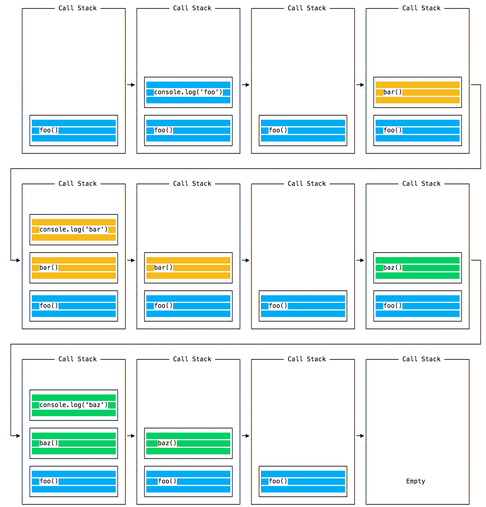

# Node.js基础

- Node.js 是一个开源与跨平台的 JavaScript 运行时环境
- Node.js 是一个基于 Chrome V8 引擎的 JavaScript 运行时环境
- Node.js 在浏览器外运行 V8 JavaScript 引擎

## Node.js与浏览器的区别

- 浏览器=ECMAScript+DOM+BOM
- Node.js=ECMAScript+各种模块(fs、http...)
- JavaScript 发展的速度非常快，但是浏览器发展得慢一些，并且用户的升级速度也慢一些，因此有时在 web 上，不得不使用较旧的 JavaScript / ECMAScript 版本，可以使用 Babel 将代码转换为与 ES5 兼容的代码，再交付给浏览器，但是在 Node.js 中，则不需要这样做
- Node.js 使用 CommonJS 模块系统，而在浏览器中，则还正在实现 ES 模块标准，在实践中，这意味着在 Node.js 中使用 require()，而在浏览器中则使用 import

## V8 JS引擎

- 最著名的javascript引擎v8，由谷歌公司研发，正是v8的高性能使得nodejs成为可能，JavaScript 引擎独立于托管它的浏览器，此关键的特性推动了 Node.js 的兴起
- V8 使用 C++ 编写，并且不断地被改进，它是可移植的，且可运行于 Mac、Windows、Linux 和其他一些系统
- JavaScript 通常被认为是一门解释型的语言，但是现代的 JavaScript 引擎不再只是解释 JavaScript，也会对其进行编译
- JavaScript 是由 V8 在其内部编译的，使用了即时（JIT）编译以加快执行速度
- v8执行代码过程：
  - 将源代码生成AST：源代码进行词法分析和语法分析后生成AST
  - 生成字节码：根据AST生成字节码，字节码通过Ingition转换为机器码才能执行
  - 执行代码：如果一段字节码是第一次执行，解释器会逐行执行；如果在执行字节码过程中发现有HotSpot，JIT即时编译器就会把HotSpot编译为机器码，并保存起来，下次就可以直接使用了，省去了将字节码转换为机器码的过程，提升了执行效率

## 执行和退出

- 命令行执行js代码`node index.js`，退出`ctrl+c`
- 代码退出`process.exit(退出码)`，process是核心模块无需引入
- 结束进程`process.kill(process.pid, 'SIGTERM')`，其中还需要进程pid
  - SIGKILL 是告诉进程要**立即终止**的信号，理想情况下，其行为类似于 process.exit()
  - SIGTERM 是告诉进程要**正常终止**的信号。它是从进程管理者（如 upstart 或 supervisord）等发出的信号

## 读取环境变量

- nodejs中通过`process.env.NODE_ENV`读取当前nodejs运行的环境，默认为开发环境即`'development'`，设置为生产环境，则为`'production'`

## nodejs中的REPL

- REPL 也被称为运行评估打印循环，是一种编程语言环境（主要是控制台窗口），它使用单个表达式作为用户输入，并在执行后将结果返回到控制台，比如在cmd中输入`node`之后进入的环境(2次ctrl+c退出)、浏览器调试工具console中的环境
- REPL是个交互式环境，可以使用tab键快速补全代码
- 输入`对象名.`+`tab`+`tab`(2下tab)可以查看对象下的所有属性和方法，包括global对象(node中的全局对象)
- 如果在某些代码之后输入 _，则会打印最后一次操作的结果
- 以.开头的命令
  - .help: 显示点命令的帮助。
  - .editor: 启用编辑器模式，可以轻松地编写多行 JavaScript 代码。当处于此模式时，按下 ctrl-D 可以运行编写的代码。
  - .break: 当输入多行的表达式时，输入 .break 命令可以中止进一步的输入。相当于按下 ctrl-C。
  - .clear: 将 REPL 上下文重置为空对象，并清除当前正在输入的任何多行的表达式。
  - .load: 加载 JavaScript 文件（相对于当前工作目录）。
  - .save: 将在 REPL 会话中输入的所有内容保存到文件（需指定文件名）。
  - .exit: 退出 REPL（相当于按下两次 ctrl-C）。
- 三个点开头的命令行表示还能继续输入
- 在命令行中可以接收参数`node index.js name=tom`,这样就可以通过`process.argv`来获取所有设置的参数

## 输出到命令行

- `console.log()`与浏览器类似,格式化输出:`console.log('%o', Number)`会打印到 stdout 流
  - %s 会格式化变量为字符串
  - %d 会格式化变量为数字
  - %i 会格式化变量为其整数部分
  - %o 会格式化变量为对象
- 使用转义输出着色`console.log('\x1b[33m%s\x1b[0m', '你好')`，或者直接使用`npm install chalk`

[转义码](https://gist.github.com/iamnewton/8754917)

```js
const chalk = require('chalk')
console.log(chalk.yellow('你好'))
```

- `console.error()`,打印错误信息，会打印到 stderr 流
- `console.clear()`清除命令行内容
- `console.count()`打印计数
- `console.trace()`查看堆栈踪迹信息
- `console.time()、console.timeEnd()`计算耗时
- 在控制台中使用进度条`npm install progress`

```js
const ProgressBar = require('progress')

const bar = new ProgressBar(':bar', { total: 10 })  // 创建一个10等分的进度条
const timer = setInterval(() => {
  bar.tick()  // 进度条前进1份
  if (bar.complete) {
    clearInterval(timer)
  }
}, 100)
```

## node中的cli

- nodejs的cli程序，node7开始提供了readline模块`npm i readline`，支持从cli中读取流

```js
const readline = require('readline')
const cli = readline.createInterface({
  input: process.stdin, // 标准输入
  output: process.stdout, // 标准输出
})
// 当按下回车键时，则它会调用回调函数
cli.question('项目的文件名？', (answer) => {
  console.log(answer) // 输入内容
  readline.close() // 关闭 readline 接口
})
```

如果打算将 CLI 输入提升到更高的水平，则 Inquirer.js 是更优的选择`npm i inquirer`提供了更完整、更抽象的解决方案

```js
const inquirer = require('inquirer')
inquirer
  .prompt({
    type: 'input',
    name: 'name',
    message: '请输入你的名字',
    default: 'me',
  })
  .then((answer) => {
    console.log(answer)
  })
```

## nodejs导入导出模块

- 使用`module.exports = 导出内容`,其中module表示模块本身，exports即导出的内容，当使用`require(模块路径)`导入时，即exports的值就是导入的内容
- 使用`exports.键 = 导出内容`导出内容，其中`exports=module.exports`,简单说exports就是`module.exports`的一个引用，不能被直接赋值，只能通过对象方式导出属性方法

```js
// index.js
module.exports = 'tom'
require('./index.js') //'tom'

// index.js
// exports = { name:'tom' } // 不能使用，exports改变了引用，不再是指向module.exports
exports.name = 'tom' // 没有改变指向空间
require('./index.js').name // 'tom'
```

module.exports公开了它指向的对象，export公开了它指向的对象的属性

## npm包管理器

- npm 是 Node.js 标准的软件包管理器，安装nodejs自带npm
- 目前npm上已经托管了上百万个软件包，周下载量达数十亿次，这使其成为世界上最大的单一语言代码仓库，并且可以确定几乎有可用于一切的软件包
- 它起初是作为下载和管理 Node.js 包依赖的方式，但其现在也已成为前端 JavaScript 中使用的工具
- Yarn 是 npm 的一个替代选择
- npm可以管理项目中的依赖
- 如果项目中有`package.json`文件就能通过`npm install`下载所有依赖的软件包，安装在`node_modules`文件夹下
- npm指令
  - `npm install <package-name>`安装指定的包
  - `npm init`初始化创建`package.json`文件
  - `npm install`安装`package.json`文件中所有依赖，如果没有`package.json`则新建一个
  - `npm search <keyword>`搜索包名
  - `npm uninstall <package-name>`删除包，可附带标志
  - `npm update`更新包，可附带标志，指定更新环境下的包,不会更新主版本
    - 安装`npm install -g npm-check-updates`，再使用`ncu -u`更新所有包到最新版本，包括主版本
  - `npm outdated`查看项目可更新的包
  - `npm list`查看所有安装包的版本，可附带标志
    - `npm list <package-name>`指定包版本
    - `npm list --depth=0`只显示一层依赖包版本信息
    - `npm view [package_name] version`查看npm上指定包的最新版本
    - `npm view [package_name] versions`查看包的所有历史版本
- 一些标志：
  - install缩写用i
  - `--save`缩写`-S`,默认安装方式（npm5之前需要手动），安装并添加条目到 package.json 文件的 dependencies（生产环境依赖，运行需要用到的）
  - `--save-dev`缩写`-D`，安装并添加条目到 package.json 文件的 devDependencies（开发环境依赖，通常是工具）
  - `--global`缩写`-g`，安装到全局环境中，一般是安装工具，所有项目中都能直接使用
- `<package-name>`包名，默认安装最新稳定版
- `<package-name>@next`、`<package-name>@beta`包名，安装最新测试版
- `<package-name>@version`包名，安装包的指定版本，version格式一般为xx.xx.xx
- 以@开头命名形式集中在一个命名空间下面，实现域级管理的包，还有一些工具软件的指定包带有后缀等，比如`css-loader`是webpack的css包，`gulp-sass`是gulp的工具包
- `npm root -g`可以查看全局安装的包路径
- `npx 可执行包名`，使用npx可以直接执行一些可以运行的包
- 使用`require(包名)`,导入`node_modules`中安装的包，require不需要写路径名，直接写包名即可，默认会冒泡的去`node_modules`中查找指定包
- 安装一个包，如果这个包还依赖其他包，那么也会一并根据package中的依赖项进行安装
- 代码中只能引入本地安装的包，不能使用全局安装的包，为了对不同项目包的管理，每个项目尽量单独安装本地包，而对于一些常用的工具包可以使用全局安装，以下是一些常见的全局安装的包：
  - npm
  - create-react-app
  - vue-cli
  - grunt-cli
  - mocha
  - react-native-cli
  - gatsby-cli
  - forever
  - nodemon
- cli(shell)一般都使用全局安装

## package.json

- `package.json` 文件是项目的清单。 它可以做很多完全互不相关的事情。 例如，它是用于工具的配置中心。 它也是 npm 和 yarn 存储所有已安装软件包的名称和版本的地方，此文件必须遵循json格式，不能有注释
- `package.json`中有这些字段
  - name 设置了应用程序/软件包的名称。
  - version 表明了当前的版本。
  - description 是应用程序/软件包的简短描述。
  - main 设置了应用程序的入口点。
  - private 如果设置为 true，则可以防止应用程序/软件包被意外地发布到 npm。
  - scripts 定义了一组可以运行的 node 脚本。
  - dependencies 设置了作为依赖安装的 npm 软件包的列表。
  - devDependencies 设置了作为开发依赖安装的 npm 软件包的列表。
  - engines 设置了此软件包/应用程序在哪个版本的 Node.js 上运行。
  - browserslist 用于告知要支持哪些浏览器（及其版本）。
- 以上所有的这些属性都可被 npm 或其他工具使用
- 还有以下属性
  - author列出软件包的作者名称
  - contributors除作者外，该项目可以有一个或多个贡献者。 此属性是列出他们的数组
  - bugs链接到软件包的问题跟踪器，最常用的是 GitHub 的 issues 页面
  - homepage设置软件包的主页
  - license指定软件包的许可证
  - keywords此属性包含与软件包功能相关的关键字数组
  - repository此属性指定了此程序包仓库所在的位置
- `package.json`当然还能承载一些其他包的配置
- `package.json`也能使用一些说明符来指定不同的依赖版本
- 鉴于使用了 semver（语义版本控制），所有的版本都有 3 个数字，第一个是主版本，第二个是次版本，第三个是补丁版本，具有以下规则：
  - 当进行不兼容的 API 更改时，则升级主版本。
  - 当以向后兼容的方式添加功能时，则升级次版本。
  - 当进行向后兼容的缺陷修复时，则升级补丁版本。
  - `~`: 如果写入的是 〜0.13.0，则只更新补丁版本：即 0.13.1 可以，但 0.14.0 不可以。
  - `^`: 如果写入的是 ^0.13.0，则要更新补丁版本和次版本：即 0.13.1、0.14.0、依此类推。
  - `*`: 如果写入的是 `*`，则表示接受所有的更新，包括主版本升级。
  - `>`: 接受高于指定版本的任何版本。
  - `>=`: 接受等于或高于指定版本的任何版本。
  - `<=`: 接受等于或低于指定版本的任何版本。
  - `<`: 接受低于指定版本的任何版本。
  - `无符号`: 仅接受指定的特定版本。
  - `latest`: 使用可用的最新版本。
  - 还可以使用组合，如`1.0.0 || >=1.1.0 <1.2.0`，即使用 1.0.0 或从 1.1.0 开始但低于 1.2.0 的版本。

## package-lock.json

- npm在5中加入此文件，该文件旨在跟踪被安装的每个软件包的**确切版本**，以便产品可以以相同的方式被 100％ 复制（即使软件包的维护者更新了软件包）
- 如果项目有`package-lock.json`文件，那么在安装的时候会按照文件中指定的版本安装依赖，这样就能复刻原项目的依赖环境
- 当我们上传项目时不会对`node_modules`进行上传，只需要上传`package.json`和`package-lock.json`，之后执行`npm install`就能还原原来的项目
- 在`package.json`中也许不会精确到指定版本，而`package-lock.json`却记录了项目使用的确切版本，这样就能无缝还原项目，而不会受依赖版本的影响
- 当运行 `npm update` 时，`package-lock.json` 文件中的依赖的版本会被更新
- `package-lock.json`文件中的依赖会按字母顺序排序，其中
  - version 字段，表示安装版本
  - resolved 字段，指向软件包位置
  - integrity 字符串，用于校验软件包是否官方

## Node.js包运行器npx

- 从 npm 的 5.2 版本支持npx命令
- npx 可以运行使用 Node.js 构建并通过 npm 仓库发布的代码
- `npx commandname`指令，运行在`node_modules`中的引用，会一步步寻找本地和全局下的可执行包
- 可以直接运行其他工具cli命令，如`npx vue create app`
- 使用指定node版本运行js，可以不使用nvm切换版本，`npx node@10 index.js`
- 也可以直接运行URL中的代码，如`npx https://github.com/1015355299/XXXX/index.js`

## Node.js事件循环

- nodejs在单线程上运行，事件循环解释了Node.js如何异步和具有非阻塞I/O
- nodejs的单线程简化编程方式，而不需要担心并发问题，只要关心如何避免阻塞
- 任何花费太长时间才能将控制权返回到事件循环的JavaScript代码，都将阻止页面中任何JavaScript代码的执行，JavaScript中几乎所有的I/O原语都是非阻塞的，简单说js中的io不会阻塞，而js代码本身是有可能阻塞事件循环

### 调用栈

- 事件循环不断检查调用堆栈，以查看是否需要运行任何函数
- 每次迭代中的事件循环都会查看调用堆栈中是否存在某些东西,如果有就执行它，直到调用堆栈为空
- 与浏览器中的调用栈类似



- 对于一些异步事件的回调，会进入消息队列，比如setTimeout不会占用node的主线程，而是会开辟新的定时器线程，等到结束把回调添加到消息队列中，等待主线程调用
- 事件循环将优先级赋予调用堆栈，它首先处理在调用堆栈中找到的所有内容，一旦其中没有任何内容，便开始处理消息队列中的内容
- es6中引入微任务队列，其回调时机位于同步任务之后，消息队列之前，使用promise以及async、await的回调将会早于消息队列的回调，但是在同一次的事件循环中的异步任务总是晚于同步任务

### process.nextTick()

- nodejs的事件循环的一个重要部分`process.nextTick()`,这使它异于浏览器的事件循环
- 每次事件循环进行一次完整的行程时，我们将其称为一个tick，把一个回调函数传给`process.nextTick()`，引擎将会在每个阶段最后，以及下一个tick阶段之前执行这个回调函数
- 在事件循环中，使用此方式注册的回调函数，会早于同时注册的其他异步任务执行，简言之，在一个事件循环阶段中注册的异步任务回调会在下一个事件循环阶段时执行，而使用`process.nextTick()`注册的回调将会在此次事件循环阶段结束时执行所有通过此方式注册的回调函数
- 当你需要确保，在下一个事件循环阶段之前就执行此异步回调，那么你应该使用`process.nextTick(()=>{})`

### setImmediate()

- `setImmediate()`将会告诉引擎尽快的执行异步回调，与`setTimeout(()=>{},0)`类似,但是2者的执行顺序取决于各种因素

### setTimeout()与setInterval()

- nodejs中的定时器功能属于内置api，而浏览器中的多定时器功能由各个厂家来实现，多少会有差异，但对于nodejs来说是唯一的
- 2者与chrome中的定时器基本没有区别，用法也相同，这里不赘述

### callback

- 回调一般多用于异步操作，当异步任务执行完成之后，将会执行回调函数，这样我们就能在回调中获取异步的数据，简言之，就是执行一些事情之后的反馈
- nodejs中处理回调的方式通常是使用回调的第一个参数作为error对象，也就是error-first准则，如果没有错误则error参数将是null
- 多层回调会产生回调地狱，这对于我们来说并不友好，正好es6中的promise使用链式操作来代替了回调，以及es2017中的async、await的同步写法来代替异步回调产生的回调地狱

### Promise()、async、await

- nodejs中的Promise与浏览器无异，同样还支持Promise.all()以及Promise.race()，也是优先于宏任务队列中的异步回调
- async与await的实现也无异
- 对于调试来说async、await优于Promise()
- 这些异步微任务的回调也是与nextTick一样，在每个事件阶段结束后调用，但是优先级低于nextTick

```js
const obj = {}
obj.id = setInterval(({ id }) => {
  console.log('setInterval')
  clearInterval(id)
},0,obj)
setImmediate(console.log, 'setImmediate')
setTimeout(console.log, 0, 'setTimeout')
process.nextTick(console.log, 'nextTick')
new Promise((resolve, reject) => {
  console.log('sync')
  resolve('Promise')
}).then(console.log)
// sync
// nextTick
// Promise
// setTimeout
// setImmediate
// setInterval
```

可以看出nextTick执行时机仅次于同步，且在所有其他异步之前

### 异步优先级

- 所有同步代码都优先于异步执行，这是毋庸置疑的，那么我们就对比一下各种异步的执行时机以及优先级
  
#### nextTick与微任务

- nextTick是在下一次事件阶段开始前执行的
- 微任务包括，Promise、async、await的异步回调，是优先于宏任务队列，但是滞后于nextTick
- 用代码验证一下

```js
process.nextTick(console.log, 'nextTick-1')

;(async function foo() {
  const res = await 'async'
  console.log(res)
})()

new Promise((resolve, reject) => {
  console.log('sync')
  resolve('Promise')
}).then(console.log)

process.nextTick(console.log, 'nextTick-2')
// sync
// nextTick-1
// nextTick-2
// async
// Promise
```

可以对比出nextTick优先于微任务

再看看nextTick中穿插微任务，以及微任务中穿插nextTick，其中async与Promise同属微任务，这里就拿一种来测试

```js
process.nextTick(() => {
  new Promise((resolve, reject) => {
    console.log('sync-2')
    resolve('Promise-1')
  }).then(console.log)
  console.log('nextTick-1')
})

new Promise((resolve, reject) => {
  console.log('sync-1')
  resolve('Promise-2')
}).then((data) => {
  process.nextTick(console.log, 'nextTick-2')
  console.log(data)
})

// sync-1
// sync-2
// nextTick-1
// Promise-2
// Promise-1
// nextTick-2
```

其执行顺序为：

1. sync-1(同步代码，之后触发Promise-2)
2. sync-2(nextTick-1回调中，之后触发Promise-1)
3. nextTick-1(nextTick-1回调中)
4. Promise-2(Promise-2回调中，注册第二个nextTick)
5. Promise-1(Promise-2回调中，Promise结束)
6. nextTick-2(nextTick-2回调中)

结论：nextTick优先于微任务，且同循环中注册的nextTick回调、微任务回调，其中nextTick回调在一次事件阶段结束时先执行，之后再执行微任务

## 事件触发器

- nodejs同浏览器，也有自己的一套事件机制，使用events模块，注册、触发事件

```js
const EventEmitter = require('events')
const eventEmitter = new EventEmitter() // 创建应该事件实例
// 使用on注册事件
eventEmitter.on('start', (data) => {
  console.log(data)  // 触发start
})
// emit触发事件，并传入参数
eventEmitter.emit('start', '触发start')
eventEmitter.emit('start', '触发start') // 可多次触发
```

只触发一次的事件(一次性事件)

```js
// 使用once注册一次性事件，触发完即刻销毁
eventEmitter.once('start', (data) => {
  console.log(data)  // 触发start
})
// emit触发事件，并传入参数
eventEmitter.emit('start', '触发start')
eventEmitter.emit('start', '触发start') // 无效
```

移除事件

```js
const EventEmitter = require('events')
const eventEmitter = new EventEmitter() // 创建应该事件实例

const cb = (data) => {
  console.log(data)
}
// 注册事件
eventEmitter.on('start', cb)
eventEmitter.on('start', ()=>{console.log('fff');}) // 只能用移除全部事件的方法
eventEmitter.once('run', cb)

// 解除指定回调的事件，需传入对应的回调函数
eventEmitter.off('start',cb)
eventEmitter.removeListener('run',cb)

// 解除全部事件
eventEmitter.removeAllListeners()
// 解除start的所有事件
eventEmitter.removeAllListeners(['start'])
```

对于不同的注册方式，可以有不同的解除方式

1. off和removeListener可以移除同一个事件名下不同的回调事件
2. removeAllListeners和removeAllListeners会直接移除所有注册的事件
3. 对于传入函数名的注册方式可以使用1中的方式来解除事件，如果在解除事件时无法使用回调函数来解除指定事件，那么只能使用2中的方式来解除所有的事件回调
4. 推荐使用传入函数名方式的注册方法，这样，在你取消事件时可以针对性的解除

## 创建HTTP服务器

- 使用http模块，就可以创建一个简单的服务器

```js
const http = require('http')
//创建服务器
const server = http.createServer((req, res) => {
  res.statusCode = 200 // 返回的状态码
  res.setHeader('content-type', 'text/plain') // 设置响应头
  res.end('ok') // 结束响应，并且返回数据
})
// 开启监听端口
server.listen(8888, () => {
  console.log('开启监听8888')
})
```

- 一个请求（一个http.IncomingMessage对象）对象，request提供请求的详细信息。通过它，我们访问请求标头和请求数据
- 一个响应（一个http.ServerResponse对象）对象，response 用于填充我们要返回给客户端的数据

## 发送GET、POST请求

- 使用https模块发送http请求

get请求

```js
const https = require('https')
// 请求配置
const options = {
  hostname:'baidu.com',
  port: 443,
  path: '/',
  method:'GET'
}
// 发起请求
const req = https.request(options, res => {
  console.log(`statusCode: ${res.statusCode}`)
  res.on('data', d => { // 响应接收
    process.stdout.write(d)
  })
})
// 错误回调
req.on('error', error => {
  console.error(error)
})
// 结束请求
req.end()
```

post请求

```js
const https = require('https')
// 请求数据
const data = JSON.stringify({
  name: 'tom',
  age: 18,
})
// 请求配置
const options = {
  hostname: 'baidu.com',
  port: 443,
  path: '/',
  method: 'POST',
  headers: {
    'content-type': 'text/plain',
    'Content-Length': data.length,
  },
}
// 发起请求
const req = https.request(options, (res) => {
  console.log(`statusCode: ${res.statusCode}`)
  res.on('data', (d) => { // 响应接收
    process.stdout.write(d) // 输出数据到控制台
  })
})
// 错误回调
req.on('error', (error) => {
  console.error(error)
})
// 发送数据
req.write(data)
// 结束请求
req.end()
```

post请求对请求头部字段有一定的要求，还需要对发送的数据进行序列化

也可以直接使用axios第三方库，其对http模块做了更好的优化，当然，前提是你得先安装它

```js
const axios=require('axios')
axios
.post('https://www.baidu.com',{name:'tom'})
.then(data=>{ // 接收数据
  console.log(data);
})
.catch(console.log)
```

## Node.js中的文件操作

- node给我们提供了操作文件的接口，使用fs模块就能对文件进行操作
- 在操作文件前我们需要先获取文件描述符，这样我们才能进一步操作文件内容

### 打开文件方式

- 针对不同的操作，打开文件拥有多种模式
- 使用`fs.open()`打开文件，当然也有同步方式`fs.openSync()`。几乎所有的文件操作都有同步方式，不过我们一般使用异步
- 其中需要使用标志，来打开不同模式
  - r+ 打开文件进行读写
  - w+打开文件以进行读写，将流放在文件的开头。如果不存在则创建文件
  - a打开要写入的文件，将流放在文件末尾。如果不存在则创建文件
  - a+打开文件进行读写，将流放在文件末尾。如果不存在则创建文件

获取文件描述符

```js
const fs = require('fs')
// 获取文件描述符
fs.open('./http.js', 'a', (err, fd) => {
  console.log(fd) // 3
})
```

同步处理

```js
const fs = require('fs')
try {
  const fd = fs.openSync('./http.js')
} catch (err) { // 处理错误
  console.error(err)
}
```

### 查看文件属性

- 使用stat方法查看文件的具体信息

```js
const fs = require('fs')
// 获取文件属性
const stats = fs.stat('./http.js',(err,stats)=>{
  console.log(stats);
})
// Stats {
//   dev: 1115740208,
//   mode: 33206,
//   nlink: 1,
//   uid: 0,
//   gid: 0,
//   rdev: 0,
//   blksize: 4096,
//   ino: 1407374884239022,
//   size: 277,
//   blocks: 0,
//   atimeMs: 1594960232944.9097,
//   mtimeMs: 1594960232944.9097,
//   ctimeMs: 1594960232944.9097,
//   birthtimeMs: 1594720973767.0852,
//   atime: 2020-07-17T04:30:32.945Z,
//   mtime: 2020-07-17T04:30:32.945Z,
//   ctime: 2020-07-17T04:30:32.945Z,
//   birthtime: 2020-07-14T10:02:53.767Z
// }
```

[具体属性查看](http://nodejs.cn/api/fs.html#fs_class_fs_stats)

- 判断文件`stats.isFile()`
- 判断目录`stats.isDirectory()`
- 判断符号链接`stats.isSymbolicLink()`

### 文件路径

- 在不同的操作系统上路径的描述方式有所不同，在window上目录是以`\`来分割的，而在其他多数系统上是以`/`分割，我们可能在window上开发项目，然后部署到Linux服务器上，这样一来我们就无法使用写死的路径
- 不过nodejs中提供了path模块，来对路径进行一系列操作，以兼容各种操作系统

```js
const path = require('path')
// 获取目录名(父文件夹名)
const dirname = path.dirname('./http.js') // .

// 获取文件后缀名
const extname = path.extname('./http.js') // .js

// 获取文件名，包含后缀
const basename = path.basename('./http.js') // http.js

// 可以通过指定第二个参数来获取不带扩展名的文件名
// const name = path.basename('./http.js','.js') // http
const name = path.basename('./http.js', extname) // http
```

#### 连接路径

- 使用join来连接多个路径

```js
const path = require('path')
const basename = path.basename('./http.js')
const dir = path.join(__dirname,basename)  
console.log(dir) // E:\desk\testcode\nodejs\nodejs\http.js
```

#### 计算路径

- 使用resolve来计算路径，在webpack是不是经常见到呢？

```js
const path = require('path')
// 计算文件的绝对路径
path.resolve('index.js') // E:\desk\testcode\nodejs\nodejs\index.js
// 将前面的参数作为后面的基础路径
path.resolve('src','index.js') // E:\desk\testcode\nodejs\nodejs\src\index.js
// 以/开头的将会认为是绝对路径
path.resolve('/src','index.js') // E:\src\index.js
```

normalize

```js
// 可以解析.或者..还有//的路径
path.normalize(__dirname+'/../nodejs/index.js') //E:\desk\testcode\nodejs\nodejs\index.js
```

这2种方式不会检测路径是否存在，只是会计算出最终的绝对路径

- `__dirname`变量，获得当前文件所在目录的完整目录名
- `__filename`变量，获取当前模块文件的带有完整绝对路径的文件名

#### path其他apis

- path.isAbsolute(),判断逻辑是否为绝对路径
- path.relative(),根据当前工作目录返回从第一个路径到第二个路径的相对路径
- path.parse(),用组成它的段分析对象的路径，根据参数路径，分析生成组成对象

```js
const path = require('path')
// 判断绝对路径
path.isAbsolute('/') // true
// 计算路径差值
path.relative('/nodejs', '/test/index.js') // 路径差 ..\test\index.js
// 解析路径组成
path.parse('/nodejs/src/index.js')
// {
//   root: '/',
//   dir: '/nodejs/src',
//   base: 'index.js',
//   ext: '.js',
//   name: 'index'
// }
```

### 读取文件

- 使用fs模块对文件进行读写操作

#### 简单读写

- 简单读写适合小文件
- fs.writeFile简单写入，可以指定写入模式，默认为替换文件内容
- fs.readFile简单读取，需要文件编码

```js
const fs = require('fs')
// 写入内容,使用a模式
fs.writeFile('./index.js', '写入的内容', { flag: 'a' }, (err) => {
  console.log(err)
})
// 读取文件，utf8编码方式读取
fs.readFile('./index.js', 'utf8', (err, data) => {
  console.log(data) // 读取的数据
})
```

使用fs.appendFile直接添加内容到文件末尾

`fs.appendFile('./index.js','添加的内容',console.log)`

这些方式都是一次性执行文件操作，对于大文件来说性能不佳，在这种情况下建议使用流的方式进行读写操作

### 处理文件夹

- `fs.access()`判断文件夹是否存在或者nodejs是否有权限使用
- `fs.existsSync()`判断文件夹是否存在，一般为同步方式

```js
const fs=require('fs')
fs.access('../nodejs',console.log) // 如果报错则判断为假
fs.existsSync('../nodejs')
```

#### 创建、读取、删除、重命名文件夹

```js
const fs = require('fs')
// 创建文件夹，
fs.mkdir('../nodejs', console.error)
// 读取文件夹文件列表
fs.readdir('../nodejs', (err, files) => {
  console.log(files) // 读取全部文件夹内的文件/文件夹名
})
// 文件夹重命名
fs.rename('../nodejs', 'nodejs', console.error)
// 删除文件夹
fs.rmdir('../nodejs', console.error)
```

- 使用第三方模块`fs-extra`可以更好的操作文件夹，当然也需要先安装
- 其支持回调、链式、async的编程方式

```js
const fs = require('fs-extra')
const folder = '/Users/joe'
fs.remove(folder, err => {
  console.error(err)
})
```

#### 文件系统模块apis

- fs.access()：检查文件是否存在，Node.js可以使用其权限访问它
- fs.appendFile()：将数据附加到文件。如果文件不存在，则创建它
- fs.chmod()：更改通过传递的文件名指定的文件的权限。相关阅读：fs.lchmod()，fs.fchmod()
- fs.chown()：更改由传递的文件名指定的文件的所有者和组。相关阅读：fs.fchown()，fs.lchown()
- fs.close()：关闭文件描述符
- fs.copyFile()：复制文件
- fs.createReadStream()：创建可读的文件流
- fs.createWriteStream()：创建可写文件流
- fs.link()：创建指向文件的新硬链接
- fs.mkdir()： 新建一个文件夹
- fs.mkdtemp()：创建一个临时目录
- fs.open()：设置文件模式
- fs.readdir()：读取目录的内容
- fs.readFile()：读取文件的内容。有关：fs.read()
- fs.readlink()：读取符号链接的值
- fs.realpath()：将相对文件路径指针（.，..）解析为完整路径
- fs.rename()：重命名文件或文件夹
- fs.rmdir()：删除文件夹
- fs.stat()：返回由传递的文件名标识的文件的状态。相关阅读：fs.fstat()，fs.lstat()
- fs.symlink()：创建指向文件的新符号链接
- fs.truncate()：将传递的文件名标识的文件截断为指定的长度。有关：fs.ftruncate()
- fs.unlink()：删除文件或符号链接
- fs.unwatchFile()：停止监视文件上的更改
- fs.utimes()：更改通过传递的文件名标识的文件的时间戳。有关：fs.futimes()
- fs.watchFile()：开始监视文件上的更改。有关：fs.watch()
- fs.writeFile()：将数据写入文件。有关：fs.write()

当然这些api默认都是异步的，如果想要使用同步方式只需在方法名后追加Sync即可，而且同步方式需要使用try..catch方式捕获错误，还会阻塞主线程执行

## Node.js操作系统模块

- nodejs支持底层操作系统功能，os模块可用于从底层操作系统和程序运行所在的计算机上检索信息并与其进行交互
- 这里列出一些os模块方法
- os.arch()，返回字符串标识底层架构，比如arm，x64，arm64
- os.cpus()，返回有关系统上可用CPU的信息
- os.endianness()，返回BE或LE取决于Node.js是使用Big Endian还是Little Endian编译的
- os.freemem()，返回代表系统中可用内存的字节数
- os.homedir()，将路径返回到当前用户的主目录
- os.hostname()，返回主机名
- os.loadavg()，返回操作系统对平均负载的计算，仅在Linux和macOS上返回有意义的值
- os.networkInterfaces()，返回系统上可用网络接口的详细信息
- os.platform()，返回为Node.js编译的平台
- os.release()，返回标识操作系统版本号的字符串
- os.tmpdir()，返回指定的临时文件夹的路径
- os.totalmem()，返回表示系统中可用总内存的字节数
- os.type()，标识操作系统
- os.uptime()，返回自上次重新启动以来计算机一直在运行的秒数
- os.userInfo()，返回关于当前有效用户的信息
- 还有一些常量标识
- 这些多是用来获取操作系统的一些信息

[官方api文档](http://nodejs.cn/api/os.html#os_os_version)

## Node.js事件模块apis

events模块提供了EventEmitter类，这是在Node.js中处理事件的关键

- emitter.addListener()，添加事件，与on方式相同
- emitter.emit()，触发事件
- emitter.eventNames()，返回一个字符串数组，这些字符串表示在当前EventEmitter对象上注册的事件
- emitter.getMaxListeners()，获取一个事件名最大的监听器数量，默认为10，通过使用setMaxListeners()来增加或降低
- emitter.listenerCount()，获取作为参数传递的事件的侦听器计数
- emitter.listeners()，获取作为参数传递的事件的侦听器数组
- emitter.off()，同emitter.removeListener()
- emitter.on()，同emitter.addListener()
- emitter.once()，添加一次性事件
- emitter.prependListener()，使用它添加的事件将会排列在所有已经存在的监听器之前以及调用
- emitter.prependOnceListener()，使用它添加的事件将会排列在所有已经存在的监听器之前以及调用，针对于一次性添加的事件
- emitter.removeAllListeners()，删除EventEmitter对象侦听特定事件的所有侦听器
- emitter.removeListener()，根据回调，删除特定的侦听器
- emitter.setMaxListeners()，设置一个可以添加到EventEmitter对象的侦听器的最大数量，默认为10

## Node.js的http模块apis

http模块是nodejs网络核心模块

- Properties，属性
  - http.METHODS，此属性列出了所有受支持的HTTP方法
  - http.STATUS_CODES，此属性列出了所有HTTP状态代码及其描述
  - http.globalAgent，指向Agent对象的全局实例，该实例是http.Agent类的实例
- Methods，方法
  - http.createServer()，返回http.Server该类的新实例
  - http.request()，向服务器发出HTTP请求，创建http.ClientRequest类的实例
  - http.get()，与相似http.request()，但是自动将HTTP方法设置为GET，并req.end()自动调用
- Classes，类
  - http.Agent，创建http.Agent类的全局实例，以管理HTTP客户端（Node.js HTTP网络的关键组成部分）的连接持久性和重用
  - http.ClientRequest，调用http.request()或http.get()时创建一个对象
  - http.Server，使用http.createServer()创建新服务器时，实例化并返回的类，拥有一些方法
    - close() 阻止服务器接受新连接
    - listen() 启动HTTP服务器并监听连接
  - http.ServerResponse，作为request触发回调的第二个参数res，拥有一下方法
    - getHeaderNames() 获取已设置的HTTP标头的名称列表
    - getHeaders() 获取已设置的HTTP标头的副本
    - setHeader('headername', value) 设置HTTP标头值
    - getHeader('headername') 获取已设置的HTTP标头
    - removeHeader('headername') 删除已经设置的HTTP标头
    - hasHeader('headername') 如果响应已设置该标头，则返回true
    - headersSent() 如果标头已经发送到客户端，则返回true
  - http.IncomingMessage，它可以用来访问响应，由于http.IncomingMessage实现了Readable Stream接口，因此使用流访问数据

## buffer

- buffer缓冲区，是内存区域，buffer在v8中表示外部分配的固定大小的内存块，无法调整大小
- 可以把buffer视为整数数组，其中的整数表示一个字节
- 使用buffer就是为了处理二进制数据
- 缓冲区与流紧密相连。当流处理器接收数据的速度快于其消化速度时，它将数据放入缓冲区
- buffer中的数据是根据Unicode编码的16进制数表示

### 使用buffer

- 使用Buffer.from()，参数可以是array、arrayBuffer、buffer、string，将会根据传入的数据创建对应的buffer空间
- 使用Buffer.alloc()，根据参数来创建指定大小的buffer，以字节为单位，并且将会初始化数据为00
- 使用Buffer.allocUnsafe()，同上，但不会初始化数据，之前内存中的数据，依然存在，当然这样虽然不太安全，但是性能更好

```js
// 根据传入数组创建对应大小的buffer，并且使用unicode编码形式
const buffer1 = Buffer.from([1, 2, 3]) // <buffer 01 02 03>
// 创建4个字节大小的buffer，并且初始化为00
const buffer2 = Buffer.alloc(4)
// 写入数据
buffer2.write('abcd') // <Buffer 61 62 63 64> 使用Unicode编码
// 创建指定大小的buffer，但是不初始化为00
const buffer3 = Buffer.allocUnsafe(4) // <Buffer c0 6b 63 3d> 没初始化
// 输出buffer全部内容
buffer2.toString() // abcd
// 获取长度
buffer3.length // 4
// 像数组方式使用，索引写入数据，注意数据进制，这里的99表示10进制99
buffer2[0] = 99 // 99=>63=>c
console.log(buffer2.toString()) //cbcd
// 复制buffer
buffer2.copy(buffer3) // 从buffer2复制到buffer3中，当然也可以传入更多参数来设置复制位置
console.log(buffer3) // <Buffer 63 62 63 64>
// buffer切片，原buffer改变同样会影响切片的buffer数据
const slice1 = buffer2.slice(0, 2) // 开始位置0，结束位置2(不包含)，切片
console.log(slice1) // <Buffer 63 62>
```

## Node.js中的流

- 流是支持Node.js应用程序的基本概念之一
- 它们是一种以有效方式处理读/写文件，网络通信或任何类型的端到端信息交换的方式
- 例如，以传统方式，当您告诉程序读取文件时，会将文件从头到尾读入内存，然后进行处理
- 使用流，您可以逐段读取它，在不将其全部保存在内存中的情况下处理其内容
- stream模块提供了构建所有流API的基础，所有流都是EventEmitter的实例
- 流有一下2个主要优点
  - 内存效率：您无需先在内存中加载大量数据，然后再进行处理
  - 时间效率：拥有数据后立即开始处理数据所需的时间更少，而不必等到整个数据有效负载就可以开始使用

不使用流的方式返回数据

```js
const fs = require('fs')
const http = require('http')
http
  .createServer((req, res) => {
    // 一次性读取文件，并返回
    fs.readFile('./index.html', (err, data) => {
      res.end(data)
    })
  })
  .listen(8888)
```

使用流的方式

```js
const fs = require('fs')
const http = require('http')
http
  .createServer((req, res) => {
    // 创建读取流
    const stream = fs.createReadStream('./index.html')
    stream.pipe(res) // 使用管道返回数据
  })
  .listen(8888)
```

当传输大文件时就能明显体现出流的优势

### pipe管道

- 创建流之后，可以使用pipe将流进行传输，把源流传输到目标流中，并且返回目标流，这样可以支持链式操作

```js
// 创建读取流
fs.createReadStream('./index.html')
.pipe(dest1)
.pipe(dest2)
```

### 流apis

- process.stdin 返回连接到stdin的流
- process.stdout 返回连接到stdout的流
- process.stderr 返回连接到stderr的流
- fs.createReadStream() 创建文件的可读流
- fs.createWriteStream() 创建一个可写的文件流
- net.connect() 启动基于流的连接
- http.request() 返回http.ClientRequest类的实例，该实例是可写流
- zlib.createGzip() 使用gzip（一种压缩算法）将数据压缩到流中
- zlib.createGunzip() 创建gzip流。
- zlib.createDeflate() 使用deflate（压缩算法）将数据压缩到流中
- zlib.createInflate() 创建Inflate流

### 流的类型

- Readable：您可以通过管道传输而不是通过管道传输的流（您可以接收数据，但不能向其发送数据）。当您将数据推送到可读流中时，将对其进行缓冲，直到使用者开始读取数据为止。
Writable：您可以通过管道传输而不是从管道传输的流（您可以发送数据，但不能接收数据）
- Duplex：您可以同时通过管道传输和传输的流，基本上是可读流和可写流的组合
- Transform：转换流类似于双工，但输出是其输入的转换

### 创建可读流

```js
const Stream = require('stream')
// // 创建可读流
// const readableStream=new Stream.Readable()
// // 实现读的方法
// readableStream._read=()=>{}
// 也可直接传入对象
const readableStream = new Stream.Readable({
  read() {},  // 读方法
})
// 向流中输入数据
readableStream.push('a')
// 使用事件来监听可读流
readableStream.on('readable', () => {
  console.log(readableStream.read())
})
```

这样就创建可读流，数据通过push来添加

### 创建可写流

```js
const Stream = require('stream')
// 创建可写流
const writableStream = new Stream.Writable()
// 实现写入方法chunk为每次数据，encoding为数据编码，调用next可继续执行操作
writableStream._write = (chunk, encoding, next) => {
  console.log(chunk.toString())
  next()
}
// 把控制台中的输入流传输到writableStream中
process.stdin.pipe(writableStream)
```

创建可写流之后，就可以把其他可读流中的数据写入到可写流中，并在`_write`方法中获取每次读取的数据

### 从可读流中读取数据、从可写流中写入数据

- 从可读流中读取数据到可写流中

```js
const Stream = require('stream')

const readableStream = new Stream.Readable({
  read() {},
})
readableStream.push('a')
readableStream.push('b')

const writableStream = new Stream.Writable({
  write(chunk, encoding, next) {
    // 由于流中的数据为buffer，需要转换显示
    console.log(chunk.toString()) // a 、 b
    next()
  },
})
// 可读流通过管道流入可写流中
readableStream.pipe(writableStream)
// 结束可写流
writableStream.end()
```

- 从可写流中写入数据

```js
const Stream=require('stream')

const writableStream = new Stream.Writable({
  write(chunk, encoding, next) {
    // 由于流中的数据为buffer，需要转换显示
    console.log(chunk.toString()) // a 、 b
    next()
  },
})
// 向可写流中写入数据
writableStream.write('a',console.error)
writableStream.write('b',console.error)
```

使用`writableStream.write()`写入数据到可写流中

## Node.js中开发、生产环境

- nodejs始终默认在开发环境下运行，不过我们可以通过设置`NODE_ENV=production`，来改变其运行环境
- 通常使用`export NODE_ENV=production`指令来配置环境，但是此方式在系统重启之后失效
- 可以把此命令存放在文件中，需要的时候运行即可
- 也可以把配置环境命令`NODE_ENV=production node app.js`写入到应用初始化之前，这样初始化时就能配置好运行的环境
- 配置为`production`由一下特点
  - 日志记录保持在最低水平
  - 发生更多的缓存级别以优化性能

可以在代码中，根据不同环境执行不同代码

```js
// 开发环境
if (process.env.NODE_ENV === "development") {
  //...
}
// 生产环境
if (process.env.NODE_ENV === "production") {
  //...
}
```

## Node.js中的错误处理

- 使用`throw 错误信息`抛出一个错误
- 也可以使用`throw new Error('Ran out of coffee')`抛出特定错误，对于不同异常，抛出不同类型的错误
- 使用`try..catch`捕获异常，在同步错误中经常可见
- 也可使用事件来监听异常情况`process.on('uncaughtException',console.error)`

主动抛出异常

```js
// 抛出异常
throw 'error'

throw new Error('出错了')
```

处理异常

```js
try {
  throw '出错了'
} catch (error) {
  console.log(error) //'出错了'
}
// 全局错误监听需要写在错误之前
process.on('uncaughtException', (err) => {
  console.error(err)
  process.exit(1) // 退出node
})
// 抛出异常
throw 'error'
```

异步错误处理

```js
// const p = new Promise((resolve, reject) => {
//   reject('出错了')
// })
// // 链式处理错误时，错误将会一直被传递下去，直到错误被处理
// // p.then(null, console.error)
// // p.catch(console.error)
// p.then().catch(console.error)

// /* ------链式处理错误------- */

const p = new Promise((resolve, reject) => {
  resolve()
})
p.then(() => {
  throw '出错了'
})
  .then()
  .catch(console.error)

/* ------async处理错误------- */

async function foo() {
  try {
    await new Promise((resolve, reject) => reject('出错了'))
  } catch (error) {
    console.error(error)
  }
}
foo()
```

外部处理错误

```js
async function foo() {
  await new Promise((resolve, reject) => reject('出错了'))
}
// 内部没处理，外部处理错误，如果没处理再到全局处理错误
foo().catch(console.error)
```

<Vssue title="Node.js issue" />