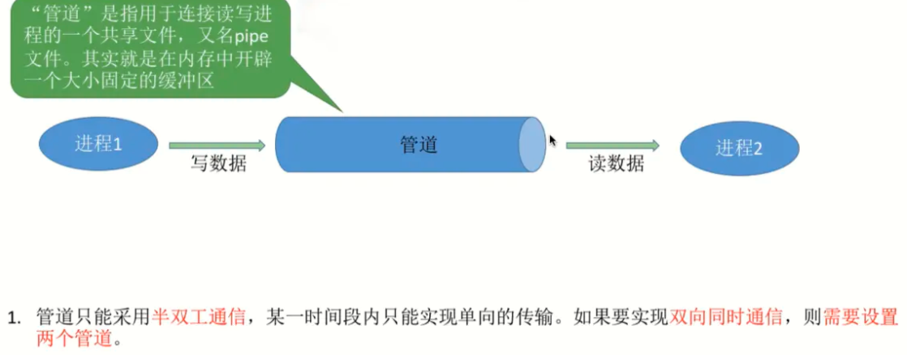

# 操作系统常见词汇

## 并发与并行

### 并发

- 何为并发？在操作系统中，是指一个时间段中有几个程序都处于已启动运行到运行完毕之间，且这几个程序都是在同一个处理机上运行，但任一个时刻点上只有一个程序在处理机上运行
- 当有多个线程在操作时,如果系统只有一个CPU,则它根本不可能真正同时进行一个以上的线程，它只能把CPU运行时间划分成若干个时间段,再将时间 段分配给各个线程执行，在一个时间段的线程代码运行时，其它线程处于挂起状。.这种方式我们称之为并发(Concurrent)
- 简单理解就是说，操作系统在处理多个任务之间，交替执行，一个任务执行一会再执行一下一个任务，由于cpu执行速度很快，在多个任务之间快速切换，从而实现多个任务在用户视觉上是同时进行的，但是实际并非如此
- 并发的好处就是，可以使多个任务在一段时间内的执行进度都做了一次更新，我觉得js主线程与异步任务与操作系统的并发性有异曲同工之妙。并发可以使cpu不至于卡在一个程序上一直执行，可以让多个程序得到短暂的执行时机

### 并行

- 何为并行？并行处理（Parallel Processing）是计算机系统中能同时执行两个或多个处理的一种计算方法。并行处理可同时工作于同一程序的不同方面
- 当系统有一个以上CPU时,则线程的操作有可能非并发。当一个CPU执行一个线程时，另一个CPU可以执行另一个线程，两个线程互不抢占CPU资源，可以同时进行，这种方式我们称之为并行(Parallel)
- 一般来讲计算机有几核就能同时执行几个程序，几核就类似几个人在干活，人越多当然效率就越高，主要还是同时间干活

### 并发与并行的区别

- 并行是指两个或者多个事件在同一时刻发生；而并发是指两个或多个事件在同一时间间隔内发生
- 在多道程序环境下，并发性是指在一段时间内宏观上有多个程序在同时运行，但在单处理机系统中，每一时刻却仅能有一道程序执行，故微观上这些程序只能是分时地交替执行

举个贴切的栗子：

- 比如做一个项目，并发就好比一个人完成这个项目，这个人要什么都做(相当于全栈)，一会写前端页面，一会写后端接口，一会操作数据库。这样看来，一个人也能完成这个项目，但是一个人一天做的事情是很有限的，可能需要很长的时间才能完成这个项目。
- 并行就好比，多个人同时做这个项目，每个人负责一块内容，有前端开发，后端开发，数据库管理。这么一来项目的各个部分每天的有进展，完成时间也就大大缩短，但是成本也就提高了

并发虽然处理事情的速度快但是成本很高，如今计算机个人cpu核数都是有限的，一般为个位数，但是有些地方就需要更多的核心，比如服务器，需要处理的数据比个人电脑要多的多，成本也就更高

对于大多数计算机来说处理的任务数都大于其核心数，那么在所难免需要用到并发技术，既然涉及到并发，难以避免各个线程、进程之间的切换以及通信问题

## 进程与线程

### 进程

- 进程是啥？官方解释：是计算机中的程序关于某数据集合上的一次运行活动，是进行资源分配的最小单位，是操作系统结构的基础
- 先明白，进程是系统进行资源分配和调度的基本单位的基本单位，是记录某数据集合上的运行活动，简单说就是记录cpu的一次运行活动
- 内存会给进程分配指定大小的空间，这个空间就是用来存储cpu执行的这个程序记录下来的一些数据
- 系统为每个运行的程序配置一个数据结构，称为进程控制块（PCB），用来描述进程的各种信息（比如代码段放在哪）

以下为pcb结构

这个pcb就是记录进程执行的一些相关数据，以下是pcb的各个组成的介绍

- 进程标识符PID相当于身份证。是在进程被创建时，操作系统会为该进程分配一个唯一的、不重复的ID，用于区分不同的进程。
- 用户标识符UID用来表示这个进程所属的用户是谁。
- 程序段指针是指当前进程的程序在内存的什么地方。
- 数据段指针是指当前进程的数据在内存的什么地方。
- 键盘和鼠标是指进程被分配得到的I/O设备。
- 各种寄存器值是指比如把程序计数器的值，比如有些计算的结果算到一半，进程切换时需要把这些值保存下来。

当cpu执行这个进程时，就会在对应的pcb中查找这个进程执行的相关数据，进而处理对应的事情

可以这么理解：cpu与内存是分开的，当操作系统需要执行一个应用程序的时候，系统会给这个程序开辟一个指定的空间(pcb)，用来记录这个程序执行的相关数据，当cpu执行到这个进程时，会去pcb中取出程序段指针执行对应的程序段代码，以及使用数据段的数据，如果需要操作一些其他设备，也会被记录在这个pcb中

#### 进程间的通信

- 为了保证安全，进程与进程之间是独立的，每个pcb在内存中的存储地址是不一样的，如果想要实现进程之间的数据交换，那么就要涉及进程间的通信

进程间常用的通信方式：

- 管道pipe：
  - 管道通信是一种半双工的通信方式，数据只能单向流动，如果需要实现双向通信那么需要设置2个管道，而且只能在具有亲缘关系的进程间通信，比如父子进程。
  - 管道的数据是以**字符流**形式写入管道，当管道写满时，执行写入的进程将被堵塞，等待读进程将数据取走。当数据取走后，管道为空，那么读进程将被阻塞，如果管道没满就不能读，如果没空就不能写，就是说读写必须在管道满或空的时候才行。
  - 如果管道数据全部被读取后，数据就会被抛弃，即管道数据只能被读一次，也就说读进程只能有一个

- 共享存储：
  - 共享内存就是映射一段能被其他进程所访问的内存，这段共享内存由一个进程创建，但多个进程都可以访问
  - 共享空间的访问必须是互斥的，即同一时间只能有一个进程在访问
  - 共享存储区是有进程控制，而不是操作系统

- 消息队列：
  - 消息队列是由消息的链表，存放在内核中并由消息队列标识符标识
  - 消息队列克服了信号传递信息少、管道只能承载无格式字节流以及缓冲区大小受限等缺点
  - 以格式化消息为单位，进程通过操作系统提供的发送消息和接受消息两个原语进行数据交换

其他方式：

- 命名管道FIFO：有名管道也是半双工的通信方式，但是它允许无亲缘关系进程间的通信。
- 套接字Socket：套解口也是一种进程间通信机制，与其他通信机制不同的是，它可用于不同及其间的进程通信。

### 线程

- 线程？是操作系统能够进行运算调度的最小单位。它被包含在进程之中，是进程中的实际运作单位
- 线程又是进程的进一步划分，如果一个进程具有并发性，那么这个进程就可以有多个线程，线程间的执行也类似与多个进程间的切换执行，也就是所谓的并发执行
- 如果一个应用属于单进程，那么如果在操作这个应用时，又要处理多个事情，比如qq聊天，如果开启了视频通话，但是还要能发图片，那么系统就需要并发执行这些事件，即使是单进程也能够在一个时间段内间隔执行任务，从而达到处理多个事件的能力

#### 线程间的通信

线程间通信方式：

- 锁机制
  - 互斥锁：提供了以排他方式防止数据结构被并发修改的方式
  - 读写锁：允许多个线程同时读共享数据，但是对写操作是互斥的
  - 条件变量：可以以原子的方式(不可拆分)阻塞进程，直到某个特定条件为真为止。对条件的测试是在互斥锁的保护下进行的。条件变量始终与互斥锁一起使用。
- 信号量机制(Semaphore)：
  - 无名线程信号量和命名线程信号量
- 信号机制：
  - 类似进程间的信号处理，线程间的通信目的主要是用于线程同步，所以线程没有像进程通信中的用于数据交换的通信机制

#### 死锁

- 死锁是指2个或以上的线程在执行过程中，由于竞争资源或者由于彼此通信而造成的一种阻塞的现象，若无外力作用，它们都将无法推进下去。此时称系统处于死锁状态或系统产生了死锁，这些永远在互相等待的进程称为死锁进程
- 简单讲，就是多个进程在执行的时候，由于获取资源或者通信故障，造成的堵塞现象，导致多个线程都被处于等待状态，无法进一步执行，如果没有外部的介入处理，那么此进程将导致死锁

产生死锁的4个条件：

- 互斥条件：指进程对所分配到的资源进行排它性使用，即在一段时间内某资源只由一个进程占用。如果此时还有其它进程请求资源，则请求者只能等待，直至占有资源的进程用毕释放
- 请求和保持条件：指进程已经保持至少一个资源，但又提出了新的资源请求，而该资源已被其它进程占有，此时请求进程阻塞，但又对自己已获得的其它资源保持不放
- 不剥夺条件：指进程已获得的资源，在未使用完之前，不能被剥夺，只能在使用完时由自己释放
- 环路等待条件：指在发生死锁时，必然存在一个进程——资源的环形链，即进程集合{P0，P1，P2，···，Pn}中的P0正在等待一个P1占用的资源；P1正在等待P2占用的资源，……，Pn正在等待已被P0占用的资源

简单解释一下这4个条件的产生：

- 互斥条件：比如一个线程正在使用分配到的资源，此时有另一个线程请求使用这一个线程当前分配的资源，但是由于互斥锁的机制，这个线程还未使用完资源，不能被另一个线程使用，那么另一个线程只能等待这个线程使用完才进一步执行
- 请求和保持条件：比如当前线程在处理当前分配的资源时，需要用到其他资源，此时其他资源又被另一个线程占用，那么将会导致，这个线程等待另一个线程执行完成，而这个线程自身又占用被分配到的资源不释放
- 不剥夺条件：这就是类似互斥锁，当前线程正在使用的资源只能到其执行结束，此资源才能被释放
- 环路等待条件：这就是把上面几条全都正好用上了，每个线程之间都在请求其他线程的资源，那么这样就会形成一个资源的环形链，死循环等待，如果没有外力的作用，这个循环将不会被中断，那么这就导致了死锁

#### 避免死锁

- 由于满足上面所提到的4个条件将会产生死锁，那么如何避免死锁的关键就是打破这4个条件，让其无法成立

避免4个必要条件的触发：

- 互斥条件：把独占资源(临界资源，即同一时间只能被一个线程使用)改造成虚拟资源，如果没有虚拟化技术，对于独占资源，比如打印机，那么打印店的老板会崩溃的。
- 请求和保持条件：解决1，当线程开始分配资源的时候，一次性分配其执行所需的资源，如果无法分配就先等待，那么就不会在执行的时候去请求其他资源。
- 不剥夺条件：在当前线程请求其他资源前，先退出当前占用的资源
- 环路等待条件：实现资源的有序编号，将稀缺资源分配较大编号，只有当进程拥有较小编号的资源时，才能申请较大编号的资源

总结：也就是要实现，避免一个线程同时请求多个资源、同时占用多个资源。在获取资源的时候设置加锁顺序(即获取资源的顺序，不能一下就能获取到目标资源)，在线程请求资源的时候，设定一个请求超时时间，在一定时间内未获取到资源，则自动放弃获取。

## cpu调度算法

这边就介绍几个常见的调度算法

- 先来先服务（FCFS, First Come First Serve）是最简单的调度算法，按先后顺序进行调度
  - FCFS属于非抢占式算法(不会因为任务的紧急性而改变cpu执行顺序)
  - 先进入就绪队列的进程，先分配处理机运行。一旦一个进程占有了处理机，它就一直运行下去，直到该进程完成工作或者因为等待某事件发生而不能继续运行时才释放处理机
  - 简单讲，就是无脑按照就绪队列里的任务顺序执行任务，直到结束让出cpu
  - 特点：比较有利于长作业，而不利于短作业。有利于CPU繁忙的作业，而不利于I/O繁忙的作业。适合处理不需要频繁切换cpu执行的时候
- 轮转算法(Round Robin)是让每个进程在就绪队列中等待的时间与享受的服务时间成正比
  - 先将就绪队列中的进程按照FCFS原则派出一个队列
  - cpu每次调度队首进程，让其执行一个时间片长度的时间
  - 执行一个时间片时间之后，把当前进行送到队尾，再接着下一个队头任务
  - 也就是每个就绪队列中的线程在每次cpu执行时的时间固定为一个时间片长度，轮流执行，有些类似并发执行
  - 特点：简单易行、平均相应时间短，但它不利于处理紧急作业。
- 多级反馈队列算法
  - 此算法，会设置多个就绪队列，每个队列的执行优先级不同，优先级低的队列对应的时间片就长，反之就短
  - 新来的进程根据FCFS算法进行服务，先投入给优先级最高的队列中，如果在cpu执行完一个时间片之后此队列还未完成，那么则将会按照轮转法，投入给优先级更低的队列(其时间片更长)执行，以此类推
  - 这么一来对应执行时间长度的进程就被投入到对应适合执行它的队列中，也就意味着，如果需要执行的时间长，那么其优先级降低
  - 当优先级高的队列为空时，才会执行优先级更低的队列
  - 特点：为提高系统吞吐量(单位时间cpu处理的信息量)和缩短平均周转时间(进程进入系统到执行完成的时间与系统实际处理它的时间之比)而照顾短进程。获得较好的I/O设备利用率和缩短响应时间而照顾I/O型进程。不必估计进程的执行时间，动态调节
- 最短作业优先算法
  - 最短作业优先算法这是对FCFS算法的改进，其目标是减少平均周转时间。对预计执行时间短的作业（进程）优先分派处理机。通常后来的短作业不抢先正在执行的作业

<Vssue title="操作系统 issue" />