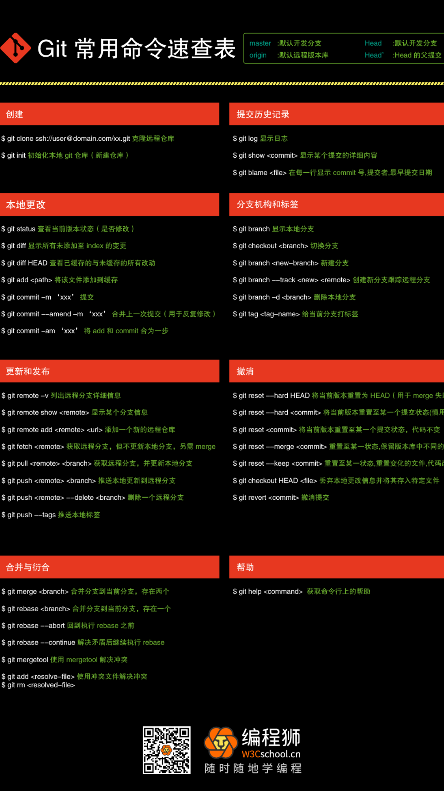

# Git使用

- git分布式版本管理工具

## git命令大全

### 设置提交人

- `git config --global user.name "Your Name Comes Here"`设置提交人的名字
- `git config --global user.email you@yourdomain.example.com`设置提交人的邮箱

### 分支

- `git branch newbranch`新建分支
- `git branch`显示分支列表
- `git switch newbranch`切换分支
- `git merge newbranch`在主分支上合并分支
- `git diff`显示冲突
- `gitk`解决冲突并且commit之后，执行的命令
- `git branch -d newbranch`删除分支
- `git branch -D crazy-idea`已经在`crazy-idea`分支上时，删除`crazy-idea`分支

## 创建

- `git clone ssh://user#domain.com/xx.git`克隆远程仓库
- `git init`初始化本地git仓库(新建仓库)

## 本地更改

- `git status`查看当前版本状态(是否修改)
- `git diff`显示所有未添加值index的变更
- `git diff HEAD`查看已经缓存的与未缓存的所有更改
- `git add <path>`将该文件添加到缓存
- `git add file1 file2 file3`修改一些文件，然后将其更新的内容添加到index中
- `git commit -m 'xxx'`带有信息的提交
- `git commit --amend -m 'xxx'`合并上一次提交(重复修改)
- `git commit -am 'xxx`将add和commit合并为一步

## 更新和发布

- `git remote -v`列出远程分支详细信息
- `git remote show <remote>`显示某个分支信息
- `git remote add <remote> <url>`添加一个新的远程仓库
- `git fetch <remote>`获取远程分支，但不更新本地分支，还需merge
- `git pull <remote> <branch>`获取远程分支，并更新本地分支
- `git push <remote> <branch>`推送本地更新到远程分支
- `git push -u origin master`推送本地更新到远程分支，首次需验证用户
- `git push <remote> --delete <branch>`删除一个远程分支
- `git push --tags`推送本地标签

## 合并于衍合

- `git merge <branch>`合并分支到当前分支，存在两个
- `git rebase <branch>`合并分支到当前分支，存在一个
- `git rebase --abort`回到执行rebase之前
- `git rebase --continue`解决矛盾后继续执行rebase
- `git mergetool`使用mergetool解决冲突
- `git add <resolve-file>`使用冲突文件解决冲突
- `git rm <resolved-file>`使用冲突文件删除已解决的冲突
- `git rm --cached filename`删除缓存中的filename文件

## 提交历史记录

- `git log`查看历史更改日志
- `git show <commit>`显示某个提交的详细内容
- `git blame <file>`在每一行显示commit号、提交者、最早提交日期
- `git log --stat --summary`更改概况

## 分支机构和标签

- `git branch`显示本地分支
- `git checkout <branch>`切换分支
- `git switch newbranch`切换分支
- `git branch <new-branch>`新建分支
- `git barnch --track <new> <remote>`创建新分支跟踪远程分支
- `git branch -d <branch>`删除本地分支
- `git tag <tag-name>`给当前分支打标签

## 撤销

- `git reset --hard HEAD`将当前版本重置为HEAD(用于merge失败)
- `git reset --hard <commit>`将当前版本重置至某个提交状态(慎用)
- `git reset <commit>`将当前版本重置至某个提交状态，代码不变
- `git reset --merge <commit>`重置至某个状态，保留版本库中不同的代码
- `git reset --keep <commit>`重置至某个状态，重置变化的文件，代码改变
- `git checkout HEAD <file>`丢弃本地更改信息并将其存入特定文件
- `git revert <commit>`撤销提交

## 帮助

- `git help <command>`获取命令行上的帮助
- `git help log`打开浏览器，跳转到命令介绍页面，**获取git命令选项大全**
- `git config -l`查看仓库配置
- `master`:默认开发分支
- `origin`:默认远程版本库
- `Head`:默认开发分支
- `Head^`:Head的父提交
- `git update-git-for-windows`更新git版本

[git命令大全](https://github.com/git-for-windows/git/blob/main/Documentation/gittutorial.txt)

拿好

<Vssue title="其他 issue" />