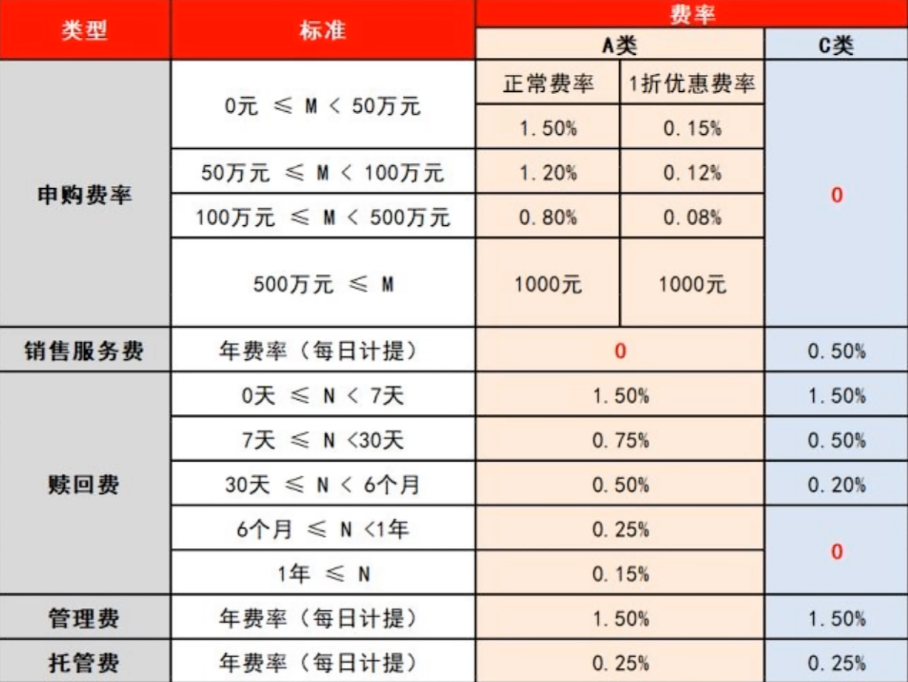
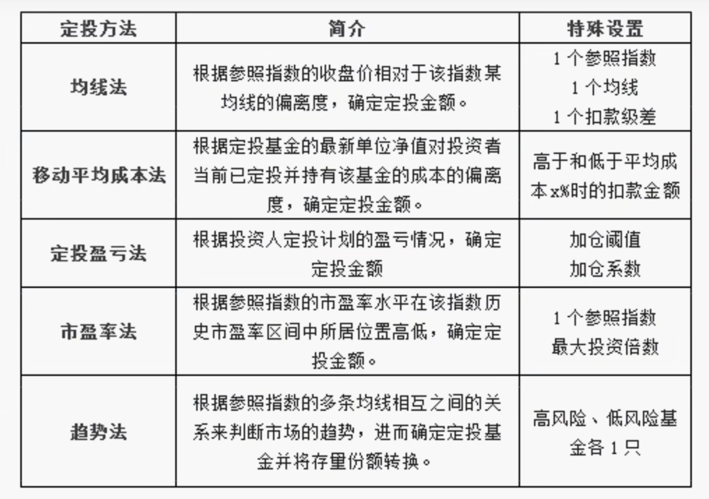
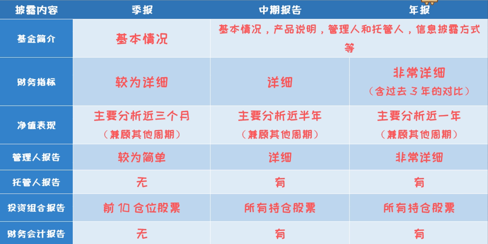

# 基金技巧

1. 复利
2. 心态
3. 最坏情况
4. 闲钱投资-储蓄
5. 冷静理性、不受市场影响、不梭哈
6. 螺旋上升-常态
7. 主动基金-基金经理动态调仓
8. 基金数量不宜过多：2-4只不重叠优秀基金
9. 机构>散户
10. 净值确认（交易日开盘后15:00前买入，则为当天净值；交易日15:00后买入，则为下一个交易日净值）

## 投基法制

1. 基金长期持有（定投摊平成本）
2. 选择合适的基金销售平台，如银行（手续费贵）、支付宝（第三方推荐）、基金公司（只有本公司）
3. 选择优秀的基金公司（公募）
4. 选择优秀的基金经理（从业年限、业绩、回撤、投资风格、少跳槽）
5. 合适的管理规模（建议50-100亿），大规模不好管理、小规模受市场影响大
6. 选择多元化基金（不同行业，风险低收益高，消费、科技、医疗、金融）
7. 买旧不买新（新基金无历史参考、有建仓期）
8. A类适合长期，C类适合短期

## 卖基时机

1. 基金经理更换时（选基=选经理）
2. 基金经理投资风格改变
3. 市场极端行情出现（判断基金估值区间：动态市盈率等权平均法）
   1. 静态市盈率pe：上年计算出来的（pe=10，说明10年回本，1/pe年化10%）
   2. 动态市盈率pe：最近4个季度计算出来的pe值
   3. 等权：所有股票相同权重（避免大股影响整体），适合分析小股市场行情（0-40低估-分批建仓、40-60正常、60-80高估-分批卖出、80-100疯狂）

## 基金定投

1. 主动基金（股票基金）、被动基金（指数基金-市场平均收益，如沪深300-大股参考）：推荐主动基金
2. 普通定投（定时投定额，建议设置周四投）
3. 智能定投（受算法和指标影响）
4. 设置涨跌提醒择时买卖（推荐涨跌3.5-4%提醒）
5. 等权<=60定投，>=60时则等大回撤（基于基金最大回撤参考设置）再加仓（推荐），看准市场位置
6. 分红再投（复利）
7. 坚持

## 基金组合

1. 规避重叠股基金（不同行业-主题、不同基金经理、不同基金公司、不同重仓股、不同股市）
2. 不要过于分散，适合2-4个基金
3. 精选行业，持续增长、非周期性行业（推荐板块：消费、医疗、科技、金融）
4. 不同风格的基金经理（价值投、成长、保守、激进）

## 基金报告

4次季报、1次年中、1次年度报告

获取报告途径：基金公司官网、第三方代销平台、证监会基金信息披露网站

主要关注点：

1. 管理人报告，基金经理自己写的4.4-4.5（谁在管）
   1. 管理人对报告期内基金的投资策略和业绩表现的说明
   2. 管理人对宏观经济、证券市场及行业走势的简要展望
2. 投资组合报告8（买了啥），各持股情况
3. 基金份额持有人信息9（谁在买），机构>散户，高层入股多
4. 主要财务指标、基金净值表现及利润分配情况3（挣钱吗），目前资金规模、净值变动比例、资产比例分配（可视化分析）

## 仓位配置

等额10份仓位（单次4%与上次加仓差值达到4%以上买入）

1. 建仓期-低估区<=40、45：分批买入直到初始仓位
2. 持有期-正常区45~60：有一定仓位，等待上涨，加仓
3. 脱离成本期-高估区60>=：超越成本15%，减仓

1. 合理偏高区：30%仓位
2. 合理偏低区：30%+30%仓位
3. 低估区：30%+30%+40%仓位

间隔区间分批抛出

## 估值

估值用于资产配置（调整债券和股票比例），结合分析

1. 股债利差法（FED）（预计收益-国债收益）：（1/pe）- 10年国债收益率 = 风险溢价%（越大低估）
2. 沪深300估值法：pe越大高估，分析大盘股市场行情更敏感
3. 等权市盈率法（TTM）：同样权重，适合齐涨齐跌、分析小盘股市场行情更敏感

## 注意事项

1. 深入了解基金经理
2. 深入了解行业
3. 投资周期与基金经理匹配
4. 少关注波动（短期回调）

## 优秀行业

1. 白酒
2. 医药