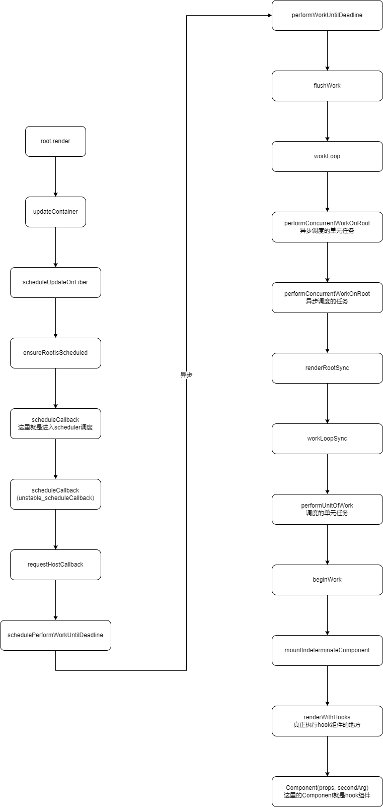

# React Hooks源码解析

基于react 18.2.x源码进行分析

## Hook组件是如何被调用

以下面例子为例，看看App Hook组件如何被调度

```jsx
const root = ReactDOM.createRoot(document.getElementById('root'));
root.render(
  <React.StrictMode>
    <App />
  </React.StrictMode>
);

// App.jsx
function App() {
  debugger
  const [count, setCount] = useState(0)
  return (
    <div className="App">
      <p>
        Edit <code>src/App.js</code> and save to reload.
      </p>
      <a
        className="App-link"
        href="https://reactjs.org"
        target="_blank"
        rel="noopener noreferrer"
      >
        Learn React
      </a>
      <p>number:{count}</p>
      <button
        onClick={() => {
          setCount((p) => {
            debugger
            return p + 1
          })
        }}
      >
        sssss
      </button>
    </div>
  )
}
```

调用链路如下



### beginWork

```jsx
function beginWork(current, workInProgress, renderLanes) {

  if (current !== null) {
    var oldProps = current.memoizedProps;
    var newProps = workInProgress.pendingProps;

    if (oldProps !== newProps || hasContextChanged() || (
     workInProgress.type !== current.type )) {
      // props或ctx改变则需要更新
      didReceiveUpdate = true;
    } else {
      // 检查是否需要更新
      var hasScheduledUpdateOrContext = checkScheduledUpdateOrContext(current, renderLanes);

      if (!hasScheduledUpdateOrContext && 
      (workInProgress.flags & DidCapture) === NoFlags) {
        // 没有挂起的更新或ctx，则提前结束
        didReceiveUpdate = false;
        return attemptEarlyBailoutIfNoScheduledUpdate(current, workInProgress, renderLanes);
      }

      if ((current.flags & ForceUpdateForLegacySuspense) !== NoFlags) {
        // legacy 模式特殊处理
        didReceiveUpdate = true;
      } else {
        // 没有更改
        didReceiveUpdate = false;
      }
    }
  } else {
    didReceiveUpdate = false;

    if (getIsHydrating() && isForkedChild(workInProgress)) {
      // hydration 相关
      var slotIndex = workInProgress.index;
      var numberOfForks = getForksAtLevel();
      pushTreeId(workInProgress, numberOfForks, slotIndex);
    }
  } 

  // 在开始更新前清理lanes
  workInProgress.lanes = NoLanes;
  // 根据组件类型执行对应的渲染方式
  switch (workInProgress.tag) {
    case IndeterminateComponent:
      {
        return mountIndeterminateComponent(current, workInProgress, workInProgress.type, renderLanes);
      }

    case LazyComponent:
      {
        var elementType = workInProgress.elementType;
        return mountLazyComponent(current, workInProgress, elementType, renderLanes);
      }

    case FunctionComponent:
      {
        var Component = workInProgress.type;
        var unresolvedProps = workInProgress.pendingProps;
        var resolvedProps = workInProgress.elementType === Component ? unresolvedProps : resolveDefaultProps(Component, unresolvedProps);
        return updateFunctionComponent(current, workInProgress, Component, resolvedProps, renderLanes);
      }

    case ClassComponent:
      {
        var _Component = workInProgress.type;
        var _unresolvedProps = workInProgress.pendingProps;

        var _resolvedProps = workInProgress.elementType === _Component ? _unresolvedProps : resolveDefaultProps(_Component, _unresolvedProps);

        return updateClassComponent(current, workInProgress, _Component, _resolvedProps, renderLanes);
      }

    case HostRoot:
      return updateHostRoot(current, workInProgress, renderLanes);

    case HostComponent:
      return updateHostComponent(current, workInProgress, renderLanes);

    case HostText:
      return updateHostText(current, workInProgress);

    case SuspenseComponent:
      return updateSuspenseComponent(current, workInProgress, renderLanes);

    case HostPortal:
      return updatePortalComponent(current, workInProgress, renderLanes);

    case ForwardRef:
      {
        var type = workInProgress.type;
        var _unresolvedProps2 = workInProgress.pendingProps;

        var _resolvedProps2 = workInProgress.elementType === type ? _unresolvedProps2 : resolveDefaultProps(type, _unresolvedProps2);

        return updateForwardRef(current, workInProgress, type, _resolvedProps2, renderLanes);
      }

    case Fragment:
      return updateFragment(current, workInProgress, renderLanes);

    case Mode:
      return updateMode(current, workInProgress, renderLanes);

    case Profiler:
      return updateProfiler(current, workInProgress, renderLanes);

    case ContextProvider:
      return updateContextProvider(current, workInProgress, renderLanes);

    case ContextConsumer:
      return updateContextConsumer(current, workInProgress, renderLanes);

    case MemoComponent:
      {
        var _type2 = workInProgress.type;
        var _unresolvedProps3 = workInProgress.pendingProps; // Resolve outer props first, then resolve inner props.

        var _resolvedProps3 = resolveDefaultProps(_type2, _unresolvedProps3);

        {
          if (workInProgress.type !== workInProgress.elementType) {
            var outerPropTypes = _type2.propTypes;

            if (outerPropTypes) {
              checkPropTypes(outerPropTypes, _resolvedProps3, // Resolved for outer only
              'prop', getComponentNameFromType(_type2));
            }
          }
        }

        _resolvedProps3 = resolveDefaultProps(_type2.type, _resolvedProps3);
        return updateMemoComponent(current, workInProgress, _type2, _resolvedProps3, renderLanes);
      }

    case SimpleMemoComponent:
      {
        return updateSimpleMemoComponent(current, workInProgress, workInProgress.type, workInProgress.pendingProps, renderLanes);
      }

    case IncompleteClassComponent:
      {
        var _Component2 = workInProgress.type;
        var _unresolvedProps4 = workInProgress.pendingProps;

        var _resolvedProps4 = workInProgress.elementType === _Component2 ? _unresolvedProps4 : resolveDefaultProps(_Component2, _unresolvedProps4);

        return mountIncompleteClassComponent(current, workInProgress, _Component2, _resolvedProps4, renderLanes);
      }

    case SuspenseListComponent:
      {
        return updateSuspenseListComponent(current, workInProgress, renderLanes);
      }

    case ScopeComponent:
      {

        break;
      }

    case OffscreenComponent:
      {
        return updateOffscreenComponent(current, workInProgress, renderLanes);
      }
  }

  throw new Error("Unknown unit of work tag (" + workInProgress.tag + "). This error is likely caused by a bug in " + 'React. Please file an issue.');
}
```

### mountIndeterminateComponent

```jsx
function mountIndeterminateComponent(_current, workInProgress, Component, renderLanes) {
  resetSuspendedCurrentOnMountInLegacyMode(_current, workInProgress);
  var props = workInProgress.pendingProps;
  var context;

  {
    var unmaskedContext = getUnmaskedContext(workInProgress, Component, false);
    context = getMaskedContext(workInProgress, unmaskedContext);
  }

  prepareToReadContext(workInProgress, renderLanes);
  var value;
  var hasId;

  if (Component.prototype && typeof Component.prototype.render === 'function') {
    // ...
  }

  setIsRendering(true);
  ReactCurrentOwner$1.current = workInProgress;
  value = renderWithHooks(null, workInProgress, Component, props, context, renderLanes);
  hasId = checkDidRenderIdHook();
  setIsRendering(false);

  workInProgress.flags |= PerformedWork;

  if (
   typeof value === 'object' && value !== null && typeof value.render === 'function' && value.$$typeof === undefined) {
    // class组件
    workInProgress.tag = ClassComponent; 

    workInProgress.memoizedState = null;
    workInProgress.updateQueue = null;

    var hasContext = false;
    // 判断是否是ctx提供方
    if (isContextProvider(Component)) {
      hasContext = true;
      pushContextProvider(workInProgress);
    } else {
      hasContext = false;
    }

    workInProgress.memoizedState = value.state !== null && value.state !== undefined ? value.state : null;
    initializeUpdateQueue(workInProgress);
    adoptClassInstance(workInProgress, value);
    mountClassInstance(workInProgress, Component, props, renderLanes);
    return finishClassComponent(null, workInProgress, Component, true, hasContext, renderLanes);
  } else {
    // 函数组件
    workInProgress.tag = FunctionComponent;

    if (getIsHydrating() && hasId) {
      pushMaterializedTreeId(workInProgress);
    }

    reconcileChildren(null, workInProgress, value, renderLanes);

    return workInProgress.child;
  }
}
```

### renderWithHooks

```jsx
function renderWithHooks(current, workInProgress, Component, props, secondArg, nextRenderLanes) {
  renderLanes = nextRenderLanes;
  currentlyRenderingFiber$1 = workInProgress;

  workInProgress.memoizedState = null;
  workInProgress.updateQueue = null;
  workInProgress.lanes = NoLanes;

  // 根据执行阶段设置hooks的集合来源，分mount和update阶段的dispatcher
  ReactCurrentDispatcher.current =
      current === null || current.memoizedState === null
        ? HooksDispatcherOnMount
        : HooksDispatcherOnUpdate;

  // 执行函数组件 如 App()
  var children = Component(props, secondArg); 

  if (didScheduleRenderPhaseUpdateDuringThisPass) {
    // 如果有render阶段的更新则，设置计数避免循环过多次
    var numberOfReRenders = 0;

    do {
      didScheduleRenderPhaseUpdateDuringThisPass = false;
      localIdCounter = 0;

      numberOfReRenders += 1;

      currentHook = null;
      workInProgressHook = null;
      workInProgress.updateQueue = null;

      ReactCurrentDispatcher$1.current =  HooksDispatcherOnRerenderInDEV ;
      children = Component(props, secondArg);
    } while (didScheduleRenderPhaseUpdateDuringThisPass);
  }


  ReactCurrentDispatcher$1.current = ContextOnlyDispatcher;

  var didRenderTooFewHooks = currentHook !== null && currentHook.next !== null;
  renderLanes = NoLanes;
  currentlyRenderingFiber$1 = null;
  currentHook = null;
  workInProgressHook = null;

  didScheduleRenderPhaseUpdate = false; // This is reset by checkDidRenderIdHook

  return children;
}
```

## useState

```jsx
function useState(initialState) {
  var dispatcher = resolveDispatcher();
  return dispatcher.useState(initialState);
}

function resolveDispatcher() {
  // 获取dispatcher，mount阶段是HooksDispatcherOnMount
  var dispatcher = ReactCurrentDispatcher.current;
  return dispatcher;
}

const HooksDispatcherOnMount: Dispatcher = {
  readContext,
  useCallback: mountCallback,
  useContext: readContext,
  useEffect: mountEffect,
  useImperativeHandle: mountImperativeHandle,
  useLayoutEffect: mountLayoutEffect,
  useInsertionEffect: mountInsertionEffect,
  useMemo: mountMemo,
  useReducer: mountReducer,
  useRef: mountRef,
  useState: mountState,
  useDebugValue: mountDebugValue,
  useDeferredValue: mountDeferredValue,
  useTransition: mountTransition,
  useMutableSource: mountMutableSource,
  useSyncExternalStore: mountSyncExternalStore,
  useId: mountId,
  unstable_isNewReconciler: enableNewReconciler,
};

const HooksDispatcherOnUpdate: Dispatcher = {
  readContext,
  useCallback: updateCallback,
  useContext: readContext,
  useEffect: updateEffect,
  useImperativeHandle: updateImperativeHandle,
  useInsertionEffect: updateInsertionEffect,
  useLayoutEffect: updateLayoutEffect,
  useMemo: updateMemo,
  useReducer: updateReducer,
  useRef: updateRef,
  useState: updateState,
  useDebugValue: updateDebugValue,
  useDeferredValue: updateDeferredValue,
  useTransition: updateTransition,
  useMutableSource: updateMutableSource,
  useSyncExternalStore: updateSyncExternalStore,
  useId: updateId,
  unstable_isNewReconciler: enableNewReconciler,
};
```

实际上useState内部调用的是dispatcher的useState，并且在不同阶段dispatcher的hooks集合都不一样，主要分mount和update阶段

```jsx
{
  useState: function (initialState) {
    currentHookNameInDev = 'useState';
    mountHookTypesDev();
    var prevDispatcher = ReactCurrentDispatcher$1.current;
    ReactCurrentDispatcher$1.current = InvalidNestedHooksDispatcherOnMountInDEV;
    try {
      return mountState(initialState);
    } finally {
      ReactCurrentDispatcher$1.current = prevDispatcher;
    }
  }
}
```

### mountState

重点看下mount下的useState

```jsx
function mountState(initialState) {
  // 生成一个hook，并加入到hook链中
  var hook = mountWorkInProgressHook();

  if (typeof initialState === 'function') {
    // 函数初始值
    initialState = initialState();
  }

  // mount阶段初始值就是缓存值
  hook.memoizedState = hook.baseState = initialState;
  // 初始当前hook队列
  var queue = {
    pending: null,
    interleaved: null,
    lanes: NoLanes,
    dispatch: null,
    lastRenderedReducer: basicStateReducer,
    lastRenderedState: initialState
  };

  hook.queue = queue;
  // 绑定当前FiberNode
  var dispatch = queue.dispatch = dispatchSetState.bind(null, currentlyRenderingFiber$1, queue);
  return [hook.memoizedState, dispatch];
}

function mountWorkInProgressHook() {
  var hook = {
    memoizedState: null, // 缓存状态
    baseState: null, // 基础状态
    baseQueue: null, // 基础队列
    queue: null,
    next: null
  };

  if (workInProgressHook === null) {
    // 这是第一个hook
    currentlyRenderingFiber$1.memoizedState = workInProgressHook = hook;
  } else {
    // 追加进hook链
    workInProgressHook = workInProgressHook.next = hook;
  }
  return workInProgressHook;
}
```

### dispatchSetState（更新state的函数，也就是set）

更新state的函数

```jsx
function dispatchSetState(fiber, queue, action) {
  // 基于FiberNode生成当前lane
  var lane = requestUpdateLane(fiber);
  var update = {
    lane: lane,
    action: action,
    hasEagerState: false,
    eagerState: null,
    next: null
  };

  if (isRenderPhaseUpdate(fiber)) {
    // 这个是在渲染阶段的更新
    enqueueRenderPhaseUpdate(queue, update);
  } else {
    // 获取候补fiber
    var alternate = fiber.alternate;

    if (fiber.lanes === NoLanes && (alternate === null || alternate.lanes === NoLanes)) {
      // 当前队列为空，则直接进入render后的阶段
      var lastRenderedReducer = queue.lastRenderedReducer;

      if (lastRenderedReducer !== null) {
        var prevDispatcher;

        try {
          var currentState = queue.lastRenderedState;
          // 这里action就是我们传递的(p)=>p+1,state的更新回调
          var eagerState = lastRenderedReducer(currentState, action); 

          update.hasEagerState = true;
          update.eagerState = eagerState;
          // 如果没有更新
          if (objectIs(eagerState, currentState)) {
            // 则不安排重新渲染
            enqueueConcurrentHookUpdateAndEagerlyBailout(fiber, queue, update, lane);
            return;
          }
        } catch (error) {
        } finally {
          
        }
      }
    }
    // 将update加入到更新队列中，等待调度
    var root = enqueueConcurrentHookUpdate(fiber, queue, update, lane);
    // 如果是root节点才进行首次调度
    if (root !== null) {
      var eventTime = requestEventTime();
      // 这内部就是调用ensureRootIsScheduled进行调度的
      scheduleUpdateOnFiber(root, fiber, lane, eventTime);
      entangleTransitionUpdate(root, queue, lane);
    }
  }

  markUpdateInDevTools(fiber, lane);
}
```

### enqueueConcurrentHookUpdate

```jsx
function enqueueConcurrentHookUpdate(fiber, queue, update, lane) {
  var interleaved = queue.interleaved;
  if (interleaved === null) {
    // 这是第一次更新，创建循环update链表
    update.next = update;
    // 渲染结束时这个队列将会被设置为挂起队列等待更新
    pushConcurrentUpdateQueue(queue);
  } else {
    update.next = interleaved.next;
    interleaved.next = update;
  }

  queue.interleaved = update;
  return markUpdateLaneFromFiberToRoot(fiber, lane);
}
```

### markUpdateLaneFromFiberToRoot

```jsx
function markUpdateLaneFromFiberToRoot(sourceFiber, lane) {
  // 更新fiberNode的lane通道
  sourceFiber.lanes = mergeLanes(sourceFiber.lanes, lane);
  var alternate = sourceFiber.alternate;
  // 候选fiber存在则同时更新lanes
  if (alternate !== null) {
    alternate.lanes = mergeLanes(alternate.lanes, lane);
  }

  var node = sourceFiber;
  var parent = sourceFiber.return;

  // 同时同步祖先节点的lanes
  while (parent !== null) {
    parent.childLanes = mergeLanes(parent.childLanes, lane);
    alternate = parent.alternate;

    if (alternate !== null) {
      alternate.childLanes = mergeLanes(alternate.childLanes, lane);
    } else {
      {
        if ((parent.flags & (Placement | Hydrating)) !== NoFlags) {
          warnAboutUpdateOnNotYetMountedFiberInDEV(sourceFiber);
        }
      }
    }

    node = parent;
    parent = parent.return;
  }

  // 只返回root
  if (node.tag === HostRoot) {
    var root = node.stateNode;
    return root;
  } else {
    return null;
  }
}
```

### update阶段调用useState

这是在update阶段下的dispatcher中的useState

```jsx
{
  useState: function (initialState) {
    currentHookNameInDev = 'useState';
    updateHookTypesDev();
    var prevDispatcher = ReactCurrentDispatcher$1.current;
    ReactCurrentDispatcher$1.current = InvalidNestedHooksDispatcherOnUpdateInDEV;
    try {
      return updateState(initialState);
    } finally {
      ReactCurrentDispatcher$1.current = prevDispatcher;
    }
  }
}

function updateState(initialState) {
  return updateReducer(basicStateReducer);
}
```

#### updateReducer（update阶段实际更新方法）

```jsx
function updateReducer(reducer, initialArg, init) {
  // 更新workInProgressHook中的链表关系，包括从候补fiber
  var hook = updateWorkInProgressHook();
  var queue = hook.queue;

  if (queue === null) {
    throw new Error('Should have a queue. This is likely a bug in React. Please file an issue.');
  }

  queue.lastRenderedReducer = reducer;
  var current = currentHook; // The last rebase update that is NOT part of the base state.

  var baseQueue = current.baseQueue; // The last pending update that hasn't been processed yet.

  var pendingQueue = queue.pending;

  if (pendingQueue !== null) {
    // 有尚未执行的更新
    if (baseQueue !== null) {
      // 合并待处理和基础队列
      var baseFirst = baseQueue.next;
      var pendingFirst = pendingQueue.next;
      baseQueue.next = pendingFirst;
      pendingQueue.next = baseFirst;
    }

    current.baseQueue = baseQueue = pendingQueue;
    queue.pending = null;
  }

  if (baseQueue !== null) {
    // 有个队列要处理
    var first = baseQueue.next;
    var newState = current.baseState;
    var newBaseState = null;
    var newBaseQueueFirst = null;
    var newBaseQueueLast = null;
    var update = first;

    do {
      var updateLane = update.lane;

      if (!isSubsetOfLanes(renderLanes, updateLane)) {
        // 更新优先级不足，只能clone后等待再次更新
        var clone = {
          lane: updateLane,
          action: update.action,
          hasEagerState: update.hasEagerState,
          eagerState: update.eagerState,
          next: null
        };

        if (newBaseQueueLast === null) {
          newBaseQueueFirst = newBaseQueueLast = clone;
          newBaseState = newState;
        } else {
          newBaseQueueLast = newBaseQueueLast.next = clone;
        } 

        currentlyRenderingFiber$1.lanes = mergeLanes(currentlyRenderingFiber$1.lanes, updateLane);
        markSkippedUpdateLanes(updateLane);
      } else {
        // 有足够的优先级更新
        if (newBaseQueueLast !== null) {
          var _clone = {
            // 这个更新会被commit，NoLane不会被跳过
            lane: NoLane,
            action: update.action,
            hasEagerState: update.hasEagerState,
            eagerState: update.eagerState,
            next: null
          };
          newBaseQueueLast = newBaseQueueLast.next = _clone;
        } 

        // 处理更新
        if (update.hasEagerState) {
          // 如果这个更新是state赋值更新
          newState = update.eagerState;
        } else {
          // 这个是action，reducer更新
          var action = update.action;
          // 这个reducer就是 basicStateReducer，就做了一件事
          // return typeof action === 'function' ? action(state) : action;
          // action就是我们的更新函数
          newState = reducer(newState, action);
        }
      }
      // 执行下一个更新
      update = update.next;
    } while (update !== null && update !== first);

    // 把所有update执行完成后获取到最终的newState
    if (newBaseQueueLast === null) {
      newBaseState = newState;
    } else {
      newBaseQueueLast.next = newBaseQueueFirst;
    }

    // 如果更新前后值不同，则标记工作完成
    if (!objectIs(newState, hook.memoizedState)) {
      markWorkInProgressReceivedUpdate();
    }

    hook.memoizedState = newState;
    hook.baseState = newBaseState;
    hook.baseQueue = newBaseQueueLast;
    queue.lastRenderedState = newState;
  }


  var lastInterleaved = queue.interleaved;

  if (lastInterleaved !== null) {
    var interleaved = lastInterleaved;
    // 标记所有已经被处理的update的lane，将其从fiberNode的lanes中剔除
    do {
      var interleavedLane = interleaved.lane;
      currentlyRenderingFiber$1.lanes = mergeLanes(currentlyRenderingFiber$1.lanes, interleavedLane);
      markSkippedUpdateLanes(interleavedLane);
      interleaved = interleaved.next;
    } while (interleaved !== lastInterleaved);
  } else if (baseQueue === null) {
    queue.lanes = NoLanes;
  }

  var dispatch = queue.dispatch;
  return [hook.memoizedState, dispatch];
}
```

### 结论

- 每次调用useState时，内部会根据当前组件所处阶段来获取对应的dispatcher，并通过`dispatcher.useState(initialState)`来初始化
- 而dispatcher是在每次renderWithHooks中被重新赋值的（根据所处阶段赋值）

比如在mount阶段调用useState则内部使用mountState，在update阶段则内部使用updateState（其实就是updateReducer）

形如下面代码

```jsx
const [count, setCount] = useState(0)

// 最终对应 ，dispatch为 dispatchSetState.bind(null, currentlyRenderingFiber$1, queue);
const [count, setCount] = [hook.memoizedState, dispatch]
```

可以看到useState最终返回的值是`hook.memoizedState`而set则是`dispatchSetState.bind(null, currentlyRenderingFiber$1, queue)`

这里state的hook结构如下，最终返回的hook是workInProgressHook

```jsx
var hook = {
  memoizedState: null,
  baseState: null,
  baseQueue: null,
  queue: null,
  next: null
};
```

并且会根据当前工作中workInProgressHook赋值到fiberNode.memoizedState上，如果有多个hook，则形成hooks链表

而hook自身又有queue（即更新队列），queue的dispatch就是这个hook的set，参考下面代码

```jsx
var workInProgressHook = mountWorkInProgressHook();
workInProgressHook.memoizedState = workInProgressHook.baseState = initialState;
// hook自身的队列
var queue = {
  pending: null,
  interleaved: null,
  lanes: NoLanes,
  dispatch: null,
  lastRenderedReducer: basicStateReducer,
  lastRenderedState: initialState
};
workInProgressHook.queue = queue;
var dispatch = queue.dispatch = dispatchSetState.bind(null, currentlyRenderingFiber$1, queue);
return [workInProgressHook.memoizedState, dispatch];
```

#### 调用多个hook

```jsx
const [count, setCount] = useState(0)
const [count1, setCount1] = useState(1)
const ref = useRef()
```

形如这样，那么在调用第二个useState时已经有workInProgressHook

```jsx
// 第二个hook，这个hook也有自己独立的queue
var hook = {
  memoizedState: null,
  baseState: null,
  baseQueue: null,
  queue: null,
  next: null
};
// 由于已经存在第一个hook，所以将第二个hook链到第一个hook的next，形成链表
workInProgressHook = workInProgressHook.next = hook;
```

第三个useRef内部也是调用mountWorkInProgressHook初始化hook，所以也是将其hook链到workInProgressHook下

所以最终得出以下结论

- 每个FiberNode内部会维护memoizedState，这个属性保存的就是workInProgressHook的链表，可以理解为一个函数组件的memoizedState保存的就是这个组件中所有hooks组成链表头节点hook
- 由于set是在初始化hook的时候就绑定好的，所以在调用set改变值的时候，其内部就是基于这个fiberNode生成对应的lane和update对象，并且hook的queue中的interleaved属性保存就是update更新对象，update也是一个链表形式，如果是首次update则会将queue推入到并发跟新队列concurrentQueues中，这个队列中的每一项都是hook的queue队列，并且在render阶段时将最后一次set的action作为queue的pending等待更新
- 在beginWork中根据组件类型执行更新方法，在这里是updateFunctionComponent，然后进入renderWithHooks这时处以update阶段，调用useState将会执行updateState内部是updateReducer进行更新。可以这么理解：在mount阶段调用useState等hook，则是进行hook初始化，但是在update阶段调用useState就是调用updateReducer进行更新，所以说触发set更新是在update阶段重新执行useState时触发的

## useRef

```jsx
function useRef(initialValue) {
  var dispatcher = resolveDispatcher();
  return dispatcher.useRef(initialValue);
}
```

mount阶段

```jsx
useRef: function (initialValue) {
  currentHookNameInDev = 'useRef';
  mountHookTypesDev();
  return mountRef(initialValue);
}

function mountRef(initialValue) {
  var hook = mountWorkInProgressHook();
  // 创建一个带有current属性初始化的对象
  var _ref2 = {
    current: initialValue
  };
  hook.memoizedState = _ref2;
  return _ref2;
}
```

update阶段

```jsx
function updateRef<T>(initialValue: T): {|current: T|} {
  const hook = updateWorkInProgressHook();
  return hook.memoizedState;
}
```

如果是函数方式，则这个更新方法会在commit阶段被调用，不属于update阶段的更新，并且ref.current是直接赋值引用所以update没有做什么

```jsx
<button
  ref={(e) => {
    ref.current = e
  }}
>
```

## useCallback

mount阶段

```jsx
function mountCallback<T>(callback: T, deps: Array<mixed> | void | null): T {
  const hook = mountWorkInProgressHook();
  const nextDeps = deps === undefined ? null : deps;
  // 多了个依赖项，并且是以数组形式记录到初始值中
  hook.memoizedState = [callback, nextDeps];
  return callback;
}
```

update阶段

```jsx
function updateCallback<T>(callback: T, deps: Array<mixed> | void | null): T {
  const hook = updateWorkInProgressHook();
  const nextDeps = deps === undefined ? null : deps;
  const prevState = hook.memoizedState;
  if (prevState !== null) {
    if (nextDeps !== null) {
      const prevDeps: Array<mixed> | null = prevState[1];
      // 对比依赖是否相同，如果相同着返回之前的函数，这个判断相当于用Object.is
      if (areHookInputsEqual(nextDeps, prevDeps)) {
        return prevState[0];
      }
    }
  }
  // 依赖改变则，重新返回传入的新函数
  hook.memoizedState = [callback, nextDeps];
  return callback;
}
```

## useMemo

mount阶段

```jsx
function mountMemo<T>(
  nextCreate: () => T,
  deps: Array<mixed> | void | null,
): T {
  const hook = mountWorkInProgressHook();
  const nextDeps = deps === undefined ? null : deps;
  // 与useCallback的差别就是调用了，把结果存起来
  const nextValue = nextCreate();
  hook.memoizedState = [nextValue, nextDeps];
  return nextValue;
}
```

update阶段

```jsx
function updateMemo<T>(
  nextCreate: () => T,
  deps: Array<mixed> | void | null,
): T {
  const hook = updateWorkInProgressHook();
  const nextDeps = deps === undefined ? null : deps;
  const prevState = hook.memoizedState;
  if (prevState !== null) {
    // Assume these are defined. If they're not, areHookInputsEqual will warn.
    if (nextDeps !== null) {
      const prevDeps: Array<mixed> | null = prevState[1];
      // 依赖不变，则返回缓存值
      if (areHookInputsEqual(nextDeps, prevDeps)) {
        return prevState[0];
      }
    }
  }
  // 依赖改变重新执行函数获取新值
  const nextValue = nextCreate();
  hook.memoizedState = [nextValue, nextDeps];
  return nextValue;
}
```

## useEffect

mount阶段

在mount阶段中useEffect保存的是effect对象，并且是被链入到fiberNode的updateQueue.lastEffect中

```jsx
function mountEffect(
  create: () => (() => void) | void,
  deps: Array<mixed> | void | null,
): void {
  return mountEffectImpl(
    PassiveEffect | PassiveStaticEffect,
    HookPassive,
    create,
    deps,
  );
}

function mountEffectImpl(fiberFlags, hookFlags, create, deps): void {
  const hook = mountWorkInProgressHook();
  const nextDeps = deps === undefined ? null : deps;
  currentlyRenderingFiber.flags |= fiberFlags;
  // 这里缓存的是effect对象
  hook.memoizedState = pushEffect(
    HookHasEffect | hookFlags,
    create,
    undefined,
    nextDeps,
  );
}

function pushEffect(tag, create, destroy, deps) {
  const effect: Effect = {
    tag,
    create,
    destroy,
    deps,
    // Circular
    next: (null: any),
  };
  let componentUpdateQueue: null | FunctionComponentUpdateQueue = (currentlyRenderingFiber.updateQueue: any);
  // 将effect链入到当前fiber的UpdateQueue的lastEffect中
  if (componentUpdateQueue === null) {
    componentUpdateQueue = createFunctionComponentUpdateQueue();
    currentlyRenderingFiber.updateQueue = (componentUpdateQueue: any);
    componentUpdateQueue.lastEffect = effect.next = effect;
  } else {
    const lastEffect = componentUpdateQueue.lastEffect;
    if (lastEffect === null) {
      componentUpdateQueue.lastEffect = effect.next = effect;
    } else {
      const firstEffect = lastEffect.next;
      lastEffect.next = effect;
      effect.next = firstEffect;
      componentUpdateQueue.lastEffect = effect;
    }
  }
  return effect;
}
```

update阶段

```jsx
function updateEffect(
  create: () => (() => void) | void,
  deps: Array<mixed> | void | null,
): void {
  return updateEffectImpl(PassiveEffect, HookPassive, create, deps);
}

function updateEffectImpl(fiberFlags, hookFlags, create, deps): void {
  const hook = updateWorkInProgressHook();
  const nextDeps = deps === undefined ? null : deps;
  let destroy = undefined;

  if (currentHook !== null) {
    const prevEffect = currentHook.memoizedState;
    destroy = prevEffect.destroy;
    if (nextDeps !== null) {
      const prevDeps = prevEffect.deps;
      // 对比依赖是否相同
      if (areHookInputsEqual(nextDeps, prevDeps)) {
        // 重新创建effect对象进行缓存
        hook.memoizedState = pushEffect(hookFlags, create, destroy, nextDeps);
        return;
      }
    }
  }

  currentlyRenderingFiber.flags |= fiberFlags;
  // 重新创建effect，并且标记当前hook有副作用，后续会被执行
  hook.memoizedState = pushEffect(
    HookHasEffect | hookFlags,
    create,
    destroy,
    nextDeps,
  );
}
```

## useReducer

mount阶段

```jsx
function mountReducer<S, I, A>(
  reducer: (S, A) => S,
  initialArg: I,
  init?: I => S,
): [S, Dispatch<A>] {
  const hook = mountWorkInProgressHook();
  let initialState;
  // 获取初始值
  if (init !== undefined) {
    initialState = init(initialArg);
  } else {
    initialState = ((initialArg: any): S);
  }
  // 直接缓存的就是初始值
  hook.memoizedState = hook.baseState = initialState;
  const queue: UpdateQueue<S, A> = {
    pending: null,
    lanes: NoLanes,
    dispatch: null,
    lastRenderedReducer: reducer,// 对比useState的basicStateReducer差异就是这个reducer
    lastRenderedState: (initialState: any),
  };
  hook.queue = queue;
  const dispatch: Dispatch<A> = (queue.dispatch = (dispatchReducerAction.bind(
    null,
    currentlyRenderingFiber,
    queue,
  ): any));
  return [hook.memoizedState, dispatch];
}

// 对比useState
function mountState<S>(
  initialState: (() => S) | S,
): [S, Dispatch<BasicStateAction<S>>] {
  const hook = mountWorkInProgressHook();
  if (typeof initialState === 'function') {
    // $FlowFixMe: Flow doesn't like mixed types
    initialState = initialState();
  }
  hook.memoizedState = hook.baseState = initialState;
  const queue: UpdateQueue<S, BasicStateAction<S>> = {
    pending: null,
    lanes: NoLanes,
    dispatch: null,
    lastRenderedReducer: basicStateReducer,
    lastRenderedState: (initialState: any),
  };
  hook.queue = queue;
  const dispatch: Dispatch<
    BasicStateAction<S>,
  > = (queue.dispatch = (dispatchSetState.bind(
    null,
    currentlyRenderingFiber,
    queue,
  ): any));
  return [hook.memoizedState, dispatch];
}
```

与useState的差别在于，useReducer的reducer是外部传入的，而useState是用默认的，如果你每次更新state都用同一个函数，那么也能实现useReducer的效果

```jsx
// useState内部使用的reducer
function basicStateReducer<S>(state: S, action: BasicStateAction<S>): S {
  // $FlowFixMe: Flow doesn't like mixed types
  return typeof action === 'function' ? action(state) : action;
}
```

update阶段用的就是updateReducer与useState的update阶段用的是同一个函数
