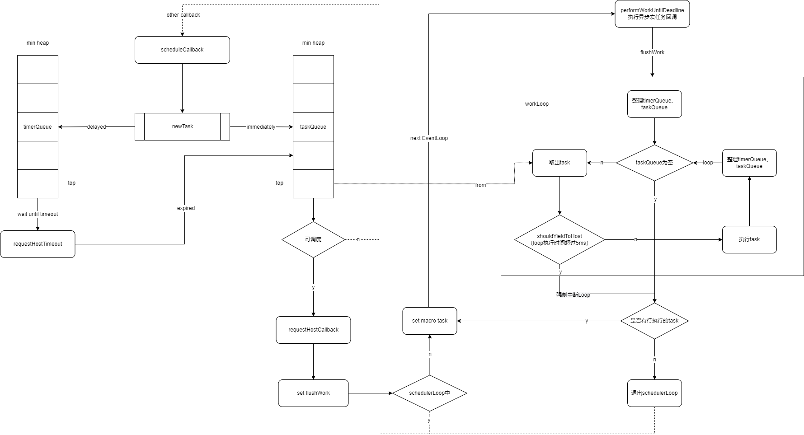
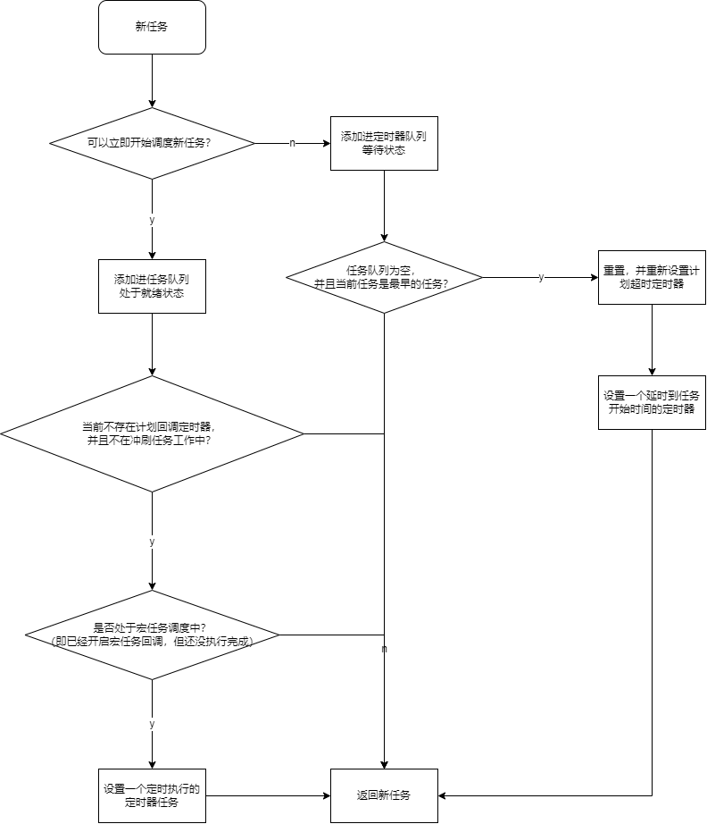
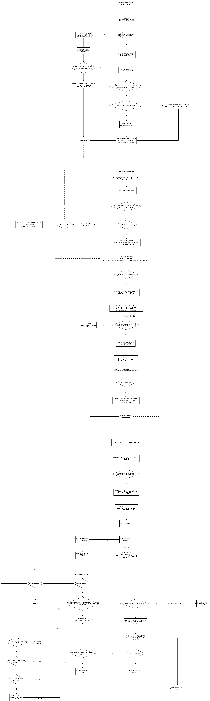

# Scheduler 调度器源码解读

- 对 React Scheduler 异步调度器源码进行解读

整体流程图



## scheduleCallback

- 这是创建一个基于优先级的调度任务

```ts
/**
 * 暴露给外部调用，基于调度优先级计划执行回调
 * @param priorityLevel 调度优先级
 * @param callback 回调任务
 * @param options 配置项
 * @returns 调度的任务
 */
function scheduleCallback(
  priorityLevel: PriorityLevel,
  callback: Callback,
  options: Options
) {
  const currentTime = getCurrentTime()
  let startTime = currentTime + (options?.delay || 0)
  // 根据当前调度优先级获取到期时长
  let timeout =
    priorityLevelTimeoutMap[priorityLevel] ||
    priorityLevelTimeoutMap[PriorityLevel.NormalPriority]
  // 获取对应的到期时间点
  let expirationTime = startTime + timeout

  const newTask: Task = {
    id: taskIdCounter++,
    callback,
    priorityLevel,
    startTime,
    expirationTime,
    sortIndex: -1,
  }

  // 任务开始时间未到则任务入队，并开启等待
  if (startTime > currentTime) {
    newTask.sortIndex = startTime
    push(timerQueue, newTask)
    if (peek(taskQueue) === null && peek(timerQueue) === newTask) {
      // 存在请求 Timeout 的调度
      if (isTimeoutScheduled) {
        clearHostTimeout()
      } else {
        isTimeoutScheduled = true
      }
      // 设置新的请求 Timeout 的调度
      setHostTimeout(startTime - currentTime)
    }
  } else {
    // 任务已经可以开始执行
    newTask.sortIndex = expirationTime
    push(taskQueue, newTask)
    // 不在请求 Callback 调度中，并且不在冲刷任务中则可以开始请求 Callback 调度
    if (!isCallbackScheduled && !isFlushWork) {
      isCallbackScheduled = true
      scheduledFlushWork = flushWork
      // 不在宏任务执行中
      if (!isInMessageLoop) {
        // 开启一个宏任务进行调度
        isInMessageLoop = true
        setHostTimeout(0)
      }
    }
  }
  return newTask
}
```

- 可以看到在创建新的调度任务时，会根据当前创建任务的开始时间添加到不同的队列中（队列其实是根据sortIndex排序的小顶堆）
  - 定时器队列：存放还未到开始时间的任务
  - 任务队列：存放已到达开始时间，但还没被执行的任务
- 当还未到达开始时间时，那么当前任务被添加到定时器队列中
  - 如果任务队列没有任务并且定时器队列中最早开始的任务是当前创建的任务，则重新创建一个基于当前任务开始时间差的定时器（也就是等待这个任务到达开始时间），并标记已经存在计划等待的定时器。否则什么也不做（因为已经存在计划等待的定时器了）
- 当已经到达开始时间时，那么当前任务被添加到任务队列中
  - 如果当前不在计划执行回调的定时器并且不在冲刷工作中，那么标记当前可以计划回调和冲刷任务，如果不在宏任务回调执行中，那么标记执行中，并设置一个宏任务回调



## setHostTimeout

- 设置定时任务

```ts
function setHostTimeout(delay: number) {
  if (delay) {
    // 有延时，设置定时回调
    timeoutId = localSetTimeout?.(handleTimeout, delay) || timeoutId
  } else {
    // 无延时，直接执行回调
    schedulePerformWorkUntilDeadline()
  }
}
```

分2种情况：

1. 无延时的任务：启动一个宏任务回调，无delay，相当于 `setTimeout(workUntil, 0)`
2. 有延时的任务：启动一个有delay的宏任务回调，并且在回调任务执行时判断一些逻辑，相当于 `setTimeout(handleTimeout, delay)`

### handleTimeout

- 这个是专门用于有delay的宏任务回调，因为delay了，期间可能有新任务，所以需要重新判断队列情况

```ts
function handleTimeout() {
  const currentTime = getCurrentTime()
  isTimeoutScheduled = false
  // 重新整理队列，可能在delay期间有新任务进来
  advanceTimers(currentTime)
  if (!isCallbackScheduled) {
    // 任务队列不为空
    if (peek(taskQueue) !== null) {
      isCallbackScheduled = true
      // 请求执行任务
      requestFlushWork()
    } else {
      // 不存在需要立即执行的任务，则等待执行最早开始的任务
      requestSetTimeoutWork(currentTime)
    }
  }
}
```

- 执行callback任务的请求只能有一个，如果重复请求将不生效，直到这个请求的任务进入执行中
- 等待timeout任务的请求也只会存在一个，如果重复请求，将会清除上一个timeout并重新设置一个

以上这些是为了保障只会有一个callback请求和timeout请求，也就意味着只通过一个callback和timeout宏任务回调来完成异步调度

### requestFlushWork

- 请求执行任务，并在下一次宏任务（无延迟）回调中执行workUntil

```ts
function requestFlushWork() {
  // 到这一步说明有确切的任务需要冲刷（也就是遍历执行），这里就是设置了冲刷方法
  scheduledFlushWork = flushWork
  // 当前不在任务执行中
  if (!isInMessageLoop) {
    isInMessageLoop = true
    // 安排宏任务
    setHostTimeout(0)
  }
}
```

- 在这里就明确有冲刷任务的需求，但是是否立即安排冲刷取决于当前是否已经在一个冲刷安排中了，这是为了避免安排多个同时存在的冲刷任务，实际上只需要一个就够，并且动态读取scheduledFlushWork冲刷任务就能实现更新
- 这里就体现了异步回调的处理方式，不仅要考虑当前执行的情况，还要考虑其他任务对当前执行的影响，无论有多少次请求，都能保证调度的一致性

### requestSetTimeoutWork

- 这个函数就是保证一直都有等待执行的任务，直到双队列都为空为止

```ts
function requestSetTimeoutWork(currentTime: number) {
  // 最早开始的任务
  const task = peek(timerQueue)
  if (task !== null) {
    // 设置一个定时器，在预期开始时间执行任务
    setHostTimeout(task.startTime - currentTime)
  }
}
```

## workUntil

- 这个就是执行任务的回调入口

```ts
function workUntil() {
  // 当前存在预定执行的任务，判断待执行的冲刷任务
  if (scheduledFlushWork !== null) {
    const currentTime = getCurrentTime()
    // 设置可执行到的最晚时刻
    deadline = currentTime + yieldInterval
    let hasMoreWorker = true
    try {
      hasMoreWorker = scheduledFlushWork(true, currentTime)
    } finally {
      // 有需要继续执行的任务
      if (hasMoreWorker) {
        // 设置一个宏任务，继续执行剩余任务（这里主要用于处理过期后需要继续执行的任务）
        // 下一个宏任务是还有isInMessageLoop和scheduledFlushWork的，并没有重置，所以可以直接再次进入workUntil
        setHostTimeout(0)
      } else {
        // 重置标志
        isInMessageLoop = false
        // 重置预定任务，说明请求的任务执行完成了
        scheduledFlushWork = null
      }
    }
  } else {
    // 执行完成，退出宏任务回调
    isInMessageLoop = false
  }
}
```

## flushWork

- 这才是实际冲刷任务的函数

```ts
function flushWork(inWorkUntil: boolean, beginTime: number) {
  // 清除执行任务请求标识，说明已经进入执行任务，并非处于事件循环等待宏任务调度中
  isCallbackScheduled = false
  if (isTimeoutScheduled) {
    isTimeoutScheduled = false
    clearHostTimeout()
  }

  // 开始冲刷
  isFlushWork = true

  // 保留冲刷前的优先级，用于冲刷后恢复优先级
  const prePriority = currentPriorityLevel

  try {
    // 冲刷开始
    return workLoop(inWorkUntil, beginTime)
  } finally {
    currentTask = null
    currentPriorityLevel = prePriority
    isFlushWork = false
  }
}
```

## workLoop

- 这是遍历执行任务的函数，是调度实际任务和blocked的地方

```ts
function workLoop(inWorkUntil: boolean, beginTime: number) {
  let currentTime = beginTime
  advanceTimers(currentTime)
  // 获取第一个任务
  currentTask = peek(taskQueue)
  while (currentTask !== null) {
    // 当前任务未到期，并且不需要被打断
    if (
      currentTask.expirationTime > currentTime &&
      (!inWorkUntil || shouldBreak())
    ) {
      break
    }

    const callback = currentTask.callback
    if (typeof callback === 'function') {
      currentTask.callback = null
      currentPriorityLevel = currentTask.priorityLevel
      // 执行任务回调，传入当前任务是否到期执行标志，用于回调内部判断到期后是否需要继续执行
      const returnValue = callback(currentTime >= currentTask.expirationTime)
      currentTime = getCurrentTime()
      if (typeof returnValue === 'function') {
        currentTask.callback = returnValue
      } else {
        // 没有返回新任务则执行下一个任务
        if (currentTask === peek(taskQueue)) {
          pop(taskQueue)
        }
      }
      advanceTimers(currentTime)
    } else {
      pop(taskQueue)
    }
    currentTask = peek(taskQueue)
  }

  // 被打断后，当前还有任务未执行
  if (currentTask !== null) {
    // 需要继续执行，但是在下一个宏任务中执行
    return true
  } else {
    // 没有，则开始等待剩余任务中最早要执行的任务
    requestSetTimeoutWork(currentTime)
    return false
  }
}

// 这个函数，默认以时间片维度来blocked，也可以自己定制blocked逻辑
function shouldBreak() {
  return getCurrentTime() >= deadline
}
```

- 这个函数核心逻辑就是遍历执行taskQueue任务，并且在每执行一个task之前都判断一下是否还有时间片，如果没有那么就直接中断本次冲刷任务（所以可能还有部分task还未执行完成，需要到下一轮的冲刷中执行）。
- 这里其实是把每次冲刷任务的时间用时间片（基于配置的yieldInterval，默认5ms）来划分，也就是在一轮宏任务冲刷过程中最长执行时间是5ms左右， 其实就是为了尽可能保证在16ms内只抽出5ms时间执行冲刷，保证画面渲染时间。但是不一定会刚好5ms，如果一个task占用了大量时间，那么也得等待这个task执行完成，毕竟每个task执行中是不可分割的，只是每次冲刷任务是可以中断的
- 当然如果存在一个执行时间超过5ms的任务，并且一直都会重复创建（也就是存在常驻的大于5ms的任务），那么随着时间积累，taskQueue的task数量只会不断递增，导致实际消费速度跟不上生产速度，最终就会造成内存爆炸。当然目前如果只是react内部渲染时产生的task我们可以不必担心会存在超过5ms的任务，除非我们自己单独使用scheduler库来做一些异步调度的事情，这时就要小心了

## 全流程

