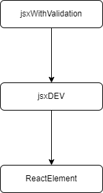
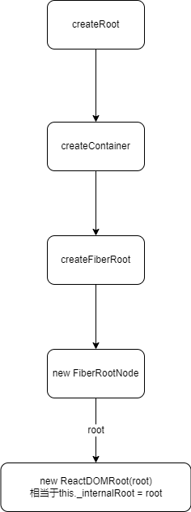

# React 18.2.x 源码解析

## jsx最终被编译成什么了？

- 众所周知我们在代码中直接嵌入jsx语法，最终被loader编译成js代码传入给render函数进行渲染
- 当我们编写的jsx代码最终作为参数传给render函数，那么这个实参就是jsx编译后的内容

### 经过jsx编译前后代码对比

```jsx
const root = ReactDOM.createRoot(document.getElementById('root'));

// jsx源码
root.render(
  <React.StrictMode>
    <App />
  </React.StrictMode>
);

// 编译后的代码
const root = react_dom_client__WEBPACK_IMPORTED_MODULE_1__.createRoot(document.getElementById('root'));
root.render(
  (0, react_jsx_dev_runtime__WEBPACK_IMPORTED_MODULE_5__.jsxDEV)(
    react__WEBPACK_IMPORTED_MODULE_0___default().StrictMode,
    {
      children: (0, react_jsx_dev_runtime__WEBPACK_IMPORTED_MODULE_5__.jsxDEV)(
        _App__WEBPACK_IMPORTED_MODULE_3__['default'],
        {},
        void 0,
        false,
        {
          fileName: _jsxFileName,
          lineNumber: 11,
          columnNumber: 5,
        },
        undefined
      ),
    },
    void 0,
    false,
    {
      fileName: _jsxFileName,
      lineNumber: 10,
      columnNumber: 3,
    },
    undefined
  )
)
```

实际上就是编译了jsx以下部分代码

```jsx
<React.StrictMode>
  <App />
</React.StrictMode>

// 变成
(0, react_jsx_dev_runtime__WEBPACK_IMPORTED_MODULE_5__.jsxDEV)(
  react__WEBPACK_IMPORTED_MODULE_0___default().StrictMode,
  {
    children: (0, react_jsx_dev_runtime__WEBPACK_IMPORTED_MODULE_5__.jsxDEV)(
      _App__WEBPACK_IMPORTED_MODULE_3__['default'],
      {},
      void 0,
      false,
      {
        fileName: _jsxFileName,
        lineNumber: 11,
        columnNumber: 5,
      },
      undefined
    ),
  },
  void 0,
  false,
  {
    fileName: _jsxFileName,
    lineNumber: 10,
    columnNumber: 3,
  },
  undefined
)

// 简化后
jsxWithValidation(
  StrictMode,
  {
    children: jsxWithValidation(
      App,
      {},
      void 0,
      false,
      {
        fileName: _jsxFileName,
        lineNumber: 11,
        columnNumber: 5,
      },
      undefined
    ),
  },
  void 0,
  false,
  {
    fileName: _jsxFileName,
    lineNumber: 10,
    columnNumber: 3,
  },
  undefined)
```

### 最终调用

最终jsx语法被编译成 `jsxWithValidation` 调用，render函数获取到的实参就是这个函数的结果

接下来看看 `jsxWithValidation` 的实现

```jsx
function jsxWithValidation(type, props, key, isStaticChildren, source, self) {
  {
    // 校验jsx有效元素类型，在这里是 App 函数
    var validType = isValidElementType(type); 

    if (!validType) {
      // 错误展示
    }

    // jsx元素创建
    var element = jsxDEV(type, props, key, source, self);

    // 跳过null
    if (element == null) {
      return element;
    } 

    if (validType) {
      var children = props.children;
      // 主要是校验子元素具有有效的key属性
      if (children !== undefined) {
        if (isStaticChildren) {
          if (isArray(children)) {
            for (var i = 0; i < children.length; i++) {
              validateChildKeys(children[i], type);
            }

            if (Object.freeze) {
              Object.freeze(children);
            }
          } else {
            error('React.jsx: Static children should always be an array. ' + 'You are likely explicitly calling React.jsxs or React.jsxDEV. ' + 'Use the Babel transform instead.');
          }
        } else {
          validateChildKeys(children, type);
        }
      }
    }

    // 校验 propTypes
    if (type === REACT_FRAGMENT_TYPE) {
      validateFragmentProps(element);
    } else {
      validatePropTypes(element);
    }

    return element;
  }
}
```

创建jsx元素 `jsxDEV` 

```jsx
function jsxDEV(type, config, maybeKey, source, self) {
  {
    var propName; // Reserved names are extracted

    var props = {};
    var key = null;
    var ref = null;

    if (maybeKey !== undefined) {
      {
        checkKeyStringCoercion(maybeKey);
      }
      key = '' + maybeKey;
    }

    // 校验key
    if (hasValidKey(config)) {
      {
        checkKeyStringCoercion(config.key);
      }
      key = '' + config.key;
    }
    // 校验ref
    if (hasValidRef(config)) {
      ref = config.ref;
      warnIfStringRefCannotBeAutoConverted(config, self);
    }


    // 浅拷贝设置的属性
    for (propName in config) {
      if (hasOwnProperty.call(config, propName) && !RESERVED_PROPS.hasOwnProperty(propName)) {
        props[propName] = config[propName];
      }
    } 

    // 浅拷贝默认属性
    if (type && type.defaultProps) {
      var defaultProps = type.defaultProps;

      for (propName in defaultProps) {
        if (props[propName] === undefined) {
          props[propName] = defaultProps[propName];
        }
      }
    }

    // 设置key和ref的getter用于校验
    if (key || ref) {
      var displayName = typeof type === 'function' ? type.displayName || type.name || 'Unknown' : type;

      if (key) {
        defineKeyPropWarningGetter(props, displayName);
      }

      if (ref) {
        defineRefPropWarningGetter(props, displayName);
      }
    }
    // 最终返回的是ReactElement结果
    return ReactElement(type, key, ref, self, source, ReactCurrentOwner.current, props);
  }
}
```

这里只需要知道传给render函数的是调用`ReactElement()`的结果就行



## ReactElement做了什么

```jsx
var ReactElement = function (type, key, ref, self, source, owner, props) {
  var element = {
    // 用来标识react元素类型
    $$typeof: REACT_ELEMENT_TYPE,
    // 内建属性
    type: type, // App
    key: key,
    ref: ref,
    props: props,
    // 记录负责创建此元素的组件
    _owner: owner
  };
  {
    element._store = {};
    // 配置一些内置属性
    Object.defineProperty(element._store, 'validated', {
      configurable: false,
      enumerable: false,
      writable: true,
      value: false
    }); // self and source are DEV only properties.

    Object.defineProperty(element, '_self', {
      configurable: false,
      enumerable: false,
      writable: false,
      value: self
    }); // Two elements created in two different places should be considered
    // equal for testing purposes and therefore we hide it from enumeration.

    Object.defineProperty(element, '_source', {
      configurable: false,
      enumerable: false,
      writable: false,
      value: source
    });

    if (Object.freeze) {
      Object.freeze(element.props);
      Object.freeze(element);
    }
  }
  return element;
};
```

实际上就是创建了一个对象，用来结构化表示react元素数据，有一些react内置的属性

## ReactDOM.createRoot并发支持

通过`ReactDOM.createRoot`方式创建的Root支持并发渲染模式，看看是创建了什么

```jsx
function createRoot(container, options) {
  if (!isValidContainer(container)) {
    throw new Error('createRoot(...): Target container is not a DOM element.');
  }

  warnIfReactDOMContainerInDEV(container);
  var isStrictMode = false;
  var concurrentUpdatesByDefaultOverride = false;
  var identifierPrefix = '';
  var onRecoverableError = defaultOnRecoverableError;
  var transitionCallbacks = null;

  if (options !== null && options !== undefined) {
    // options配置校验、提取等等

    if (options.unstable_strictMode === true) {
      isStrictMode = true;
    }

    if (options.identifierPrefix !== undefined) {
      identifierPrefix = options.identifierPrefix;
    }

    if (options.onRecoverableError !== undefined) {
      onRecoverableError = options.onRecoverableError;
    }

    if (options.transitionCallbacks !== undefined) {
      transitionCallbacks = options.transitionCallbacks;
    }
  }

  // 内部调用 createFiberRoot 创建FiberRootNode，并且还会创建一个FiberNode作为current属性，FiberNode是有缓存机制的
  var root = createContainer(container, ConcurrentRoot, null, isStrictMode, concurrentUpdatesByDefaultOverride, identifierPrefix, onRecoverableError);
  markContainerAsRoot(root.current, container);
  var rootContainerElement = container.nodeType === COMMENT_NODE ? container.parentNode : container;
  listenToAllSupportedEvents(rootContainerElement);
  // 最终创建
  return new ReactDOMRoot(root);
}

```

创建调用链路如下



最终`createRoot`创建的就是`ReactDOMRoot`的一个实例，然后把`FiberRootNode`实例挂载到`this._internalRoot`上

## render方法

```jsx
const root = ReactDOM.createRoot(document.getElementById('root'));
root.render(
  <React.StrictMode>
    <App />
  </React.StrictMode>
);
```

以上代码使用`ReactDOM.createRoot`来创建支持并发模式的ReactDOM.Root

经过jsx的分析，这里我们可以知道传递给render的是一个ReactElement对象，接下来看看render方法

```js
ReactDOMHydrationRoot.prototype.render = ReactDOMRoot.prototype.render = function (children) {
  // FiberRootNode
  var root = this._internalRoot;
  // 。。。校验参数，做错误提示
  
  // 最终调用
  updateContainer(children, root, null, null);
};
```

### updateContainer函数

```jsx
function updateContainer(element, container, parentComponent, callback) {
  // element是ReactElement对象，container是FiberRootNode
  // FiberNode
  var current$1 = container.current;
  // 获取已开始时间（从开始到现在的毫秒数）
  var eventTime = requestEventTime();
  // 这里会根据同步模式或者并发模式生成 lane 通道
  // 如果当前window.event存在，则会根据触发的事件类型生成对应优先级的lane通道，具体事件优先级可以看 getEventPriority 这个函数实现
  // 默认返回的lane为 16 也就是 0b10000 
  var lane = requestUpdateLane(current$1);

  // 从父组件开始获取context（逐层往上）
  var context = getContextForSubtree(parentComponent);

  // 同时设置FiberRootNode的ctx，如果存在则设置给pendingContext（用于等待更新ctx）
  if (container.context === null) {
    container.context = context;
  } else {
    container.pendingContext = context;
  }
  
  // 基于当前时间和lane优先级创建一个更新对象
  var update = createUpdate(eventTime, lane); 

  // 配置update的一些属性，包括更新回调函数
  update.payload = {
    element: element
  };
  callback = callback === undefined ? null : callback;

  if (callback !== null) {
    update.callback = callback;
  }
  // 将update更新对象加入到FiberNode的updateQueue更新队列中，返回的是 FiberRootNode
  var root = enqueueUpdate(current$1, update, lane);

  if (root !== null) {
    scheduleUpdateOnFiber(root, current$1, lane, eventTime);
    // Transitions 相关
    entangleTransitions(root, current$1, lane);
  }

  return lane;
}
```

#### enqueueUpdate函数

```jsx
function enqueueUpdate(fiber, update, lane) {
  // 更新队列是在fiberNode创建是就有的
  // FiberNode独享的更新队列
  var updateQueue = fiber.updateQueue;
  if (updateQueue === null) {
    return null;
  }
  // 共享更新队列
  var sharedQueue = updateQueue.shared;

  if (isUnsafeClassRenderPhaseUpdate()) {
    // 用于 class 组件的不安全更新
    var pending = sharedQueue.pending;
    if (pending === null) {
      // This is the first update. Create a circular list.
      update.next = update;
    } else {
      update.next = pending.next;
      pending.next = update;
    }

    sharedQueue.pending = update;
    return unsafe_markUpdateLaneFromFiberToRoot(fiber, lane);
  } else {
    // 主要关注，内部调用markUpdateLaneFromFiberToRoot
    return enqueueConcurrentClassUpdate(fiber, sharedQueue, update, lane);
  }
}
```

#### enqueueConcurrentClassUpdate

```jsx
function enqueueConcurrentClassUpdate(fiber, queue, update, lane) {
  // 交替更新链
  var interleaved = queue.interleaved;
  if (interleaved === null) {
    // 第一个更新
    update.next = update;
    // 将sharedQueue推入到全局并发队列，相当于concurrentQueues.push(queue)
    pushConcurrentUpdateQueue(queue);
  } else {
    // 非第一次更新时，将当前更新对象插入到另一条更新链中
    update.next = interleaved.next;
    interleaved.next = update;
  }
  // 相当于 sharedQueue.interleaved = update
  queue.interleaved = update;
  return markUpdateLaneFromFiberToRoot(fiber, lane);
}
```

#### markUpdateLaneFromFiberToRoot

```jsx
function markUpdateLaneFromFiberToRoot(sourceFiber, lane) {
  // 合并当前FiberNode的lane通道
  sourceFiber.lanes = mergeLanes(sourceFiber.lanes, lane);
  // 这是另一个候补FiberNode，第一次是没有
  var alternate = sourceFiber.alternate;
  // 同步候补FiberNode的lanes
  if (alternate !== null) {
    alternate.lanes = mergeLanes(alternate.lanes, lane);
  }

  var node = sourceFiber;
  var parent = sourceFiber.return;

  // 这里做的是，将从父到根的路径上的FiberNode以及alternate的lanes都更新一遍
  // 简单说就是Fiber树中从这个FiberNode往上的节点的lanes通道都加上当前lane
  while (parent !== null) {
    parent.childLanes = mergeLanes(parent.childLanes, lane);
    alternate = parent.alternate;

    if (alternate !== null) {
      alternate.childLanes = mergeLanes(alternate.childLanes, lane);
    } else {
      {
        if ((parent.flags & (Placement | Hydrating)) !== NoFlags) {
          warnAboutUpdateOnNotYetMountedFiberInDEV(sourceFiber);
        }
      }
    }

    node = parent;
    parent = parent.return;
  }

  if (node.tag === HostRoot) {
    // 返回 FiberRootNode
    var root = node.stateNode;
    return root;
  } else {
    return null;
  }
}
```

#### scheduleUpdateOnFiber调度

这个函数是调度的关键函数

```jsx
function scheduleUpdateOnFiber(root, fiber, lane, eventTime) {
  // 校验最大嵌套更新，最多50
  checkForNestedUpdates();

  // 为FiberRootNode挂起的lanes添加当前lane，并在eventTimes中对应通道标记
  // 如 lane 为 0b10000 则 eventTimes[4] = eventTime，4就是10000中1的位置索引
  markRootUpdated(root, lane, eventTime);

  if ((executionContext & RenderContext) !== NoLanes && root === workInProgressRoot) {
    // 此更新是在渲染阶段调度的
    warnAboutRenderPhaseUpdatesInDEV(fiber); // Track lanes that were updated during the render phase
  } else {
    // 正常更新
    warnIfUpdatesNotWrappedWithActDEV(fiber);

    if (root === workInProgressRoot) {
      // 收到对正在渲染中的树的更新，第一次渲染是不会有的
      if ((executionContext & RenderContext) === NoContext) {
        workInProgressRootInterleavedUpdatedLanes = mergeLanes(workInProgressRootInterleavedUpdatedLanes, lane);
      }

      if (workInProgressRootExitStatus === RootSuspendedWithDelay) {
        markRootSuspended$1(root, workInProgressRootRenderLanes);
      }
    }

    // 开始调度
    ensureRootIsScheduled(root, eventTime);

    if (lane === SyncLane && executionContext === NoContext && (fiber.mode & ConcurrentMode) === NoMode && // Treat `act` as if it's inside `batchedUpdates`, even in legacy mode.
    !ReactCurrentActQueue$1.isBatchingLegacy) {
      // 保证 legacy 行为
      resetRenderTimer();
      flushSyncCallbacksOnlyInLegacyMode();
    }
  }
}
```

#### ensureRootIsScheduled

为root计划开启一个调度任务

```jsx
function ensureRootIsScheduled(root, currentTime) {
  var existingCallbackNode = root.callbackNode; 

  // 标记过期（饿死）的lane
  markStarvedLanesAsExpired(root, currentTime);

  // 获取下一个更新的lanes
  var nextLanes = getNextLanes(root, root === workInProgressRoot ? workInProgressRootRenderLanes : NoLanes);

  if (nextLanes === NoLanes) {
    // 没有需要调度的任务
    if (existingCallbackNode !== null) {
      cancelCallback$1(existingCallbackNode);
    }
    root.callbackNode = null;
    root.callbackPriority = NoLane;
    return;
  } 

  // 下一个最高优先级lane
  var newCallbackPriority = getHighestPriorityLane(nextLanes);

  var existingCallbackPriority = root.callbackPriority;

  // 结束回调优先级等于下一个lane优先级
  if (existingCallbackPriority === newCallbackPriority && 
  !(ReactCurrentActQueue$1.current !== null && existingCallbackNode !== fakeActCallbackNode)) {
     //与 `act` 相关的特殊情况。如果当前计划的任务是调度任务，而不是 `act` 任务，取消它并重新在 `act` 队列上调度
    return;
  }

  if (existingCallbackNode != null) {
    // 取消结束回调，在新一轮中重新开启
    cancelCallback$1(existingCallbackNode);
  } 

  // 调度器任务，即 newTask
  var newCallbackNode;

  // 同步任务
  if (newCallbackPriority === SyncLane) {
    if (root.tag === LegacyRoot) {
      if (ReactCurrentActQueue$1.isBatchingLegacy !== null) {
        ReactCurrentActQueue$1.didScheduleLegacyUpdate = true;
      }
      scheduleLegacySyncCallback(performSyncWorkOnRoot.bind(null, root));
    } else {
      scheduleSyncCallback(performSyncWorkOnRoot.bind(null, root));
    }

    // 基于微任务调度
    if (ReactCurrentActQueue$1.current !== null) {
      // 添加到act队列，相当于把同步调度任务放到微任务中执行
      ReactCurrentActQueue$1.current.push(flushSyncCallbacks);
    } else {
      scheduleMicrotask(function () {
        // 不支持在渲染和commit阶段执行同步回调
        if ((executionContext & (RenderContext | CommitContext)) === NoContext) {
          flushSyncCallbacks();
        }
      });
    }
    newCallbackNode = null;
  } else {
    // 异步任务
    var schedulerPriorityLevel;
    // 将当前lanes通道转换成对应的调度器事件优先级
    switch (lanesToEventPriority(nextLanes)) {
      case DiscreteEventPriority:
        schedulerPriorityLevel = ImmediatePriority;
        break;

      case ContinuousEventPriority:
        schedulerPriorityLevel = UserBlockingPriority;
        break;

      case DefaultEventPriority:
        schedulerPriorityLevel = NormalPriority;
        break;

      case IdleEventPriority:
        schedulerPriorityLevel = IdlePriority;
        break;

      default:
        schedulerPriorityLevel = NormalPriority;
        break;
    }
    // 内部调用的是调度器中的scheduleCallback方法
    newCallbackNode = scheduleCallback$1(schedulerPriorityLevel, performConcurrentWorkOnRoot.bind(null, root));
  }
  // 标记FiberRootNode的回调优先级和调度器任务
  root.callbackPriority = newCallbackPriority;
  root.callbackNode = newCallbackNode;
}
```

#### markStarvedLanesAsExpired标记过期的lanes（饿死）

```jsx
function markStarvedLanesAsExpired(root, currentTime) {
  var pendingLanes = root.pendingLanes;
  var suspendedLanes = root.suspendedLanes;
  var pingedLanes = root.pingedLanes;
  var expirationTimes = root.expirationTimes;

  var lanes = pendingLanes;

  // 遍历所有lanes通道，
  while (lanes > 0) {
    var index = pickArbitraryLaneIndex(lanes);
    var lane = 1 << index;
    var expirationTime = expirationTimes[index];

    if (expirationTime === NoTimestamp) {
      // lane通道没有被暂停或者lane被挂起了，则从新计算过期时间
      if ((lane & suspendedLanes) === NoLanes || (lane & pingedLanes) !== NoLanes) {
        // 根据lane的优先级追加对应的过期时间长度，像默认优先级5秒过期时间
        expirationTimes[index] = computeExpirationTime(lane, currentTime);
      }
    } else if (expirationTime <= currentTime) {
      // 标记过期的lanes通道
      root.expiredLanes |= lane;
    }
    // 从右往左，下一个lanes，优先级从高到低
    lanes &= ~lane;
  }
}
```

#### getNextLanes

```jsx
function getNextLanes(root, wipLanes) {
  var pendingLanes = root.pendingLanes;
  if (pendingLanes === NoLanes) {
    return NoLanes;
  }

  var nextLanes = NoLanes;
  var suspendedLanes = root.suspendedLanes;
  var pingedLanes = root.pingedLanes; 
  
  var nonIdlePendingLanes = pendingLanes & NonIdleLanes;
  // 判断当前lanes中存在非空闲的lane
  if (nonIdlePendingLanes !== NoLanes) {
    var nonIdleUnblockedLanes = nonIdlePendingLanes & ~suspendedLanes;
    // 判断当前lanes中存在非暂停的lane
    if (nonIdleUnblockedLanes !== NoLanes) {
      // 获取最高优先级的lane，及最右边的1 
      nextLanes = getHighestPriorityLanes(nonIdleUnblockedLanes);
    } else {
      var nonIdlePingedLanes = nonIdlePendingLanes & pingedLanes;
      // 当前只有非空闲并且挂起的lane
      if (nonIdlePingedLanes !== NoLanes) {
        nextLanes = getHighestPriorityLanes(nonIdlePingedLanes);
      }
    }
  } else {
    // 空闲lanes通道
    var unblockedLanes = pendingLanes & ~suspendedLanes;
    // 空闲lanes通道中存在挂起但没有暂停的lane
    if (unblockedLanes !== NoLanes) {
      nextLanes = getHighestPriorityLanes(unblockedLanes);
    } else {
      // 空闲lanes通道中的挂起lanes中存在暂停的lane
      if (pingedLanes !== NoLanes) {
        nextLanes = getHighestPriorityLanes(pingedLanes);
      }
    }
  }

  
  if (nextLanes === NoLanes) {
    // 只有被暂停的时候
    return NoLanes;
  } 

  // 当前有工作中的lane并且当前lanes不是下一个lanes
  if (wipLanes !== NoLanes && wipLanes !== nextLanes && 
  // 并且没有暂停的lane
  (wipLanes & suspendedLanes) === NoLanes) {
    // 计算下一个lanes中的最高优先级的lane
    var nextLane = getHighestPriorityLane(nextLanes);
    // 计算当前工作中最高优先级的lane
    var wipLane = getHighestPriorityLane(wipLanes);

    if (
    // 判断下个更新lane优先级是否小于等于当前工作中的lane
    nextLane >= wipLane || 
    // 默认优先级的lane是不支持中断TransitionLanes过度lane
    nextLane === DefaultLane && (wipLane & TransitionLanes) !== NoLanes) {
      return wipLanes;
    }
  }

  if ((nextLanes & InputContinuousLane) !== NoLanes) {
    // 如果下一个更新的lanes中存在连续输入的lane，则需要带上挂起lanes中默认优先级的lane
    nextLanes |= pendingLanes & DefaultLane;
  } 
  var entangledLanes = root.entangledLanes;

  // 将部分混合lanes尽可能加入到下一次更新lanes中
  if (entangledLanes !== NoLanes) {
    var entanglements = root.entanglements;
    var lanes = nextLanes & entangledLanes;

    while (lanes > 0) {
      var index = pickArbitraryLaneIndex(lanes);
      var lane = 1 << index;
      nextLanes |= entanglements[index];
      lanes &= ~lane;
    }
  }

  return nextLanes;
}
```

### performConcurrentWorkOnRoot

```jsx
function performConcurrentWorkOnRoot(root, didTimeout) {

  // 每次调度重新清除事件时间
  currentEventTime = NoTimestamp;
  currentEventTransitionLane = NoLanes;

  if ((executionContext & (RenderContext | CommitContext)) !== NoContext) {
    throw new Error('Should not already be working.');
  } 

  
  var originalCallbackNode = root.callbackNode;
  var didFlushPassiveEffects = flushPassiveEffects();

  // 调度lane通道之前先执行所有的副作用
  if (didFlushPassiveEffects) {
    // 副作用可能取消当前root的回调，所以要判断是否为当前回调，如果不是则不做调度
    if (root.callbackNode !== originalCallbackNode) {
     
      return null;
    }
  }

  // 获取下一个lanes
  var lanes = getNextLanes(root, root === workInProgressRoot ? workInProgressRootRenderLanes : NoLanes);

  if (lanes === NoLanes) {
    // 没有要执行的lane
    return null;
  }

  // 只有当不包含输入同步lane以及过期、超时的lane时才使用时间切片，其他情况则同步执行
  var shouldTimeSlice = !includesBlockingLane(root, lanes) && !includesExpiredLane(root, lanes) && !didTimeout;
  // 根据是否需要异步执行lane来调度render
  var exitStatus = shouldTimeSlice ? renderRootConcurrent(root, lanes) : renderRootSync(root, lanes);

  if (exitStatus !== RootInProgress) {
    if (exitStatus === RootErrored) {
      // 第一次渲染出错，则再重试一次
      var errorRetryLanes = getLanesToRetrySynchronouslyOnError(root);

      if (errorRetryLanes !== NoLanes) {
        lanes = errorRetryLanes;
        exitStatus = recoverFromConcurrentError(root, errorRetryLanes);
      }
    }
    // 无法恢复的错误
    if (exitStatus === RootFatalErrored) {
      var fatalError = workInProgressRootFatalError;
      prepareFreshStack(root, NoLanes);
      markRootSuspended$1(root, lanes);
      ensureRootIsScheduled(root, now());
      throw fatalError;
    }

    if (exitStatus === RootDidNotComplete) {
      // 只有在并发渲染中才会有未完成渲染的情况
      markRootSuspended$1(root, lanes);
    } else {
      // render完成

      var renderWasConcurrent = !includesBlockingLane(root, lanes);
      var finishedWork = root.current.alternate;

      // 如果是并发渲染，并且判断store是否于候补的一致
      if (renderWasConcurrent && !isRenderConsistentWithExternalStores(finishedWork)) {
        // store在交错事件中发生了变化，则使用同步渲染，以保证不会进一步产生差异
        exitStatus = renderRootSync(root, lanes); 

        // 再次判断渲染状态
        if (exitStatus === RootErrored) {
          var _errorRetryLanes = getLanesToRetrySynchronouslyOnError(root);

          if (_errorRetryLanes !== NoLanes) {
            lanes = _errorRetryLanes;
            exitStatus = recoverFromConcurrentError(root, _errorRetryLanes); // We assume the tree is now 
          }
        }

        if (exitStatus === RootFatalErrored) {
          var _fatalError = workInProgressRootFatalError;
          prepareFreshStack(root, NoLanes);
          markRootSuspended$1(root, lanes);
          ensureRootIsScheduled(root, now());
          throw _fatalError;
        }
      } 

      // 渲染完成准备commit
      root.finishedWork = finishedWork;
      root.finishedLanes = lanes;
      // 根据不同lane的状态在这里做commit
      finishConcurrentRender(root, exitStatus, lanes);
    }
  }

  // 进行下一次调度
  ensureRootIsScheduled(root, now());

  if (root.callbackNode === originalCallbackNode) {
    // 是同一个回调，则继续递归执行
    return performConcurrentWorkOnRoot.bind(null, root);
  }

  return null;
}
```

### finishConcurrentRender（commit）

```jsx
function finishConcurrentRender(root, exitStatus, lanes) {
  switch (exitStatus) {
    case RootInProgress:
    case RootFatalErrored:
      {
        throw new Error('Root did not complete. This is a bug in React.');
      }
    case RootErrored:
      {
        // 重试后又报错，则直接commit
        commitRoot(root, workInProgressRootRecoverableErrors, workInProgressTransitions);
        break;
      }
    case RootSuspended:
      {
        // 从暂停lanes中移除挂起的lane
        markRootSuspended$1(root, lanes); 
        // 当前root暂停，有需要重试的lane
        if (includesOnlyRetries(lanes) && 
        !shouldForceFlushFallbacksInDEV()) {
          // 这个渲染只包括重试，没有更新，这样可以减少加载态
          var msUntilTimeout = globalMostRecentFallbackTime + FALLBACK_THROTTLE_MS - now(); 

          if (msUntilTimeout > 10) {
            var nextLanes = getNextLanes(root, NoLanes);

            if (nextLanes !== NoLanes) {
              // 当前暂停的lanes有任务，继续处理
              break;
            }

            var suspendedLanes = root.suspendedLanes;
            // 当前lanes不是暂停lanes的子集
            if (!isSubsetOfLanes(suspendedLanes, lanes)) {
              // 所以需要执行挂起的lanes最后才执行暂停lanes
              var eventTime = requestEventTime();
              markRootPinged(root, suspendedLanes);
              break;
            } 
            
            //渲染被挂起，还没有超时，也没有较低优先级的工作。
            // 等待更多数据到达,再commit
            root.timeoutHandle = scheduleTimeout(commitRoot.bind(null, root, workInProgressRootRecoverableErrors, workInProgressTransitions), msUntilTimeout);
            break;
          }
        } 
        // 任务已经过期，commit
        commitRoot(root, workInProgressRootRecoverableErrors, workInProgressTransitions);
        break;
      }

    case RootSuspendedWithDelay:
      {
        markRootSuspended$1(root, lanes);
        if (includesOnlyTransitions(lanes)) {
          // Transitions 没有过期时间不会commit，直到真正渲染才会退出过度
          break;
        }
        // 非Transitions 但是处于暂停延时状态
        if (!shouldForceFlushFallbacksInDEV()) {
          var mostRecentEventTime = getMostRecentEventTime(root, lanes);
          var eventTimeMs = mostRecentEventTime;
          var timeElapsedMs = now() - eventTimeMs;

          var _msUntilTimeout = jnd(timeElapsedMs) - timeElapsedMs; 

          if (_msUntilTimeout > 10) {
            // 等待时间到来后commit
            root.timeoutHandle = scheduleTimeout(commitRoot.bind(null, root, workInProgressRootRecoverableErrors, workInProgressTransitions), _msUntilTimeout);
            break;
          }
        } 

        commitRoot(root, workInProgressRootRecoverableErrors, workInProgressTransitions);
        break;
      }

    case RootCompleted:
      {
        // render完成准备commit
        commitRoot(root, workInProgressRootRecoverableErrors, workInProgressTransitions);
        break;
      }

    default:
      {
        throw new Error('Unknown root exit status.');
      }
  }
}
```

### commitRoot

```jsx
function commitRoot(root, recoverableErrors, transitions) {
  var previousUpdateLanePriority = getCurrentUpdatePriority();
  var prevTransition = ReactCurrentBatchConfig$3.transition;

  // commit前保存优先级，用于恢复
  try {
    ReactCurrentBatchConfig$3.transition = null;
    setCurrentUpdatePriority(DiscreteEventPriority);
    commitRootImpl(root, recoverableErrors, transitions, previousUpdateLanePriority);
  } finally {
    ReactCurrentBatchConfig$3.transition = prevTransition;
    setCurrentUpdatePriority(previousUpdateLanePriority);
  }

  return null;
}
```

#### commitRootImpl（真正的commit）

```jsx
function commitRootImpl(root, recoverableErrors, transitions, renderPriorityLevel) {
  do {
    // 清空所有的副作用
    flushPassiveEffects();
  } while (rootWithPendingPassiveEffects !== null);

  flushRenderPhaseStrictModeWarningsInDEV();

  if ((executionContext & (RenderContext | CommitContext)) !== NoContext) {
    throw new Error('Should not already be working.');
  }

  var finishedWork = root.finishedWork;
  var lanes = root.finishedLanes;


  if (finishedWork === null) {
    return null;
  } else {
    {
      if (lanes === NoLanes) {
        error('root.finishedLanes should not be empty during a commit. This is a ' + 'bug in React.');
      }
    }
  }

  root.finishedWork = null;
  root.finishedLanes = NoLanes;

  // 不能重复commit一棵树
  if (finishedWork === root.current) {
    throw new Error('Cannot commit the same tree as before. This error is likely caused by ' + 'a bug in React. Please file an issue.');
  } 

  // commitRoot 永远不会继续返回一个调度；它总是同步完成
  root.callbackNode = null;
  root.callbackPriority = NoLane;
  
  // 标记哪个lane已经完成
  var remainingLanes = mergeLanes(finishedWork.lanes, finishedWork.childLanes);
  markRootFinished(root, remainingLanes);

  if (root === workInProgressRoot) {
    // 完成后重置
    workInProgressRoot = null;
    workInProgress = null;
    workInProgressRootRenderLanes = NoLanes;
  } 

  // 有待处理的副作用，需要单独安排一次调度来处理，这是在commit阶段安排的
  if ((finishedWork.subtreeFlags & PassiveMask) !== NoFlags || (finishedWork.flags & PassiveMask) !== NoFlags) {
    if (!rootDoesHavePassiveEffects) {
      rootDoesHavePassiveEffects = true; 
      // 当前渲染的root可能被覆盖所以需要放在pendingPassiveTransitions
      pendingPassiveTransitions = transitions;
      scheduleCallback$1(NormalPriority, function () {
        flushPassiveEffects(); 
        return null;
      });
    }
  } 

  var subtreeHasEffects = (finishedWork.subtreeFlags & (BeforeMutationMask | MutationMask | LayoutMask | PassiveMask)) !== NoFlags;
  var rootHasEffect = (finishedWork.flags & (BeforeMutationMask | MutationMask | LayoutMask | PassiveMask)) !== NoFlags;

  if (subtreeHasEffects || rootHasEffect) {
    var prevTransition = ReactCurrentBatchConfig$3.transition;
    ReactCurrentBatchConfig$3.transition = null;
    var previousPriority = getCurrentUpdatePriority();
    setCurrentUpdatePriority(DiscreteEventPriority);
    var prevExecutionContext = executionContext;
    executionContext |= CommitContext; 

    ReactCurrentOwner$2.current = null; 
    
    // commit子阶段，BeforeMutation
    var shouldFireAfterActiveInstanceBlur = commitBeforeMutationEffects(root, finishedWork);
    // 改变阶段
    commitMutationEffects(root, finishedWork, lanes);
    // 当前工作树是当前root
    resetAfterCommit(root.containerInfo);

    root.current = finishedWork; 

    // 布局阶段
    commitLayoutEffects(finishedWork, root, lanes);
    
    requestPaint();
    executionContext = prevExecutionContext;

    setCurrentUpdatePriority(previousPriority);
    ReactCurrentBatchConfig$3.transition = prevTransition;
  } else {
    // 无副作用
    root.current = finishedWork; 
  }

  var rootDidHavePassiveEffects = rootDoesHavePassiveEffects;

  if (rootDoesHavePassiveEffects) {
    // 有副作用的commit，在布局后再安排调度
    rootDoesHavePassiveEffects = false;
    rootWithPendingPassiveEffects = root;
    pendingPassiveEffectsLanes = lanes;
  } else {
   
  } 


  remainingLanes = root.pendingLanes; 

  // 检查是否有剩余的lane
  if (remainingLanes === NoLanes) {
    // 清除失败
    legacyErrorBoundariesThatAlreadyFailed = null;
  }

 
  onCommitRoot(finishedWork.stateNode, renderPriorityLevel);

  // 在commit之后再调度
  ensureRootIsScheduled(root, now());

  if (recoverableErrors !== null) {
    // 未能恢复的错误，需要展示错误内容
    var onRecoverableError = root.onRecoverableError;
    for (var i = 0; i < recoverableErrors.length; i++) {
      var recoverableError = recoverableErrors[i];
      var componentStack = recoverableError.stack;
      var digest = recoverableError.digest;
      onRecoverableError(recoverableError.value, {
        componentStack: componentStack,
        digest: digest
      });
    }
  }

  if (hasUncaughtError) {
    hasUncaughtError = false;
    var error$1 = firstUncaughtError;
    firstUncaughtError = null;
    throw error$1;
  } 

  // 离散的副作用，在渲染前同步执行完成
  if (includesSomeLane(pendingPassiveEffectsLanes, SyncLane) && root.tag !== LegacyRoot) {
    flushPassiveEffects();
  }


  remainingLanes = root.pendingLanes;

  if (includesSomeLane(remainingLanes, SyncLane)) {
    // 计算嵌套同步渲染次数，避免循环最大50
    if (root === rootWithNestedUpdates) {
      nestedUpdateCount++;
    } else {
      nestedUpdateCount = 0;
      rootWithNestedUpdates = root;
    }
  } else {
    nestedUpdateCount = 0;
  }

  // 执行同步布局回到
  flushSyncCallbacks();
  return null;
}
```

#### commitBeforeMutationEffects

```jsx
function commitBeforeMutationEffects(root, firstChild) {
  // commit准备阶段
  focusedInstanceHandle = prepareForCommit(root.containerInfo);
  nextEffect = firstChild;
  commitBeforeMutationEffects_begin(); 

  var shouldFire = shouldFireAfterActiveInstanceBlur;
  shouldFireAfterActiveInstanceBlur = false;
  focusedInstanceHandle = null;
  return shouldFire;
}
```

```jsx
function commitBeforeMutationEffects_begin() {
  // 此阶段仅用于beforeActiveInstanceBlur
  while (nextEffect !== null) {
    var fiber = nextEffect; 

    var child = fiber.child;

    if ((fiber.subtreeFlags & BeforeMutationMask) !== NoFlags && child !== null) {
      child.return = fiber;
      nextEffect = child;
    } else {
      commitBeforeMutationEffects_complete();
    }
  }
}
```

#### commitMutationEffects

```jsx
function commitMutationEffects(root, finishedWork, committedLanes) {
  inProgressLanes = committedLanes;
  inProgressRoot = root;
  setCurrentFiber(finishedWork);
  commitMutationEffectsOnFiber(finishedWork, root);
  setCurrentFiber(finishedWork);
  inProgressLanes = null;
  inProgressRoot = null;
}
```

对不同组件做commit的具体实现

```jsx
function commitMutationEffectsOnFiber(finishedWork, root, lanes) {
  var current = finishedWork.alternate;
  var flags = finishedWork.flags; // The effect flag should be checked *after* we refine the type of fiber,
  // because the fiber tag is more specific. An exception is any flag related
  // to reconcilation, because those can be set on all fiber types.

  switch (finishedWork.tag) {
    case FunctionComponent:
    case ForwardRef:
    case MemoComponent:
    case SimpleMemoComponent:
      {
        recursivelyTraverseMutationEffects(root, finishedWork);
        commitReconciliationEffects(finishedWork);

        if (flags & Update) {
          try {
            commitHookEffectListUnmount(Insertion | HasEffect, finishedWork, finishedWork.return);
            commitHookEffectListMount(Insertion | HasEffect, finishedWork);
          } catch (error) {
            captureCommitPhaseError(finishedWork, finishedWork.return, error);
          } // Layout effects are destroyed during the mutation phase so that all
          // destroy functions for all fibers are called before any create functions.
          // This prevents sibling component effects from interfering with each other,
          // e.g. a destroy function in one component should never override a ref set
          // by a create function in another component during the same commit.


          if (finishedWork.mode & ProfileMode) {
            try {
              startLayoutEffectTimer();
              commitHookEffectListUnmount(Layout | HasEffect, finishedWork, finishedWork.return);
            } catch (error) {
              captureCommitPhaseError(finishedWork, finishedWork.return, error);
            }

            recordLayoutEffectDuration(finishedWork);
          } else {
            try {
              commitHookEffectListUnmount(Layout | HasEffect, finishedWork, finishedWork.return);
            } catch (error) {
              captureCommitPhaseError(finishedWork, finishedWork.return, error);
            }
          }
        }

        return;
      }

    case ClassComponent:
      {
        recursivelyTraverseMutationEffects(root, finishedWork);
        commitReconciliationEffects(finishedWork);

        if (flags & Ref) {
          if (current !== null) {
            safelyDetachRef(current, current.return);
          }
        }

        return;
      }

    case HostComponent:
      {
        recursivelyTraverseMutationEffects(root, finishedWork);
        commitReconciliationEffects(finishedWork);

        if (flags & Ref) {
          if (current !== null) {
            safelyDetachRef(current, current.return);
          }
        }

        {
          // TODO: ContentReset gets cleared by the children during the commit
          // phase. This is a refactor hazard because it means we must read
          // flags the flags after `commitReconciliationEffects` has already run;
          // the order matters. We should refactor so that ContentReset does not
          // rely on mutating the flag during commit. Like by setting a flag
          // during the render phase instead.
          if (finishedWork.flags & ContentReset) {
            var instance = finishedWork.stateNode;

            try {
              resetTextContent(instance);
            } catch (error) {
              captureCommitPhaseError(finishedWork, finishedWork.return, error);
            }
          }

          if (flags & Update) {
            var _instance4 = finishedWork.stateNode;

            if (_instance4 != null) {
              // Commit the work prepared earlier.
              var newProps = finishedWork.memoizedProps; // For hydration we reuse the update path but we treat the oldProps
              // as the newProps. The updatePayload will contain the real change in
              // this case.

              var oldProps = current !== null ? current.memoizedProps : newProps;
              var type = finishedWork.type; // TODO: Type the updateQueue to be specific to host components.

              var updatePayload = finishedWork.updateQueue;
              finishedWork.updateQueue = null;

              if (updatePayload !== null) {
                try {
                  commitUpdate(_instance4, updatePayload, type, oldProps, newProps, finishedWork);
                } catch (error) {
                  captureCommitPhaseError(finishedWork, finishedWork.return, error);
                }
              }
            }
          }
        }
        return;
      }

    case HostText:
      {
        recursivelyTraverseMutationEffects(root, finishedWork);
        commitReconciliationEffects(finishedWork);

        if (flags & Update) {
          {
            if (finishedWork.stateNode === null) {
              throw new Error('This should have a text node initialized. This error is likely ' + 'caused by a bug in React. Please file an issue.');
            }

            var textInstance = finishedWork.stateNode;
            var newText = finishedWork.memoizedProps; // For hydration we reuse the update path but we treat the oldProps
            // as the newProps. The updatePayload will contain the real change in
            // this case.

            var oldText = current !== null ? current.memoizedProps : newText;

            try {
              commitTextUpdate(textInstance, oldText, newText);
            } catch (error) {
              captureCommitPhaseError(finishedWork, finishedWork.return, error);
            }
          }
        }

        return;
      }

    case HostRoot:
      {
        recursivelyTraverseMutationEffects(root, finishedWork);
        commitReconciliationEffects(finishedWork);

        if (flags & Update) {
          {
            if (current !== null) {
              var prevRootState = current.memoizedState;

              if (prevRootState.isDehydrated) {
                try {
                  commitHydratedContainer(root.containerInfo);
                } catch (error) {
                  captureCommitPhaseError(finishedWork, finishedWork.return, error);
                }
              }
            }
          }
        }

        return;
      }

    case HostPortal:
      {
        recursivelyTraverseMutationEffects(root, finishedWork);
        commitReconciliationEffects(finishedWork);
        return;
      }

    case SuspenseComponent:
      {
        recursivelyTraverseMutationEffects(root, finishedWork);
        commitReconciliationEffects(finishedWork);
        var offscreenFiber = finishedWork.child;

        if (offscreenFiber.flags & Visibility) {
          var offscreenInstance = offscreenFiber.stateNode;
          var newState = offscreenFiber.memoizedState;
          var isHidden = newState !== null; // Track the current state on the Offscreen instance so we can
          // read it during an event

          offscreenInstance.isHidden = isHidden;

          if (isHidden) {
            var wasHidden = offscreenFiber.alternate !== null && offscreenFiber.alternate.memoizedState !== null;

            if (!wasHidden) {
              // TODO: Move to passive phase
              markCommitTimeOfFallback();
            }
          }
        }

        if (flags & Update) {
          try {
            commitSuspenseCallback(finishedWork);
          } catch (error) {
            captureCommitPhaseError(finishedWork, finishedWork.return, error);
          }

          attachSuspenseRetryListeners(finishedWork);
        }

        return;
      }

    case OffscreenComponent:
      {
        var _wasHidden = current !== null && current.memoizedState !== null;

        if ( // TODO: Remove this dead flag
        finishedWork.mode & ConcurrentMode) {
          // Before committing the children, track on the stack whether this
          // offscreen subtree was already hidden, so that we don't unmount the
          // effects again.
          var prevOffscreenSubtreeWasHidden = offscreenSubtreeWasHidden;
          offscreenSubtreeWasHidden = prevOffscreenSubtreeWasHidden || _wasHidden;
          recursivelyTraverseMutationEffects(root, finishedWork);
          offscreenSubtreeWasHidden = prevOffscreenSubtreeWasHidden;
        } else {
          recursivelyTraverseMutationEffects(root, finishedWork);
        }

        commitReconciliationEffects(finishedWork);

        if (flags & Visibility) {
          var _offscreenInstance = finishedWork.stateNode;
          var _newState = finishedWork.memoizedState;

          var _isHidden = _newState !== null;

          var offscreenBoundary = finishedWork; // Track the current state on the Offscreen instance so we can
          // read it during an event

          _offscreenInstance.isHidden = _isHidden;
          {
            if (_isHidden) {
              if (!_wasHidden) {
                if ((offscreenBoundary.mode & ConcurrentMode) !== NoMode) {
                  nextEffect = offscreenBoundary;
                  var offscreenChild = offscreenBoundary.child;

                  while (offscreenChild !== null) {
                    nextEffect = offscreenChild;
                    disappearLayoutEffects_begin(offscreenChild);
                    offscreenChild = offscreenChild.sibling;
                  }
                }
              }
            }
          }
          {
            // TODO: This needs to run whenever there's an insertion or update
            // inside a hidden Offscreen tree.
            hideOrUnhideAllChildren(offscreenBoundary, _isHidden);
          }
        }

        return;
      }

    case SuspenseListComponent:
      {
        recursivelyTraverseMutationEffects(root, finishedWork);
        commitReconciliationEffects(finishedWork);

        if (flags & Update) {
          attachSuspenseRetryListeners(finishedWork);
        }

        return;
      }

    case ScopeComponent:
      {
        return;
      }

    default:
      {
        recursivelyTraverseMutationEffects(root, finishedWork);
        commitReconciliationEffects(finishedWork);
        return;
      }
  }
}
```

#### commitLayoutEffects

```jsx
function commitLayoutEffects(finishedWork, root, committedLanes) {
  inProgressLanes = committedLanes;
  inProgressRoot = root;
  nextEffect = finishedWork;
  commitLayoutEffects_begin(finishedWork, root, committedLanes);
  inProgressLanes = null;
  inProgressRoot = null;
}
```

commit 布局阶段

```jsx
function commitLayoutEffects_begin(subtreeRoot, root, committedLanes) {
  // Suspense layout effects semantics don't change for legacy roots.
  var isModernRoot = (subtreeRoot.mode & ConcurrentMode) !== NoMode;

  while (nextEffect !== null) {
    var fiber = nextEffect;
    var firstChild = fiber.child;

    if (fiber.tag === OffscreenComponent && isModernRoot) {
      // Keep track of the current Offscreen stack's state.
      var isHidden = fiber.memoizedState !== null;
      var newOffscreenSubtreeIsHidden = isHidden || offscreenSubtreeIsHidden;

      if (newOffscreenSubtreeIsHidden) {
        // The Offscreen tree is hidden. Skip over its layout effects.
        commitLayoutMountEffects_complete(subtreeRoot, root, committedLanes);
        continue;
      } else {
        // TODO (Offscreen) Also check: subtreeFlags & LayoutMask
        var current = fiber.alternate;
        var wasHidden = current !== null && current.memoizedState !== null;
        var newOffscreenSubtreeWasHidden = wasHidden || offscreenSubtreeWasHidden;
        var prevOffscreenSubtreeIsHidden = offscreenSubtreeIsHidden;
        var prevOffscreenSubtreeWasHidden = offscreenSubtreeWasHidden; // Traverse the Offscreen subtree with the current Offscreen as the root.

        offscreenSubtreeIsHidden = newOffscreenSubtreeIsHidden;
        offscreenSubtreeWasHidden = newOffscreenSubtreeWasHidden;

        if (offscreenSubtreeWasHidden && !prevOffscreenSubtreeWasHidden) {
          // This is the root of a reappearing boundary. Turn its layout effects
          // back on.
          nextEffect = fiber;
          reappearLayoutEffects_begin(fiber);
        }

        var child = firstChild;

        while (child !== null) {
          nextEffect = child;
          commitLayoutEffects_begin(child, // New root; bubble back up to here and stop.
          root, committedLanes);
          child = child.sibling;
        } // Restore Offscreen state and resume in our-progress traversal.


        nextEffect = fiber;
        offscreenSubtreeIsHidden = prevOffscreenSubtreeIsHidden;
        offscreenSubtreeWasHidden = prevOffscreenSubtreeWasHidden;
        commitLayoutMountEffects_complete(subtreeRoot, root, committedLanes);
        continue;
      }
    }

    if ((fiber.subtreeFlags & LayoutMask) !== NoFlags && firstChild !== null) {
      firstChild.return = fiber;
      nextEffect = firstChild;
    } else {
      commitLayoutMountEffects_complete(subtreeRoot, root, committedLanes);
    }
  }
}
```

#### onCommitRoot

```jsx
function onCommitRoot(root, eventPriority) {
  if (injectedHook && typeof injectedHook.onCommitFiberRoot === 'function') {
    try {
      var didError = (root.current.flags & DidCapture) === DidCapture;

      if (enableProfilerTimer) {
        var schedulerPriority;

        switch (eventPriority) {
          case DiscreteEventPriority:
            schedulerPriority = ImmediatePriority;
            break;

          case ContinuousEventPriority:
            schedulerPriority = UserBlockingPriority;
            break;

          case DefaultEventPriority:
            schedulerPriority = NormalPriority;
            break;

          case IdleEventPriority:
            schedulerPriority = IdlePriority;
            break;

          default:
            schedulerPriority = NormalPriority;
            break;
        }
        // commit结束后的处理
        injectedHook.onCommitFiberRoot(rendererID, root, schedulerPriority, didError);
      } else {
        injectedHook.onCommitFiberRoot(rendererID, root, undefined, didError);
      }
    } catch (err) {
      {
        if (!hasLoggedError) {
          hasLoggedError = true;
          error('React instrumentation encountered an error: %s', err);
        }
      }
    }
  }
}
```