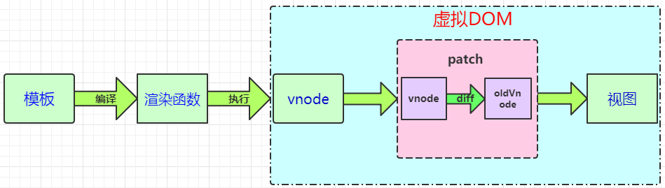
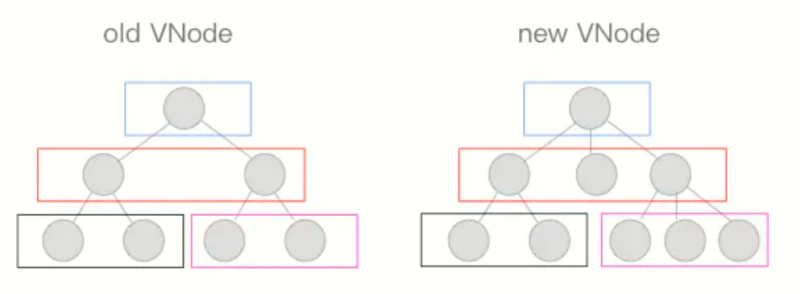
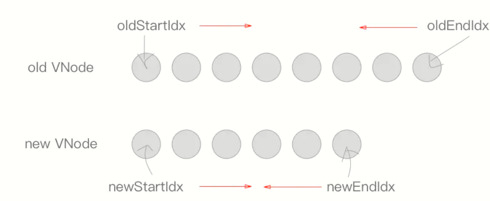
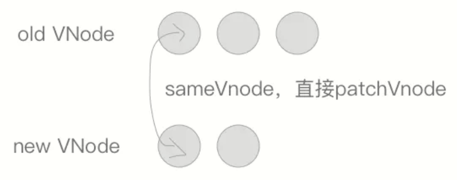
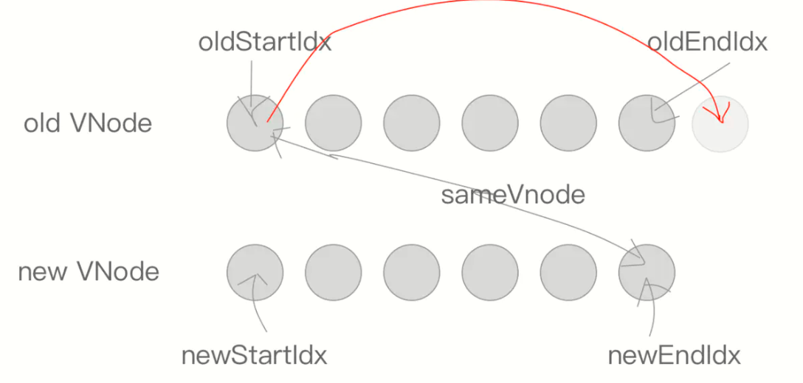
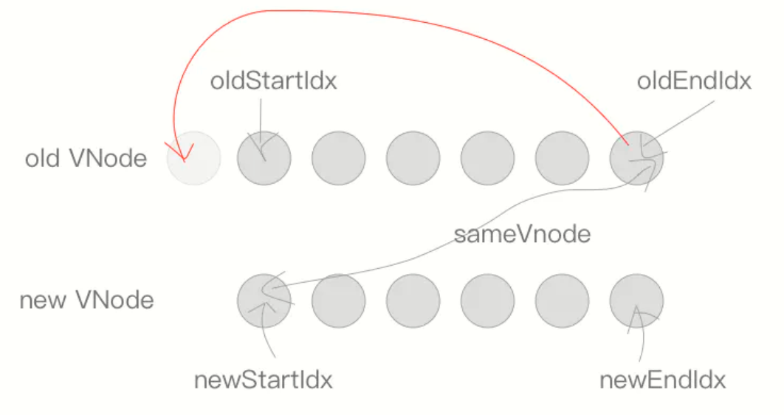
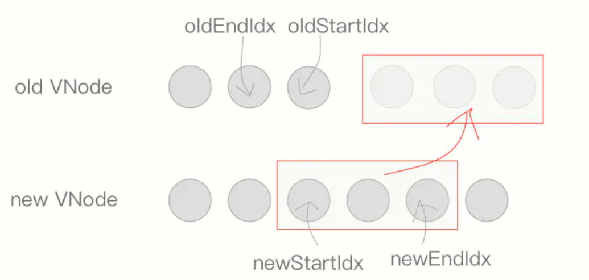

# 虚拟DOM与diff算法


- vue通过编译模板生成render函数，调用render生成vnode，在第一次调用render的时候会触发依赖收集，以便之后更新操作。
- 当生成vnode之后会调用patch进行比对，以便检测出区别，对不同的地方做重新修改，最后渲染成真实DOM

## 虚拟DOM

- vue通过对template解析生成render函数，调用render函数生成vnode，构成虚拟DOM树
- 虚拟DOM其实就是一种使用js对象结构来表示真实DOM的结构，通过对vnode还原出真实DOM结构。就像数据格式化一样，把一种数据先格式化成另一种我们看的懂得语言，进行操作之后再还原

```html
<div id="app">
  <div class="header">
    <span>头部</span>
  </div>
  <h2 class="title">标题</h2>
</div>
```

以上这种简单得html结构，可以用以下这种虚拟DOM来表示

```js js
const app = {
  tag: 'div',
  props: {
    id: 'app'
  },
  children: [{
      tag: 'div',
      props: {
        class: 'header'
      },
      children: [{
        tag: 'span',
        children: '头部'
      }]
    },
    {
      tag: 'h2',
      props: {
        class: 'title'
      },
      children: '标题'
    }
  ]
}
```

- 当然VDOM不是vue独有的，所以对于不同的框架，他们解析出来的vnode结构也有所不同，当都是用来体现真实DOM的一些必要的属性

### 解析过程



- vue的组件模板编译生成成render之后，当挂载完成后会生成vnode，此时数据已经是响应式的，之后如果需要更新将会对新旧vnode进行diff算法算出区别，并且在更新之后，把只需要更新的部分生成真实DOM替换掉旧DOM，这样就可以以最小的开销来更新DOM，这就很类似浏览器对每次重排的优化一样
- 这里不介绍如何使用正则匹配template的内容生成ast过程，通过对template解析生成ast，再对ast进行静态节点优化等，接着进行generate生成一个render字符串，如下结构

```js js
with(this){
    return (isShow) ? 
    _c(
        'div',
        {
            staticClass: "demo",
            class: c
        },
        _l(
            (sz),
            function(item){
                return _c('span',[_v(_s(item))])
            }
        )
    )
    : _e()
}
```

- 此时就生成了一个render函数，其中有许多_c、_l等，是一个个生成vnode的函数，这里简单演示一个

vnode构造函数

```js js
// 构造一个vnode
function Element(tagName,props,children){
  this.tagName=tagName
  this.props=props
  this.children=children
  // 判断此元素是否有绑定key的值,用于diff优化
  if(props.key) this.key=props.key;
  this.count=children.reduce((pre,child,i)=>{
    // 获取子元素个数
    if(child instanceof Element){
      pre+=child.count
    }else{
      children[i]=''+child
    }
    return ++pre
  },0)
}
// 生成一个vnode
function createElement(tagName,props,children){
  return new Element(tagName,props,children)
}
```

以上就是一个简单的创建vnode元素的函数，通过generate解析AST编译成由vnode构造函数组成的render函数，当调用此函数时，就会生成一个与template对应的VDOM，对VDOM进行diff差异化查找之后，更新的部分重新生成真实DOM替换原来旧位置的DOM

接下来看看如何把vnode还原成真实DOM，这里只演示简单的通过vnode还原成真实DOM

```js js
const app = {
  tag: 'div',
  props: {
    id: 'app'
  },
  children: [{
      tag: 'div',
      props: {
        class: 'header'
      },
      children: [{
        tag: 'span',
        children: '头部'
      }]
    },
    {
      tag: 'h2',
      props: {
        class: 'title'
      },
      children: '标题'
    }
  ]
}

function createDOM(VNode, root = null) {
  // 是元素节点
  if (typeof VNode === 'object' && VNode !== null) {
    let node = null
    if (!root) { // 根节点
      root = document.createElement(VNode.tag || 'div')
      node = root
    } else { //子节点
      const child = document.createElement(VNode.tag || 'div')
      root.appendChild(child)
      node = root.lastChild
    }
    // 设置属性
    if (VNode.props) {
      for (const key in VNode.props) {
        node.setAttribute(key, VNode.props[key])
      }
    }
    // 文本节点
    if (typeof VNode.children === 'string') {
      createDOM(VNode.children, node)
    } else {
      // 元素节点
      VNode.children.forEach((el) => {
        createDOM(el, node)
      })
    }
  } else {
    root.textContent = VNode
  }
  return root
}
console.log(createDOM(app));
```


这样子就把一个简单的虚拟DOM还原成真实DOM了


## diff算法

- patch的核心：diff算法
- 用 diff 算法可以比对出两颗树的「差异」


- 如果用普通的遍历来对比不同，那么时间复杂度可以达到O(n^3)，这是一个不可用的算法，vue为了解决这个难题采用层次遍历，每次只比对同层节点这样时间复杂度直接降为O(n)，大大提高效率



- patch把两颗VDOM树的差异更新到视图中，那么就需要传入2个对比的节点以及其原本的父级节点
- 其中有3种情况
  - 没有oldVNode那么说明是最开始的渲染，则直接添加到父节点上
  - 没有newVNode则说明是删除节点，那么会从父节点中删除旧节点
  - 如果都存在，那么说明需要对比出差异，则进行diff算法计算
    - 如果是key值、tag、isComment(注释节点)、有或没有data等，则判断为相同节点
    - 其他则为不同节点，那么将会进行diff计算差异

### diff过程

- 当新节点为文本节点时直接用textContent设置值
- 当新节点不是文本节点时
  - 如果新旧都有孩子那么通过updateChild更新子节点们的区别
  - 当只有新节点有孩子时，如果老节点是文本节点那么清除文本，再把新节点插入到父节点下
  - 当只有老节点有孩子时，那么说明需要清除此节点
  - 当只有老节点是文本节点，那么也清除文本内容

代码如下

```js js
if (oldCh && ch && (oldCh !== ch)) {
    updateChildren(elm, oldCh, ch);
} else if (ch) {
    if (oldVnode.text) nodeOps.setTextContent(elm, '');
    addVnodes(elm, null, ch, 0, ch.length - 1);
} else if (oldCh) {
    removeVnodes(elm, oldCh, 0, oldCh.length - 1)
} else if (oldVnode.text) {
    nodeOps.setTextContent(elm, '')
}
```

接下来就剩比对孩子们的差异了，也是diff最复杂的地方


- 使用4个指针，即新头、新尾、旧头、旧尾，存放的是指向节点的索引
- 使用4个变量保存这4个指针指向的节点
- 首先从两头开始往中间靠拢对比，新头与旧头，新尾与旧尾



当遇到相同节点，则移到下一位置对比




如果是旧头与新尾相同，那么把旧头移到旧尾，旧头指针后移，新尾指针前移



如果是旧尾与新头相同，那么把旧尾移到旧头，旧尾指针前移，新头指针后移



最后剩下都不符合的情况，这也是最复杂的情况


如果存在key值，则从新节点中根据key的值查找是否有相同的旧节点，如果有移动到旧头部，如果没有相同key或者对比不存在那么将会创建一个相同新节点并插入到旧头部，并且后移新头



当旧节点头尾指针相碰时，新头尾却没有，那么就将剩余的新节点添加到旧节点尾部，这样就更新完成了


当新头尾相碰，而旧头尾却没有，那么就将剩余的旧节点删除，这样就更新成功

以上就是diff算法判断流程，主要是对各种情况分开讨论，当然也有些优化是 只针对常见的情况，而不是特殊情况，这样才能满足大部分需求，比如父 节点不同，即使子节点有相同的，那么还是统一删除，而不是再对子节点做判断，这也是根据我们平时的思维来判断大部分情况的可能

当然代码就不贴了哈哈