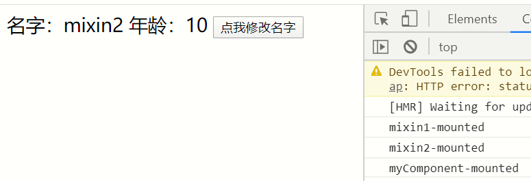
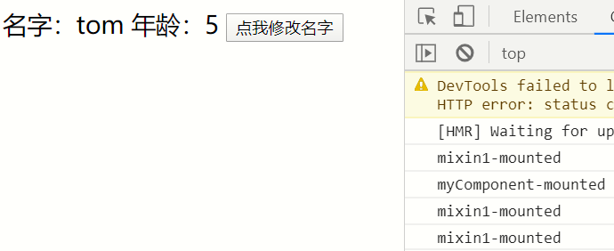

# vue重点知识

- 这篇主要统一介绍vue中常见或者是重点，也有些是个人认为比较重要的一些细节方面

## Mixin混入

- mixin可用于抽离复用的代码，当需要使用的时候混入到当前组件中即可，当然mixin中的数据可能与当前组件的数据有冲突的地方，接下来看看mixin是如何混入的

### 组件混入

```html
// mixin.js
export default {
  data(){
    return {
      name:'jerry',
    }
  },
  methods:{
    getName(){
      return this.name='tom'
    }
  },
  mounted(){
    console.log('mixin-mounted')
  }
}
// myComponent.vue
<template>
  <div>
    名字：{{ name }} 年龄：{{ age }}
    <button @click="getName">点我修改名字</button>
  </div>
</template>

<script>
import myMixin from './mixin'
export default {
  mixins: [myMixin], // 混入数据
  data() {
    return {
      age: 5
    }
  },
  mounted() {
    console.log('myComponent-mounted')
  }
}
</script>
```


- 通过结果可以看的确实混入到当前组件中，其实就是把mixin.js中对应数据进行混合，加入到当前组件中，可以看到混入之后的生命周期执行顺序不是嵌套组件那样，貌似所有混入的钩子都在当前组件钩子之前触发，而且并没有覆盖钩子，似乎是进行顺序调用的
- 再看看如果是相同数据和方法会是如何混合的

```html
// mixin1.js
export default {
  data(){
    return {
      name:'mixin1',
      age:8
    }
  },
  methods:{
    getName(){
      return this.name='tom'
    }
  },
  mounted(){
    console.log('mixin1-mounted')
  }
}
// mixin2.js
export default {
  data(){
    return {
      name:'mixin2',
    }
  },
  methods:{
    getName(){
      return this.age=10
    }
  },
  mounted(){
    console.log('mixin2-mounted')
  }
}
// myComponent
<template>
  <div>
    名字：{{ name }} 年龄：{{ age }}
    <button @click="getName">点我修改名字</button>
  </div>
</template>

<script>
import myMixin1 from './mixin1'
import myMixin2 from './mixin2'

export default {
  mixins: [myMixin1, myMixin2], // 混入数据
  data() {
    return {
      age: 5
    }
  },
  mounted() {
    console.log('myComponent-mounted')
  }
}
</script>
```



- 从结果中可以看到，如果是多个mixin混入，那么将会取最后一个混入作为数据，当然如果本身组件有这个属性，那么还是以当前组件为主，而且如果是钩子按照混入顺序执行，组件自身相对于最后混入，如果是普通方法则是后混入的覆盖前面的

### 全局混入

- 如果在全局混入那么之后的每个vue实例都会带有混入的数据

```html
// main.js
import Vue from "vue";
import App from "./App.vue";
import router from "./router";
import store from "./store";
import mixin1 from "./views/mixin1";

Vue.config.productionTip = false;
Vue.mixin(mixin1) // 全局混入

new Vue({
  router,
  store,
  render: h => h(App)
}).$mount("#app");
// myComponent
<template>
  <div>
    名字：{{ name }} 年龄：{{ age }}
    <button @click="getName">点我修改名字</button>
  </div>
</template>

<script>
export default {
  data() {
    return {
      age: 5
    }
  },
  mounted() {
    console.log('myComponent-mounted')
  }
}
</script>
```



- 可以看的这时候虽然myComponent没有单独混入mixin1.js但是由于在全局中混入，所以之后创建的每个vue都带有这些数据
- 如果是插件，那么可以使用`Vue.use(插件)，此时vue会调用插件内部的install，进行混入到Vue中，之后的实例也都带有插件的数据

mixin利弊：

- 利：
  - 可以抽离公共代码，提高代码复用
- 弊：
  - 但是如果很多组件都要混入许多mixin那么就会导致后期的维护问题，不仅变量函数不够明确、不利于阅读，而且多个mixin可以会存在变量覆盖、命名冲突，使用过的的mixin可能出现多对多的关系，复杂度较高

## v-if与v-show

- 相同点
  - v-if与v-show都是控制标签是否显示
- 不同点
  - v-if可以控制标签是否被渲染，也就是是否会生成DOM，如果判断为false，那么则不会被生成VDOM，更不会被生成真实DOM，可以理解成存不存在
  - v-show只是通过简单的控制css的样式，如果是隐藏则设置为`display:none`，如果是显示则去掉这个属性，就像给他增加一个隐藏的`class`一样


- 可以看的，此时判断都为false，v-if用注释节点来占位，而v-show直接设置为`display:none`


- 此时显示的时候v-if节点渲染出来了，而v-show的display去掉了

这样我们可以得出一个结论：如果是频繁切换的标签或者组件可以使用v-show来控制，如果是大组件，而且不是特别常用，那么可以在需要使用的时候在生成DOM，比如首屏优化的时候一开始用v-if不生成DOM，等需要的时候生成，这样可以提高首屏渲染速度

- 说到这里顺便讲一下css的display与visibale
- `display:none`，则不显示对应的元素，在文档布局中不再分配空间（回流+重绘）
- `visibility:hidden`隐藏对应元素，在文档布局中仍保留原来的空间（重绘）


选中display，此时页面根本没有出现其位置，也就意味着不存在页面中，不占位置，当需要显示的时候会触发回流和重绘


选中visibility可以看到页面中存在这个元素，当需要显示的时候只会触发重绘

这样一看visibility类似v-show，display类似v-if，同样道理根据元素切换的频率来使用这些属性，如果是首页也可以根据这些特性进行优化加载

## v-if与v-for使用时机

- vue不推荐我们同时在一个元素中使用v-if与v-for，由于v-for的渲染优先级高于v-if，所以只会等到v-for把元素都渲染出来才会再进行v-if判断，这样一来导致了重复的v-if判断，其中尽量都要绑定唯一key值，这样在每次diff计算中可以优化性能，减少对比次数
- 如果一定要使用，那么请把v-if放在v-for循环的父元素上，这样一开始就能进行判断是否渲染，或者放在循环之内，用于内部元素判断是否渲染

## computed与watch

- computed是计算属性，它的特点就是可以缓存，如果数据不变则它返回的结果也不会改变，可以提高性能
- watch是监听数据的变动，当数据改变时就会触发对应的回调，传入参数就是新旧数据，这里有一点需要注意，如果监听的是引用数据，那么新旧参数是指向同一个内存地址，是获取不到旧值的，而值类型数据可以，watch不能使用箭头函数，因为那样获取不到this指向不了vue实例，如果需要watch可以开启深度监听，即设置deep属性为true则可以监听对象内部深层数据的变动

computed主要用来那些可以缓存，且经常读取的数据，watch用于监听那些经常改变，而且改变时需要做出操作的数据

## 事件

- 当事件需要传递而外参数时，则需要手动传递`$event`，如果不写参数默认会传这个事件对象
- vue中可以使用事件修饰符来修饰事件，达到不同的效果，也就是类似原生事件的一些方法，如下
  - .stop // 停止事件传播
  - .prevent  // 提交事件不在重载页面
  - .capture  // 使用事件捕获，即内部元素触发的事件先在此处理，然后才交由内部元素进行处理
  - .self // 只当在 event.target 是当前元素自身时触发处理函数
  - .once // 事件将只会触发一次
  - .passive  // 滚动事件的默认行为 (即滚动行为) 将会立即触发
  - 不要把 .passive 和 .prevent 一起使用
- 当然还包括一些按键修饰符等

## v-model

- 双向绑定数据，用于表单元素绑定value的值
- 修饰符：trim去掉两边空格、lazy输入不会立即同步显示、number只能输入数字

### 自定义v-model

- vue2.2.0新增可以自定义v-model绑定的事件以及属性
- 通过model来设置绑定的prop与event

```html
// 父组件
<template>
  <div>
    请输入<span>{{ text1 }}</span>
    <Children1 v-model="text"></Children1>
  </div>
</template>

<script>
import Children1 from './Children1'

export default {
  components: {
    Children1
  },
  data() {
    return {
      text: '55'
    }
  }
}
</script>
// 子组件
<template>
  <div>
    <input
      type="text"
      :value="text1"
      @input="$emit('change', $event.target.value)"
    />
  </div>
</template>

<script>
export default {
  model: {
    prop: 'text1',
    event: 'change'
  },
  props: {
    text1: {
      type: String,
      default: ''
    }
  }
}
</script>
```

父组件可以通过v-model绑定子组件中的input触发的事件以及改变的值，在子组件的我们自定义绑定的事件以及属性，重点是在model对象以及触发事件时调用`$emit`

## `$nextTick`

- `$nextTick`可以DOM更新之后再调用，在一般情况下，我们对数据进行操作后，DOM是还未发生改变
- 由于vue的异步渲染机制，可以把多次操作在一次异步调用的时候统一执行，而且只会保留最后的结果渲染出来，等到渲染结束之后会调用`$nextTick`的回调

```html
<template>
  <div>
    <ul ref="ul">
      <li v-for="key in list" :key="key">{{ key }}</li>
    </ul>
    <button @click="change">change</button>
  </div>
</template>

<script>
export default {
  data() {
    return {
      age: 1,
      list: [1]
    }
  },
  methods: {
    change() {
      this.list.push(++this.age)
      this.list.push(++this.age)
      this.list.push(++this.age)
      console.log(this.$refs.ul.childNodes.length) // 1,4,7
      this.$nextTick(() => {
        console.log(this.$refs.ul.childNodes.length)  // 4,7,10
      })
    }
  }
}
</script>
```

可以看的`$nextTick`总是在DOM渲染之后才执行，这样就能获取到最新的DOM数据，如果你是要等数据在DOM中渲染之后获取DOM，那么需要在`$nextTick`回调中操作，简单说本轮的数据只会在下一轮事件循环的DOM中体现，而`$nextTick`正是在下一次事件循环开始执行的异步操作，此时DOM已经渲染更新了

## `slot`

- 插槽可以理解成组件中的占位符，有些情况下可能不知道组件的具体形式，那么可以通过外部传入来替代组件插槽位置的内容
- 如果组件没有插槽那么将会忽略使用此组件时传入到标签内部的数据

```html
// 父组件
<template>
  <div>
    <Children1 :text="text">
      <div id="slot">这是插槽</div>
    </Children1>
  </div>
</template>

<script>
import Children1 from './Children1'
export default {
  components: {
    Children1
  },
  data() {
    return {
      text: 'hi'
    }
  }
}
</script>

<style scoped>
#slot {
  width: 100px;
  height: 100px;
  background-color: bisque;
}
</style>
// 子组件
<template>
  <div id="child">{{text}}
    <slot>后备内容</slot>
  </div>
</template>

<script>
export default {
  props: {
    text: {
      type: String,
      default: ''
    }
  }
}
</script>
<style  scoped>
#child{
  background-color:aqua;
  width: 200px;
  height: 200px;
}
</style>
```

在父组件中使用子组件，并且在子组件标签内部传入数据，那么在子组件模板中定义的slot插槽将会被传入的数据替代

- 其中插槽的作用域只与使用的地方有个，比如在父组件中使用子组件的插槽，那么插槽的内容区域的作用域就是父组件，而不是定义插槽的子组件内部
- 记住：父级模板里的所有内容都是在父级作用域中编译的；子模板里的所有内容都是在子作用域中编译的。
- 在定义插槽的时候定义默认显示的内容，那样就可以在没有传入数据的时候显示默认内容了

### 具名插槽

- 在vue2.6.0之后使用v-slot替代slot与slot-scope，当然虽然这些也都能使用，不过还是推荐使用最新指令
- 具名插槽就是在定义的时候给slot添加name属性，指定每个slot的名字，这样如果外部使用的时候可以根据内部定义的slot的name来选择替换对应的插槽位置

```html
// 父组件
<template>
  <div>
    <Children1 :text="text">
      <template v-slot:two>
        <div id="slot">这是插槽two</div>
      </template>
      <template v-slot:one>
        <div id="slot">这是插槽one</div>
      </template>
    </Children1>
  </div>
</template>

<script>
import Children1 from './Children1'
export default {
  components: {
    Children1
  },
  data() {
    return {
      text: 'hi'
    }
  }
}
</script>

<style scoped>
#slot {
  width: 100px;
  height: 100px;
  background-color: bisque;
}
</style>
// 子组件
<template>
  <div id="child">
    {{ text }}
    <slot name="one">one</slot>
    <slot name="two">two</slot>
  </div>
</template>

<script>
export default {
  props: {
    text: {
      type: String,
      default: ''
    }
  }
}
</script>
<style scoped>
#child {
  background-color: aqua;
  width: 200px;
  height: 200px;
}
</style>
```

这样一来就可以根据选定的slot的name对应替换内容了，这里要注意，`使用具名插槽时需要用template来包含替换的内容，而且v-slot属性需要在template中设置，而不是直接在替换内容中设置`。而且如果没有使用template包裹的内容将会替换默认slot，也就是没有设置name属性的插槽。注意 v-slot 只能添加在 `<template>` 上

### 作用域插槽

- 当你在插槽中需要使用到子组件内部数据时，就可以使用作用域插槽
- 作用域插槽在定义的时候通过v-bind绑定定义时的数据在插槽上，当父组件需要使用的时候通过v-slot获取所绑定的数据
- v-bind的数据作为组件的prop属性

```html
// 父组件
<template>
  <div>
    <Children1 :text="text">
      <template v-slot:default="data">
        <div id="slot">
          这是插槽name:{{ data.user.name }} age:{{ data.user.age }}
        </div>
      </template>
    </Children1>
  </div>
</template>

<script>
import Children1 from './Children1'
export default {
  components: {
    Children1
  },
  data() {
    return {
      text: 'hi'
    }
  }
}
</script>

<style scoped>
#slot {
  width: 100px;
  height: 100px;
  background-color: bisque;
}
</style>
// 子组件
<template>
  <div id="child">
    {{ text }}
    <slot v-bind:user="user">{{ user.name }}</slot>
  </div>
</template>

<script>
export default {
  props: {
    text: {
      type: String,
      default: ''
    }
  },
  data() {
    return {
      user: {
        name: 'tom',
        age: 5
      }
    }
  }
}
</script>
<style scoped>
#child {
  background-color: aqua;
  width: 200px;
  height: 200px;
}
</style>
```

此时父组件通过v-slot来获取子组件定义时绑定的数据，从而就能在父组件的插槽中使用子组件定义的数据。当只有使用的是默认插槽绑定数据时，可以把v-slot直接写在组件标签上，而不用写在template中。但是如果有多个slot那么还是必须写在template中。v-slot:可以缩写成#，也可以通过`v-slot:[变量]`来动态绑定插槽

## 动态/异步/缓存组件

- 当有的时候可能需要动态渲染组件，比如主页框架一致的情况下，通过控制渲染的组件不同来达到不同的效果，那么可以使用动态组件
- 动态组件通过component动态绑定is为需要渲染的组件名

```html
<template>
  <div>
    <div v-for="val in comp" :key="val">
      <keep-alive>
        <component :is="val"></component>
      </keep-alive>
    </div>
  </div>
</template>

<script>
export default {
  components: {
    Children1: () => import('./Children1'),
    Children2: () => import('./Children2')
  },
  data() {
    return {
      comp: ['Children1', 'Children2']
    }
  }
}
</script>

<style scoped>
#slot {
  width: 100px;
  height: 100px;
  background-color: bisque;
}
</style>
```

这样一来可以根据渲染的组件列表来渲染不同的组件，同时使用import异步加载组件，只有当组件使用的时候才会加载，并且配合keep-alive缓存组件，阻止组件销毁

- 动态组件可以让我们按照需求渲染不同的组件
- 异步组件可以让我们异步加载组件，等需要使用的时候才加载
- 缓存组件可以避免频繁创建销毁的性能开销

<Vssue title="Vue.js issue" />