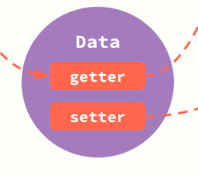
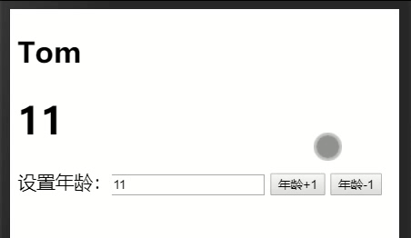

# 双向绑定以及响应式原理


- vue双向绑定的核心原理是使用观察者模式通过数据劫持以及发布订阅者模式实现更新视图，其中观察者模式通过defineProperty设置getter与setter来实现数据劫持，在getter中收集依赖，在setter中通知依赖更新
- vue使用mvvm架构，其中m为model也就是数据模型，v为view，即DOM视图，vm就是viewModel视图模型
- 原生DOM已经实现view=>model，也就是通过DOM事件监听，回调函数来实现改变数据
- vue的响应式原理，通过js的对象访问器属性，拦截对象属性的操作，通过设置getter与setter来监听数据请求与变更，这样我们就可以在数据改变的时候做出我们想要的操作，比如更新DOM的内容为改变的值，这里就实现了model=>view的操作
- vue的双向绑定是基于数据响应式以及事件监听来实现，是view与model的中间人，用于视图与数据模型的双向操作

## 响应式原理


- 数据响应式的任务就是，监听数据的改变，同步渲染view视图的变化，也就是数据变化DOM也更新内容

### 数据劫持



代码演示

```js js
const obj={
  name:'tom',
  age:5
}
// 劫持name属性
Object.defineProperty(obj,'name',{
  enumerable:true,
  configurable:true,
  get(){
    console.log(`获取属性name，值为${this.value}`)
    return this.value
  },
  set(val){
    this.value=val
    console.log(`更新属性name，值为${this.value}`)
  }
})
obj.name='jerry'  // 成功劫持setter
const name=obj.name // 成功劫持getter
obj.age=3 // 没有劫持
```

> 此处注意，只能劫持之后的操作，对于设置getter与setter之前的操作无效

以上演示了js的对象属性劫持，接下来结合DOM实现最简单的数据响应式

```js js
<div id="app">hi</div>
<script>
  const obj={
    text:null
  }
  Object.defineProperty(obj,'text',{
    enumerable:true,
    configurable:true,
    get(){
      // 选择元素，返回元素文本内容
      const app=document.querySelector('#app')
      return app.textContent
    },
    set(val){
      // 更新元素内容为设置的值
      const app=document.querySelector('#app')
      app.textContent=val
    }
  })
  console.log(obj.text) // hi
  obj.text='hello' // view更新为hello
</script>
```

可以看到，我们在数据更新的时候重新替换了元素显示的文本内容，当get数据的时候我们通过选择器获取到元素的文本内容并且返回，由于vue是数据驱动视图，数据由model来控制，view是用来显示数据，我们不需要每次获取数据的时候都通过选择器来获取元素，在vue的双向绑定中通过监听输入事件触发更新数据

- 由于我们在vue中定义的data对象可能是个超大的数据模型，那么就需要对其中的每个属性都添加响应式
- 由于属性可能还包含对象，可能嵌套的很深，那么最深层的属性变更时，就要引起所有包含这个属性的对象发生更新，就类似DOM事件的冒泡，需要对所有祖先进行更新，这么一来就需要用到一个Dep，用来收集这个属性的所有依赖
- Dep简单说就是一个订阅器，订阅某个属性的所有祖先对象，当这个属性变更时通知所有的祖先进行更新操作

#### 递归劫持以及依赖收集


```js js
/* ----------------------数据监听器---------------------- */
// 监听器
function Observer(data) {
  // 监听器数据本身为传入数据
  this.data = data
  // 给所有属性添加数据拦截
  this.walk(data)
}
Observer.prototype.walk = function (data) {
  // 保存监听器实例的this
  const self = this
  Object.keys(data).forEach((key) => {
    // 遍历所有的属性名，给所有属性添加数据劫持
    this.defineReactive(data, key, data[key]) // 传入原对象，键，值
  })
}
// 设置数据劫持
Observer.prototype.defineReactive = function (data, key, val) {
  observer(val);
  // 为此属性创建一个依赖收集器，也就是订阅者收集
  const dep = new Dep()
  // 此时可以给所有属性添加拦截
  Object.defineProperty(data, key, {
    enumerable: true, // 可遍历
    configurable: true, // 可配置
    // 定义getter与setter拦截
    get() {
      // 如果是第一次get此属性那么就要添加到依赖中，也就是要收集所有的订阅者
      if (Dep.target) {
        dep.addSub(Dep.target) // 添加watcher，此处的Dep.target就是实例化watcher时的实例
      }
      return val
    },
    set(newVal) {
      // 如果数据没有改变则不需要操作
      if (val === newVal) return
      // 发生变更，替换数据，并且通知所有订阅者
      val = newVal
      // 通知订阅者,dep为每个属性的订阅者列表
      dep.notify()
    }
  })
}
// 用于给子属性创建监听器
function observer(data) {
  // 判断属性是否还为对象，如果还为对象，则继续设置监听器
  if (typeof data === 'object' && data !== null) {
    // 创建新监听器
    return new Observer(data)
  }
}
/* -------------------依赖收集器------------------- */
// 依赖收集构造器
function Dep() {
  this.subs = [] // 依赖列表
}
// 依赖收集器的原型方法，用来给每个属性的订阅者列表执行相同的操作
// 比如批量通知订阅者更新、添加订阅者，sub指代订阅者
Dep.prototype.addSub = function (sub) {
  this.subs.push(sub) // 添加订阅者到订阅列表
}
// 批量通知订阅者们
Dep.prototype.notify = function () {
  // 通知每个订阅者，调用他们的update方法，即更新操作
  this.subs.forEach((sub) => {
    sub.update()
  })
}
```

- 以上代码中，Observer为监听构造器，用于设置所有对象属性的拦截，其中defineReactive是用来设置每个属性的getter与setter也就是数据劫持用，主要就是通过这个方法来实现对数据的监听
- Dep为订阅构造器，用于实例化属性的订阅列表，即依赖收集。通过调用实例的添加订阅者以及通知订阅者方法，来实现添加属性依赖，以及通知数据变化

### 订阅者


- 接下来实现订阅者构造器Watcher，其中订阅者需要做的就是当创建订阅者的时候把自身设置为未订阅状态，当通知更新的时候执行更新方法，当订阅者收到更新通知后需要对更新做自己的判断，所以需要一个自定义回调函数，传入的就是每次更新前后的数据

```js js
/* defineReactive中的getter */
get() {
  // 如果是第一次get此属性那么就要添加到依赖中，也就是要收集所有的订阅者
  if (Dep.target) {
    dep.addSub(Dep.target) // 添加watcher，此处的Dep.target就是实例化watcher时的实例
  }
  return val
},
/* --------------------订阅者-------------------- */
// 订阅者构造器
function Watcher(vm, key, callback) {
  // viewModel实例
  this.vm = vm
  // 订阅的属性
  this.key = key
  // 更新时触发的回调
  this.callback = callback
  // 订阅者本身的值，即订阅者对象
  this.value = this.get() // 调用get用于触发初始化依赖收集
}
// 触发初始化依赖收集
Watcher.prototype.get = function () {
  // 临时订阅者缓存，为当前订阅者
  Dep.target = this
  // 触发依赖收集，由于直接去获取data对象的数据就会触发其getter所以这里就直接取属性值
  // this.vm.data就是vm实例对应都设置过数据拦截之后的data对象，获取订阅属性的值
  const value = this.vm.data[this.key]
  // 清空临时缓存
  Dep.target = null
  // 返回依赖收集后的值，即订阅者初始值
  return value
}
// 更新Watcher实例数据后执行回调
Watcher.prototype.run = function () {
  // 触发getter获取最新数据
  const newVal = this.vm.data[this.key]
  // 旧值
  const oldVal = this.value
  // 不需要更新数据
  if (newVal === oldVal) return
  // 需要更新数据，触发回调,需要绑定this为vm实例
  this.value = newVal
  this.callback.call(this.vm, newVal, oldVal)
}
// 更新方法
Watcher.prototype.update = function () {
  // 当通知变化时，执行的操作，此处只执行订阅者的run方法
  this.run()
}
// 初始化缓存
Dep.target = null
```

- 以上这些就大致实现了数据劫持、依赖收集、发布订阅以及订阅者执行相关更新操作
- 这里只处理了大致的数据监听、变更通知，还未实现对DOM的更新，由于vue中的数据响应式不仅可以把数据写在标签的属性中，还可以以模板形式嵌入到内容中，所以需要对节点做属性解析以及内容解析

### 解析DOM

- 解析DOM节点可以根据需求来解析，如果是使用模板那么就要解析文本节点，如果不是则需要解析节点属性，即自定义属性，通过对自定义属性名检索，获取指令类型，通过对不同指令进行不同的解析以及操作，来达到效果
- 比如解析到文本的模板，那么就要到data中取对应的数据来覆盖文本节点的内容
- 如果获取到的是事件指令那么要根据事件名以及事件回调来注册事件
- 如果是数据绑定指令，那么需要给数据收集依赖，以便观察更新
- 这些实现了数据的响应式，也就是通过数据驱动视图，但是如果想要达到双向绑定，那么就需要同时注册输入事件以及收集依赖

```js js
/* -----------------------解析DOM------------------------ */
// 解析构造器，用于构造一个DOM解析实例
function Compile(el, vm) {
  // 获取DOM
  this.node = document.querySelector(el)
  this.vm = vm
  // 临时DOM仓库
  this.fragment = null
  // 初始化，主要是把真实DOM转成临时DOM仓库，多次修改不会影响原DOM
  this.init()
}
// 初始化，把原DOM内容，转成临时DOM，修改完再append
Compile.prototype.init = function () {
  // 判断是否存在ele
  if (!this.node) throw new TypeError('无法找到绑定的DOM节点')
  // 存在
  // 把原DOM转成临时文档片段仓库，用于批量修改DOM再一次性添加重排
  this.fragment = this.nodeToFragment(this.node)
  // 解析DOM节点，并且更新
  this.compileNodes(this.fragment)
  // 把更新后的DOM添加到原节点内
  this.node.appendChild(this.fragment)
}
Compile.prototype.nodeToFragment = function (node) {
  // 创建仓库
  const fragment = document.createDocumentFragment()
  // 取第一个孩子
  let child = node.firstChild
  // 把node的全部子孙移动到仓库中
  while (child) {
    fragment.appendChild(node.firstChild) // 一个个移除node到仓库
    child = node.firstChild
  }
  return fragment // 返回仓库
}
// 解析节点，需要对属性以及内容加以解析
Compile.prototype.compileNodes = function (frag) {
  // 保存this
  const self = this
  // 获取所有子节点
  const childNodes = frag.childNodes
  // 定义正则，匹配模板
  const reg = /\{\{(.*)\}\}/;
  // 遍历所有子节点，节点可能为元素节点以及文本节点，主要解析文本和属性，其他不解析
  [].slice.call(childNodes).forEach((node) => {
    // 获取文本内容
    const text = node.textContent
    // 元素节点，使用属性解析
    if (node.nodeType === 1) {
      self.compileAttr(node)
    } else if (node.nodeType === 3 && reg.test(text)) {
      // 文本节点，有模板，使用模板解析，否则不解析
      // 还需要传入匹配到的模板内的变量名，即绑定的对象属性名，匹配组1
      self.compileText(node, reg.exec(text)[1])
    }
    // 如果还有子节点，递归解析
    if (node.childNodes && node.childNodes.length) {
      self.compileNodes(node)
    }
  })
}
Compile.prototype.compileAttr = function (node) {
  const self = this
  // 获取所有的元素属性
  const attrs = node.attributes;
  Array.prototype.forEach.call(attrs, (attr, index) => {
    // 过滤非数字键
    if (typeof index !== 'number') return
    // 获取属性名，此处可能是使用v-或者on:之类的属性名，要区分
    // 还需匹配缩写形式
    const attrName = attr.name
    // 普通数据绑定指令v-bind:或者:
    if (self.isDirective(attrName)) {
      self.updateAttr(node, attrName, attr.value) // 把属性值以及绑定变量名传入
    } else if (self.isEventDirective(attrName)) { // 事件指令
      self.updateEvent(node, attrName, attr.value) // 把属性值以及事件名传入
    }
    // 清除属性
    node.removeAttribute(attrName)
  })
}
// 解析模板，添加模板变量的订阅者
Compile.prototype.compileText = function (node, key) {
  const self = this
  // 初始值，此实际值为data对象中设置的初始值，更新到模板上
  const initVal = this.vm.data[key] // 这就是数据驱动
  // 更新初始视图
  this.updateText(node, initVal)
  // 创建一个订阅者，当此模板变量对应的属性值改变时将会触发回调
  // 第一次没有创建订阅者，需要手动更新，之后可以通过回调自动更新
  new Watcher(this.vm, key, (newVal, oldVal) => {
    self.updateText(node, newVal)
  })
}

// 判断为事件指令
Compile.prototype.isEventDirective = function (attrName) {
  // 判断是否为v-on:开头或者@开头
  return attrName.indexOf('v-on:') === 0 || attrName.indexOf('@') === 0
}
// 判断为数据绑定指令
Compile.prototype.isDirective = function (attrName) {
  // 判断是否为v-bind:开头或者:开头
  return attrName.indexOf('v-bind:') === 0 || attrName.indexOf(':') === 0
}
// 更新文本内容
Compile.prototype.updateText = function (node, value) {
  node.textContent = value === undefined || value === null ? '' : value
}
// 解析事件属性，注册事件
Compile.prototype.updateEvent = function (node, attrName, value) {
  const eventName = attrName.split(':')[1] || attrName.slice(1)
  // 获取对应执行的方法
  const method = this.vm.methods && this.vm.methods[value]
  // 判断是否有定义的方法
  if (eventName && method) {
    // 添加注册指定的事件
    node.addEventListener(eventName, method.bind(this.vm))
  } else {
    throw new TypeError('未指定事件回调方法')
  }
}
// 解析数据绑定，更新数据
Compile.prototype.updateAttr = function (node, attrName, value) {
  // 获取属性名
  const key = attrName.split(':')[1]
  // 获取对应的数据
  const val = this.vm.data[key]
  if (val !== value) {
    // 有更新，重新设置属性值
    node.setAttribute(attrName, val.toString())
  }
  // 更新属性值
  new Watcher(this.vm, key, (newVal, oldVal) => {
    node.setAttribute(attrName, newVal.toString())
  })
}
```

以上大概都是数据响应式的核心了，接下来在数据响应式的基础上增加view=>model也就是利于事件监听来实现数据双向绑定

## 双向绑定


- vue最核心的就是数据响应式，双向绑定只是利用原生DOM提供的事件监听来实现视图到模型的更新，而数据响应式的核心就是数据模型到视图的更新
- 结合数据响应式以及DOM事件监听可以实现双向绑定，由于大部分只有表单元素才具有输入监听事件，那么只有表单元素才能实现数据的双向绑定

```js js
/* --------------------------双向绑定------------------------------ */
// 判断为数据双向绑定指令
Compile.prototype.isModelDirective = function (attrName) {
  // 判断是否为v-model开头
  return attrName.indexOf('v-model') === 0
}
// 解析双向绑定，设置双向更新
Compile.prototype.updateModelVal = function (node, value) {
  const self = this
  const val = this.vm.data[value]
  if (val !== node.value) {
    // 有更新，重新设置属性值
    node.value = val === undefined || val === null ? '' : val
  }
  // 更新属性值
  new Watcher(this.vm, value, (newVal, oldVal) => {
    node.value = newVal === undefined || newVal === null ? '' : newVal
  })
  // 监听输入，更新数据
  node.addEventListener('input', (e) => {
    const newVal = e.target.value
    if (val === newVal) return
    self.vm.data[value] = newVal
  })
}
```

主要就是添加了input事件，使其更新数据

## 组件构造器

用于实例化组件

```js js
/* --------------------------组件-------------------------- */
// 组件构造器
function SelfVue(options) {
  const self = this
  // 数据
  this.data = options.data
  // 方法
  this.methods = options.methods
  // 代理所有key
  Object.keys(this.data).forEach((key) => {
    self.proxyKeys(key)
  })
  // 拦截所有属性
  observer(this.data)
  // 解析DOM，this为当前实例
  new Compile(options.el, this)
  // 触发钩子
  options.mounted.call(this)
}
SelfVue.prototype.proxyKeys = function (key) {
  const self = this
  Object.defineProperty(this, key, {
    enumerable: false,
    configurable: true,
    get() {
      return self.data[key]
    },
    set(val) {
      self.data[key] = val
    }
  })
}
```

## 全部代码

其中包括数据响应以及双向绑定

```js js
/* ----------------------数据监听器---------------------- */
// 监听器
function Observer(data) {
  // 监听器数据本身为传入数据
  this.data = data
  // 给所有属性添加数据拦截
  this.walk(data)
}
Observer.prototype.walk = function (data) {
  // 保存监听器实例的this
  const self = this
  Object.keys(data).forEach((key) => {
    // 遍历所有的属性名，给所有属性添加数据劫持
    this.defineReactive(data, key, data[key]) // 传入原对象，键，值
  })
}
// 设置数据劫持
Observer.prototype.defineReactive = function (data, key, val) {
  observer(val);
  // 为此属性创建一个依赖收集器，也就是订阅者收集
  const dep = new Dep()
  // 此时可以给所有属性添加拦截
  Object.defineProperty(data, key, {
    enumerable: true, // 可遍历
    configurable: true, // 可配置
    // 定义getter与setter拦截
    get() {
      // 如果是第一次get此属性那么就要添加到依赖中，也就是要收集所有的订阅者
      if (Dep.target) {
        dep.addSub(Dep.target) // 添加watcher，此处的Dep.target就是实例化watcher时的实例
      }
      return val
    },
    set(newVal) {
      // 如果数据没有改变则不需要操作
      if (val === newVal) return
      // 发生变更，替换数据，并且通知所有订阅者
      val = newVal
      // 通知订阅者,dep为每个属性的订阅者列表
      dep.notify()
    }
  })
}
// 用于给子属性创建监听器
function observer(data) {
  // 判断属性是否还为对象，如果还为对象，则继续设置监听器
  if (typeof data === 'object' && data !== null) {
    // 创建新监听器
    return new Observer(data)
  }
}
/* -------------------依赖收集器------------------- */
// 依赖收集构造器
function Dep() {
  this.subs = [] // 依赖列表
}
// 依赖收集器的原型方法，用来给每个属性的订阅者列表执行相同的操作
// 比如批量通知订阅者更新、添加订阅者，sub指代订阅者
Dep.prototype.addSub = function (sub) {
  this.subs.push(sub) // 添加订阅者到订阅列表
}
// 批量通知订阅者们
Dep.prototype.notify = function () {
  // 通知每个订阅者，调用他们的update方法，即更新操作
  this.subs.forEach((sub) => {
    sub.update()
  })
}
/* --------------------订阅者-------------------- */
// 订阅者构造器
function Watcher(vm, key, callback) {
  // viewModel实例
  this.vm = vm
  // 订阅的属性
  this.key = key
  // 更新时触发的回调
  this.callback = callback
  // 订阅者本身的值，即订阅者对象
  this.value = this.get() // 调用get用于触发初始化依赖收集
}
// 触发初始化依赖收集
Watcher.prototype.get = function () {
  // 临时订阅者缓存，为当前订阅者
  Dep.target = this
  // 触发依赖收集，由于直接去获取data对象的数据就会触发其getter所以这里就直接取属性值
  // this.vm.data就是vm实例对应都设置过数据拦截之后的data对象，获取订阅属性的值
  const value = this.vm.data[this.key]
  // 清空临时缓存
  Dep.target = null
  // 返回依赖收集后的值，即订阅者初始值
  return value
}
// 更新Watcher实例数据后执行回调
Watcher.prototype.run = function () {
  // 触发getter获取最新数据
  const newVal = this.vm.data[this.key]
  // 旧值
  const oldVal = this.value
  // 不需要更新数据
  if (newVal === oldVal) return
  // 需要更新数据，触发回调,需要绑定this为vm实例
  this.value = newVal
  this.callback.call(this.vm, newVal, oldVal)
}
// 更新方法
Watcher.prototype.update = function () {
  // 当通知变化时，执行的操作，此处只执行订阅者的run方法
  this.run()
}
// 初始化缓存
Dep.target = null
/* -----------------------解析DOM------------------------ */
// 解析构造器，用于构造一个DOM解析实例
function Compile(el, vm) {
  // 获取DOM
  this.node = document.querySelector(el)
  this.vm = vm
  // 临时DOM仓库
  this.fragment = null
  // 初始化，主要是把真实DOM转成临时DOM仓库，多次修改不会影响原DOM
  this.init()
}
// 初始化，把原DOM内容，转成临时DOM，修改完再append
Compile.prototype.init = function () {
  // 判断是否存在ele
  if (!this.node) throw new TypeError('无法找到绑定的DOM节点')
  // 存在
  // 把原DOM转成临时文档片段仓库，用于批量修改DOM再一次性添加重排
  this.fragment = this.nodeToFragment(this.node)
  // 解析DOM节点，并且更新
  this.compileNodes(this.fragment)
  // 把更新后的DOM添加到原节点内
  this.node.appendChild(this.fragment)
}
Compile.prototype.nodeToFragment = function (node) {
  // 创建仓库
  const fragment = document.createDocumentFragment()
  // 取第一个孩子
  let child = node.firstChild
  // 把node的全部子孙移动到仓库中
  while (child) {
    fragment.appendChild(node.firstChild) // 一个个移除node到仓库
    child = node.firstChild
  }
  return fragment // 返回仓库
}
// 解析节点，需要对属性以及内容加以解析
Compile.prototype.compileNodes = function (frag) {
  // 保存this
  const self = this
  // 获取所有子节点
  const childNodes = frag.childNodes
  // 定义正则，匹配模板
  const reg = /\{\{(.*)\}\}/;
  // 遍历所有子节点，节点可能为元素节点以及文本节点，主要解析文本和属性，其他不解析
  [].slice.call(childNodes).forEach((node) => {
    // 获取文本内容
    const text = node.textContent
    // 元素节点，使用属性解析
    if (node.nodeType === 1) {
      self.compileAttr(node)
    } else if (node.nodeType === 3 && reg.test(text)) {
      // 文本节点，有模板，使用模板解析，否则不解析
      // 还需要传入匹配到的模板内的变量名，即绑定的对象属性名，匹配组1
      self.compileText(node, reg.exec(text)[1])
    }
    // 如果还有子节点，递归解析
    if (node.childNodes && node.childNodes.length) {
      self.compileNodes(node)
    }
  })
}
Compile.prototype.compileAttr = function (node) {
  const self = this
  // 获取所有的元素属性
  const attrs = node.attributes;
  Array.prototype.forEach.call(attrs, (attr, index) => {
    // 过滤非数字键
    if (typeof index !== 'number') return
    // 获取属性名，此处可能是使用v-或者on:之类的属性名，要区分
    // 还需匹配缩写形式
    const attrName = attr.name
    // 普通数据绑定指令v-bind:或者:
    if (self.isDirective(attrName)) {
      self.updateAttr(node, attrName, attr.value) // 把属性值以及绑定变量名传入
    } else if (self.isEventDirective(attrName)) { // 事件指令
      self.updateEvent(node, attrName, attr.value) // 把属性值以及事件名传入
    } else if (self.isModelDirective(attrName)) { // 双向绑定
      self.updateModelVal(node, attr.value)
    }
    // node.removeAttribute(attrName)
  })
}
// 解析模板，添加模板变量的订阅者
Compile.prototype.compileText = function (node, key) {
  const self = this
  // 初始值，此实际值为data对象中设置的初始值，更新到模板上
  const initVal = this.vm.data[key] // 这就是数据驱动
  // 更新初始视图
  this.updateText(node, initVal)
  // 创建一个订阅者，当此模板变量对应的属性值改变时将会触发回调
  // 第一次没有创建订阅者，需要手动更新，之后可以通过回调自动更新
  new Watcher(this.vm, key, (newVal, oldVal) => {
    self.updateText(node, newVal)
  })
}

// 判断为事件指令
Compile.prototype.isEventDirective = function (attrName) {
  // 判断是否为v-on:开头或者@开头
  return attrName.indexOf('v-on:') === 0 || attrName.indexOf('@') === 0
}
// 判断为数据绑定指令
Compile.prototype.isDirective = function (attrName) {
  // 判断是否为v-bind:开头或者:开头
  return attrName.indexOf('v-bind:') === 0 || attrName.indexOf(':') === 0
}
// 判断为数据双向绑定指令
Compile.prototype.isModelDirective = function (attrName) {
  // 判断是否为v-model开头
  return attrName.indexOf('v-model') === 0
}
// 更新文本内容
Compile.prototype.updateText = function (node, value) {
  node.textContent = value === undefined || value === null ? '' : value
}
// 解析事件属性，注册事件
Compile.prototype.updateEvent = function (node, attrName, value) {
  const eventName = attrName.split(':')[1] || attrName.slice(1)
  // 获取对应执行的方法
  const method = this.vm.methods && this.vm.methods[value]
  // 判断是否有定义的方法
  if (eventName && method) {
    // 添加注册指定的事件
    node.addEventListener(eventName, method.bind(this.vm))
  } else {
    throw new TypeError('未指定事件回调方法')
  }
}
// 解析数据绑定，更新数据
Compile.prototype.updateAttr = function (node, attrName, value) {
  // 获取属性名
  const key = attrName.split(':')[1]
  // 获取对应的数据
  const val = this.vm.data[key]
  if (val !== value) {
    // 有更新，重新设置属性值
    node.setAttribute(attrName, val.toString())
  }
  // 更新属性值
  new Watcher(this.vm, key, (newVal, oldVal) => {
    node.setAttribute(attrName, newVal.toString())
  })
}
/* --------------------------双向绑定------------------------------ */
// 解析双向绑定，设置双向更新
Compile.prototype.updateModelVal = function (node, value) {
  const self = this
  const val = this.vm.data[value]
  if (val !== node.value) {
    // 有更新，重新设置属性值
    node.value = val === undefined || val === null ? '' : val
  }
  // 更新属性值
  new Watcher(this.vm, value, (newVal, oldVal) => {
    node.value = newVal === undefined || newVal === null ? '' : newVal
  })
  // 监听输入，更新数据
  node.addEventListener('input', (e) => {
    const newVal = e.target.value
    if (val === newVal) return
    self.vm.data[value] = newVal
  })
}
/* --------------------------组件-------------------------- */
// 组件构造器
function SelfVue(options) {
  const self = this
  // 数据
  this.data = options.data
  // 方法
  this.methods = options.methods
  // 代理所有key
  Object.keys(this.data).forEach((key) => {
    self.proxyKeys(key)
  })
  // 拦截所有属性
  observer(this.data)
  // 解析DOM，this为当前实例
  new Compile(options.el, this)
  // 触发钩子
  options.mounted.call(this)
}
SelfVue.prototype.proxyKeys = function (key) {
  const self = this
  Object.defineProperty(this, key, {
    enumerable: false,
    configurable: true,
    get() {
      return self.data[key]
    },
    set(val) {
      self.data[key] = val
    }
  })
}
```

## 测试

这里支持缩写形式，且支持数据响应式、双向绑定、事件绑定、模板形式

```html
<div id="app">
  <h2 v-bind:name="" :name="">名字：{{name}}</h2>
  <h1 v-bind:age="" :age="">年龄：{{age}}</h1>
  设置年龄：<input v-model="age">
  <button v-on:click="clickUp">年龄+1</button>
  <button @click="clickDown">年龄-1</button>
</div>
<script>
const vm = new SelfVue({
  el: '#app',
  data: {
    name: 'Tom',
    age: 10
  },
  methods: {
    clickUp: function () {
      this.age++
    },
    clickDown: function () {
      this.age--
    },
    growth: function growth(self) {
      if (self.age === 15) return
      self.age++
      window.setTimeout(growth, 1000, self);
    }
  },
  mounted: function () {
    window.setTimeout(this.methods.growth, 1000, this)
  }
});
</script>
```

效果图



## 基于ES6的proxy实现

- ES6引入了proxy更加方便我们实现数据响应式，并且支持更多属性的劫持，包括in操作符、apply、new操作符等
- js中还有一个很强大的内置对象Reflect，它提供拦截 JavaScript 操作的方法，它拦截了目标对象的操作，并且在某些情况下可以改变操作的this指向

```js js
const data = {
  name: 'tom',
  age: 5,
  partner: ['jerry', 'jetty']
}
const proxyConf = {
  configurable: false,
  enumerable: true,
  get(target, key, receiver) {
    console.log(`获取数据${key}`)
    return Reflect.get(target, key, receiver)
  },
  set(target, key, value, receiver) {
    console.log(`设置数据${key}`)
    return Reflect.set(target, key, value, receiver)
  },
  deleteProperty(target, key) {
    console.log(`删除数据${key}`)
    return Reflect.deleteProperty(target, key)
  }
}
const proxyData = new Proxy(data, proxyConf)
// 都能拦截
proxyData.name = 'jerry'
console.log(proxyData.age)
delete proxyData.name
proxyData.partner.pop()
```

以上代码直接使用es6的proxy代理对象实现defineProperty功能，不仅如此还能代理数组的操作，配合Reflect更加方便操作代理对象，Reflect与Proxy的api一一对应，使用Reflect更加规范化

### 基于proxy实现监听器observer

- 原理与之前使用defineProperty一致，只是使用新的api实现

```js js
// 监听数据
function defineReactive(data) {
  // 判断原始类型
  if (typeof data !== 'object' || data === null) return data
  // 代理配置对象
  const proxyConf = {
    configurable: false,
    enumerable: true,
    // 监听访问操作
    get(target, key, receiver) {
      const ownKeys = Reflect.ownKeys(target)
      // 判断自身属性，需要执行拦截
      if (ownKeys.includes(key)) {
        // 拦截
      }
      const result = Reflect.get(target, key, receiver)
      return defineReactive(result) // 如果是对象则再深度监听
    },
    // 监听赋值操作
    set(target, key, value, receiver) {
      // 值不变
      if (value === target[key]) return true
      const result = Reflect.set(target, key, value, receiver) // 更新
      // 更新通知
      return result
    },
    // 监听删除操作
    deleteProperty(target, key) {
      return Reflect.deleteProperty(target, key)
    }
  }
  return new Proxy(data, proxyConf) // 返回代理后对象，作为操作对象
}
```

主要区别在于，get操作在需要使用的时候才进行监听，这样可以避免一开始递归监听所有数据导致js运行时间过长

之后的实现大致相同，接下来使用ES6的class语法来重写一遍

### 基于class语法重写响应式与双向绑定

- 主要就是优化代码，使代码看起来更舒服，使用新语法更加简洁

```js js
// 监听器
class Observer {
  constructor(data) {
    return this.defineReactive(data) // 返回代理对象，不是this
  }
  defineReactive(data) {
    if (typeof data !== 'object' || data === null) return data
    const dep = new Dep()
    const that = this
    const proxyConf = {
      configurable: false,
      enumerable: true,
      get(target, key, receiver) {
        const ownKeys = Reflect.ownKeys(target)
        if (ownKeys.includes(key)) { // 判断自身属性，需要执行拦截
          if (Dep.target) dep.addSub(Dep.target) // 第一次访问的时候收集依赖
        }
        const result = Reflect.get(target, key, receiver)
        return that.defineReactive(result) // 如果是对象则再深度监听
      },
      set(target, key, value, receiver) {
        if (value === target[key]) return true
        const result = Reflect.set(target, key, value, receiver)
        dep.notify() // 通知
        return result
      }
    }
    return new Proxy(data, proxyConf)
  }
}
// 依赖收集器
class Dep {
  constructor() {
    this.subs = [] // 存储依赖项
  }
  static target = null
  notify() { // 通知
    this.subs.forEach(watcher => watcher.update())
  }
  addSub(watcher) { // 添加依赖
    this.subs.push(watcher)
  }
}
// 订阅者
class Watcher {
  constructor(vm, key, cb) {
    this.vm = vm
    this.key = key
    this.cb = cb
    // value是用于存放未更新前的数据
    this.value = this.get()
  }
  get() {
    Dep.target = this
    const value = this.vm.data[this.key] // getter触发依赖收集
    Dep.target = null
    return value
  }
  run() { // 执行
    const newVal = this.vm.data[this.key]
    const oldVal = this.value
    if (newVal === this.value) return
    this.value = newVal
    this.cb.call(this, newVal, oldVal) // 执行更新回调
  }
  update() { // 更新
    this.run()
  }
}
```

是不是发现使用ES6的语法很简洁，使用class来定义可以直接把原型方法、静态属性、构造方法都写在应该class中代码可读性也更高

### ES6全部代码

- 以下大概就是实现了数据响应式以及双向绑定，由于这里是模拟模板解析，就没有用到render函数以及virtual DOM，而是直接解析原有DOM结构，其实过程很类似

```js js
<div id="app">
  <h2 v-bind:name="" :name="">名字：{{name}}</h2>
  <h1 v-bind:age="" :age="">年龄：{{age}}</h1>
  设置年龄：<input v-model="age">
  <button v-on:click="clickUp">年龄+1</button>
  <button @click="clickDown">年龄-1</button>
</div>
<script>
  // 监听器
  class Observer {
    constructor(data) {
      return this.defineReactive(data) // 返回代理对象，不是this
    }
    defineReactive(data) {
      if (typeof data !== 'object' || data === null) return data
      const dep = new Dep()
      const that = this
      const proxyConf = {
        configurable: false,
        enumerable: true,
        get(target, key, receiver) {
          const ownKeys = Reflect.ownKeys(target)
          if (ownKeys.includes(key)) { // 判断自身属性，需要执行拦截
            if (Dep.target) dep.addSub(Dep.target) // 第一次访问的时候收集依赖
          }
          const result = Reflect.get(target, key, receiver)
          return that.defineReactive(result) // 如果是对象则再深度监听
        },
        set(target, key, value, receiver) {
          if (value === target[key]) return true
          const result = Reflect.set(target, key, value, receiver)
          dep.notify() // 通知
          return result
        }
      }
      return new Proxy(data, proxyConf)
    }
  }

  // 依赖收集器
  class Dep {
    constructor() {
      this.subs = [] // 存储依赖项
    }
    static target = null
    notify() { // 通知
      this.subs.forEach(watcher => watcher.update())
    }
    addSub(watcher) { // 添加依赖
      this.subs.push(watcher)
    }
  }

  // 订阅者
  class Watcher {
    constructor(vm, key, cb) {
      this.vm = vm
      this.key = key
      this.cb = cb
      // value是用于存放未更新前的数据
      this.value = this.get()
    }
    get() {
      Dep.target = this
      const value = this.vm.data[this.key] // getter触发依赖收集
      Dep.target = null
      return value
    }
    run() { // 执行
      const newVal = this.vm.data[this.key]
      const oldVal = this.value
      if (newVal === this.value) return
      this.value = newVal
      this.cb.call(this, newVal, oldVal) // 执行更新回调
    }
    update() { // 更新
      this.run()
    }
  }

  // 模拟vue解析DOM
  class Compile {
    constructor(vm) {
      this.el = document.querySelector(vm.el)
      this.vm = vm
      this.init()
    }
    init() {
      let fragment = document.createDocumentFragment()
      fragment = this.elementToFragment(fragment)
      this.compileNode(fragment)
      this.el.appendChild(fragment)
    }
    elementToFragment(frag) {
      let child = this.el.firstChild
      while (child) {
        frag.appendChild(child)
        child = this.el.firstChild
      }
      return frag
    }
    compileNode(node) {
      const that = this
      const childNodes = node.childNodes
      const reg = /\{\{(.*)\}\}/
      Array.prototype.forEach.call(childNodes, node => {
        const text = node.textContent
        if (node.nodeType == 1) {
          that.compileElement(node)
        } else if (node.nodeType == 3 && reg.test(text)) {
          that.compileText(node, reg.exec(text)[1])
        }
        if (node.childNodes && node.childNodes.length) {
          that.compileNode(node)
        }
      })
    }
    compileText(node, key) {
      const that = this
      const val = this.vm.data[key]
      this.updateText(node, val)
      new Watcher(this.vm, key, (newVal, oldVal) => {
        that.updateText(node, newVal)
      })
    }
    compileElement(node) {
      const that = this
      const attrs = node.attributes
      Array.prototype.forEach.call(attrs, (attr, key) => {
        if (typeof key !== 'number') return
        const attrName = attr.name
        const attrVal = attr.value
        if (that.isDirective(attrName)) {
          that.compileDir(node, attrName, attrVal)
        } else if (that.isEventDirective(attrName)) {
          that.compileEventDir(node, attrName, attrVal)
        } else if (that.isModelDirective(attrName)) {
          that.compileModelDir(node, attrVal)
        }
        node.removeAttribute(attrName)
      })
    }
    compileDir(node, attrName, attrVal) {
      const that = this
      const key = attrName.split(':')[1]
      const newVal = this.vm.data[key]
      if (newVal === attrVal) return
      this.updateAttr(node, key, newVal)
      new Watcher(this.vm, key, (newVal) => {
        that.updateAttr(node, key, newVal)
      })
    }
    compileEventDir(node, attrName, attrVal) {
      const data = this.vm.data
      const eventType = attrName.split(':')[1] || attrName.slice(1)
      const cb = this.vm.methods[attrVal].bind(data)
      node.addEventListener(eventType, cb)
      new Watcher(this.vm, attrVal, (newVal) => {
        node.removeEventListener(eventType, cb)
        node.addEventListener(eventType, newVal.bind(data))
      })
    }
    compileModelDir(node, attrVal) {
      const that = this
      const value = this.vm.data[attrVal]
      that.updateView(node, value)
      new Watcher(this.vm, attrVal, (newVal) => {
        that.updateView(node, newVal)
      })
      node.addEventListener('input', (e) => {
        this.vm.data[attrVal] = e.target.value
      })
    }
    updateView(node, value) {
      node.value = value === undefined || value === null ? '' : value
    }
    updateAttr(node, key, value) {
      node[key] = value === undefined || value === null ? '' : value
    }
    updateText(node, newVal) {
      node.textContent = newVal === undefined || newVal === null ? '' : newVal
    }
    isDirective(attrName) {
      return attrName.indexOf('v-bind:') === 0 || attrName.indexOf(':') === 0
    }
    isEventDirective(attrName) {
      return attrName.indexOf('@') === 0 || attrName.indexOf('v-on:') === 0
    }
    isModelDirective(attrName) {
      return attrName.indexOf('v-model') === 0
    }
  }

  // 组件构造器
  class MyVue {
    constructor(options) {
      for (const key of Reflect.ownKeys(options)) {
        this[key] = options[key]
      }
      this.proxyKeys(this.data)
      this.data = new Observer(this.data)
      new Compile(this)
      this.mounted()
    }
    proxyKeys(data) {
      Reflect.ownKeys(data).forEach(key => {
        Object.defineProperty(this, key, {
          get() {
            return data[key]
          },
          set(val) {
            data[key] = val
          }
        })
      }, this)
    }
  }
  const options = {
    el: '#app',
    data: {
      name: 'Tom',
      age: 8
    },
    methods: {
      clickUp() {
        console.log('clickUp')
        this.age++
      },
      clickDown() {
        console.log('clickDown')
        this.age--
      }
    },
    mounted() {
      setTimeout((that) => {
        that.data.name = 'jerry'
      }, 2000, this)
      console.log('挂载完成')
    }
  }
  const vm = new MyVue(options)
</script>
```

<Vssue title="Vue.js issue" />