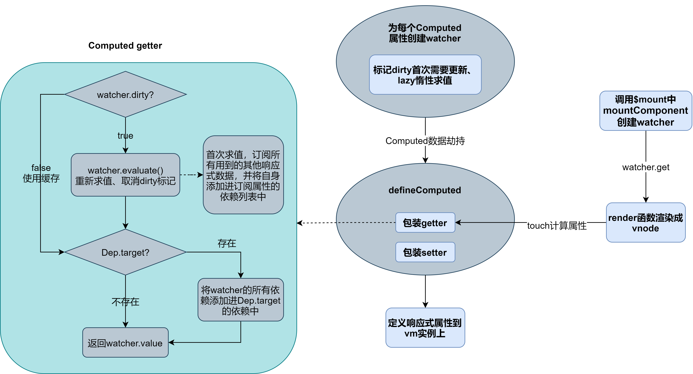

# 源码分析：Computed计算属性

此系列通过直接在vue源码中分析Computed计算属性的底层原理

> 以vue 2.6.11版本进行源码分析

## Computed

- **描述**：计算属性的结果会被缓存，除非依赖的响应式 property 变化才会重新计算。计算属性将被混入到 Vue 实例中。所有 getter 和 setter 的 this 上下文自动地绑定为 Vue 实例。
- 简单说：复杂的表达式或者计算，并且可能需要缓存结果时，采用计算属性更加合适。

**官方建议**：对于任何复杂逻辑，你都应当使用计算属性。

## 分析原理

- Computed在`beforeCreate`钩子之后`created`钩子之前进行初始化，并且在watch初始化之前，这也意味着watch可以监视计算属性

[源码位置](https://github.com/vuejs/vue/blob/dev/src/core/instance/state.js#L49-L63)

```js
export function initState (vm: Component) {
  vm._watchers = []
  const opts = vm.$options
  if (opts.props) initProps(vm, opts.props)
  if (opts.methods) initMethods(vm, opts.methods)
  if (opts.data) {
    initData(vm)
  } else {
    observe(vm._data = {}, true /* asRootData */)
  }
  if (opts.computed) initComputed(vm, opts.computed)  // 初始化计算属性
  if (opts.watch && opts.watch !== nativeWatch) {
    initWatch(vm, opts.watch)
  }
}
```

### initComputed

- 初始化计算属性
- 为实例创建一个计算属性观察者对象，用于存放每个计算属性自身的观察者实例
- 遍历所有计算属性，并为每个属性创建自身监视器(观察者)对象用于收集依赖以及添加订阅
- 并定义未存在于组件实例上的计算属性，使其响应式

> 计算属性可以是函数，也可以是具有get、set方法的对象

[源码位置](https://github.com/vuejs/vue/blob/dev/src/core/instance/state.js#L170-L211)

```js
// 计算属性默认开启惰性求值
const computedWatcherOptions = { lazy: true }
...
function initComputed (vm: Component, computed: Object) {
  // 为组件创建计算属性的观察者列表
  const watchers = vm._computedWatchers = Object.create(null)
  // computed properties are just getters during SSR
  const isSSR = isServerRendering()

  // 遍历所有计算属性
  for (const key in computed) {
    // 计算属性值、函数或对象get、set
    const userDef = computed[key]
    // 获取计算属性获取的处理函数
    const getter = typeof userDef === 'function' ? userDef : userDef.get
    ...

    // 浏览器端，给当前计算属性创建观察者对象
    if (!isSSR) {
      // 重点
      watchers[key] = new Watcher(
        vm, // 组件实例
        getter || noop, // 访问器
        noop,// 回调
        computedWatcherOptions  // 使用惰性求值选项
      )
    }
    // 定义组件上不存在的计算属性
    if (!(key in vm)) {
      // 重点
      defineComputed(vm, key, userDef)
    } else if (process.env.NODE_ENV !== 'production') {
      ...
    }
  }
}
```

### new Watcher()

- 为当前计算属性创建一个观察者
- 当作订阅者，订阅发布者，即作为依赖被收集
- 当作发布者，发布消息，即通知依赖进行更新

[源码位置](https://github.com/vuejs/vue/blob/dev/src/core/observer/watcher.js#L46-L97)

```js
// Watcher 构造函数
constructor (
  vm: Component,
  expOrFn: string | Function,
  cb: Function,
  options?: ?Object,
  isRenderWatcher?: boolean
) {
  this.vm = vm
  if (isRenderWatcher) {
    vm._watcher = this
  }
  // 向组件的观察者列表添加当前计算属性观察者
  vm._watchers.push(this)
  // options
  if (options) {
    ...
    this.lazy = !!options.lazy  // 计算属性默认惰性求值
    ...
  } else {
    ...
  }
  this.cb = cb
  
  this.active = true
  // 一开始都为true，说明首次要更新
  this.dirty = this.lazy // dirty用于标记是否需要重新计算
  this.deps = []
  this.newDeps = []
  this.depIds = new Set()
  this.newDepIds = new Set()

  // 解析getter，可能是表达式或者函数
  if (typeof expOrFn === 'function') {
    // 将当前属性观察者的getter设置为用户设置的get方法或者属性处理函数
    this.getter = expOrFn
  } else {
    // 用于watch解析点分字符串对象
    this.getter = parsePath(expOrFn)
    if (!this.getter) {
      this.getter = noop
      ...
    }
  }
  // 是否惰性求值
  this.value = this.lazy
    ? undefined
    : this.get()
}
```

### defineComputed

- 定义计算属性，并挂载到vm实例上

> 其中computed属性优先级低于props、methods、data中定义的属性，如果已经存在同名的属性props、methods、data则不被定义

[源码位置](https://github.com/vuejs/vue/blob/dev/src/core/instance/state.js#L213-L242)

```js
// 定义可共享的属性描述符对象
const sharedPropertyDefinition = {
  enumerable: true,
  configurable: true,
  get: noop,
  set: noop
}

export function defineComputed (
  target: any,// 组件实例
  key: string,// 计算属性名
  userDef: Object | Function // 用户定义的计算属性函数或对象形式
) {
  // 浏览器端才需要cache
  const shouldCache = !isServerRendering()
  // 计算属性为函数形式
  if (typeof userDef === 'function') {
    sharedPropertyDefinition.get = shouldCache
      ? createComputedGetter(key) // 浏览器端
      : createGetterInvoker(userDef)  // 服务端
    sharedPropertyDefinition.set = noop // 函数形式默认为getter，无setter
  } else {
    // 对象形式，get、set
    sharedPropertyDefinition.get = userDef.get
      ? shouldCache && userDef.cache !== false
        ? createComputedGetter(key)
        : createGetterInvoker(userDef.get)
      : noop
    sharedPropertyDefinition.set = userDef.set || noop  // 用户设置的setter，很少使用
  }
  ...
  // 定义计算属性数据劫持
  Object.defineProperty(target, key, sharedPropertyDefinition)
}
```

### createComputedGetter

- 为计算属性创建getter
- 实现数据缓存以及更新操作

[源码位置](https://github.com/vuejs/vue/blob/dev/src/core/instance/state.js#L244-L257)

```js
// watcher.evaluate
evaluate () {
  this.value = this.get()
  this.dirty = false
}

// 创建计算属性getter
function createComputedGetter (key) {
  // getter
  return function computedGetter () {
    // 获取计算属性对应的watcher
    const watcher = this._computedWatchers && this._computedWatchers[key]
    if (watcher) {
      // watcher.dirty 缓存判断，如果为true表示需要重新计算watcher的value否则直接返回缓存的value
      // 如果是脏数据，即数据需要更新，则调用用户的处理函数
      if (watcher.dirty) {
        // 内部调用 watcher.get 并清除 dirty 标志
        watcher.evaluate()
      }
      // 深度依赖收集，即将当前watcher的依赖添加到，依赖当前watcher的依赖列表中
      if (Dep.target) {
        watcher.depend()
      }
      // 返回计算后的值
      return watcher.value
    }
  }
}
```

#### watcher.get

- 调用用户设置的getter，对计算属性进行重新求值

[源码位置](https://github.com/vuejs/vue/blob/dev/src/core/observer/watcher.js#L102-L124)

```js
// watcher.get
get () {
  // 把当前观察者添加到栈中，并标记Dep.target为当前计算属性观察者
  pushTarget(this)
  let value
  const vm = this.vm
  try {
    // 调用当前计算属性的getter函数，即用户设置的get/函数
    value = this.getter.call(vm, vm)
  } catch (e) {
    ...
  } finally {
    // 如果深度监视属性，则递归的添加依赖
    if (this.deep) {
      traverse(value)
    }
    // Dep.target 出栈，恢复之前的target，用于依赖收集
    popTarget()
    // 更新依赖列表
    this.cleanupDeps()
  }
  // 作为watcher.value,缓存起来，直到重新标记为dirty才重新计算
  return value
}
```

### createGetterInvoker

- 服务端执行时，直接调用getter不做缓存处理

[源码位置](https://github.com/vuejs/vue/blob/dev/src/core/instance/state.js#L259-L263)

```js
function createGetterInvoker(fn) {
  return function computedGetter () {
    // 直接返回用户设置的函数或get方法执行的结果，不进行任何缓存处理
    return fn.call(this, this)
  }
}
```

### Computed过程示意图

