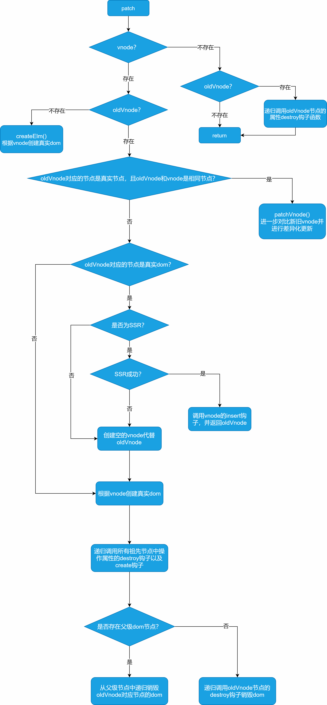

# Vue2源码分析：Patch

此系列通过直接在vue源码中分析Patch的底层原理

> 以vue 2.6.11版本进行源码分析

## patch

- patch方法主要对dom进行初始化渲染、通过diff算法比对vnode并更新真实dom、销毁dom
- patch对比新旧vnode的核心是diff算法

### patch入口

- 当数据变化时需要响应式的更新真实dom，`updateComponent`更新组件的方法是在watcher.get中被执行

```js
updateComponent = () => {
  vm._update(vm._render(), hydrating)
}
```

watcher.get

```js
get () {
  // 把当前观察者添加到栈中，并标记Dep.target为当前计算属性观察者
  pushTarget(this)
  let value
  const vm = this.vm
  try {
    // 调用当前计算属性的getter函数，即计算属性值中的获取函数
    // 如：方法或者是对象get方法
    value = this.getter.call(vm, vm)  // 这里的getter就是updateComponent
  } catch (e) {
    if (this.user) {
      handleError(e, vm, `getter for watcher "${this.expression}"`)
    } else {
      throw e
    }
  } finally {
    if (this.deep) {// 如果深度监听计算属性的依赖
      traverse(value)
    }
    popTarget()
    this.cleanupDeps()
  }
  return value
}
```

- 每当`dep.notify`通知依赖进行更新时会调用`watcher.update`
- 在`watcher.update`又会执行`watcher.run`
- 在`watcher.run`又会执行`watcher.get`并触发`updateComponent`方法执行更新操作
- 执行`updateComponent`会通过`vm._render`重新创建vnode，传入`vm._update`更新函数中进行patch

```js
// 创建新的vnode并进行patch更新dom
vm._update(vm._render(), hydrating)
```

- 进入`vm._update`后根据vnode初始化情况进行初始化patch或者更新patch

```js
Vue.prototype._update = function (vnode: VNode, hydrating?: boolean) {
  const vm: Component = this
  const prevEl = vm.$el
  const prevVnode = vm._vnode
  const restoreActiveInstance = setActiveInstance(vm)
  vm._vnode = vnode
  // 首次渲染时没有上一个vnode
  if (!prevVnode) {
    // 初始化渲染
    vm.$el = vm.__patch__(vm.$el, vnode, hydrating, false /* removeOnly */)
  } else {
    // 更新时
    vm.$el = vm.__patch__(prevVnode, vnode)
  }
  restoreActiveInstance()
  // update __vue__ reference
  if (prevEl) {
    prevEl.__vue__ = null
  }
  if (vm.$el) {
    vm.$el.__vue__ = vm
  }
  // if parent is an HOC, update its $el as well
  if (vm.$vnode && vm.$parent && vm.$vnode === vm.$parent._vnode) {
    vm.$parent.$el = vm.$el
  }
}
```

### vm.\_\_patch\_\_

- 在`vm.__patch__`中对不同平台适配，如果是浏览器中才进行patch操作

```js
Vue.prototype.__patch__ = inBrowser ? patch : noop
```

### createPatchFunction

- 由于在patch过程中需要创建真实dom，涉及到dom创建，根据不同平台的dom api进行适配
- nodeOps对象中实现了浏览器端的dom api，modules是对dom属性的操作进行封装
- createPatchFunction最终返回真正的patch方法

```js
export const patch: Function = createPatchFunction({ nodeOps, modules })
```

### patch主函数

- 传入patch的2个主要参数是：oldVnode旧的虚拟节点，vnode新的虚拟节点
- 最终patch返回的是真实dom节点，并重新赋值到`vm.$el`上

```js
function patch (oldVnode, vnode, hydrating, removeOnly) {
  // 新节点为空，旧节点不为空，则表示销毁节点，递归销毁
  if (isUndef(vnode)) {
    if (isDef(oldVnode)) invokeDestroyHook(oldVnode)
    return
  }
  let isInitialPatch = false
  const insertedVnodeQueue = []
  // 无旧节点，则表示创建节点
  if (isUndef(oldVnode)) {
    // empty mount (likely as component), create new root element
    isInitialPatch = true // 第一次patch，创建根元素
    createElm(vnode, insertedVnodeQueue)
  } else {
    const isRealElement = isDef(oldVnode.nodeType)
    // 非真实dom，且新旧节点相同，者进行patchVnode，比对vnode
    if (!isRealElement && sameVnode(oldVnode, vnode)) {
      // patch核心对比2个vnode
      patchVnode(oldVnode, vnode, insertedVnodeQueue, null, null, removeOnly)
    } else {
      // 是真实dom
      if (isRealElement) {
        // mounting to a real element
        // check if this is server-rendered content and if we can perform
        // a successful hydration.
        // 元素类型，并且采用ssr
        if (oldVnode.nodeType === 1 && oldVnode.hasAttribute(SSR_ATTR)) {
          oldVnode.removeAttribute(SSR_ATTR)
          hydrating = true
        }
        // 服务端处理
        if (isTrue(hydrating)) {
          if (hydrate(oldVnode, vnode, insertedVnodeQueue)) {
            invokeInsertHook(vnode, insertedVnodeQueue, true)
            return oldVnode
          } else if (process.env.NODE_ENV !== 'production') {
            warn(
              'The client-side rendered virtual DOM tree is not matching ' +
              'server-rendered content. This is likely caused by incorrect ' +
              'HTML markup, for example nesting block-level elements inside ' +
              '<p>, or missing <tbody>. Bailing hydration and performing ' +
              'full client-side render.'
            )
          }
        }
        // either not server-rendered, or hydration failed.
        // create an empty node and replace it
        // 不是服务端或者出错，创建空的虚拟节点
        oldVnode = emptyNodeAt(oldVnode)
      }

      // replacing existing element
      const oldElm = oldVnode.elm
      const parentElm = nodeOps.parentNode(oldElm)

      // 创建新dom节点
      createElm(
        vnode,
        insertedVnodeQueue,
        // extremely rare edge case: do not insert if old element is in a
        // leaving transition. Only happens when combining transition +
        // keep-alive + HOCs. (#4590)
        oldElm._leaveCb ? null : parentElm,
        nodeOps.nextSibling(oldElm)
      )

      // 递归更新父组件的销毁和创建
      if (isDef(vnode.parent)) {
        let ancestor = vnode.parent
        const patchable = isPatchable(vnode)
        while (ancestor) {
          for (let i = 0; i < cbs.destroy.length; ++i) {
            cbs.destroy[i](ancestor)
          }
          ancestor.elm = vnode.elm
          if (patchable) {
            for (let i = 0; i < cbs.create.length; ++i) {
              cbs.create[i](emptyNode, ancestor)
            }
            // #6513
            // invoke insert hooks that may have been merged by create hooks.
            // e.g. for directives that uses the "inserted" hook.
            const insert = ancestor.data.hook.insert
            if (insert.merged) {
              // start at index 1 to avoid re-invoking component mounted hook
              for (let i = 1; i < insert.fns.length; i++) {
                insert.fns[i]()
              }
            }
          } else {
            registerRef(ancestor)
          }
          ancestor = ancestor.parent
        }
      }

      // 销毁旧的节点，通过父节点进行移除
      if (isDef(parentElm)) {
        // 存在父组件则移除子组件节点
        removeVnodes([oldVnode], 0, 0)
      } else if (isDef(oldVnode.tag)) {
        // 没有父节点，通过组件自身destroy方法销毁
        invokeDestroyHook(oldVnode)
      }
    }
  }
  // 组件insert钩子
  invokeInsertHook(vnode, insertedVnodeQueue, isInitialPatch)
  return vnode.elm
}
```

### patchVnode

- patchVnode对比2个vnode的结构差异并更新
- 主函数的作用是在相同vnode的情况下进行比对

对比逻辑：

1. 新节点是文本节点
   1. 新旧节点文本内容不同，则更新旧节点的内容（设置textContent会同时清除其他节点）
2. 新节点不是文本节点
   1. 新旧节点都存在子节点
      1. 新旧子节点不同，则diff更新子节点的差异（diff核心）updateChildren
   2. 只存在新节点的子节点
      1. 旧节点存在文本，则清空文本内容，并添新节点的子节点
      2. 添新节点的子节点
   3. 只存在旧节点的子节点
      1. 移除旧节点的所有子节点
   4. 旧节点存在文本
      1. 清空旧节点上的文本内容

other情况：不更新

```js
function patchVnode (
  oldVnode,
  vnode,
  insertedVnodeQueue,
  ownerArray,
  index,
  removeOnly
) {
  // 新旧vnode为同一个对象，无需diff
  if (oldVnode === vnode) {
    return
  }

  if (isDef(vnode.elm) && isDef(ownerArray)) {
    // 克隆vnode，优化静态节点和插槽的重用
    vnode = ownerArray[index] = cloneVNode(vnode)
  }

  const elm = vnode.elm = oldVnode.elm

  if (isTrue(oldVnode.isAsyncPlaceholder)) {
    if (isDef(vnode.asyncFactory.resolved)) {
      hydrate(oldVnode.elm, vnode, insertedVnodeQueue)
    } else {
      vnode.isAsyncPlaceholder = true
    }
    return
  }

  // reuse element for static trees.
  // note we only do this if the vnode is cloned -
  // if the new node is not cloned it means the render functions have been
  // reset by the hot-reload-api and we need to do a proper re-render.
  if (isTrue(vnode.isStatic) &&
    isTrue(oldVnode.isStatic) &&
    vnode.key === oldVnode.key &&
    (isTrue(vnode.isCloned) || isTrue(vnode.isOnce))
  ) {
    // 如果是静态节点者重用组件实例
    vnode.componentInstance = oldVnode.componentInstance
    return
  }

  let i
  const data = vnode.data
  if (isDef(data) && isDef(i = data.hook) && isDef(i = i.prepatch)) {
    // 预先更新组件属性
    i(oldVnode, vnode)
  }

  const oldCh = oldVnode.children
  const ch = vnode.children
  if (isDef(data) && isPatchable(vnode)) {
    // 批量执行节点的属性的更新钩子，更新节点属性
    for (i = 0; i < cbs.update.length; ++i) cbs.update[i](oldVnode, vnode)
    if (isDef(i = data.hook) && isDef(i = i.update)) i(oldVnode, vnode)
  }
  // 非文本节点
  if (isUndef(vnode.text)) {
    // 新旧vnode都存在children
    if (isDef(oldCh) && isDef(ch)) {
      // diff核心
      // children不同则 diff children
      if (oldCh !== ch) updateChildren(elm, oldCh, ch, insertedVnodeQueue, removeOnly)
    } else if (isDef(ch)) {
      // 只有新节点存在children
      if (process.env.NODE_ENV !== 'production') {
        checkDuplicateKeys(ch)
      }
      // 如果旧节点存在文本则清空内容
      if (isDef(oldVnode.text)) nodeOps.setTextContent(elm, '')
      // 添加新节点children的vnode
      addVnodes(elm, null, ch, 0, ch.length - 1, insertedVnodeQueue)
    } else if (isDef(oldCh)) {
      // 只有旧节点存在children，则移除旧节点的所有child
      removeVnodes(oldCh, 0, oldCh.length - 1)
    } else if (isDef(oldVnode.text)) {
      // 只存在旧节点的文本，则清空文本
      nodeOps.setTextContent(elm, '')
    }
  } else if (oldVnode.text !== vnode.text) {
    // 文本节点，且内容不同，需要更新文本内容，会同时清除其他子节点
    nodeOps.setTextContent(elm, vnode.text)
  }
  if (isDef(data)) {
    // patch结束，执行postpatch钩子
    if (isDef(i = data.hook) && isDef(i = i.postpatch)) i(oldVnode, vnode)
  }
}
```

### updateChildren

- 更新子节点之间的差异
- 其中使用了8个主要变量

1. oldStartIdx旧头指针
2. oldEndIdx旧尾指针
3. oldStartVnode旧头节点
4. oldEndVnode旧尾节点
5. newStartIdx新头指针
6. newEndIdx新尾指针
7. newStartVnode新头节点
8. newEndVnode新尾节点

主要对比逻辑：

1. 旧头和新头相同
2. 旧头和新尾相同
3. 旧尾和新尾相同
4. 旧尾和新头相同
5. 其他情况
   1. 新头指向节点的key在旧节点中不存在，则为创建新节点dom
   2. 新头指向节点的key在旧节点中存在，则获取旧节点
      1. 新旧节点相同，则深度diff，把旧节点dom移动到当前旧头指针之前，并删除旧节点
      2. 新旧节点不同，则说明相同key不同节点，则相当于创建新节点dom

处理完成后：

1. 还存在旧节点则删除剩余旧节点dom插入到当前新头位置后
2. 还存在新节点则创建剩余新节点dom插入到当前新头位置后

```js
function updateChildren (parentElm, oldCh, newCh, insertedVnodeQueue, removeOnly) {
  let oldStartIdx = 0
  let newStartIdx = 0
  let oldEndIdx = oldCh.length - 1
  let oldStartVnode = oldCh[0]
  let oldEndVnode = oldCh[oldEndIdx]
  let newEndIdx = newCh.length - 1
  let newStartVnode = newCh[0]
  let newEndVnode = newCh[newEndIdx]
  let oldKeyToIdx, idxInOld, vnodeToMove, refElm

  // removeOnly is a special flag used only by <transition-group>
  // to ensure removed elements stay in correct relative positions
  // during leaving transitions
  const canMove = !removeOnly

  if (process.env.NODE_ENV !== 'production') {
    checkDuplicateKeys(newCh)
  }
  // diff过程，直到遍历完旧children或者新children节点
  while (oldStartIdx <= oldEndIdx && newStartIdx <= newEndIdx) {
    if (isUndef(oldStartVnode)) {
      // 旧头跳过之前删除的undefined节点
      oldStartVnode = oldCh[++oldStartIdx] // Vnode has been moved left
    } else if (isUndef(oldEndVnode)) {
      // 旧尾跳过之前删除的undefined节点
      oldEndVnode = oldCh[--oldEndIdx]
    } else if (sameVnode(oldStartVnode, newStartVnode)) {
      // 旧头和新头指向的节点相同，则进行深度diff，之后双指针都后移一位
      patchVnode(oldStartVnode, newStartVnode, insertedVnodeQueue, newCh, newStartIdx)
      oldStartVnode = oldCh[++oldStartIdx]
      newStartVnode = newCh[++newStartIdx]
    } else if (sameVnode(oldEndVnode, newEndVnode)) {
      // 旧尾和新尾指向的节点相同，则进行深度diff，之后双指针都前移一位
      patchVnode(oldEndVnode, newEndVnode, insertedVnodeQueue, newCh, newEndIdx)
      oldEndVnode = oldCh[--oldEndIdx]
      newEndVnode = newCh[--newEndIdx]
    } else if (sameVnode(oldStartVnode, newEndVnode)) { // Vnode moved right
      // 旧头和新尾节点相同，则进行深度diff，之后旧头后移一位，新尾前移一位
      patchVnode(oldStartVnode, newEndVnode, insertedVnodeQueue, newCh, newEndIdx)
      canMove && nodeOps.insertBefore(parentElm, oldStartVnode.elm, nodeOps.nextSibling(oldEndVnode.elm))
      oldStartVnode = oldCh[++oldStartIdx]
      newEndVnode = newCh[--newEndIdx]
    } else if (sameVnode(oldEndVnode, newStartVnode)) { // Vnode moved left
      // 旧尾和新头节点相同，则进行深度diff，之后旧尾前移一位，新头后移一位
      patchVnode(oldEndVnode, newStartVnode, insertedVnodeQueue, newCh, newStartIdx)
      canMove && nodeOps.insertBefore(parentElm, oldEndVnode.elm, oldStartVnode.elm)
      oldEndVnode = oldCh[--oldEndIdx]
      newStartVnode = newCh[++newStartIdx]
    } else {
      // 其他情况
      // 根据旧节点生成 {key:index} 的映射关系以便于优化查找
      if (isUndef(oldKeyToIdx)) oldKeyToIdx = createKeyToOldIdx(oldCh, oldStartIdx, oldEndIdx)
      // 新节点的key，从旧节点中获取索引
      idxInOld = isDef(newStartVnode.key)
        ? oldKeyToIdx[newStartVnode.key]  // 旧节点中存在对应key（优化查找）
        : findIdxInOld(newStartVnode, oldCh, oldStartIdx, oldEndIdx) // 旧节点中不存在对应key则遍历查找
      // 索引不存在旧节点中，则判断为新节点
      if (isUndef(idxInOld)) { 
        // 创建新节点
        createElm(newStartVnode, insertedVnodeQueue, parentElm, oldStartVnode.elm, false, newCh, newStartIdx)
      } else {
        // 通过索引获取旧的节点
        vnodeToMove = oldCh[idxInOld]
        // 当前新头节点与key相同的旧节点为同一个节点
        if (sameVnode(vnodeToMove, newStartVnode)) {
          // 深度diff
          patchVnode(vnodeToMove, newStartVnode, insertedVnodeQueue, newCh, newStartIdx)
          // 将旧节点对应位置置为undefined，以便排除处理过的节点
          oldCh[idxInOld] = undefined
          // 把新头节点对应的旧节点插入到旧头索引位置之前
          canMove && nodeOps.insertBefore(parentElm, vnodeToMove.elm, oldStartVnode.elm)
        } else {
          // 相同key，但是不同元素，则相当于创建新节点
          createElm(newStartVnode, insertedVnodeQueue, parentElm, oldStartVnode.elm, false, newCh, newStartIdx)
        }
      }
      // 处理完一个新头节点
      newStartVnode = newCh[++newStartIdx]
    }
  }
  // 旧children遍历完成，新children还未遍历完成
  if (oldStartIdx > oldEndIdx) {
    // 获取参照元素
    refElm = isUndef(newCh[newEndIdx + 1]) ? null : newCh[newEndIdx + 1].elm
    // 创建所有剩余的未处理的新节点的dom添加到参考节点后
    addVnodes(parentElm, refElm, newCh, newStartIdx, newEndIdx, insertedVnodeQueue)
  } else if (newStartIdx > newEndIdx) {
    // 移除多余的旧节点dom
    removeVnodes(oldCh, oldStartIdx, oldEndIdx)
  }
}
```

### createElm创建真实dom

- createElm根据vnode节点类型递归创建真实dom

```js
function createElm (
  vnode,
  insertedVnodeQueue,
  parentElm,
  refElm,
  nested,
  ownerArray,
  index
) {
  // 覆盖旧vnode对应的真实dom会导致patch出错
  // 创建新的vnode并进行静态节点、插槽的浅拷贝之后再挂载真实dom
  if (isDef(vnode.elm) && isDef(ownerArray)) {
    // This vnode was used in a previous render!
    // now it's used as a new node, overwriting its elm would cause
    // potential patch errors down the road when it's used as an insertion
    // reference node. Instead, we clone the node on-demand before creating
    // associated DOM element for it.
    vnode = ownerArray[index] = cloneVNode(vnode)
  }

  vnode.isRootInsert = !nested // for transition enter check
  // 如果vnode是子组件则无需重新创建而是直接返回
  if (createComponent(vnode, insertedVnodeQueue, parentElm, refElm)) {
    return
  }

  const data = vnode.data
  const children = vnode.children
  const tag = vnode.tag
  if (isDef(tag)) {
    // 创建真实dom
    vnode.elm = vnode.ns
      ? nodeOps.createElementNS(vnode.ns, tag)
      : nodeOps.createElement(tag, vnode)
    // 设置组件css作用域id
    setScope(vnode)

    /* istanbul ignore if */
    if (__WEEX__) {
      ...
    } else {
      // web平台
      // 递归创建子节点
      createChildren(vnode, children, insertedVnodeQueue)
      if (isDef(data)) {
        // 存在data属性，则为组件，调用组件create钩子
        invokeCreateHooks(vnode, insertedVnodeQueue)
      }
      insert(parentElm, vnode.elm, refElm)
    }
  } else if (isTrue(vnode.isComment)) {
    // 创建注释节点并插入
    vnode.elm = nodeOps.createComment(vnode.text)
    insert(parentElm, vnode.elm, refElm)
  } else {
    // 创建文本节点并插入
    vnode.elm = nodeOps.createTextNode(vnode.text)
    insert(parentElm, vnode.elm, refElm)
  }
}
```

### patch全过程

#### patch更新dom流程


#### patch对比流程



#### createElm创建dom过程


#### patchVnode过程


#### updateChildren过程

