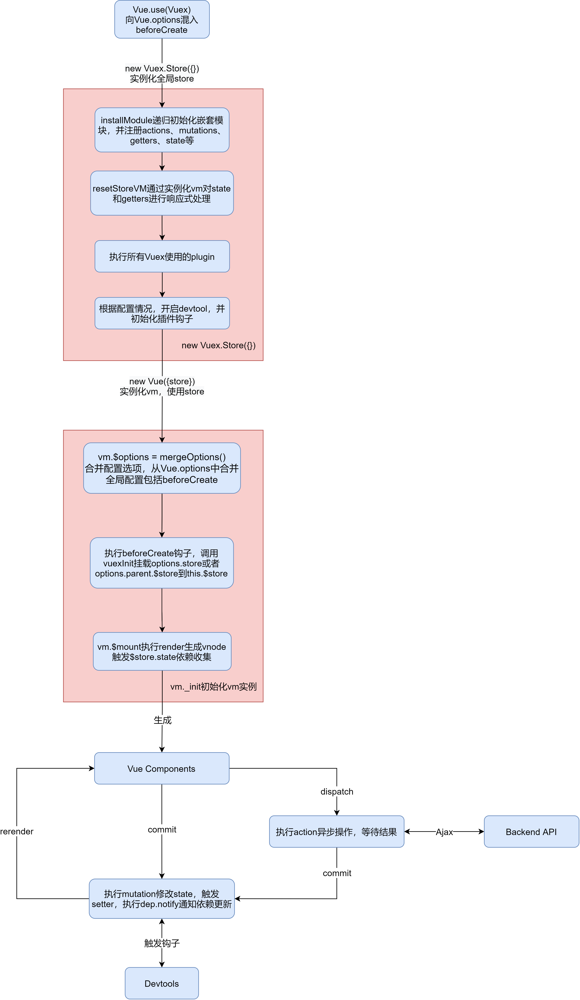

# Vuex3.x源码分析

此系列通过在Vuex源码中分析底层原理

> 以Vuex3.6.2版本进行源码分析

## Vuex

- Vuex 是一个专为 Vue.js 应用程序开发的状态管理模式。它采用集中式存储管理应用的所有组件的状态，并以相应的规则保证状态以一种可预测的方式发生变化。Vuex 也集成到 Vue 的官方调试工具 devtools extension，提供了诸如零配置的 time-travel 调试、状态快照导入导出等高级调试功能。
- Vuex其实是一个包含Store类和install等方法的对象

```js
// index.js
export default {
  Store,
  install,
  version: '__VERSION__',
  mapState,
  mapMutations,
  mapGetters,
  mapActions,
  createNamespacedHelpers,
  createLogger
}
```

### install

- 在Vue项目中使用Vuex，即通过插件的方式安装Vuex，并在Vue实例化配置中使用store实例

```js
// 安装Vuex，内部调用install方法
Vue.use(Vuex)

// 实例化store
const store = new Vuex.Store({
  state,
  getters,
  actions,
  mutations
})

new Vue({
  el: '#app',
  store,  // 全局使用store
  render: h => h(Counter)
})
```

- 在`Vue.use(Vuex)`内部会调用`Vuex.install`方法安装Vuex，本质上是在Vue中混入`vuexInit`方法并在恰当阶段执行挂载store

```js
export function install(_Vue) {
  // 全局保存Vue，避免重复安装
  if (Vue && _Vue === Vue) {
    if (__DEV__) {
      console.error(
        '[vuex] already installed. Vue.use(Vuex) should be called only once.'
      )
    }
    return
  }
  Vue = _Vue
  // 注入store，存在store配置则注入到this.$store中，否则从父组件中注入$store
  applyMixin(Vue)
}
```

#### applyMixin 

- 根据Vue版本执行相应的混入store逻辑

```js
export default function (Vue) {
  // 获取vue版本
  const version = Number(Vue.version.split('.')[0])

  if (version >= 2) {
    // vue 2以上，混入到全局Vue的beforeCreate中初始化vuex
    Vue.mixin({ beforeCreate: vuexInit })
  } else {
    // vue1中增强init，在init中先执行vuex的初始化
    const _init = Vue.prototype._init
    Vue.prototype._init = function (options = {}) {
      options.init = options.init
        ? [vuexInit].concat(options.init)
        : vuexInit
      _init.call(this, options)
    }
  }
  // vuex的混入钩子注入到每个组件实例的init钩子或beforeCreate中
  function vuexInit () {
    // 获取vue实例配置对象
    const options = this.$options
    // 存在并注入store
    if (options.store) {
      // 注入选项中的store到vue实例中
      this.$store = typeof options.store === 'function'
        ? options.store() // 函数形式，用于module独享store
        : options.store   // 对象形式，共用store
    } else if (options.parent && options.parent.$store) {
      // 自身没有store配置，则注入父级中的store，比如根组件有store配置，子组件从根组件中引用相同的全局store对象
      // 这样一来就可以在每个组件中都引用同一个store实例对象
      this.$store = options.parent.$store
    }
  }
}
```

### Store

- store实例作为全局状态管理单例对象，其中包含了公用的原型方法和内部属性

```js
export class Store {
  constructor(options = {}) {
    if (!Vue && typeof window !== 'undefined' && window.Vue) {
      // 如果存在全局Vue则直接使用，并挂载store
      // 即直接在vue中安装vuex
      install(window.Vue)
    }

    const { plugins = [], strict = false } = options

    // 内部属性
    this._committing = false  // 是否处于committing阶段
    this._actions = Object.create(null) 
    this._actionSubscribers = []  // action订阅者集合
    this._mutations = Object.create(null)
    this._wrappedGetters = Object.create(null)  // 包装getter
    this._modules = new ModuleCollection(options) // 模块集合实例
    this._modulesNamespaceMap = Object.create(null) // 模块命名空间映射对象
    this._subscribers = []  // mutation订阅者集合
    this._watcherVM = new Vue() // 观察vm实例，用于store.watch监视getter值变化
    this._makeLocalGettersCache = Object.create(null) // 本地getter缓存对象

    // 绑定 commit 和 dispatch 的this指向实例
    const store = this
    // 原型方法
    const { dispatch, commit } = this
    // 包装dispatch到Store实例中，绑定store
    this.dispatch = function boundDispatch(type, payload) {
      return dispatch.call(store, type, payload)
    }
    // 包装commit到Store实例中，绑定store
    this.commit = function boundCommit(type, payload, options) {
      return commit.call(store, type, payload, options)
    }

    // 严格模式
    this.strict = strict

    // 原始配置中的state
    const state = this._modules.root.state

    // 递归初始化模块
    installModule(this, state, [], this._modules.root)

    // 初始化vm，用于响应式state和getter
    resetStoreVM(this, state)

    // 执行所有plugin并传入当前store
    plugins.forEach((plugin) => plugin(this))

    const useDevtools =
      options.devtools !== undefined ? options.devtools : Vue.config.devtools
    if (useDevtools) {
      // 开发工具插件初始化
      devtoolPlugin(this)
    }
  }

  // 返回内部vm实例data中的$$state
  get state() {
    return this._vm._data.$$state
  }

  // 替换state
  set state(v) {
    if (__DEV__) {
      // 替换state
      assert(false, `use store.replaceState() to explicit replace store state.`)
    }
  }

  // 执行注册的mutation，并通知订阅者
  commit(_type, _payload, _options) {}

  // 在指定阶段执行before和after、error，根据多入口调用all等待所有结果，再then中结束返回结果
  dispatch(_type, _payload) {}

  // 向_subscribers添加订阅器
  subscribe(fn, options) {}

  // 向_actionSubscribers中添加订阅器
  subscribeAction(fn, options) {}

  // 监视getter函数返回结果的变化，内部调用$watch
  watch(getter, cb, options) {}

  // 替换$$state
  replaceState(state) {}

  // 在指定path下注册模块
  registerModule(path, rawModule, options = {}) {}

  // 指定path中注销模块
  unregisterModule(path) {}

  // 在指定path中判断模块存在
  hasModule(path) {}

  // 强制热更新update，重置store
  hotUpdate(newOptions) {}

  // 调用fn前标记_committing
  _withCommit(fn) {}
}
```

- 在初始化store中强绑定了store实例，这样一来可以在任何commit和dispatch操作函数中以store作为this访问

```js
// 原型方法
const { dispatch, commit } = this
this.dispatch = function boundDispatch(type, payload) {
  // 强绑定全局store实例
  return dispatch.call(store, type, payload)
}
this.commit = function boundCommit(type, payload, options) {
  // 强绑定全局store实例
  return commit.call(store, type, payload, options)
}
```

#### installModule

- installModule初始化递归安装所有模块，并注册绑定命名空间下的mutation、action、getter等

```js
function installModule(store, rootState, path, module, hot) {
  const isRoot = !path.length
  // 通过path获取命名空间名
  const namespace = store._modules.getNamespace(path)

  // register in namespace map
  if (module.namespaced) {
    ...
    // 映射命名空间下的模块
    store._modulesNamespaceMap[namespace] = module
  }

  // 非根，且不是热模块
  if (!isRoot && !hot) {
    // 根据path获取嵌套state对象
    const parentState = getNestedState(rootState, path.slice(0, -1))
    const moduleName = path[path.length - 1]
    // 标记commit，用于判断是否是通过commit来改变state
    store._withCommit(() => {
      ...
      // 在父级state(默认为顶层state)中注册响应式模块对象，即在父state中以子模块名作为键，注册响应式模块对象
      Vue.set(parentState, moduleName, module.state)
    })
  }

  // 创建模块内部的本地上下文对象，绑定命名空间下的ctx
  const local = (module.context = makeLocalContext(store, namespace, path))

  // 遍历Mutation注册绑定命名空间下的mutation
  module.forEachMutation((mutation, key) => {
    const namespacedType = namespace + key
    registerMutation(store, namespacedType, mutation, local)
  })

  // 遍历Action注册绑定命名空间下的action，如果存在root:true,者将其注册为全局action
  module.forEachAction((action, key) => {
    const type = action.root ? key : namespace + key
    const handler = action.handler || action
    registerAction(store, type, handler, local)
  })

  // 遍历Getter注册绑定命名空间下的Getter
  module.forEachGetter((getter, key) => {
    const namespacedType = namespace + key
    registerGetter(store, namespacedType, getter, local)
  })

  // 递归初始化子模块
  module.forEachChild((child, key) => {
    installModule(store, rootState, path.concat(key), child, hot)
  })
}
```

#### resetStoreVM

- 重置store中的vm实例，在store实例中会实例化一个vm，用于响应式处理state属性以及getter计算属性

```js
function resetStoreVM(store, state, hot) {
  const oldVm = store._vm

  // 全局getters
  store.getters = {}
  // 重置getter缓存
  store._makeLocalGettersCache = Object.create(null)
  // 获取包装过的getters对象
  const wrappedGetters = store._wrappedGetters
  // 用于存储所有包装过的getter
  const computed = {}
  forEachValue(wrappedGetters, (fn, key) => {
    // 闭包中保留store参数
    computed[key] = partial(fn, store)
    // 代理全局getters到的vm实例的属性中
    Object.defineProperty(store.getters, key, {
      get: () => store._vm[key],  // 从内部的vm实例中获取getter，与computed相同
      enumerable: true, // for local getters
    })
  })

  const silent = Vue.config.silent
  Vue.config.silent = true
  // 添加一个vue实例来保存state，以及使用computed实现getter缓存
  store._vm = new Vue({
    data: {
      $$state: state,
    },
    computed,
  })
  Vue.config.silent = silent

  // 使用严格模式，判断只能通过commit修改state
  if (store.strict) {
    enableStrictMode(store)
  }

  // 存在旧的vm，如替换state
  if (oldVm) {
    if (hot) {
      // 强制热重载
      store._withCommit(() => {
        oldVm._data.$$state = null  // 清除旧的state
      })
    }
    Vue.nextTick(() => oldVm.$destroy())  // 销毁旧的vm实例
  }
}
```

### ModuleCollection

- 初始化store时，根据传入的配置对象，实例化模块收集器，用于注册和管理模块嵌套

```js
// 实例化ModuleCollection
this._modules = new ModuleCollection(options)
```

```js
export default class ModuleCollection {
  constructor (rawRootModule) {
    // 注册根模块，根模块的path数组为空，rawRootModule为全局的store配置对象
    this.register([], rawRootModule, false)
  }

  // 通过path获取嵌套模块
  get (path) {}

  // 根据path获取模块的嵌套命名空间名
  getNamespace (path) {}

  // 更新目标模块，更新模块属性
  update (rawRootModule) {}

  // 注册模块，包括嵌套子模块
  register (path, rawModule, runtime = true) {
    // 校验模块对象
    if (__DEV__) {
      assertRawModule(path, rawModule)
    }

    // 创建子模块（第一次注册的是根模块）
    const newModule = new Module(rawModule, runtime)
    if (path.length === 0) {
      // 根模块
      this.root = newModule // store._modules.root = 根模块
    } else {
      // 子模块注册
      // 获取父级模块
      const parent = this.get(path.slice(0, -1))
      // 向父级模块中添加子模块，即在parent._children数组中添加子模块
      parent.addChild(path[path.length - 1], newModule)
    }

    // 递归注册嵌套子模块
    if (rawModule.modules) {
      forEachValue(rawModule.modules, (rawChildModule, key) => {
        this.register(path.concat(key), rawChildModule, runtime)
      })
    }
  }

  // 注销子模块，从path中获取父模块，从父模块中移除子模块
  unregister (path) {}

  // 判断是否注册过，从path中获取父模块，并从父模块中判断是否存在子模块child
  isRegistered (path) {}
}
```

### Module

- 模块类，用于将store分隔成独立模块，如果使用命名空间，则会将模块注册为指定命名空间下的模块，而不会影响全局store属性

```js
export default class Module {
  constructor (rawModule, runtime) {
    this.runtime = runtime
    // 存储子模块
    this._children = Object.create(null)
    // 原始模块配置对象
    this._rawModule = rawModule
    const rawState = rawModule.state
    // 存储原始state对象
    this.state = (typeof rawState === 'function' ? rawState() : rawState) || {}
  }

  get namespaced () {
    // 是否配置命名空间
    return !!this._rawModule.namespaced
  }

  // 添加子模块
  addChild (key, module) {
    this._children[key] = module
  }

  // 移除子模块
  removeChild (key) {
    delete this._children[key]
  }

  // 获取子模块
  getChild (key) {
    return this._children[key]
  }

  // 判断子模块是否存在
  hasChild (key) {
    return key in this._children
  }

  // 更新原始模块对象的namespaced、actions、mutations、getters
  update (rawModule) {
    this._rawModule.namespaced = rawModule.namespaced
    if (rawModule.actions) {
      this._rawModule.actions = rawModule.actions
    }
    if (rawModule.mutations) {
      this._rawModule.mutations = rawModule.mutations
    }
    if (rawModule.getters) {
      this._rawModule.getters = rawModule.getters
    }
  }

  // 遍历子模块，递归安装子模块
  forEachChild (fn) {
    forEachValue(this._children, fn)
  }

  // 遍历getters，根据命名空间生成key，并在store._wrappedGetters中注册getter
  forEachGetter (fn) {
    if (this._rawModule.getters) {
      forEachValue(this._rawModule.getters, fn)
    }
  }

  // 遍历actions，根据命名空间生成key，并在store._actions中注册action
  forEachAction (fn) {
    if (this._rawModule.actions) {
      forEachValue(this._rawModule.actions, fn)
    }
  }

  // 遍历mutations，根据命名空间生成key，并在store._mutations中注册mutation
  forEachMutation (fn) {
    if (this._rawModule.mutations) {
      forEachValue(this._rawModule.mutations, fn)
    }
  }
}
```

## Vue中使用Vuex

- 首先使用`Vue.use(Vuex)`安装Vuex
- 其次实例化store，`new Vuex.Store({})`
- 最后配置到全局Vue实例中，`new Vue({store})`

这样一来store将被挂载到Vue对象上，等到需要实例化vm时合并Vue上的store选项到实例上，因此就能够在所有组件中共用store

```js
// 安装Vuex，内部调用install方法
Vue.use(Vuex)

// 实例化store
const store = new Vuex.Store({
  state,
  getters,
  actions,
  mutations
})
// 实例化全局vm
new Vue({
  el: '#app',
  store,  // 全局使用store
  render: h => h(Counter)
})
```

### 混入beforeCreate

- 在`Vue.use(Vuex)`时，将vueInit混入到了Vue的配置对象上
- 在实例化vm时，通过`mergeOptions`合并Vue上的全局配置到实例的配置对象中，从而在每个vm中都能引用同一份全局store实例

> 以Vue2为例

```js
// applyMixin
export default function (Vue) {
  // 获取vue版本
  const version = Number(Vue.version.split('.')[0])
  if (version >= 2) {
    // vue 2以上，在beforeCreate中初始化vuex
    Vue.mixin({ beforeCreate: vuexInit })
  } else {
    // vue1中增强init
    ...
  }

  // vuex的混入钩子注入到每个组件实例的init钩子或beforeCreate中
  function vuexInit () {
    const options = this.$options
    // store injection
    if (options.store) {
      // 注入选项中的store
      this.$store = typeof options.store === 'function'
        ? options.store() // 函数形式
        : options.store   // 对象形式
    } else if (options.parent && options.parent.$store) {
      // 自身没有store，则注入父级中的store，比如根组件有store，子组件从根组件中引用相同的全局store对象
      this.$store = options.parent.$store
    }
  }
}
```

`Vue.mixin`

```js
// vuex src\mixin.js
Vue.mixin({ beforeCreate: vuexInit })

// vue src\core\global-api\mixin.js
Vue.mixin = function (mixin: Object) {
  this.options = mergeOptions(this.options, mixin)
  return this
}
```

- 最终将`{ beforeCreate: vuexInit }`配置到`Vue.options`上

### beforeCreate混入到vm上

- 在实例化vm时都会调用`Vue.prototype._init`进行初始化，其中合并了全局配置属性，初始化了组件数据，并触发了beforeCreate和created钩子

```js{16-20}
// vue src\core\instance\init.js
Vue.prototype._init = function (options?: Object) {
  // options 传入的配置参数
  const vm: Component = this;
  // a uid
  vm._uid = uid++;
  // vue单例不被劫持
  vm._isVue = true;
  // 合并选项
  if (options && options._isComponent) {
    // 把父类的一些选项放到实例中
    initInternalComponent(vm, options);
  } else {
    // 根组件选项，合并全局配置到根组件配置
    // Vue.component 注册的全局组件会合并到 根实例的 components 选项中
    vm.$options = mergeOptions(
      resolveConstructorOptions(vm.constructor),
      options || {},
      vm
    );
  }
  if (process.env.NODE_ENV !== "production") {
    // 代理render中的上下文vm
    initProxy(vm);
  } else {
    // 用于render函数执行指向vm上下文
    vm._renderProxy = vm;
  }
  // expose real self
  vm._self = vm;
  initLifecycle(vm); // 初始化内部属性 parent和root、children
  initEvents(vm); // 初始化事件，将父组件中设置的事件添加到组件事件对象中
  initRender(vm); // 初始化插槽、作用域插槽、从父级中响应式attrs、listeners到实例
  callHook(vm, "beforeCreate");// 执行实例中的所有当前阶段的钩子，以及用户设定的阶段钩子，如父级中传入的@hook:beforeCreate
  initInjections(vm); // 处理inject的属性，从祖先组件中获取inject的值并注入到当前组件中
  initState(vm); // 初始化props、methods、data、computed、watch
  initProvide(vm); // resolve provide after data/props，处理provide属性，注入到实例的_provided属性中
  callHook(vm, "created");

  // 存在el选项，则调用mount
  if (vm.$options.el) {
    // 挂载
    vm.$mount(vm.$options.el);
  }
};
```

`vm.constructor`上的配置即为全局配置，将会经过选项合并策略合并到vm中

#### mergeOptions

- mergeOptions将会根据选项合并策略进行合并，优先使用子组件中存在的配置

```js
export function mergeOptions (
  parent: Object,
  child: Object,
  vm?: Component
): Object {
  // 函数中的options
  if (typeof child === 'function') {
    child = child.options
  }
  // 标准化props、inject、directives属性
  normalizeProps(child, vm)
  normalizeInject(child, vm)
  normalizeDirectives(child)

  // 只有合并的选项才有 _base
  if (!child._base) {
    // 合并继承选项，不需要使用继承，直接合并extends选项
    if (child.extends) {
      parent = mergeOptions(parent, child.extends, vm)
    }
    // 合并mixin选项内容
    if (child.mixins) {
      for (let i = 0, l = child.mixins.length; i < l; i++) {
        parent = mergeOptions(parent, child.mixins[i], vm)
      }
    }
  }

  const options = {}
  let key
  for (key in parent) {
    mergeField(key)
  }
  for (key in child) {
    if (!hasOwn(parent, key)) {
      // 合并 parent 中不存在的child属性
      mergeField(key)
    }
  }
  function mergeField (key) {
    // strats合并覆盖策略配置，如果策略不存在则优先使用自身的属性覆盖父级属性
    const strat = strats[key] || defaultStrat 
    // 使用合并策略合并之后的结果
    options[key] = strat(parent[key], child[key], vm, key)
  }
  return options
}
```

当子组件中不存在store配置时，将会根据合并策略进行合并，通常情况子组件中的store指向的就是父组件中的store配置

#### 触发beforeCreate钩子

- 在初始化全局vm时调用`callHook(vm, "beforeCreate")`初始化vuex

```js{9}
export function callHook(vm: Component, hook: string) {
  // undefined阻止收集
  pushTarget();
  const handlers = vm.$options[hook];
  const info = `${hook} hook`;
  if (handlers) {
    // 遍历当前类型钩子的所有处理函数
    for (let i = 0, j = handlers.length; i < j; i++) {
      invokeWithErrorHandling(handlers[i], vm, null, vm, info);
    }
  }
  // 内部事件
  // 存在hook:mount注册的事件在处也触发，如自定义的 @hook:mount 在mounted阶段也会被触发
  if (vm._hasHookEvent) {
    vm.$emit("hook:" + hook);
  }
  popTarget();
}
```

- 调用beforeCreate时传入vm，`invokeWithErrorHandling(handlers[i], vm, null, vm, info)`,这里的`handlers[i]`包含在`Vue.use(Vuex)`时混入的`vuexInit`函数，并在`invokeWithErrorHandling`内部绑定`handlers[i]`上下文为vm

```js{10}
export function invokeWithErrorHandling (
  handler: Function,
  context: any,
  args: null | any[],
  vm: any,
  info: string
) {
  let res
  try {
    res = args ? handler.apply(context, args) : handler.call(context)
    if (res && !res._isVue && isPromise(res) && !res._handled) {
      res.catch(e => handleError(e, vm, info + ` (Promise/async)`))
      res._handled = true
    }
  } catch (e) {
    handleError(e, vm, info)
  }
  return res
}
```

- 初始化vuex

```js
function vuexInit () {
  const options = this.$options
  // vm.$options中存在store，即之前mergeOptions时从Vue上合并而来的store实例
  if (options.store) {
    // 注入选项中的store到$store
    this.$store = typeof options.store === 'function'
      ? options.store() // 函数形式
      : options.store   // 对象形式
  } else if (options.parent && options.parent.$store) {
    // 自身没有store配置，则从父级vm中注入$store，比如根组件有$store，子组件从根组件中引用相同的全局store对象
    this.$store = options.parent.$store
  }
}
```

这样一来就可以在全局范围内访问全局唯一的store实例了，如果想根据命名空间获取模块对象，则可以从vuex中获取mapState、mapGetters、mapMutations、mapActions等内置api获取绑定命名空间下的模块对象属性并注入到相应的组件中

## Vuex状态变迁


> 为了便于理解，这里只涉及单模块的全局store

- Vuex主要有3部分组成：

1. State 驱动应用的数据源
2. Mutation 修改State的唯一途径，直接变更State
3. Action 可以包含任意异步操作，提交的是 Mutation，而不是直接变更State

### 状态流转过程

- 首先初始化在state中的数据，在template以`$store.state.xxx`形式使用，或者是在组件方法中使用到
- 当组件渲染时，即调用render函数渲染成vnode时，将会触发`$store.state`属性getter读取操作，并进行依赖收集（实例化Store时内部创建了一个_vm用于响应式处理state属性以及getters计算属性，内部已经为每个state对象创建监听器和依赖收集器，getters同computed创建watcher实例）
- 每当在`Vue Components`中使用异步`this.dispatch()`调用action方法修改state时，都会触发state的set操作，从而在setter中通知依赖此属性的watcher进行update，从而实现响应式更新。action过程可以进行异步操作，等待异步返回后执行commit操作修改state
- 如果不涉及异步操作，则可以通过`this.commit()`，调用mutation方法来直接同步修改state数据
- 如果启用devtools则会在初始化时，订阅commit以及mutation的触发，在触发commit或者mutation时，通知订阅者，从而可以在devtools中拷贝新旧state进行状态分析，若不通过这2种方式修改state，将不会被devtool捕获

### state/getters响应化

- Vuex中的state响应化是通过实例化vm并将state作为其data部分，进行响应化
- getters的响应化和缓存也是通过配置为vm的computed属性实现的

```js
// src\store.js 核心代码
function resetStoreVM(store, state, hot) {
  // 创建store上的getters对象用于外部访问getters
  store.getters = {}
  // 用于缓存嵌套模块下的getters
  store._makeLocalGettersCache = Object.create(null)
  // 参数闭包包装后的的getters，事先关联好子模块的state、getters，根模块的state、getters参数
  const wrappedGetters = store._wrappedGetters
  // 包装后的计算属性对象
  const computed = {}
  forEachValue(wrappedGetters, (fn, key) => {
    // 在getters中闭包保存根store，这样在子模块的getters中也能访问全局state
    computed[key] = partial(fn, store)
    // 设置getters属性的访问器，间接访问_vm实例上经过computed处理的getters属性
    Object.defineProperty(store.getters, key, {
      get: () => store._vm[key],  // vm上的computed属性既是getters属性
      enumerable: true, // for local getters
    })
  })

  ...
  // 添加一个vue实例来保存state树，以及使用computed缓存getter
  store._vm = new Vue({
    data: {
      $$state: state, // 将state作为vmdata进行数据响应化
    },
    computed, // 处理getters具有computed的惰性求值和缓存功能
  })
  ...
}
```

### commit提交mutation

- Vuex官方推荐只通过mutation来修改state
- 当在组件中调用`commit(mutationType)`时，将会执行对应的mutation方法进而修改state数据
- 在触发commit并执行完mutation方法后，将会通知之前订阅commit的订阅者，执行回调
- 使用subscribe添加commit触发后的钩子函数

```js
// src\store.js 核心代码
commit(_type, _payload, _options) {
  // 统一化参数
  const { type, payload, options } = unifyObjectStyle(
    _type,
    _payload,
    _options
  )

  const mutation = {
    type,
    payload,
  }

  // 根据commit触发的type获取mutation方法数组
  const entry = this._mutations[type]  // 作为数组存储，避免多个命名空间中存在相同path

  // 标记commit
  this._withCommit(() => {
    // 遍历调用的mutation方法数组，依次执行，并传入执行commit时的实参
    entry.forEach(function commitIterator(handler) {
      handler(payload)
    })
  })

  // 遍历订阅器，逐个触发回调
  this._subscribers
    .slice() // 拷贝订阅器，以防同步解绑订阅器，导致迭代失效
    .forEach((sub) => sub(mutation, this.state)) 
}
```

### dispatch派发action

- action用于处理异步操作，通常在action中等待异步结果之后调用commit执行mutation修改state
- 通过`dispatch(actionType)`触发的action都会返回一个Promise，等待异步返回
- 使用subscribeAction添加dispatch时的回调钩子，在action的不同阶段处理结果

```js
// src\store.js 核心代码
dispatch(_type, _payload) {
  // 统一化参数
  const { type, payload } = unifyObjectStyle(_type, _payload)

  const action = {
    type,
    payload,
  }
  // 获取actionType对应的action函数数组
  const entry = this._actions[type]

  try {
    // 执行订阅action的before钩子
    this._actionSubscribers
      .slice()
      .filter((sub) => sub.before)  // 过滤出before钩子
      .forEach((sub) => sub.before(action, this.state))
  } catch (e) {
    ...
  }

  // 根据调用函数数量，返回包装后的Promise，若handler不是promise将会被Promise.resolve()包装并返回
  // 保证result为Promise
  const result =
    entry.length > 1
      ? Promise.all(entry.map((handler) => handler(payload))) // 多个入口，异步等待
      : entry[0](payload) // 只有一个

  return new Promise((resolve, reject) => {
    result.then(
      (res) => {
        // action执行成功
        try {
          // 执行订阅action的after钩子
          this._actionSubscribers
            .filter((sub) => sub.after)
            .forEach((sub) => sub.after(action, this.state))
        } catch (e) {
          ...
        }
        // 最后返回res
        resolve(res)
      },
      (error) => {
        // action执行失败
        try {
          // 执行订阅action的error钩子
          this._actionSubscribers
            .filter((sub) => sub.error)
            .forEach((sub) => sub.error(action, this.state, error))
        } catch (e) {
          ...
        }
        // 最后返回错误
        reject(error)
      }
    )
  })
}
```

## Vuex流程图

