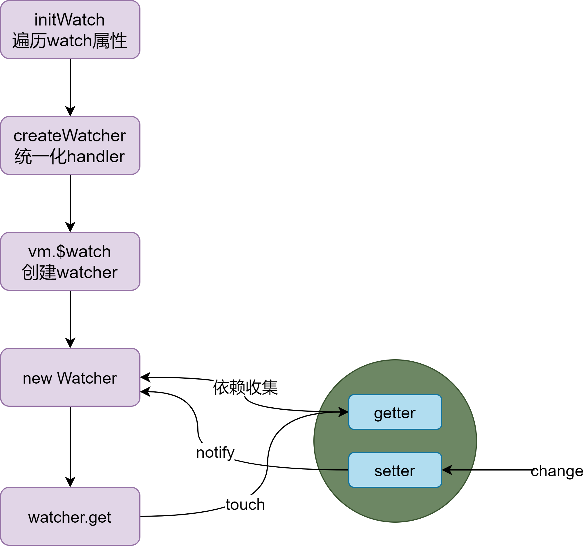

# Vue2源码分析：Watch监视

此系列通过直接在vue源码中分析Watch的底层原理

> 以vue 2.6.11版本进行源码分析

## Watch

- **描述**:一个对象，键是需要观察的表达式，值是对应回调函数。值也可以是方法名，或者包含选项的对象。Vue 实例将会在实例化时调用 $watch()，遍历 watch 对象的每一个 property。
- 简单说：为一个表达式(被观察属性)创建watcher，并在表达式所对应的属性改变时通知watcher执行回调

支持以下写法：

```js
watch: {
  a: function (val, oldVal) {
    console.log('new: %s, old: %s', val, oldVal)
  },
  // 方法名
  b: 'someMethod',
  // 该回调会在任何被侦听的对象的 property 改变时被调用，不论其被嵌套多深
  c: {
    handler: function (val, oldVal) { /* ... */ },
    deep: true
  },
  // 该回调将会在侦听开始之后被立即调用
  d: {
    handler: 'someMethod',
    immediate: true
  },
  // 你可以传入回调数组，它们会被逐一调用
  e: [
    'handle1',
    function handle2 (val, oldVal) { /* ... */ },
    {
      handler: function handle3 (val, oldVal) { /* ... */ },
      /* ... */
    }
  ],
  // watch vm.e.f's value: {g: 5}
  'e.f': function (val, oldVal) { /* ... */ }
}
```

> 开启deep后可深度监听，只要被监听对象改变时都会触发回调。开启immediate可在监听开始时就执行回调

## 分析原理

- watch属性是最晚被初始化的数据，这样一来就可以监听所有其他属性

[源码位置](https://github.com/vuejs/vue/blob/dev/src/core/instance/state.js#L60-L62)

```js
export function initState (vm: Component) {
  vm._watchers = []
  const opts = vm.$options
  if (opts.props) initProps(vm, opts.props)
  if (opts.methods) initMethods(vm, opts.methods)
  if (opts.data) {
    initData(vm)
  } else {
    observe(vm._data = {}, true /* asRootData */)
  }
  if (opts.computed) initComputed(vm, opts.computed)
  if (opts.watch && opts.watch !== nativeWatch) {
    initWatch(vm, opts.watch) // 初始化watch属性
  }
}
```

### initWatch

- 遍历所有watch属性，对每个watch监听的属性都创建watcher进行观察，当监听对象发送变化是触发回调

[源码位置](https://github.com/vuejs/vue/blob/dev/src/core/instance/state.js#L293-L304)

```js
function initWatch (vm: Component, watch: Object) {
  // 遍历watch属性
  for (const key in watch) {
    // watch属性值，可能是对象、数组、函数、方法名
    const handler = watch[key]
    // 值为数组，则为每个处理函数都创建一个watcher，观察监听对象
    if (Array.isArray(handler)) {
      for (let i = 0; i < handler.length; i++) {
        createWatcher(vm, key, handler[i])
      }
    } else {
      createWatcher(vm, key, handler)
    }
  }
}
```

### createWatcher

- 统一化参数，主要处理值为对象的情况，提取handler，以及值为方法名

[源码位置](https://github.com/vuejs/vue/blob/dev/src/core/instance/state.js#L306-L320)

```js
function createWatcher (
  vm: Component,
  expOrFn: string | Function,
  handler: any,
  options?: Object
) {
  // 普通对象检测
  if (isPlainObject(handler)) {
    options = handler
    handler = handler.handler // 提取handler回调
  }
  // 处理值为方法名时
  if (typeof handler === 'string') {
    handler = vm[handler]
  }
  // 统一化handler
  return vm.$watch(expOrFn, handler, options)
}
```

### $watch

- 创建watcher，处理参数，并返回一个可中断watch的方法
- $watch可手动调用，最终返回`unwatchFn`用于解除监听

[源码位置](https://github.com/vuejs/vue/blob/dev/src/core/instance/state.js#L348-L369)

```js
Vue.prototype.$watch = function (
  expOrFn: string | Function,
  cb: any,
  options?: Object
): Function {
  const vm: Component = this
  // 处理手动调用时传入值为对象的情况
  if (isPlainObject(cb)) {
    return createWatcher(vm, expOrFn, cb, options)
  }
  options = options || {}
  // 标识由用户设定的回调
  options.user = true
  // 创建被观察对象的watcher，当对象发生改变时调用cb执行回调
  const watcher = new Watcher(vm, expOrFn, cb, options)
  // 立即调用
  if (options.immediate) {
    try {
      // 立即调用handler
      cb.call(vm, watcher.value)
    } catch (error) {
      handleError(error, vm, `callback for immediate watcher "${watcher.expression}"`)
    }
  }
  // 返回解绑函数
  return function unwatchFn () {
    watcher.teardown()
  }
}
```

#### watcher.teardown()

- 销毁watcher，从它的所有依赖中移除自身，并从组件实例中也移除自身

[源码位置](https://github.com/vuejs/vue/blob/dev/src/core/observer/watcher.js#L226-L240)

```js
teardown () {
  // 具有活性的watcher
  if (this.active) {
    // 移除操作代价比较高，如果组件正在被销毁，则可以跳过
    if (!this.vm._isBeingDestroyed) {
      // 从组件实例的所有watcher中移除自身
      remove(this.vm._watchers, this)
    }
    let i = this.deps.length
    while (i--) {
      // 从自身的所有依赖中移除自身(取消订阅)
      this.deps[i].removeSub(this)
    }
    // 标记为失活
    this.active = false
  }
}
```

### Watch过程示意图

