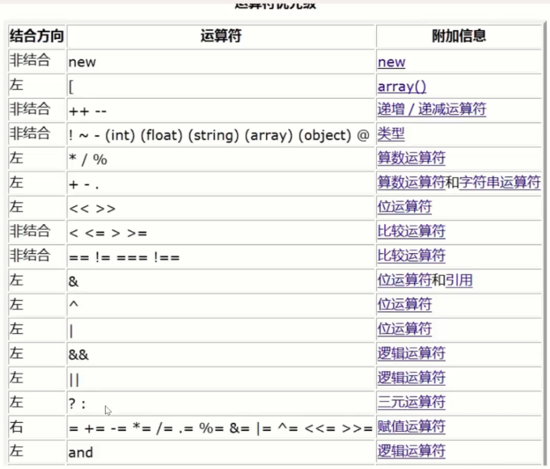

# 五、PHP

## php 基础语法

- 脚本语言

### php 标记（php 引擎识别）

- \<?php 起始标记 php 代码 结束标记 ?>，如果只有 php 代码可不用结束标记
- 注释;//单行简单描述 /\*多行注释\*/复杂描述
- 语句结束符;

### php 基础知识

#### php 变量

- 以\$符号开头：\$name
- 输出变量：echo、print_r()、var_dump()
- 删除变量：unset（变量）
- 变量命名规则同其他语言
- 驼峰法命名，除第一个单词首字母大写，复杂变量建议下划线开头，区分大小写

#### 预定义变量

- 预定义变量都是数组共 9 个
- \$\_GET 通过 get 提交的 shuj
- \$\_POST 通过 post 提交的数据
- \$\_REQUEST 通过 get 和 post 提交的数据
- \$\_SERVER 用户和服务器的基本信息数据，系统定义好的
- \$\_FILES 用户提交的文件数据
- \$\_SESSION session 数据
- \$\_COOKIE cookie 数据
- \$GLOBALS 所有全局变量，也是唯一一个表示以下划线开始的预定义变量
- \$\_ENV 环境数据
- 明确数据在哪个预定义变量中

#### 变量传值

- 值传递，数据传递，赋值给新变量
- 引用传递，变量地址传递，一个地址多个变量名：$d=&$c,变量 d、c 公用一个地址

#### 常量

- 不变的数据,不能修改和删除
- 常量通常为大写字母
- 不可改变数值
- 只有定义和使用
- 定义常量 使用 define（'常量名'，常量值）
- 定义常量 const 常量名=值
- 访问常量：直接使用常量名、constant（'常量名'）
- 定义数组常量 php7+

  ```js 数组常量
  const MATH=array(
    'PI'=>3.14
  )
  echo MATH['PI'];
  ```

#### 系统常量

- 固定的系统常量：固定值
  - PHP_VERSION 版本号
  - PHP_INT_SIZE：php 中整数占用的字节
  - PHP_INT_MAX：php 中整数表示的最大值
- 魔术常量：值在使用情况下会不同

  - \_\_DIR\_\_当前文件所在绝对路径
  - \_\_FILE\_\_当前文件绝对路径（带有文件名）
  - \_\_LINE\_\_当前代码所在行号
  - \_\_FUNCTION\_\_函数内部使用，表示当前函数的名字
  - \_\_CLASS\_\_类内部方法里使用，表示当前类名
  - \_\_METHOD\_\_类内部方法里使用，表示当前方法名（带类名）
  - \_\_NAMESPACE\_\_当前所属命名空间的名字

#### 数据类型

> 三大类八小类

- 基本数据类型
  - 整型
  - 浮点型
  - 布尔型
  - 字符串型
- 复合数据类型
  - 数组型
  - 对象型
- 特殊数据类型
  - 资源型：数据库资源/文件资源
  - 空型
- var_dump()可查看数据类型和结果详情
- 负数最小值：-PHP_INT_MAX -1
- 浮点数：科学计数法为浮点，超过最大整型的数，不精确
- 布尔型不区分大小写
- 字符串型：用''、""、<<<定界符(用于多行字符串,保留格式)

  ```js 定界符
  //EOT可自取名,'EOT'表示单引号字符串
  $str=<<<EOT
      $str1
  EOT;
  ```

- 单引号字符串只能解析\\'和\\\
- 双引号字符串可以解析转义多种，`\$,\",\\,\r\n,\t,\变量（直接输出值）`可解析变量
- 解析字符串中的变量：1.用空格隔开 2.用{变量} 推荐使用{}
- 定界符内的内容都是字符串包括注释，定界符格式严格不能有多余的符号

##### php 数组

- 多个元素的序列组成，键值对
- 索引都为数字：索引数组
- 索引都是字符串：关联数组
- 混合数组，不推荐使用
- 通常保存相关数据，逗号隔开
- 定义数组 array（）或[]
- 只定义值，下标自动生成
- 指定下标 :'下标'=>值
- 通过下标访问元素
- 添加元素：数组名[],自动下标再赋值，数组名[下标]，固定下标赋值
- 删除元素：unset($arr[1]),删除$arr[1],unset(\$arr),删除整个数组
- 多维数组\$arr[0][2],二维数组：一维索引，二维关联

#### 类型判定

- is\_数据类型，判断类型，返回布尔型
- is_numeric,是否能转成数值
- is_scalar,是否为标量（基础类型）

#### php 类型转换

- 自动转换（方便），不改变数据本身
- 强制转换（效率高），资源和 null 不能强制转换
  - （类型）\$a,强制转换对应类型，不改变原来值
  - settype(变量，'目标类型'),改变原来值
  - 类型
    - integer
    - float
    - bool
    - string
    - array
    - object
- 空类型都为 false，'0'也为 false 不同与 js

#### 运算符

- 大多与其他语言一致
- 错误抑制符、合并运算符、位运算符
  - 错误抑制符：@，只需要可能出现错误的表达式前使用，只针对最近目标，如果针对结果（过程）需使用（），只能抑制**简单错误**，不让它显示出来，抑制低级错误，不影响代码执行
  - 合并运算符：?? eg: \$a ?? b 简单的判断数据存在性的判断,\$a 不存在则使用 b 的值,判断的数据不是那么重要，表达式 1？：表达式 3====表达式 1 ？？ 表达式 3，不一定等价，？？判断存在？：判断是否为真
- 飞船运算：<=>,比较运算符左边大于右边返回 1，等于返回 0，小于返回-1，字符串逐位比较不管长度
- `$a=false or die('错误')`\$a 为 false 则不运行

#### 运算符优先级



- 括号优先级最高

### 流程控制

1. 顺序结构
2. 分支结构
3. 循环结构

- 分支结构
  - 考虑不同情形实现分块执行，有可能只有一个代码块
  - if 分支，互斥，**最多执行一个代码块**
  - switch 分支，可以选择多块执行，条件是具体的
- while 循环：不确定循环次数
- for 循环：确定次数
- foreach：**专门遍历数组**,可以不获取下标，极少用于一维数组，多用于多维数组

  ```js foreach遍历
  foreach(数组变量 as [下标变量=>] 值变量){
    //通过下标变量读取变量下标
    //通过值变量读取每个元素值
  }
  ```

- do-while：先执行一次
- 循环条件需要可变
- 循环控制：控制循环体内代码执行方向
  - continue，直接进行下一次循环，层级默认为 1，多个 continue 可跳多层
  - break，直接跳出此循环，默认层级 1，多写多跳

#### 标签语法

- php 嵌入 html
- 标签都写在 php 里不利前端维护
- 解决方案：有 php 用 php，不是 php 就不用 php 代码块
- 分支出现{用：代替，}用 end+标记内容，代替

  ```js 标签语法
  <table>
    <?php
      for($i=1;i<9;i++):
    ?>
    <tr>
      <?php
        for($j=1;j<5;j++):
      ?>
      <td>
        <?php
          if($j<$i){
            echo '$j*$i='.$j*$i;
          }
        ?>
      </td>
        <?php endfor;?>
    </tr>
    <?php endfor;?>
  ```

### php 函数

- 一处维护，多处使用
- 过程一样，时机不同
- 模块化编程，每个模块使用函数编程，代码复用
- 定义方式同其他脚本语言
- 一次定义无限使用
- 函数在栈区运行（效率高），结束时释放栈区内存
- 代码读取，代码编译，代码加载，代码执行，执行结束释放脚本内存（包括代码段）
- 形参与外部任何变量无关
- 形参假设运算，代替外部实际参数
- 实参可以是数据，也可以是保存数据的表达式、常量、函数
- 形参默认值
  - 默认值为最常见的值，有实参则不使用默认值`($n=9)`，(参数=默认值)，默认值调用时赋值
- 传值方式：值传递（不改变数据本身）、引用传值（改变数据本身，只能为变量）
- return 会强制结束函数，是否需要运算结果，可以返回任何数据类型
- 函数规则：
  - 命名规则
    - 不区分大小写，不能出现同名函数（同一脚本中）
    - 驼峰法命名同变量，下划线开头（较多）
    - 函数颗粒度小，功能小，大问题用小函数一个个解决
    - 函数体基本不进行输出操作，如果有数据通常通过返回给调用，只负责运算

#### 函数高级

- 函数作用域
  - 局部变量、全局变量、超全局变量、跨域访问
  - 局部变量
    - 形参属于局部变量，只能在局部访问（函数内），引用属于外部变量和局部变量公用一个内存地址
  - 全局变量（函数外部）
    - 可传值给形参，给局部变量使用
    - **全局变量不能在局部访问**，不同于 js
    - 全局作用域和局部作用域不交叉
    - 用局部变量接收全局变量
  - 超全局变量
    - **可在任何位置访问，不限制作用域**
    - **可通过\$GLOBALS，访问全局变量 eg：\$GLOBALS['全局变量名']**
    - 可通过超全局变量\$GLOBALS（自己包含自己）定义全局变量\$GLOBALS['b']=5
    - 一般只用来访问，不建议用来定义全局变量
- 跨作用域访问
  - 不同作用域之间访问
  - 函数内使用 global 关键字声明（只能），引变量，也可以修改外部值，同一地址
  - global 声明的是全局变量，局部作用域声明全局变量

#### 静态变量

- 在函数内部定义
- 可在多次调用时公用局部变量
- 使用 static 关键字修饰
- 在函数加载时只初始化一次（加载到内存时执行），同一函数共享数据
- 多次调用时共享的数据可设为静态变量
- 数据需要函数多次调用共享数据，可以使用
- 在函数使用递归存储数据的时候，可以使用

#### 强类型参数

- 在定义函数时给形参设定类型
- 保护函数运行逻辑正确
- 定义强类型`function add(float $a,float $b){}`
- 规定传入参数类型
- 不想再内部进行多判断，可以使用强类型参数
- 返回值，定义好返回的类型`function add(float $a,float $b):bool{}`，boolean 为对象
- 开启强类型检查`declare(strict_type=1)`,返回值才会强制检查必须为返回类型，不加则只会强制转换

#### 可变参数

- 不固定参数的设置
- 在形参前面加...
- function add($a,$b,...\$args){},可变参数接收多余参数为数组
- 形参中可以定义可变参数，吸收多余实参变成数组

  ```js 可变参数
  function add($a,$b,...$args){
    $sum=$a+$b;
    foreach($args as $v){
      $sum+=$v;
    }
  }
  ```

- 将实参拆分为多个数据的数组，将数据解构成多个参数

```js 解析实参
function add($a,$b){
  return $a+$b;
}
$arr[10,4];
echo add(...$arr);//输出14
```

#### 可变函数

- 用变量保存的值刚好是另一个函数的名字，那么可以通过变量 直接访问函数
- 变量**值**为函数名（字符串），
  变量（）访问函数

```js 可变函数
function add(){
  echo '1';
}
$var='add';
$var();//输出1
```

- 实际用于将自定义函数作为其他位置的回调函数 callback 使用

```js 回调函数
function add($a,$b){
  return $a+$b;
}
function sum($c,$d,$fun){
  return $fun($c,$d);
}
echo sum(5,6,'add');//输出11
```

- 函数名要存在

#### 匿名函数

- 定义时函数没有名字
- 使用变量保存函数的内存地址
- 通过变量访问函数
- 变量=function (){return 值;};变量赋值需要加分号

#### 回调匿名函数（js 常用）

- 直接将匿名函数定义在函数的实参中，当作实参传递

```js 回调匿名函数
$arr[1,2,3];
function cube($arr,$cube){
  $list=[];
  foreach($arr as $value){
    $list[]=$cube($value);
  }
  return $list;
}
cube($arr,function cube($num){
  return $num **3;//num的3次方
})
```

- 让变量保存函数并进行调用，**且调用后立即销毁，包括代码段**

#### 匿名函数闭包（匿名函数内部使用）

- 定义在函数内，能够读取其他函数内部变量的匿名函数（闭包函数）
- 函数定义在某个函数内部（内部函数）
- 内部函数是匿名函数
- 内部函数访问外部函数的局部变量
  - 不能直接访问
  - 访问使用 use
  - 匿名函数内用**FUNCTION**会返回闭包，而非函数名

```js 闭包函数
function out($str){
  //使用use 声明$str为外部函数的变量
  $inner=function() use ($str){
    echo $str;
  }
  $inner();
}
out('hello');//输出hello
```

- 闭包函数可以返回给外部函数调用，这样可以使得闭包所占用的外部函数资源不会被释放（即闭包函数内部使用的外部数据，类静态变量）
- 闭包函数资源占用，闭包返回给外部还需使用不释放资源

#### 系统函数

- 系统函数效率比自己封装的高
- 通过 api 文档查看
- 通过索引查看
- 通过搜索查看

#### 伪类型

- 未必一定存在的类型
- number 数值，浮点整型
- scalar 标量，php4 种基本类型
- mixed 混合，没有明确类型
- callable 可调用，说明是函数名

#### 常用系统函数

- 输出类
  - echo 一种语法结构，不是函数，不需要括号
  - print_r 输出变量结构，方便查看
  - var_dump 详细打印变量的结构和数据
  - exit/die 输出消息并终止脚本运行
- 时间日期类
  - time 获取当前时间戳（10 位）
  - date 按照指定格式输出时间，可以是当前或者指定时间戳
  - strtotime 将任何英文文本日期时间转换为时间戳
  - microtime 获取时间戳和微秒数
- 数学类
  - max 多个中最大
  - min 多个中最小
  - floor 下取整
  - ceil 上取整
  - mt_rand 获取指定区间或者 0 到最大数之间的一个随机整数
  - round 指定小时位进行四舍五入
- 字符串类
  - addslashes 对 ASCII 中的特殊字符进行转义。通常对用户输入内容进行处理（防止 sql 注入）
  - htmlsmpecialchars 将 html 特殊符号转换成普通字符
  - htmlspecialchars_decode 将实体字符转换为普通字符
  - chr 将 ASCII 对应的数值转换对应的符号
  - ord 将 ASCII 字符转换对应的数值
  - explode 将字符串按照指定符号分割，得到数组
  - implode 将一个数组按指定的符号连接成字符串
  - md5 使用 md5 算法对数据加密
  - str_repeat 将字符串重复指定次数
  - str_replace 字符串替换
  - str_shuffle 随机打乱一个字符串
  - str_split 按照指定长度将数组分割，返回数组
  - strip_tags 去除 html 和 php 标记
  - strlen 获取字符串的长度（字节长度），mb_strlen（字符长度）
  - stripos/strpos 查找字符串中首次出现的位置
  - substr 从字符串中截取指定位置和长度的子字符串
  - trim 去除字符串两边的空格
  - ucfirst 字符串首字母大写
  - strtolower 所有字母小写
  - strtoupper 所有字母大写
  - strstr 获取字符串中某个字符首次出现直到最后的字符串
- 数组类
  - array_key_exists 判断下标释放在数组中存在
  - array_keys 获取数组全部下标，或某个确定值的下标
  - array_merge 合并数组元素（相同字符串下标元素覆盖）
  - array_pop 弹出数组最后一个元素（原数组改变）
  - array_push 压入一个元素到数组最后（改变数组）
  - array_unshift 数组最前面插入一个元素（改变）
  - array_shift 数组最前面弹出一个元素（改变）
  - shuffle 将原始数组打乱
  - in_array 判断元素释放在数组中
  - range 生成一个规则数值的数组
  - current 获取当前数组指针所在位置的值
  - next 将数组元素指针后移一位，并获取新元素的值
  - prev 与 next 相反
  - end 指针移动到最后一个元素，并获取值
  - reset 重置数组指针，回到第一个元素
  - list 语法结构，从数组中获取数据，并且将数据赋值给变量

### 文件包含

- 已有的代码以文件的形式包含到某个指定代码中
- 多个文件变成一个整体
- 使用被包含文件的内容
- 提升开发效率
- 提供代码复用
- 利于代码维护
- 被请求文件执行代码产生数据或者结构
- 小规模开发大规模应用

#### 文件包含实现

- include （'文件名'），括号可有可无（不重要文件）
- require '文件名'，（只在找不到时有区别）（重要文件）
- include_ince '文件名'
- require_once '文件名'
- 给不同文件提供不同内容
- 提供、模板、处理数据
- 先包含（使用被包含文件的数据或者结构）、后包含（将当前所有数据给被包含文件使用，通常用于显示数据，用 php 标签和语法来输出数据）
- 包含方式区别
  - include 报警告错误继续运行
  - require 报致命错误终止运行（安全、建议）
  - 无 once 多次包含会加载多次，\_once 加载一次安全效率低（不建议）

#### 文件包含原理

- 本质就是将包含文件放到对应位置的代码
- php 代码直接放
- 非 php 代码，放到位置，但是 php 不会进行解析
- 文件包含的代码是在执行阶段进行解析
- 编译阶段不会将文件包含加载进来
- 被包含文件运行时独立编译
- 执行的时候才会知道错误
- 包含出错只会影响后续代码

#### 文件包含路径

- 绝对路径（效率低，准确度高建议）
  - 本地绝对路径，磁盘
  - 网络绝对路径 url（php 默认不支持）
- 相对路径
  - 当前目录./,默认当前文件路径（建议直接文件名，不建议./）
  - 上级目录../

### 嵌套包含路径问题

- **在进行文件包含时使用了相对路径（./或../）,而且文件又又嵌套包含，导致./或者../无法正确识别路径**
- 每个文件夹下都有./和../
- 嵌套包含会让系统无法正确原文件中./和../从哪里开始
- 系统永远从当前工作目录的./和../开始寻找
