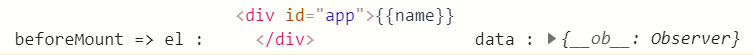
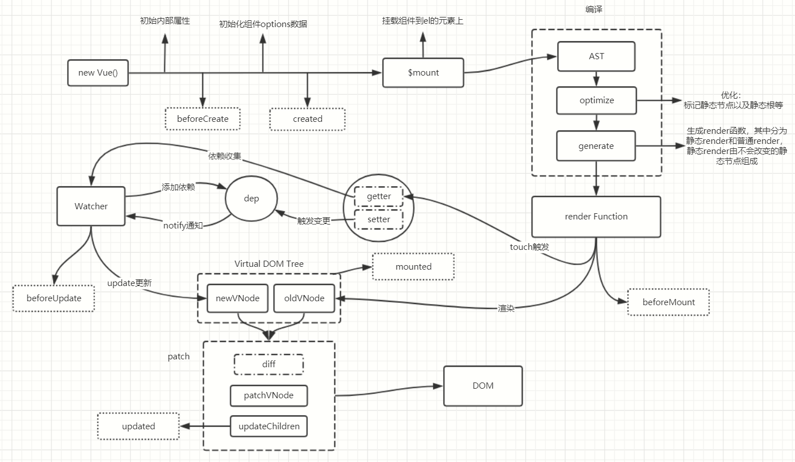

# Vue生命周期

- vue在创建组件以及到销毁之间每个阶段有对应的生命周期钩子，用来在特定时间执行动作
- 主要的8大生命周期：beforeCreate(组件创建前)、created(创建后)、beforeMount(组件挂载前)、mounted(挂载后)、beforeUpdate(数据修改后视图更新前)、updated(视图更新后)、beforeDestroy(组件销毁前)、destroyed(组件销毁后)
- 还有几个生命周期钩子：activated(组件激活后)、deactivated(组件停用后)这2个主要是在组件设置了keep-alive之后特有的生命周期。errorCaptured(当捕获一个来自子孙组件的错误时被调用)
- 接下来分析每个阶段Vue所做的事情


## beforeCreate

- 当这个钩子触发前，vue会先初始化一些属性比如`$parent`,`$children`，对于根组件没有parent，且一开始的children为空数组，都没有挂载
- 初始化事件initEvents，如_events等，用于事件操作对象
- 在初始化一些内部属性之后，就会调用beforeCreate钩子

```js
const vm=new Vue({
  el:'#app',
  data:{
    name:'tom'
  },
  beforeCreate(){
    console.log(`beforeCreate => el :`,this.$el ,` data :`,this.$data)
  }
})
```


可以看到此时el与data都没有初始化

- 调用完成之后就开始初始化组件的一些自身属性
- 初始化 inject
- 初始化 state
  - 初始化 props
  - 初始化 methods
  - 初始化 data
  - 初始化 computed
  - 初始化 watch
- 初始化 provide
- 这里注意，data的初始化在props之后，所以dada中可以使用props中的属性，而props中则不能使用data中的属性
- 之后就是调用created钩子

## created

看看调用created之后的数据


现在可以看到data数据已经监听了，这里就设置了数据的getter与setter了，具有响应式

- 此时会判断组件是否有指定挂载的el元素，如果有进入下一个template模板判断，如果没有则调用vm.$mount(el)手动挂载到el上再进行模板判断，当然如果都没有指定el那么就不会被挂载
- 当前对模板选项进行判断，如果有指定的template属性，则对属性值进行编译，找到template中el挂载的标签，对其内部解析，最后将会编译成render函数，用于渲染。如果没有指定template，那么将会对指定el选择器外部html进行编译生成render函数
- 这里注意，由template生成render函数，其中经历复杂的处理，先是生成ast抽象语法树，再对ast做优化，比如静态节点标记，以及key值绑定，最后根据ast生成render函数，用于构建vnode，如果是运行时编译则不会生成render函数，但是还会执行生成ast
- 实例创建完成后，我们能读取到数据data的值，但是DOM还没生成，挂载属性el还不存在
- 之后就是调用beforeMount钩子准备挂载

## beforeMount



可以看到已经获取了el元素，但是对于数据还未挂载到视图上，此时调用了render生成vnode，并且渲染成了DOM节点，组件挂载到了el元素上

- 在这之后对子组件进行从beforeCreate执行到beforeMount阶段，也就是先对所有包含的子组件进行挂载前操作把数据渲染到组件上，最后从最底层的组件依次向外触发mounted钩子
- 在mounted之前还会创建vm.$el替换原来的el
- 相关的render函数首次被调用

## mounted


执行mounted时，数据已经挂载到了DOM上

- 之后就是观察数据的更新，触发beforeUpdate与updated、然后进入摧毁
- 此时编译好的HTML已经挂载到了页面上，页面上已经渲染出了数据。一般会利用这个钩子函数做一些ajax请求获取数据进行数据初始化
- mounted在整个实例中只执行一次。

## beforeUpdate


- 这时数据已经被修改了，但是视图还未被更新
- 接下来就是更新视图，经过patch、diff之后计算出不同点以及一些操作，触发watcher的updated操作，这里的更新顺序是从最底层更新到外层，也就是最先更新的是子孙组件，类似冒泡触发
- 其中watcher的执行视图更新操作是以批量进行的，对数据的变更只保留一份更新，由于vue是异步渲染的，对更新是使用批量操作，只保留一份相同的更新而且是这次事件循环的最终结果渲染出来，从而避免重复更新渲染
- 当修改vue实例的data时，vue就会自动帮我们更新渲染视图，在这个过程中，vue提供了beforeUpdate的钩子给我们，在检测到我们要修改数据的时候，更新渲染视图之前就会触发钩子beforeUpdate

## updated

- 此时视图渲染完成，已经更新成最新数据了
- 该钩子在服务器端渲染期间不被调用
- 应该避免在此期间更改状态，因为这可能会导致更新无限循环

## beforeDestroy

- 在组件销毁前触发的钩子，主要用来解除自定义绑定
- 由于在调用此钩子之后，vue会自动清理自身设置的一些事件、逻辑等，不用我们来清理，我们只需要清理自定义的事件、定时器等，以免造成内存垃圾

## destoryed

- 此时组件已经销毁了，所有的子组件也被销毁了vue实例绑定的东西也被解除了

以上这些就是Vue组件从创建到销毁的整个流程中执行的动作，我们一般在mounted钩子中初始化网络请求，因为此时数据都挂载好了，可以操作数据。

如果你需要一个组件不被重复创建与销毁那么可以使用keep-alive标签包裹缓存组件，当停用触发deactivated时对当前数据进行保存，等下次激活时可以在activated中释放这些数据，就可以营造出一种记忆操作功能，保存用户的上一次页面操作，不过这主要针对于频繁切换的组件来说可能需要用到

