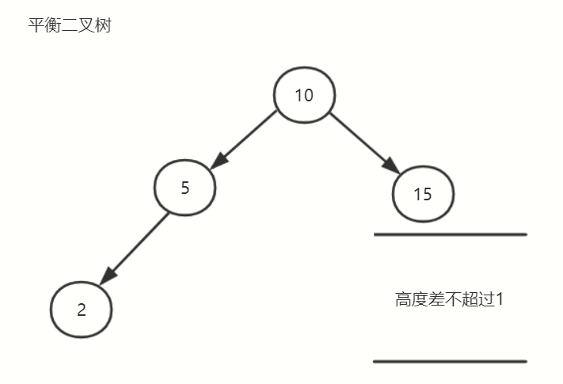
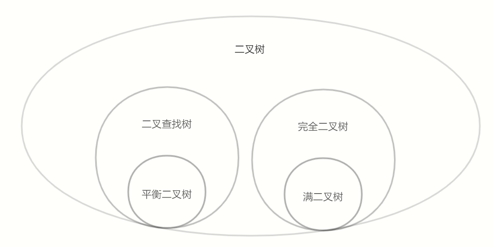

# 算法

## 二叉树

- 二叉树是每个结点最多有两个子树的树结构
- 通常子树被称作“左子树”（left subtree）和“右子树”（right subtree）
- 二叉树常被用于实现二叉查找树和二叉堆


### 满二叉树

- 一棵深度为k，且有2^k-1个结点的二叉树，称为满二叉树
- 这种树的特点是每一层上的结点数都是最大结点数，每层节点都填满


### 完全二叉树

- 在一棵二叉树中，除最后一层外，若其余层都是满的，并且或者最后一层是满的，或者是在右边缺少连续若干结点，则此二叉树为完全二叉树
- 具有n个结点的完全二叉树的深度为floor(log2(n))+1
- 深度为k的完全二叉树，至少有2^(k-1)个叶子结点，至多有2^(k)-1个结点
- 堆就是利用完全二叉树的性质


### 二叉查找树

- 二叉排序树（Binary Sort Tree），又称二叉查找树（Binary Search Tree），亦称二叉搜索树
- 一棵空树，或者是具有下列性质的二叉树：
  - （1）若左子树不空，则左子树上所有结点的值均小于它的根结点的值；
  - （2）若右子树不空，则右子树上所有结点的值均大于它的根结点的值；
  - （3）左、右子树也分别为二叉排序树；
  - （4）没有键值相等的结点。
- 简单说二叉查找树的每个节点都要满足大于其左子树的值，小于右子树的值


步骤：

- 若根结点的关键字值等于查找的关键字，成功。
- 否则，若小于根结点的关键字值，递归查左子树。
- 若大于根结点的关键字值，递归查右子树。
- 若子树为空，查找不成功。
- 查找时间复杂度O(logn)

### 平衡二叉树

- 平衡二叉树要么是一棵空树
- 要么保证左右子树的高度之差不大于1
- 子树也必须是一颗平衡二叉树



### 各种树之间的关系



### 树的遍历(基于数组)

#### 前序遍历

- 前序遍历（DLR），是二叉树遍历的一种，也叫做先根遍历、先序遍历、前序周游，可记做根左右
- 前序遍历首先访问根结点然后遍历左子树，最后遍历右子树


前序遍历结果：ABDECF

代码实现

```前序遍历
/*
      A
    /  \
    B    C
  / \  /
  D  E F
*/
const tree = ['A', 'B', 'C', 'D', 'E', 'F']
// 前序遍历
function DLR(tree, i = 0, arr = []) {
  // 判断当前节点是否有效
  if (i < tree.length && tree[i] !== null && tree[i] !== undefined) {
    // 有效加入
    arr.push(tree[i])
  } else { // 无效返回
    return
  }
  // 左遍历
  DLR(tree, i * 2 + 1, arr)
  // 右遍历
  DLR(tree, i * 2 + 2, arr)
  // 返回遍历结果
  return arr
}
console.log(DLR(tree)) // ["A", "B", "D", "E", "C", "F"]
-----------------------------------------------
// 非递归前序遍历
function DLR(tree) {
  // 定义遍历结果、临时节点索引
  const arr = [],
    stack = []
  let l = tree.length
  // 当前索引
  let i = 0
  while (l > 0) {
    // 判断当前节点是否有效
    if (i < tree.length && tree[i] !== null && tree[i] !== undefined) {
      // 有效、加入，记录节点
      arr.push(tree[i])
      stack.push(i)
      // 左子节点遍历
      i = 2 * i + 1
      // 遍历数-1
      l--
    } else {
      // 无效节点，获取上次记录的父节点，转到右子节点遍历
      i = 2 * stack.pop() + 2
    }
  }
  return arr
}
console.log(DLR(tree)) // ["A", "B", "D", "E", "C", "F"]
```

#### 中序遍历

- 中序遍历（LDR）是二叉树遍历的一种，也叫做中根遍历、中序周游
- 在二叉树中，中序遍历首先遍历左子树，然后访问根结点，最后遍历右子树
- 左根右遍历


中序遍历结果：DBEAFC

代码实现

```中序遍历
/*
      A
    /  \
    B    C
  / \  /
  D  E F
*/
const tree = ['A', 'B', 'C', 'D', 'E', 'F']
// 中序遍历
function LDR(tree, i = 0, arr = []) {
  // 判断当前节点是否有效
  if (i < tree.length && tree[i] !== null && tree[i] !== undefined) {
    // 有效，继续判断左子节点
    LDR(tree, i * 2 + 1, arr)
    // 第一个左子节点，拐点
    arr.push(tree[i])
  } else {
    // 无效
    return
  }
  // 判断右子节点
  LDR(tree, i * 2 + 2, arr)
  return arr
}
console.log(LDR(tree)) // ["D", "B", "E", "A", "F", "C"]
-----------------------------------------------
// 非递归中序遍历
function LDR(tree) {
  // 定义遍历结果、临时节点索引
  const arr = [],
    stack = []
  let l = tree.length
  // 当前索引
  let i = 0
  while (l > 0) {
    // 判断当前节点是否有效
    if (i < tree.length && tree[i] !== null && tree[i] !== undefined) {
      // 有效、进行左子节点判断，记录当前节点
      stack.push(i)
      // 左子节点遍历
      i = 2 * i + 1
    } else {
      const parent = stack.pop()
      // 无效节点，获取上次记录的父节点，保存父节点
      arr.push(tree[parent])
      // 遍历数-1
      l--
      // 转到右子节点遍历
      i = 2 * parent + 2
    }
  }
  return arr
}
console.log(LDR(tree)) // ["D", "B", "E", "A", "F", "C"]
```

#### 后序遍历

- 后序遍历（LRD）是二叉树遍历的一种，也叫做后根遍历、后序周游，可记做左右根
- 后序遍历有递归算法和非递归算法两种。在二叉树中，先左后右再根，即首先遍历左子树，然后遍历右子树，最后访问根结点


后序遍历结果：DEBFCA

代码实现

```后序遍历
/*
      A
    /  \
    B    C
  / \  /
  D  E F
*/
const tree = ['A', 'B', 'C', 'D', 'E', 'F']
// 后序遍历
function LRD(tree, i = 0, arr = []) {
  // 判断当前节点是否有效
  if (i < tree.length && tree[i] !== null && tree[i] !== undefined) {
    // 有效，先左子节点遍历
    LRD(tree, i * 2 + 1, arr)
    // 再右子节点遍历
    LRD(tree, i * 2 + 2, arr)
    // 最后保存当前值
    arr.push(tree[i])
  } else {
    // 无效返回
    return
  }
  return arr
}
console.log(LRD(tree)) // ["D", "E", "B", "F", "C", "A"]
-----------------------------------------------
// 非递归后序遍历
function LRD(tree) {
  // 定义遍历结果、临时节点索引
  const arr = [],
    stack = [],
    set = new Set()
  let l = tree.length
  // 当前索引
  let i = 0
  while (l > 0) {
    // 判断当前节点是否有效，以及是否记录过
    if (tree[i] !== null && tree[i] !== undefined && !set.has(i)) {
      stack.push(i)
      i = i * 2 + 1
    } else {
      // 查看当前栈顶索引，父节点
      i = stack[stack.length - 1]
      // 如果记录过则直接保存
      if (set.has(i)) {
        // 取出最近保存的节点
        const cur = stack.pop()
        // 保存当前栈顶元素
        arr.push(tree[cur])
        l--
      } else {
        // 不存在索引，记录栈顶父元素索引
        set.add(i)
        // 父节点的右子节点遍历
        i = i * 2 + 2
      }
    }
  }
  return arr
}
console.log(LRD(tree)) // ["D", "E", "B", "F", "C", "A"]
```

### 树的遍历(基于对象)

使用对象构建一个二叉树


```构建二叉树
/*
      A
    /  \
    B    C
  / \  /
  D  E F
*/
// 构造节点
class Node {
  constructor(value, left = null, right = null) {
    this.value = value
    this.left = left
    this.right = right
  }
  // 设置左子节点
  static setLeft(origin, target) {
    origin.left = target
  }
  // 设置右子节点
  static setRight(origin, target) {
    origin.right = target
  }
}
// 构造树
class Tree {
  constructor(root) {
    // 设置根节点
    this.root = root
  }
  // 前序遍历
  DLR() {}
  // 中序遍历
  LDR() {}
  // 后序遍历
  LRD() {}
  // 层次遍历
  Layer() {}
}
const nodeA = new Node('A')
const nodeB = new Node('B')
const nodeC = new Node('C')
const nodeD = new Node('D')
const nodeE = new Node('E')
const nodeF = new Node('F')
const tree = new Tree(nodeA)

Node.setLeft(tree.root, nodeB)
Node.setRight(tree.root, nodeC)
Node.setLeft(nodeB, nodeD)
Node.setRight(nodeB, nodeE)
Node.setLeft(nodeC, nodeF)
```

#### 前序

代码实现

```前序遍历
// 前序遍历
DLR(node = this.root, arr = []) {
  if (node) { // 判断当前节点是否存在
    arr.push(node)
    this.DLR(node.left, arr)  // 左遍历
    this.DLR(node.right, arr) // 右遍历
    return arr
  }
  return
}
```

#### 中序

代码实现

```中序遍历
LDR(node = this.root, arr = []) {
  if (node) { // 判断当前节点是否存在
    this.LDR(node.left, arr) // 左遍历
    arr.push(node)
    this.LDR(node.right, arr) // 右遍历
    return arr
  }
  return
}
```

#### 后序

代码实现

```后序遍历
// 后序遍历
LRD(node = this.root, arr = []) {
  if (node) { // 判断当前节点是否存在
    this.LRD(node.left, arr) // 左遍历
    this.LRD(node.right, arr) // 右遍历
    arr.push(node)
    return arr
  }
  return arr
}
```

#### 层次遍历

代码实现

```层次遍历
// 层次遍历
Layer(queue = [this.root], arr = []) {
  const node = queue.shift() // 取队列头
  arr.push(node) // 保存取出的节点
  if (node.left) { // 判断左子节点
    queue.push(node.left) // 加入队列
  }
  if (node.right) { // 判断右子节点
    queue.push(node.right) // 加入队列
  }
  if (!queue.length) return arr // 队列空，即可返回
  return this.Layer(queue, arr)
}
```

全部代码

```全部代码
/*
      A
    /  \
    B    C
  / \  /
  D  E F
*/
// 构造节点
class Node {
  constructor(value, left = null, right = null) {
    this.value = value
    this.left = left
    this.right = right
  }
  // 设置左子节点
  static setLeft(origin, target) {
    origin.left = target
  }
  // 设置右子节点
  static setRight(origin, target) {
    origin.right = target
  }
}
// 构造树
class Tree {
  constructor(root) {
    // 设置根节点
    this.root = root
  }
  // 前序遍历
  DLR(node = this.root, arr = []) {
    if (node) { // 判断当前节点是否存在
      arr.push(node)
      this.DLR(node.left, arr) // 左遍历
      this.DLR(node.right, arr) // 右遍历
      return arr
    }
    return
  }
  // 中序遍历
  LDR(node = this.root, arr = []) {
    if (node) { // 判断当前节点是否存在
      this.LDR(node.left, arr) // 左遍历
      arr.push(node)
      this.LDR(node.right, arr) // 右遍历
      return arr
    }
    return
  }
  // 后序遍历
  LRD(node = this.root, arr = []) {
    if (node) { // 判断当前节点是否存在
      this.LRD(node.left, arr) // 左遍历
      this.LRD(node.right, arr) // 右遍历
      arr.push(node)
      return arr
    }
    return arr
  }
  // 层次遍历
  Layer(queue = [this.root], arr = []) {
    const node = queue.shift() // 取队列头
    arr.push(node) // 保存取出的节点
    if (node.left) { // 判断左子节点
      queue.push(node.left) // 加入队列
    }
    if (node.right) { // 判断右子节点
      queue.push(node.right) // 加入队列
    }
    if (!queue.length) return arr // 队列空，即可返回
    return this.Layer(queue, arr)
  }
}
const nodeA = new Node('A')
const nodeB = new Node('B')
const nodeC = new Node('C')
const nodeD = new Node('D')
const nodeE = new Node('E')
const nodeF = new Node('F')
const tree = new Tree(nodeA)

Node.setLeft(tree.root, nodeB)
Node.setRight(tree.root, nodeC)
Node.setLeft(nodeB, nodeD)
Node.setRight(nodeB, nodeE)
Node.setLeft(nodeC, nodeF)

console.log(tree.DLR())
console.log(tree.LDR())
console.log(tree.LRD())
console.log(tree.Layer())
```