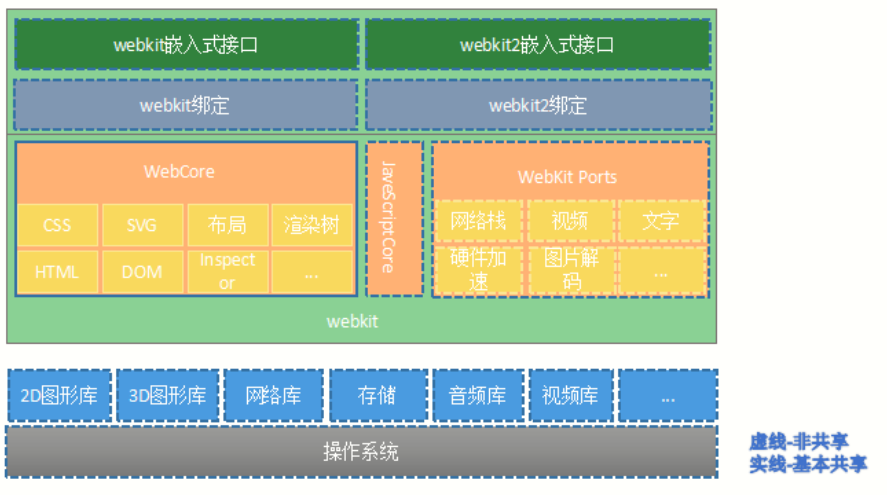
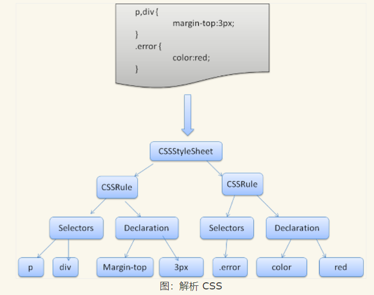
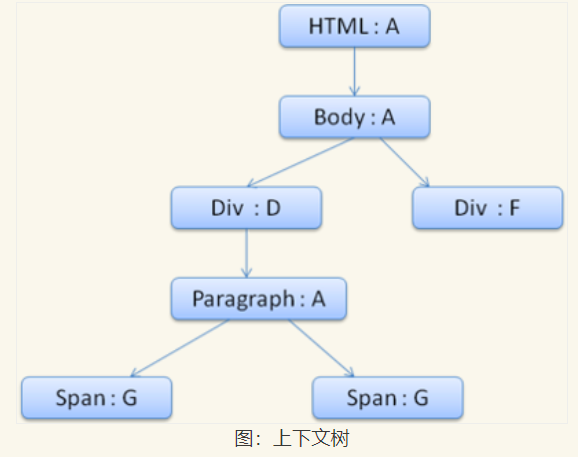
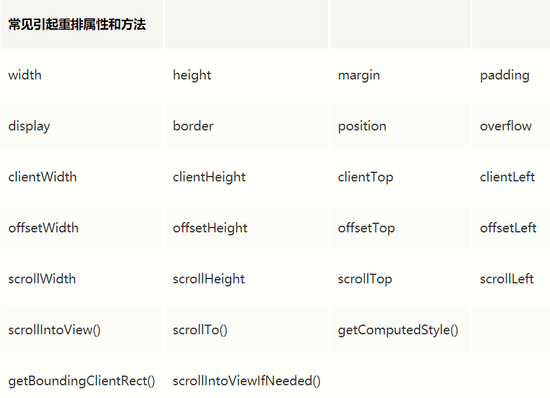
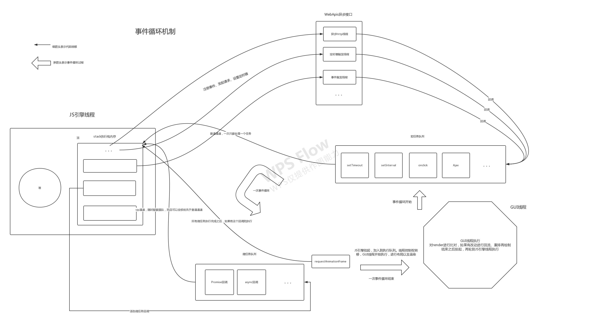

# 刨析浏览器工作原理

## 浏览器多进程

在webkit内核之上，chromium率先在webkit之外引入了多进程模型使用多进程带来的好处包括如下几点：

- 避免了因单个页面的不响应或者奔溃而影响整个浏览器的稳定器，特别是对用户界面的影响
- 当第三方插件奔溃时不会影响页面或者浏览器的稳定性，因为第三方插件也被基于单独的进程来运行
- 方便了安全模型的实施，沙箱模型就是基于多进程架构，沙盒模型隔离插件等进程，提高浏览器稳定性
- 多进程充分利于cpu多核优势

每一个浏览器页面都属于一个浏览器进程，除了部分情况(比如多个空白标签页，浏览器会对其进行优化，整合到一个进程中)

> Chromium可以看做是Chrome的试验版本，加入了很多比较激进的特性

### 浏览器进程间通信

- 由于操作系统中进程与进程之间是相互独立的，资源不共享，那么在进程与进程之间进行通信的开销就更大了
- 浏览器进程与进程之间通过IO线程(RenderHost)来实现进程间通信，其通信具体方式可参考操作系统篇的进程间通信

如下展示部分进程间的通信模型

### 浏览器的各个进程

浏览器属于操作系统的一个应用程序，其工作时需要许多进程之间相互调配，来完成工作

看看浏览器有哪些主要进程

- Browser进程：浏览器的主进程
  - 负责浏览器界面显示，与用户交互。如前进，后退等，即用户打开浏览器看到的UI部分，不包括显示网页的部分
  - 负责各个页面的管理，创建和销毁其他进程，也就是管理各个标签页
  - 将Renderer进程得到的内存中的Bitmap，绘制到用户界面上
  - 网络资源的管理，下载等，把网络请求到的资源通过io线程传递给渲染线程使用。最终渲染线程渲染后的图像信息由此线程绘制到屏幕上
  - 是所有其他类型进程的祖先，并且有且只有一个
- Render进程：浏览器渲染进程(浏览器内核，渲染引擎，呈现引擎)
  - 负责页面的渲染工作，blink/webkit的渲染工作主要是在这个进程完成
  - 默认每个页面一个，互不影响
  - 主要作用为解析HTML，CSS，构建DOM树和RenderObject树，布局和绘制等，
  - 负责页面渲染，脚本执行，事件处理，内部是多线程
- GPU进程：3D绘制进程
  - 最多一个，用于3D绘制，合成图像等
  - 仅当GPU硬件加速打开的时候才会被创建，主要用于对3D图形加速调用的实现
- 第三方插件进程：比如用户安装的浏览器插件
  - 每种类型的插件对应一个进程，仅当使用该插件时才创建
  - 当有多个网页要使用同一个类型的插件的时候，插件进程是被共享的

其中前端主要研究，也最经常打交道的就是Render浏览器渲染进程，看看主流浏览器使用的什么浏览器内核(也就是渲染引擎)吧！

- Firefox 使用的是 Gecko，这是 Mozilla 公司“自制”的呈现引擎
- Safari 和 Chrome 浏览器使用的都是 Webkit(Bink，即Webkit的一个分支)
- Trident是微软的视窗操作系统（Windows）搭载的网页浏览器Internet Explorer呈现引擎

目前最流行的就是Webkit引擎，接下来对Webkit引擎架构做个分析

## Webkit架构

- 操作系统：webkit可以在不同的操作系统上工作，不同浏览器可能会依赖不同的操作系统，同一个浏览器使用的webkit也可能依赖不同的操作系统，如chromium浏览器支持Windows，Mac OS，Linux，Android等；
- 第三方库：位于操作系统层面之上，是webkit运行的基础，包括图形库，网络库，视频库等；
- webkit：
  - WebCore：与平台无关，各个浏览器移植所共享。包含HTML解析，CSS解析，渲染，调试等部分
  - JavaScript引擎：WebKit中默认使用JavaScriptCore引擎，Blink中使用V8引擎，二者的区别后面文章会详细介绍
  - WebKit ports：平台相关，需要浏览器根据硬件平台做更改。包含网络栈，音视频，GPU等部分
- WebKit接口层：提供接口给浏览器应用调用

## 渲染进程(重点)

浏览器的渲染进程需要处理许许多多任务，也是浏览器最重要的进程之一也是浏览器的内核部分，由于渲染进程需要处理服务器请求的资源，所以需要使用多线程，线程相比进程调度和切换更方便，且线程之间共享进程的内层空间，进程是操作系统分配资源的最小单位，线程是程序执行的最小单位，接下来看看渲染进程的构成

- GUI 渲染线程
  - 负责渲染浏览器界面，解析HTML，CSS，构建DOM树和RenderObject树，布局和渲染等
  - 当界面需要重绘（Repaint）或由于某种操作引发回流(reflow)时，该线程就会执行
  - GUI渲染线程与JS引擎线程是互斥的，当JS引擎执行时GUI线程会被挂起（相当于被冻结了），GUI更新会被保存在一个队列中等到JS引擎空闲时立即被执行
- JavaScript引擎线程
  - 也可以称为JS内核，例如V8引擎，主要负责解析Javascript脚本，运行代码
  - JS引擎一直等待着任务队列中任务的到来，然后加以处理，一个Tab页（renderer进程）中无论什么时候都只有一个JS线程在运行JS程序
  - 同样注意，GUI渲染线程与JS引擎线程是互斥的，所以如果JS执行的时间过长，这样就会造成页面的渲染不连贯，导致页面渲染加载阻塞。
- 定时触发器线程
  - setInterval与setTimeout所在线程
  - 浏览器定时计数器并不是由JavaScript引擎计数的,（因为JavaScript引擎是单线程的, 如果处于阻塞线程状态就会影响记计时的准确）
  - 通过单独线程来计时并触发定时（计时完毕后，添加到事件队列中，等待JS引擎空闲后执行）
- 事件触发线程
  - 当一个事件被触发时该线程会把事件添加到待处理队列的队尾，等待JS引擎的处理，用来控制事件循环
  - 这些事件可以是当前执行的代码块如定时任务、也可来自浏览器内核的其他线程如鼠标点击、AJAX异步请求等，但由于JS的单线程关系所有这些事件都得排队等待JS引擎处理
  - 当对应的事件符合触发条件被触发时，该线程会把事件添加到待处理队列的队尾，等待JS引擎的处理
- 异步http请求线程
  - 在XMLHttpRequest连接后是通过浏览器新开一个线程请求将检测到状态变更时如果设置有回调函数，异步线程就产生状态变更事件，将这个回调再放入事件队列中。再由JavaScript引擎执行
  - 下载资源的线程还是浏览器主进程下的下载线程

### 浏览器主进程与渲染进程之间的通信

- 当用户输入URL时，Browser进程收到用户请求，首先UI线程处理，网络下载线程发起网络请求，获取到服务器资源，转交给IO线程，随后通过RendererHost接口转交给Renderer进程
- Renderer进程的Renderer接口收到消息，IO线程简单处理后，交给渲染线程，进行HTML解析和DOM树构建，CSS解析，JS执行，RenderObject树构建，布局和绘制等过程，如果用到GPU加速，则还会配合GPU进程合成图像，最后生成用户可见区域（ViewPort）的Bitmap即页面图像信息。最后通过共享内存方式IPC给Browser进程进行绘制
- Browser进程使用Bitmap内存在界面上绘制出图像

这就是一个简单的浏览器解析网页文件，再到客户端显示网页的过程，此部分在另一篇`详解浏览器发起请求到显示网页过程`文章中有详细分析

### GUI线程

GUI线程是渲染图像的主要部分，通过GUI线程把服务器下载的资源通过一步步解析成最终显示的网页

看看Webkit引擎GUI解析文件流程

- 首先浏览器先按照关键请求路径策略请求服务器文件，对于网页的不同文件，浏览器有默认设置请求优先级，比如最优先请求html、css、font，然后是js、图片视频等文件，当然我们也可能调整部分文件的请求优先级
- 获取到文件时，GUI线程先解析html文件，并且把html标签转换为dom树的节点
- 然后解析外部css文件与内嵌、内联样式，构建css样式树
- 遇到js文件则同步解析，如果js文件使用defer/async，则开启异步下载线程，等到下载完成再交给js引擎执行。如果是异步下载的js则不会影响GUI同步解析html文档，当然如果把外部引入的js写在body底部，那样对文档的解析也没有太大影响，这样可以提前渲染网页，而不会因为js文件阻塞页面显示
- 当css样式树与DOM树构建之后，则会合成为render渲染树，负责计算元素的尺寸、位置
- 生成render树之后，绘制render树(paint)的页面像素信息，最后发送给浏览器主线程，主线程再将各图层信息发送给GPU进程合成图像，显示在屏幕上显示

其中渲染引擎在解析的同时，会尽可能早的把网页内容呈现出来，所以并不是等所有dom树与css树构建完成才渲染，而是解析一部分渲染一部分，这样就能够避免用户界面长时间留白的情况，优化用户体验。浏览器在代码中发现一个 img 标签引用了一张图片，于是就向服务器发出图片请求，此时浏览器不会等到图片下载完，而是会继续解析渲染后面的代码，等到服务器返回图片文件，由于图片占用了一定面积，影响了后面段落的布局，浏览器就会回过头来重新渲染这部分代码

#### 解析HTMl生成解析树

在解析html的时候，会使用解析器对html进行解析，其实html代码就是给我们程序员自己看的，只不过规定了html的语法标准，从而能够使用统一的规则解析html文件生成DOM树

组合解析器与词法分析器对html进行词法分析以及语法分析

- 词法分析：词法分析是将输入内容分割成大量标记的过程，词法分析器（有时也称为标记生成器），负责将输入内容分解成一个个有效标记。也就是标记有效的html中的一个个单词或者标点符号，去除无效或者不需要的字符，就好比把一篇文件分解成一个个有效的字符
- 解析器：解析器负责根据语言的语法规则分析文档的结构，从而构建解析树。解析器会在词法分析的基础上对词法进行语法规则匹配，如果发现了匹配规则，解析器会将一个对应于该标记的节点添加到解析树中，然后继续请求下一个标记，如果直到最后都没有匹配到规则，则会抛出语法错误

如上是解析html生成解析树，此树是由一个个匹配html语法规则构成的树，其中每个节点就是由多个词法标记组成的合法的语法，比如一个正确的语句或者是表达式

#### 解析树生成DOM树

解析器的输出“解析树”是由 DOM 元素和属性节点构成的树结构，比如如下标记

其中标记化算法，大致就是匹配标签的过程，比如匹配到开始标签就会期望一个结束标签，不过浏览器的容错机制会在一定程度上纠正开发者的错误代码结构，但是最好不要这样做。上图标记最终将会生成如下DOM树结构

当然，在构建解析树的同时也会生成DOM树，而且在解析的同时会不断的修改DOM，所有的html标签都会被创建为DOM树中的节点

当DOM构建完成时，将会触发DOMContentLoaded事件，此时DOM树已经完成构建，但是不能确定CSS树构建完成。

加载css的时候，可能会修改下面DOM节点的样式，如果css加载不阻塞render树渲染的话，那么当css加载完之后，render树可能又得重新重绘或者回流了，这就造成了一些没有必要的损耗。所以在合成render树需要css树也构建完毕才能合成。虽然css的解析与DOM解析是异步进行，但是在构建render树的时候需要二者都处于完成状态，才会进行render树构建，所以css与dom树的生成会阻塞render树的生成

#### CSS样式解析生成CSSOM树

- 由于css的解析不同于html解析，html的解析依赖于上下文环境，而css样式是上下文无关的词法，通过正则匹配对css样式做解析处理
- 其中使用浏览器内核的css解析器将CSS文件解析成 StyleSheet 对象，且每个对象都包含CSS规则
- CSS 规则对象则包含选择器和声明对象，以及其他与 CSS 语法对应的对象

生成如下样式树

#### 合成render树

- render树又为渲染树、呈现树，用于最终渲染图像的依据，此树由DOM树与style规则树合并而成，当然也不是简单的合并内容，其中涉及到复杂的匹配算法
- 其中主要是摘取DOM树中需要渲染的DOM节点，比如head以及display为none的节点则不会加入到render中，但是visibility属性值为“hidden”的元素仍会显示）
- DOM元素在render树中大多数是有对应的呈现器，呈现器通常就是css对应的盒模型，其中包含元素的宽度、高度和位置等几何信息
- 对与标准文档流的元素，在呈现树中的位置对应于DOM树中的位置，而对于浮动或者绝对定位的元素来说，其存放在其他位置，并映射到真正的框架，而放在原位的是占位框架

- 构建呈现树时，需要计算每一个呈现对象的可视化属性。这是通过计算每个元素的样式属性来完成的，通过style rules树计算呈现树的上下文样式
- 在匹配样式的时候会用到缓存机制，对相同样式规则直接使用之前添加过的规则。以及共享样式等优化方式

此时已经生成render树，但是对于呈现器来说，在创建完成并添加到呈现树时，并不包含位置和大小信息。计算这些值的过程称为布局或重排

#### 布局Layout

- HTML 采用基于流的布局模型，这意味着大多数情况下只要一次遍历就能计算出几何信息，布局可以按从左至右、从上至下的顺序遍历文档，但是比如表格需要多次遍历
- 布局是一个递归过程，从根呈现器开始，然后递归遍历部分或所有的框架层次结构，为每一个需要计算的呈现器计算几何信息
- 所有的呈现器都有一个“laybout”或者“reflow”方法，每一个呈现器都会调用其需要进行布局的子代的 layout 方法
- 根呈现器的位置左边是 0,0，其尺寸为视口（也就是浏览器窗口的可见区域）

##### Dirty位系统

- 为了优化每次layout不会导致全局layout，浏览器采用Dirty位系统
- 如果某个呈现器发生了更改或者将自身及其子代标注为“dirty”，则需要进行布局
- 有两种标记：“dirty”和“children are dirty”。“children are dirty”表示尽管呈现器自身没有变化，但它至少有一个子代需要布局

##### 全局布局与增量布局

- 全局布局：是指会触发整个呈现树的重新计算位置等信息，比如修改全局样式、调整屏幕大小等
- 增量布局：是指只对呈现器进行布局，一个标记为dirty的呈现器，会异步存放增量布局。比如从网络上获取的额外内容增加到DOM树中，将会创建新的呈现器添加到呈现树中

##### 异步布局与同步布局

- 异步布局：增量布局是异步执行的，Firefox将增量布局的重排命令加入队列，等调度程序批量执行这些命令，wbekit使用计时器，一段时间对呈现树进行遍历，并对呈现器进行布局
- 同步布局：全局布局一般是同步触发的，所以尽量不要触发全局布局。对于一些操作也会直接触发重新布局，比如滚动发生改变的时候，布局命令，会以回调的形式触发。访问一些样式属性，将会触发同步增量布局，如下图

操作这些属性与方法都会引起重排

- 对于只调整呈现器位置的布局来说，那么可以从缓存中直接读取呈现器的大小，而无需再计算
- 布局处理：
  - 父呈现器确定自己的宽度
  - 父呈现器依次处理子呈现器，并且：
    - 放置子呈现器（设置 x,y 坐标）
    - 如果有必要，调用子呈现器的布局（如果子呈现器是 dirty 的，或者这是全局布局，或出于其他某些原因），这会计算子呈现器的高度
  - 父呈现器根据子呈现器的累加高度以及边距和补白的高度来设置自身高度，此值也可供父呈现器的父呈现器使用
  - 将其 dirty 位设置为 false
- 呈现器宽度计算：
  - 呈现器宽度是根据容器块的宽度、呈现器样式中的“width”属性以及边距和边框计算得出的
  - 容器的宽度取容器的 availableWidth 和 0 中的较大值，clientWidth()- paddingLeft()- paddingRight()是计算元素的宽度是“width”样式属性
  - clientWidth 和 clientHeight 表示一个对象的内部（除去边框和滚动条）
  - 这些值会缓存起来，以用于需要布局而宽度不变的情况
- 换行：如果呈现器在布局过程中需要换行，会立即停止布局，并告知其父代需要换行。父代会创建额外的呈现器，并对其调用布局

#### 绘制paint

- 在绘制阶段，系统会遍历呈现树，并调用呈现器的“paint”方法，将呈现器的内容显示在屏幕上。绘制工作是使用用户界面基础组件完成的
- 和布局一样，绘制也可以是全局的（绘制完整的树）或增量的。在增量的绘制过程中，一些渲染对象以不影响整棵树的方式改变，改变的渲染对象使其在屏幕上的矩形区域失效(invalidate)，这将导致操作系统将其看作dirty区域，并产生一个paint事件，操作系统很巧妙的处理这个过程，并将多个区域合并为一个
- 绘制顺序：
  - 背景颜色
  - 背景图片
  - 边框
  - 子代
  - 轮廓

Webkit 矩形存储

- 在重新绘制之前，Webkit 会将原来的矩形另存为一张位图，然后只绘制新旧矩形之间的差异部分

Firefox 显示列表

- Firefox 遍历整个呈现树，为绘制的矩形建立一个显示列表。列表中按照正确的绘制顺序（先是呈现器的背景，然后是边框等等）包含了与矩形相关的呈现器
- 这样等到重新绘制的时候，只需遍历一次呈现树，而不用多次遍历（绘制所有背景，然后绘制所有图片，再绘制所有边框等等）- Firefox 对此过程进行了优化，也就是不添加隐藏的元素，例如被不透明元素完全遮挡住的元素

动态变化

- 在发生变化时，浏览器会尽可能做出最小的响应。因此，元素的颜色改变后，只会对该元素进行重绘
- 元素的位置改变后，只会对该元素及其子元素（可能还有同级元素）进行布局和重绘
- 添加 DOM 节点后，会对该节点进行布局和重绘
- 一些重大变化（例如增大“html”元素的字体）会导致缓存无效，使得整个呈现树都会进行重新布局和绘制

简单说浏览器将会尽可能做最小的变动，如果是操作如下属性只会触发重绘

一些重大的变动会导致缓存无效，比如根元素字体大小的调整

呈现引擎的线程

- GUI线程是呈现引擎的主线程，在每个标签页下都只有一个GUI线程
- 但是网络操作可能有多个并行线程，并行连接数是有限的（通常为 2 至 6 个，以 Firefox 3 为例是 6 个）

### JavaScript引擎线程

- Javascript引擎，也可以称为JS内核，主要负责处理Javascript脚本程序，例如V8引擎
- js为什么是单线程：避免多线程同时操作DOM产生冲突，那么只能通过锁来解决.避免因为引入了锁而带来更大的复杂性，Javascript在最初就选择了单线程执行
- js引擎与GUI引擎互斥，同时只能有其中一个线程在执行，而另一个线程将会加入队列等待当前线程空闲才执行，如果js线程执行时间太长，那么GUI线程就不能及时渲染页面，而导致页面卡顿
- 当GUI线程解析到js文件，开启网络线程下载外部js之后，会把js文件传给js引擎解析
- js引擎主要对js代码进行解释并且执行
- js主线程处理当前正在执行的代码，它会执行当前调用栈栈顶的执行上下文，从堆空间(一般是存储对象)和栈空间(一般存储非对象值以及对象引用)取数据，进而处理当前调用栈所用到的数据
- 所有的同步代码会按照代码顺序压入调用栈中等待主线程执行，如果代码中遇到了异步代码，则会根据异步类型抛给异步线程执行
- 异步类型，主要分为微任务与宏任务
- 任务队列其实本质就是一块内存空间，里面的任务是依据FIFO先进先出的规则来执行，所有异步代码执行完毕的回调都是加入到异步任务队列中等待主线程的调用
- 异步可以提高cpu的利用率

#### js同步任务

- 基于js的单线程同时只能处理一件事情，而同步即是在主线程上排队执行的任务，只有当前任务执行完成，才会进入下一个任务。同步执行的函数会在预期得到结果，也就是可以清楚什么时候能得到返回值
- 所有同步代码只会进入调用栈，同步代码会阻塞主线程的执行，而且会优先与其他非同步代码执行

#### 异步任务

- 异步是指当前执行的代码会进入异步线程处理之后才会再由主线程处理回调
- 异步的结果不是马上能够得到，而是会在将来的某个时间点获取到
- 通常异步代码所要经过的步骤比同步代码多，由于异步代码不是直接放在调用栈中执行，而是要派发(可能不需要)给其他线程处理，等处理完成后的回调放在某个地方存储(比如任务队列)，等到同步队列执行完成之后才会取回异步回调代码进行执行
- 异步任务会加入到异步队列中，等到执行栈为空之后才会去异步队列中取异步任务执行
- 其中异步任务又分为：异步宏任务与异步微任务

##### 异步宏任务

- 一般的宏任务队列存放的是WebApis的回调，WebApis中包含许多线程，GUI渲染线程(与js主线程互斥不能同时执行)、事件触发线程、定时器线程、异步网络请求线程
- 宏任务存放由异步WebApis产生的回调函数，但优先级低于微任务
- 异步宏任务主要是在执行js代码时遇到需要执行webApi时创建
- 当执行到定时器时，如setInterval、setTimeout，js引擎会通知定时器线程开一个定时器，等到定时器定时到了，定时器线程会主动往异步宏任务队列队尾添加一个回调函数，此函数其实就是在你js代码中设置定时器的回调函数。当主线程的同步代码执行完就会去异步队列查看可执行的异步任务
- 当执行到注册一个浏览器事件的时候，js引擎会通知事件触发线程监听这个事件的触发，等到这个事件被触发的时候，事件线程主动向异步宏任务队列添加回调函数，此函数也是我们在js代码中写的回调
- 当执行到发起异步Ajax请求时，js引擎会通知异步http线程开一个ajax请求，等到此线程监听到http状态的变更后，也会主动的向异步宏任务队列添加回调函数，此函数可能是你在js代码中写到的成功回调或者是失败回调
- 异步宏任务队列就是由执行js代码，调用异步webapi触发的回调函数而组成的队列
- 可以这么理解(个人理解)：宏任务都是由外部线程推送的回调函数组成，js引擎只负责分发异步执行的任务，而回调是由各个异步线程来执行插入到宏任务队列。那么宏任务队列就是由渲染进程除了js进程之外的其他wbeapi创建的异步线程的推送而组成的。宏任务队列属于渲染进程的共享空间(也就是其他线程可以公用的内存空间，虽然线程间公用进程的内存空间，但是这个宏任务队列是其他线程可以直接操作的空间)

##### 异步微任务

- 微任务队列与宏任务队列的区别就在于，主线程对于其中的任务调度的区别，主进程会优先执行微任务队列中的全部任务，当微任务中的全部任务执行完毕才会进而转到宏任务执行
- 微任务可以由这些方法关键字调用产生Promise、async、await、MutaionObserver、process.nextTick(Node.js环境）
- 如果调用微任务方法时，方法内部包含其他线程干预处理时，会抛给指定线程执行，而主线程继续执行下面的代码，等到其他线程处理完成之后，如果有回调函数则会把回调加入到指定异步类型(这里为微任务队列)的队列中排队等待主线程执行
- 微任务与宏任务的主要区别在于，主线程优先执行全部微任务，待执行完成之后才会挨个执行宏任务
- 微任务队列是由js引擎维护，微任务队列的回调只由js内置接口使用，比如Promise，async等。其中这些关键字调用产生的异步微任务是直接添加到微任务队列中，而不会经过其他线程的处理，当然除非你在调用这些api时还在其内部创建其他异步宏任务
- 微任务队列是由js引擎直接推送的，其中的回调则是调用创建微任务api时传入的代码

#### EventLoop事件循环机制

- 事件循环机制是针对于js线程的调度方式
- 可以理解为js线程在寻找任务执行的过程就是事件循环，其寻找方式就是调用机制
- 先了解一下js引擎是如何执行js代码的
  - 通常渲染引擎的GUI线程执行到加载js代码后开启网络线程下载js文件，当下载完成则会把js文件加入到事件队列，也就是宏任务队列
  - 首先js引擎(如V8引擎)先取第一个宏任务，即script导入的代码块，然后主线程在调用栈中解析js代码
  - 等所有代码解析完成之后开始运行js代码
  - 如果遇到同步代码直接执行
  - 遇到异步代码，如果是宏任务类型即异步WebApis处理的异步代码，那么将会通知WebApis在对应的线程中处理异步任务，此时js主线程继续执行下面的代码，在其他线程处理完毕之后如果有回调函数，则异步线程会将回调函数加入到宏任务队列尾部
  - 如果是微任务类型的异步代码，也同宏任务处理，只不过是把回调函数加入到微任务队列中，其执行的优先级高于宏任务队列
  - 当同步代码全部执行完成，主线程将会一直检测任务队列，如果有异步微任务则执行完全部的微任务
  - 挂起js线程，开启GUI线程，执行布局绘制页面，之后就是开始下一轮的事件循环，挂起GUI开启js引擎，就又回到取宏任务执行
  - 这里注意，所有的微任务都是由宏任务中执行的代码产生，一开始只有宏任务队列有任务，且所有的异步任务都是由js代码块中产生的，可以这么理解宏任务队列是js引擎执行文件的入口

以下是js引擎线程内部的大致结构

以下是异步任务队列大致结构

以下是WebApis大致结构

以上是事件循环中需要涉及到的部分，接下来看看事件循环机制(**请放大查看**)

### 定时器触发线程

- 此线程主要是给js中设置定时器setTimeout与setInterval使用，由于定时器属于另开的一个线程，专门用来定时使用，那么这个定时精确定能得到保证。js线程的任务是执行代码，定时线程是给js引擎提供较为准确的定时回调
- W3C在HTML标准中规定，规定要求setTimeout中低于4ms的时间间隔算为4ms，即使定时时间设置为0也无法立即执行，无法改变其异步任务的特性。当js线程执行到设置定时器时，给定时线程发送所需的信息，让定时线程开启一个定时器，如果此定时器设置时间为0，那么定时线程将会马上把回调添加到宏任务队列，等待js引擎的执行
- 其中js线程派发任务以及定时线程添加回调，再到事件循环结束之后执行GUI的渲染，这个过程避免不了需要耗费时间，那么w3c中规定的时间也不无道理，也许是经过各种测试以及讨论出的比较合理的最短时间，不过有些浏览器也达不到这个最低间隔

### 事件触发线程

- 事件触发线程是专门负责注册DOM事件以及监听触发事件任务
- 当执行js代码需要注册监听一个事件是，派发给事件线程，注册一个事件并且监听这个事件。当触发这个事件时，事件线程会往宏任务队列添加回调函数，等待js引擎线程的拉取
- 触发事件时会将当前DOM以及window对象的一些事件相关的信息即事件对象，以回调函数的参数形式传给回调函数

### 异步http请求线程

- 这个线程的任务是在js发起http请求时监听的状态变更，当请求状态改变是会触发回调，当状态为成功或者失败时会将结果放入到事件对象当作回调函数的参数。然后把回调加入到宏任务队列中，等待js线程的调用
- 通过测试会发现当一个标签页发起请求时，最早出现网络下载的是browser主进程，即浏览器主进程。之后才是发起请求标签页的网络下载
- 个人理解：当标签页发起请求时，渲染进程会开一个异步http线程用来对浏览器主进程发起一个http请求信息，此时异步http线程会设置这个请求状态变更的监听回调函数
- 当浏览器主进程收到标签页进程的异步http请求信息时，开启一个网络下载线程，此时标签页进程的异步http线程就是监听这个下载线程状态的改变，当成功或者失败时，把资源或者信息传给标签页进程的异步http线程，然后再添加js的回调以及响应对象

以上大致是浏览器内核的工作原理

以下链接是比较好的相关文章

[深入浏览器工作原理](https://www.cnblogs.com/lhb25/p/how-browsers-work.html)

[浏览器渲染以及GPU的图像合成](https://segmentfault.com/a/1190000008015671#item-2)

[阮一峰的事件循环](http://www.ruanyifeng.com/blog/2014/10/event-loop.html#comment-text)

[浏览器工作原理梳理](https://juejin.im/post/5a6547d0f265da3e283a1df7#heading-17)