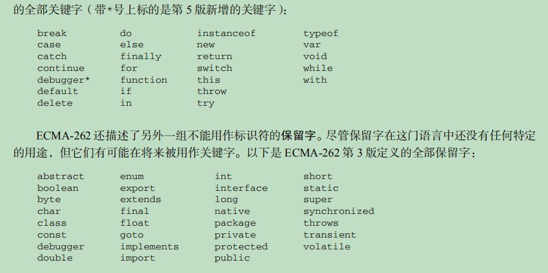

# 一刷红宝石知识点归纳

## 第一章JavaScript介绍

### 浏览器战争

这一章主要讲的就是关于netscapet(网景)与微软的战争，还有关于JavaScript的诞生和ECMAScript的出现

- js于1995年诞生于网景公司，当时主要用来处理以前由服务器端处理的输入验证操作。
- 微软也不甘示弱，在ie中实现自己的js
- 网景公司的布兰登·艾奇，也就是js的创始人，当时的js叫做LiveScript，后来网景与sun公司合作，建立了开发联盟，于Netsscape Navigator 2(网景浏览器)发布前夕，想蹭Java的热炒，把LiveScript改名为JavaScript，其实js与java根本是两码事，前者是凑热度改的名(话糙理不糙，哈哈)。
- 之后两方各自发展自己的js，后来微软推出自己的js叫做JScript，由于没有标准组织来管理，所以出现了两个派别
- 后来以js1.1为蓝本的建议被提交到了欧洲计算机制造商协会即ECMA，该组织就是专门来，制定标准化一种通用、跨平台、供应商中立的脚本语言的语法和语义。总之这个协会由各大nb公司的程序员组成，后来定制了ECMA-262的新脚本语言标准，此后为了公平性，就把js改为ECMAScript，但是大家 还是习惯叫JavaScript，其实这两个并不是同一个东西
- ECMAScript只是规定js的语法部分，不包括DOM(文档对象模型)和BOM(浏览器对象模型)，但是我们常说的js其实是ECMAScript+DOM+BOM的组合
- ECMAScript的宿主环境，可以理解为执行环境，一般为Web浏览器，还有Node环境，其实主要讲的就是V8引擎，在Web浏览器环境下js拥有DOM和BOM，这是浏览器提供的不是js语法本身具有
  
### DOM

- DOM即文档对象模型，简单讲就是用于html的应用程序编程接口(api)，DOM 把整个页面映射为一个多层节点结构。DOM就是html中的标签按照关系组成的一棵对象树，js可以对这个树进行删除、添加、替换、修改其中的任何节点。

### DOM级别

- 在w3c还未对DOM制定标准前，不同浏览器厂家对DOM的操作各有不同，这个时期的DOM操作，一般就被称为DOM0，0级DOM是非标准的，其api受浏览器厂家影响。
- 1998年w3c(万维网联盟，也是个制定标准的组织，主要制定万维网通信标准)推出DOM1级标准，其标准主要包括DOM核心与DOM HTML，核心是规定如何映射基于xml的文档结构，就是简化对文档中任意的访问和操作。DOM HTML就是在核心上，添加了对html的对象和方法，当然DOM并不只针对js一种语言
- DOM2级，
  - 主要引入DOM视图DOM 视图（DOM Views）：定义了跟踪不同文档（例如，应用 CSS 之前和之后的文档）视图的接口；
  - DOM 事件（DOM Events）：定义了事件和事件处理的接口；
  - DOM 样式（DOM Style）：定义了基于 CSS 为元素应用样式的接口；
  - DOM 遍历和范围（DOM Traversal and Range）：定义了遍历和操作文档树的接口。
- DOM3级主要引入统一的加载和保存文档的方法，以及验证文档的方法


### BOM

- BOM浏览器对象模型，从根本上讲，BOM 只处理浏览器窗口和框架；但人们习惯上也把所有针对浏览器的JavaScript 扩展算作 BOM 的一部分。
- 扩展：
  - 弹出新浏览器窗口的功能；
  - 移动、缩放和关闭浏览器窗口的功能；
  - 提供浏览器详细信息的 navigator 对象；
  - 提供浏览器所加载页面的详细信息的 location 对象；
  - 提供用户显示器分辨率详细信息的 screen 对象；
  - 对 cookies 的支持；
  - 像 XMLHttpRequest 和 IE 的 ActiveXObject 这样的自定义对象。
- BOM没有标准遵循，根据浏览器厂家不同会有不同的api

## 第二章HTML中使用JavaScript

从这章开始，不瞎聊了，只记录重点

### `<script>`标签

- html 4.01中script规定了6个属性：
  - async：可选。表示应该立即下载脚本，但不应妨碍页面中的其他操作，比如下载其他资源或
等待加载其他脚本。只对外部脚本文件有效。
  - charset：可选。表示通过 src 属性指定的代码的字符集。由于大多数浏览器会忽略它的值，
因此这个属性很少有人用。
  - defer：可选。表示脚本可以延迟到文档完全被解析和显示之后再执行。只对外部脚本文件有
效。IE7 及更早版本对嵌入脚本也支持这个属性。
  - language：已废弃。原来用于表示编写代码使用的脚本语言（如 JavaScript、JavaScript1.2
或 VBScript）。大多数浏览器会忽略这个属性，因此也没有必要再用了。
  - src：可选。表示包含要执行代码的外部文件。
  - type：可选。可以看成是 language 的替代属性；实际上，服务器在传送 JavaScript 文件时使用的MIME 类型通常是 application/x–javascript，考虑到约定俗成和最大限度的浏览器兼容性，目前 type 属性的值依旧还是text/javascript。不过不是必须，默认值就为text/javascript

使用script嵌入js有2种方式:

- 直接在script标签包含中写入js代码
  - 代码自上而下执行
  - 如果代码中遇到结束标签`</script>`会被默认认为是结束，所以不要在js代码中包含结束标签的语句，如果需要加入，那么需要给/转义成\/即<\/script>
- 使用script的属性src填入来自外部域的 JavaScript 文件
  - 使用外部js时写在标签中的代码不会生效，且建议使用外部载入js，这样对于维护性和可读性更强
  - 可在XHTML(可扩展超文本标记)中使用单标签即`<script />`，但是在html不能使用单标签，无法解析
  - 导入的js文件扩展名不是必须的，可以通过服务端返回MIME类型来确保是js
  - script的src是可跨源的与img类似，但是不推荐跨源导入js，除非此源的所有者可信任，或者是你自己

按照传统做法一般都把script放在head中，不过这种做法会导致浏览器，等待js下载并且执行后才会继续解析html内容，那么导致浏览器响应缓慢

现代做法是把script的js导入放在body结束标签上方，即body中的最底部，这样可以先渲染html的内容，不会导致用户体验差

### 延迟脚本

#### defer

- html 4.01中定义了defer，用于js延迟执行，但是还是会异步下载，当整个页面都解析完成后才会执行script有defer属性的js代码
- 虽然在html5中规定defer的script需要按照脚本出现的顺序来执行，而且还要先于DOMContentLoaded事件前执行，但是在现实中并不一定会顺序执行也不一定会在DOMContentLoaded前执行，所以最好只包含一个defer的script脚本
- defer只适用于外部载入的js，ie4~ie7支持defer属性，ie8以后支持html5的规定行为
- 在 XHTML 文档中，要把 defer 属性设置为 defer="defer"

#### async

- async的script不一定按照出现顺序执行，谁先下载完成谁先执行
- 其标识的script载入的js会异步下载和执行，且不会阻塞页面加载，建议异步脚本不要在加载期间修改 DOM，影响渲染，异步脚本会在页面load事件前执行，但可能会在 DOMContentLoaded 事件触发之前或之后执行
- 在 XHTML 文档中，要把 async 属性设置为async="async"。

#### XHTML跳过

#### 不推荐使用的语法

有些浏览器不支持js？所以为了不让不支持的浏览器显示js代码只需如下操作

```不支持js
<script><!-- 
 function sayHi(){ 
 alert("Hi!"); 
 } 
//--></script>
```

#### js使用外部载入的优点

- 可维护性：遍及不同 HTML 页面的 JavaScript 会造成维护问题。但把所有 JavaScript 文件都放在
一个文件夹中，维护起来就轻松多了。而且开发人员因此也能够在不触及 HTML 标记的情况下，
集中精力编辑 JavaScript 代码。
- 可缓存：浏览器能够根据具体的设置缓存链接的所有外部 JavaScript 文件。也就是说，如果有两个
页面都使用同一个文件，那么这个文件只需下载一次。因此，最终结果就是能够加快页面加载的
速度。
- 适应未来：通过外部文件来包含 JavaScript 无须使用前面提到 XHTML 或注释 hack。HTML 和
XHTML 包含外部文件的语法是相同的。

所以还是尽量使用外部载入js文件

#### 文档模式

- 最初2种模型，混杂模式于标准模式，混杂模式可使ie与ie5的行为相同，标准模式使ie的行为更接近标准，这2种主要影响css的呈现，有时候也会影响js的解析执行
- 其他浏览器也效防使用文档模式，后来ie就提出准标准模式，但是还有些不标准的地方

标准模式开启方式，重点记忆html5的标准模式

```文档模式
<!-- HTML 4.01 严格型 --> 
<!DOCTYPE HTML PUBLIC "-//W3C//DTD HTML 4.01//EN"
"http://www.w3.org/TR/html4/strict.dtd"> 
<!-- XHTML 1.0 严格型 --> 
<!DOCTYPE html PUBLIC 
"-//W3C//DTD XHTML 1.0 Strict//EN" 
"http://www.w3.org/TR/xhtml1/DTD/xhtml1-strict.dtd">
<!-- HTML 5 -->
<!DOCTYPE html>
```

准标准模式

```文档模式1
<!-- HTML 4.01 过渡型 --> 
<!DOCTYPE HTML PUBLIC 
"-//W3C//DTD HTML 4.01 Transitional//EN" 
"http://www.w3.org/TR/html4/loose.dtd"> 
<!-- HTML 4.01 框架集型 --> 
<!DOCTYPE HTML PUBLIC 
"-//W3C//DTD HTML 4.01 Frameset//EN" 
"http://www.w3.org/TR/html4/frameset.dtd"> 
<!-- XHTML 1.0 过渡型 --> 
<!DOCTYPE html PUBLIC 
"-//W3C//DTD XHTML 1.0 Transitional//EN" 
"http://www.w3.org/TR/xhtml1/DTD/xhtml1-transitional.dtd"> 
<!-- XHTML 1.0 框架集型 --> 
<!DOCTYPE html PUBLIC 
"-//W3C//DTD XHTML 1.0 Frameset//EN" 
"http://www.w3.org/TR/xhtml1/DTD/xhtml1-frameset.dtd">
```

现在一般都是开启标准模式，让浏览器正确解析运行，除非特定场景

#### `<noscript>`

此标签主要用在不支持js的浏览器中，默认显示的内容，即浏览器不支持脚本，浏览器支持脚本，但脚本被禁用，就会显示noscript的内容，也就类似img的占位图片

## 第三章基本概念

### ECMAScript语法

- ECMAScript语法大量借鉴了c以及其他语言比如java、perl
- 此书主要讲的是es5，之后我就简称es5了
- js中是区分大小写的
- typeof可区分所有原始类型除了null，但是对于函数特别对待，由于函数在js中属于一等公民，所有typeof也能直接判断函数

#### 标识符

- 以字符、下划线、美元符开头，其他字符可以是字母、下划线、美元符、数字组成
标识符一般是程序员自己定义的变量或者函数名，推荐使用驼峰命名规则，即首字母小写，之后每一个单词的首字母大写如userName
- 标识符包括ascii与unicode的字符但是不推荐，比如笑脸什么的
- 不能把关键字、保留字、true、false、null作为标识符

#### 注释

- 沿用c语言风格
- //单行注释
- `/*多行注释*/`

以下注释同多行注释，不过如下注释可增强可读性，一般在大企业有规定此方式来注释说明，一些函数参数等描述

```注释
/*
 * 这是一个多行
 * （块级）注释
 */
```

#### 严格模式

- es5引入严格模式，其模式就是一种不同的解析与执行模型
- 此模式下一般会规避一些不安全以及不确定的行为操作
- 使用`'use strict'`这是一段编译指示，指示浏览器js引擎启用严格模式来解析与执行js代码
- 也可只在函数内部使用，表明在此函数内部使用严格模式来处理代码，如果在全局环境下标明，则整个代码都使用严格模式

#### 语句

- es中语句结尾可加可不加分号；但是推荐加？主要原因是怕代码打包的时候会导致压缩错误，不过注意一下哪些情况下需要分号就行了
- 如if语句如果只由一条执行语句可以省略语句块{},但是不推荐，因为可读性差了

#### 关键字与保留字

- 关键字不能作与保留字都不能作为标识符




主要记忆关键字，2个模式下的保留着也要看看，还有es5加入的let与yield保留字，现在是关键字了吧，其他是es3定义，es5还限制了es5在严格环境下eval与arguments使用会抛出异常

#### 变量

- js中的变量是松散类型的，也就是弱类型，变量可以保存任何类型，var声明的变量未初始化默认为undefined
- 不推荐一个变量被多种类型赋值，虽然可以被不同类型赋值，但是最好让这个变量保存一种类型
- 函数内的var声明的变量为局部变量，var声明的变量只有函数内与全局环境下的作用域
- 可以不用关键字声明变量，其会默认定义成全局变量，不论在哪里定义，不推荐，严格模式下，此方式定义会报错

```隐式全局变量
function test(){
 message = "hi"; // 全局变量
}
test();
alert(message); // "hi"
```

- 不推荐定义为全局变量，因为会污染全局环境，由于全局环境哪里都能访问

- 可以一次性定义多个变量，使用逗号分隔定义即可，在严格模式下，不能定义名为 eval 或 arguments 的变量，貌似现在不会